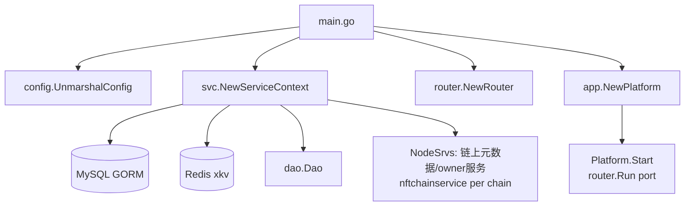
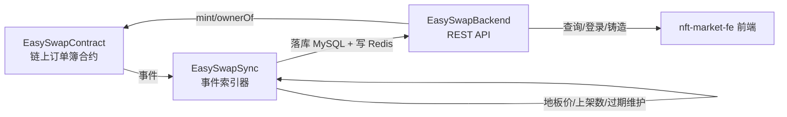

# EasySwapBackend 模块解析

> 本文档用于团队内部理解 EasySwap **后端 API 服务（Web Server）** 的**架构设计**与**业务功能**，目标是能够复刻出相似业务的 NFT 订单簿交易系统后端。重点覆盖分层架构、接口清单、认证机制、数据/金额流向、以及值得注意的业务规则。

---

## 1. 项目定位

EasySwapBackend 是 EasySwap NFT 交易市场的 **REST API 后端**，为前端（`nft-market-fe`）和管理后台提供：

- 订单簿 / NFT / 合集 / 成交记录等**读模型查询接口**
- 用户钱包**登录认证**（nonce + 签名 + Token）
- 资产组合（portfolio）查询与**手动导入**
- NFT **铸造**（MetaNode 合约）
- 元数据刷新、腾讯云 COS 上传凭证
- 管理员合约管理 / NFT 导入任务

**架构定位**：它是「链上合约 + 链下索引（EasySwapSync）+ API（EasySwapBackend）+ 前端」中的**查询与轻量写入层**。绝大多数业务数据由 EasySwapSync 同步落库，后端**只读 MySQL/Redis**，少数写操作（铸造、导入、刷新队列、管理员维护）由后端发起或转投 Redis 队列。

**技术栈**：Go 1.21 + `gin`（HTTP 框架）+ `gorm`（MySQL）+ `go-zero`（Redis 封装）+ `go-ethereum`（链上铸造/查询）+ `shopspring/decimal`（金额精度）+ `swaggo`（Swagger 文档）+ `viper`（配置）。

> 依赖说明：`go.mod` 中 `replace github.com/ProjectsTask/EasySwapBase => ../EasySwapBase`，强依赖本地同仓库的 EasySwapBase（GORM 表结构、Redis 封装、链上 NFT 元数据服务、错误码、HTTP 响应封装等）。

---

## 2. 目录与文件结构

```
EasySwapBackend/
├── main.go                        # 入口：加载配置 → 初始化服务上下文 → 路由 → 启动
├── config/
│   └── config.toml.example        # 配置文件模板
├── docs/                          # swagger 文档（docs.go / swagger.json）
└── src/
    ├── app/
    │   └── app.go                 # Platform：装配 router 并启动 HTTP 服务
    ├── config/
    │   └── config.go              # 配置结构体与解析（viper）
    ├── common/
    │   ├── address.go             # 地址统一/校验
    │   └── utils/                 # crypto / math / retry / utils
    ├── svc → service/svc/         # 服务上下文（DB/Redis/Dao/链服务）
    ├── api/
    │   ├── router/                # 路由注册（router.go / v1.go）
    │   ├── middleware/            # auth / cacheapi / logger / recover
    │   └── v1/                    # HTTP Handler（薄层：参数解析 + 调用 service）
    ├── service/
    │   ├── v1/                    # 业务逻辑层（真正组装数据的地方）
    │   └── mq/                    # 元数据刷新队列封装
    ├── dao/                       # 数据访问层（SQL 查询）
    └── types/
        └── v1/                    # 请求/响应结构体
```

**分层**：`api/v1`（HTTP 协议层）→ `service/v1`（业务逻辑层）→ `dao`（数据访问层）→ `EasySwapBase`（基础设施）。`svc.ServerCtx` 作为依赖注入容器贯穿三层。

---

## 3. 架构设计

### 3.1 启动流程与依赖注入



- `ServerCtx` 用函数式选项（`WithDB / WithKv / WithDao`）组装，持有 `C`（配置）、`DB`、`KvStore`、`Dao`、`NodeSrvs`。
- 启动时校验 `chain_supported` 配置，按链为每条链初始化一个 `nftchainservice.Service`（用于链上元数据解析、owner 查询）。

### 3.2 Gin 中间件链

```go
r.Use(middleware.RecoverMiddleware())   // panic 恢复 + 堆栈打印
r.Use(middleware.RLog())                 // 请求/响应日志（含 latency、request、response）
r.Use(cors.New(...))                     // 全放开 CORS
```

- `RLog` 通过 `BodyLogWriter` 包装 `ResponseWriter` 缓存响应体，记录完整请求响应日志（含 `session_id` token）。
- `CacheApi(store, 60)`：**接口级响应缓存**中间件，60 秒缓存整个响应体（见 4.2）。
- `AuthMiddleWare(store)`：基于 `session_id` 请求头的认证（见 4.1）。

### 3.3 多链设计

- 配置 `[[chain_supported]]` 声明支持的链（name/chain_id/endpoint）。
- 代码内 `chainIDToChain` 映射：`1→eth`、`10→optimism`、`11155111→sepolia`。
- 数据表按链后缀命名（`ob_order_eth` / `ob_order_sepolia`…），由 `EasySwapBase` 的 `multi.*TableName(chain)` 生成。
- **跨链聚合查询**：DAO 层用原生 SQL `UNION ALL` 拼接各链同名表，再统一 `ORDER BY ... LIMIT/OFFSET`（例如 activity、portfolio 查询），并为每个结果行附加 `chain_name` / `chain_id`。

---

## 4. 认证与缓存机制（复刻必读）

### 4.1 用户登录与 Token 认证

**登录三步**（`/api/v1/user/*`）：

1. `GET /user/:address/login-message`：服务端生成 `uuid`（nonce），拼成 `"Welcome to EasySwap!\nNonce:{uuid}"`，以 `cache:orderbookdex:login:msg:{address}` 存入 Redis（有效期 72h）。
2. `POST /user/login`：前端用钱包签名该 message，提交 `{chain_id, message, signature, address}`：
   - 校验 message 中的 `Nonce:` 与 Redis 中缓存的 uuid 一致（**注意：签名验证逻辑为 TODO 注释，当前未真正验签**）；
   - 用户不存在则插入 `ob_user`（`is_signed=true`）；
   - 生成 AES-OFB 加密的 token（token 明文为 `cache:orderbookdex:login:address:data:{address}`），token 对应的 uuid 以 30 天有效期写入 Redis。
3. 后续请求在 `session_id` 请求头携带该 token。

**认证中间件 `AuthMiddleWare`**：
- 读取 `session_id` 头（支持**逗号分隔多地址**，如多账户场景）；
- `hex` 解码 → AES-OFB 解密（密钥 `CR_LOGIN_SALT = "gf_login_salt&$%"`）→ 得到 `cache:...:address:data:{address}` key → 从 Redis 取该 key，存在即认证通过；
- 失败返回 `ErrTokenVerify` / `ErrTokenExpire`。
- `GetAuthUserAddress` 从解密结果中解析出地址列表，供需要用户身份的接口使用。

> 要点：登录态存 Redis、token 是**对称加密的地址标识**而非 JWT；Token 有效期 30 天；`is_allowed` 字段标识用户是否被允许访问（但大多数接口并未强制校验该字段）。

### 4.2 响应缓存中间件 `CacheApi`

用于 `GET /collections/ranking` 和 `GET /collections/{address}/{token_id}/image`：

- cacheKey = `path + "," + rawQuery + requestBody`，超 128 字符则 sha512 摘要；
- 命中：直接写回缓存的状态码/Header/Body 并 `Abort`；
- 未命中：放行 handler，捕获响应体（`BodyLogWriter`），若 `code==200` 则用 gob 序列化 `responseCache{Status,Header,Data}` 并 `SetnxEx` 60 秒。

---

## 5. 业务功能清单（按路由分组）

### 5.1 User（用户）
| 接口 | 说明 |
|------|------|
| `GET /user/:address/login-message` | 获取登录签名消息（nonce） |
| `POST /user/login` | 登录，返回 token + is_allowed |
| `GET /user/:address/sig-status` | 查询用户是否已签名（`ob_user.is_signed`） |

### 5.2 Collections（合集/资产）
| 接口 | 说明 |
|------|------|
| `GET /collections/ranking` | 成交量排行榜（多链并发聚合，Redis 缓存 60s） |
| `GET /collections/:address` | 合集详情（地板价、成交量、供应量等） |
| `GET /collections/:address/bids` | 合集出价盘口（按 price 聚合，价格降序） |
| `GET /collections/:address/:token_id/bids` | 单品出价列表 |
| `GET /collections/:address/items` | 合集内可售 NFT 列表（支持筛选/排序） |
| `GET /collections/:address/history-sales` | 历史成交价格（24h/7d/30d） |
| `GET /collections/:address/:token_id` | NFT 详情（含最优出价/挂单） |
| `GET /collections/:address/:token_id/image` | NFT 图片（Redis 缓存） |
| `GET /collections/:address/:token_id/traits` | NFT 属性 |
| `GET /collections/:address/top-trait` | 指定 token 集合的最高属性价 |
| `GET /collections/:address/:token_id/owner` | NFT owner |
| `POST /collections/:address/:token_id/metadata` | 刷新元数据（投递 Redis 队列） |
| `GET /collections/:address/:token_id/listing` | 单品跨平台挂单信息（需认证） |
| `POST /collections/:address/mint` | 铸造 NFT（需认证） |

### 5.3 Activities（活动/成交记录）
- `GET /activities`：多链活动记录查询。支持 `filter_ids`（链）、`collection_addresses`、`token_id`、`user_addresses`、`event_types` 过滤；不传链 ID 则查询全部链。

### 5.4 Portfolio（资产组合）
| 接口 | 说明 |
|------|------|
| `GET /portfolio/collections` | 用户多链持有的合集及估值 |
| `GET /portfolio/items` | 用户多链持有的 NFT |
| `GET /portfolio/listings` | 用户多链挂单 |
| `GET /portfolio/bids` | 用户多链出价 |
| `POST /portfolio/import-item` | 手动导入单个 NFT（校验链上 owner） |

### 5.5 Orders（订单）
- `GET /bid-orders`：查询指定 token 列表的最优出价（单品最优价 + 合集出价合并逻辑）。

### 5.6 Upload（腾讯云 COS）
| 接口 | 说明 |
|------|------|
| `POST /upload/cos-token` | 获取 COS 临时凭证（免登录） |
| `GET /upload/cos-policy` | 获取 COS 上传策略（需认证） |
| `POST /upload/cos-callback` | COS 上传回调（需认证，仅记录日志） |

### 5.7 MetaNode（NFT 铸造/查询，免登录）
| 接口 | 说明 |
|------|------|
| `POST /metanode/mint` | 单 NFT 铸造（服务端私钥签名交易） |
| `POST /metanode/batch-mint` | 批量铸造（≤50） |
| `GET /metanode/query` | 分页查询 NFT |
| `GET /metanode/contract-info` | 合约信息 |
| `GET /metanode/token/:token_id` | 特定 Token 信息 |

### 5.8 Admin（管理员，需认证）
| 接口 | 说明 |
|------|------|
| `GET/POST/PUT/DELETE /admin/contracts...` | 合约地址 CRUD |
| `POST .../enable|disable` | 启用/禁用合约（写 `auth` 字段：1 认证通过 / 2 认证不通过） |
| `POST /admin/nft-import/sync-contract` | 同步整个合约 NFT（**当前为模拟/待实现**） |
| `POST /admin/nft-import/sync-token` | 同步单个 Token（**模拟**） |
| `GET .../sync-status|sync-history` | 同步状态/历史（**模拟数据**） |
| `GET /admin/system/stats` | 系统统计 |
| `POST /admin/system/refresh-metadata` | 批量刷新元数据 |

---

## 6. 核心业务规则与数据/金额流向

### 6.1 数据来源（读模型依赖 EasySwapSync）

后端**不直接解析链上事件**，而是消费 EasySwapSync 落库的数据：

| 数据 | 来源表/缓存 | 用途 |
|------|-----------|------|
| 订单簿 | `ob_order_{chain}` | items 列表、bids、listing |
| NFT 资产 | `ob_item_{chain}` | items、portfolio、owner |
| 元数据/图片 | `ob_item_external_{chain}` | 图片、视频 |
| 属性 | `ob_item_trait_{chain}` | traits、top-trait |
| 合集 | `ob_collection_{chain}` | 详情、排行 |
| 成交记录 | `ob_activity_{chain}` | activities、历史成交价 |
| 地板价历史 | `ob_collection_floor_price_{chain}` | 排行中地板价涨跌 |
| 成交量排行 | Redis `cache:{project}:{chain}:ranking:volume:{epoch}` | 排行榜（**由外部离线任务生产**，本模块只读） |
| 上架数量 | Redis `cache:es:{chain}:collection:listed:{addr}`（ordermanager 写） | 排行/合集列表 |

### 6.2 金额处理规则

- 所有价格/金额统一用 `shopspring/decimal.Decimal`，避免浮点误差。
- 地板价 `floor_price` 来自 `ob_collection.floor_price`（由 EasySwapSync 的 ordermanager 维护）。
- 成交量 `volume` 来自排行榜 Redis 缓存；`QueryCollectionFloorChange` 通过对比 `ob_collection_floor_price` 计算周期内涨跌。
- **`getBidType` 的偏移修正**：`BidTypeOffset = 3`，把 `order_type`（1 listing / 2 offer / 3 collection_bid / 4 item_bid）转成前端语义（≥3 减 3），即 3→0（合集出价）、4→1（单品出价）。

### 6.3 合集出价盘口（CollectionBids）

`GET /collections/:address/bids` 对 `ob_order` 中 `order_type=3(collection_bid)` 且 `active` 且未过期的订单**按 price 分组聚合**：

- `size = sum(quantity_remaining)`（同价总数量）
- `total = sum(quantity_remaining) * price`（同价总金额）
- `bidders = count(distinct maker)`（同价出价人数）
- 按 `price desc` 排序（买方最优价在前）

### 6.4 合集 items 列表（可售口径）

`GetItems` 底层走 `QueryCollectionItemBySupply`，业务约定：

- **可售判定**：`ob_item.supply >= 1`（注意：这是新口径，直接从 item 表判断，不关联订单表）；
- 对外 `list_price` 直接取 `item.sale_price`；
- 图片优先取 `item_external` 的 `oss_uri`（已上传）否则 `image_uri`；视频同理 `video_oss_uri` / `video_uri`；
- 并发 goroutine 补充：图片、owner 持有数量、最近成交价。

> 另一套旧实现 `QueryCollectionItemOrder` 则联表 `ob_order`，支持 `status`（1 buy now / 2 has offer / 3 all）与 `markets`、`sort` 等复杂筛选，复刻时可按需二选一。

### 6.5 Portfolio 估值规则

- 用户合集估值：`ItemValue += item_count × floor_price`（以地板价粗略估值），并汇总 `ItemOwned`。
- 用户 items 按最近成交时间排序，`owned_time` 取该 NFT 最近一次 `sale` 事件时间。
- `POST /portfolio/import-item`（手动导入）：
  1. 校验入参（地址格式、token_id 非空）；
  2. 用 `nftchainservice` 链上查 `ownerOf(tokenId)`，**校验 owner 与请求 user_address 一致**，不一致拒绝；
  3. 拉取链上元数据（name/image），sanitize 图片 URI（拒绝 `data:image/`、长度 >255）；
  4. 幂等 upsert collection / item / item_external 三张表。

### 6.6 NFT 铸造（MetaNode）

- 配置 `[metanode]` 存 `owner_private_key`、按链的 `contract_addresses` / `rpc_endpoints` / gas。
- `MintMetaNodeNFT`：`ethclient.Dial(RPC)` → 用私钥构造 `bind.TransactOpts`（`bind.NewKeyedTransactorWithChainID`）→ 调 ERC721 合约 `safeMint(to, uri)` → 等待回执 → 从 `Transfer` 事件解析 tokenId → 写库 `insertMintedItemToDB`。
- `BatchMint` 串行循环调用单铸，单次失败不影响其他，返回 `success_count / failed_count / status`。
- **金额/资产流向**：铸造由服务端私钥付费（gas），NFT 直接 mint 到请求方 `to_address`。

### 6.7 COS 上传凭证

- 文件类型白名单（image/video/audio/document）+ 扩展名 + 大小限制（图片 50MB、视频 500MB、音频 100MB、文档 20MB）。
- 生成文件路径 `{fileType}/{userAddr}/{timestamp}_{random}.{ext}`。
- **注意**：当前实现用**主密钥直传**（`generateTemporaryCredentials` 直接返回配置中的 secret_id/secret_key，未真正调用腾讯云 STS 换取临时密钥），生产需替换。

### 6.8 管理员合约管理（部分为占位实现）

- 合约 CRUD 直连 `ob_collection_{chain}`（`getChainName(chainID)` 映射，默认 sepolia）。
- `enable/disable` 实际写 `auth` 字段：`1=认证通过`、`2=认证不通过`。
- **NFT 导入任务（sync-contract / sync-token / sync-status / sync-history）目前是 TODO/模拟数据**，未实现真正的链上同步，复刻时需要自行实现（如调用 EasySwapSync 的导入队列）。

---

## 7. 值得注意的实现细节

1. **登录验签缺失**：`UserLogin` 中 `verifySignature` 被注释掉，当前只校验 nonce 与 Redis 一致性，**未真正验证钱包签名**——复刻时必须补上。
2. **token 是 AES 对称加密的地址 key**：`session_id` 头支持逗号分隔多个，认证通过条件仅是 Redis 中存在解密后的 key。
3. **地址统一**：`common.UnifyAddress` 用 EIP-55 checksum 校验并统一；DAO 中大量 `strings.ToLower` 后比较/入参。
4. **幂等写入**：portfolio import、item_external 等用 `clause.OnConflict ... DoUpdates` 做 upsert。
5. **多链聚合用原生 SQL `UNION ALL`**：避免 ORM 复杂 join，注意 SQL 注入风险——`userAddrsParam` 等字符串拼接未参数化（复刻需改造为参数化查询）。
6. **排行榜数据源在外部**：`cache:...:ranking:volume:{epoch}` 由外部离线任务（不在本仓库三件套内）生产，本模块只读；`periodToEpoch` 把时间窗口映射为采样周期数（15m=3, 1h=12, 6h=72, 1d=288, 7d=2016, 30d=8640）。
7. **并发聚合**：排行、合集详情、items 列表等大量使用 `sync.WaitGroup` + goroutine 并发查询多个数据源，聚合后再组装响应。
8. **`getBidType` 偏移**：出价 `order_type` 展示前减去 3。
9. **`QueryCollectionItemBySupply` 与 `QueryCollectionItemOrder` 两套 items 逻辑并存**：前者是新实现的简化口径（supply ≥ 1 即视为可售），后者是完整订单联表口径。
10. **Swagger 文档**：`main.go` 注释定义 BasePath `/api/v1` 与 BearerAuth，`docs/` 已生成。
11. **配置里的 `[easyswap_market]`（contract/fee）是遗留项**，`Config` 结构体中未定义，实际不使用。
12. **未使用/预留**：`ImageCfg`（图片管理器）、`ImageMgr`、`Evm` 字段均被注释或未启用，相关图片 URL 处理被简化为直出 URI。

---

## 8. 配置说明（`config/config.toml`）

```toml
[project_cfg]
name = "EasySwap"                 # 项目名（排行榜缓存 key 前缀用）

[api]
port = ":80"
max_num = 500

[log]                            # EasySwapBase 日志配置

[[kv.redis]]                     # Redis
host = "127.0.0.1:6379"
type = "node"

[db]                             # MySQL（easyswap 库，连接池等）

[[chain_supported]]              # 支持的多链（可多条）
name = "sepolia"
chain_id = 11155111
endpoint = "https://rpc.ankr.com/eth_sepolia"

[metadata_parse]                 # 元数据解析字段映射
name_tags = ["name", "title"]
image_tags = ["image", "image_url", "animation_url", ...]
attributes_tags = ["attributes", "properties", "attribute"]
trait_name_tags = ["trait_type"]
trait_value_tags = ["value"]

[cos]                            # 腾讯云 COS
secret_id / secret_key / bucket / region / app_id / domain

[metanode]                       # MetaNode 铸造配置
owner_private_key = "..."
gas_limit = 300000
gas_price = "20000000000"

[metanode.contract_addresses]    # 按链 ID 映射合约地址
[metanode.rpc_endpoints]         # 按链 ID 映射 RPC
```

---

## 9. 启动与运行

```shell
# 1. 三仓库同级目录：EasySwapBackend / EasySwapBase / EasySwapSync
# 2. 复制配置
cp config/config.toml.example config/config.toml
# 3. go.mod 打开 replace 注释，执行 go mod tidy
# 4. 替换 chain_supported.endpoint 为有效 RPC
# 5. 部署 EasySwapContract 得到订单簿合约地址，替换 easyswap_market.contract（遗留项）
# 6. 启动 EasySwapSync 的 docker-compose（MySQL + Redis）
# 7. 运行
cd src
go run main.go -conf ../config/config.toml
```

`main.go` → 解析 `-conf` → 校验 `chain_supported` → `svc.NewServiceContext` → `router.NewRouter` → `app.NewPlatform` → `router.Run(port)`。

---

## 10. 复刻要点总结

1. **四层清晰**：`api/v1`（协议）→ `service/v1`（业务）→ `dao`（数据）→ `EasySwapBase`（基础设施），依赖注入靠 `ServerCtx`。
2. **读多写少**：核心价值在于把 EasySwapSync 落库的数据**组装成前端友好的读模型**（聚合、排序、并发查询、Redis 缓存）。
3. **多链统一**：表按链后缀 + 原生 SQL `UNION ALL` 聚合，`chainIDToChain` 维护链映射。
4. **认证用 nonce+签名+对称加密 token**（Redis 存态），注意当前**验签是 TODO**，复刻必须补齐。
5. **金额一律 `decimal`**，地板价/成交量/估值口径要与同步端一致。
6. **写操作边界**：铸造走链上（服务端私钥），导入/刷新走链上 owner 校验 + Redis 队列，管理员维护直连 DB。
7. **大量 TODO/模拟实现**（NFT 导入任务、COS STS 临时密钥、签名验证、图片管理器）——复刻前需明确这些是占位，需自行实现。

---

### 三模块协作关系（EasySwapContract / EasySwapSync / EasySwapBackend）



- **合约**：管资产托管与撮合，发事件。
- **Sync**：把事件转成结构化数据（订单/item/activity/地板价），并维护订单过期、地板价、上架数。
- **Backend**：消费 Sync 的数据，提供查询、认证、铸造、上传与管理接口。
