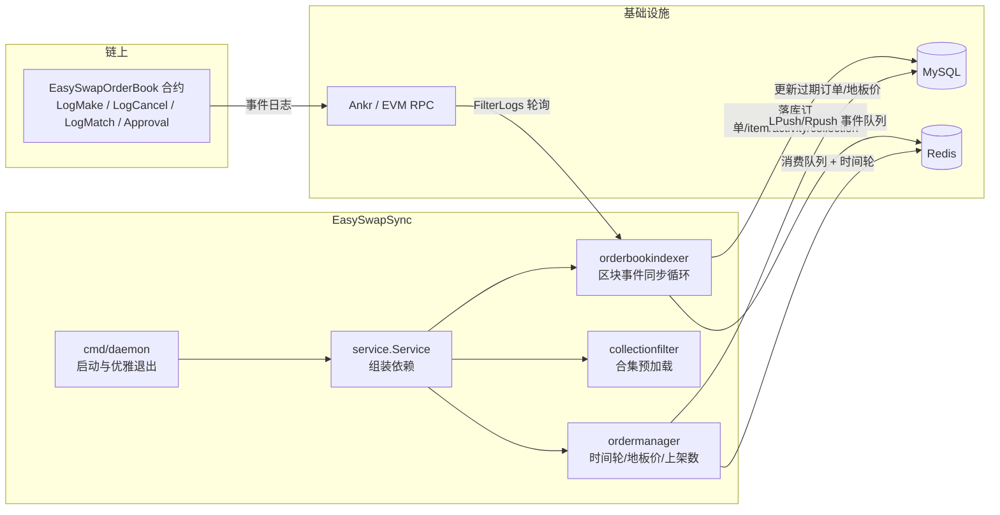

# EasySwapSync 模块解析

> 本文档用于团队内部理解 EasySwap **链下数据同步服务（索引器）** 的**架构设计**与**业务功能**，目标是能够复刻出相似业务的 NFT 订单簿交易系统后端数据层。重点覆盖事件同步机制、订单/成交/地板价等数据的产生与落库规则、资金与资产流向、以及值得注意的业务细节。

---

## 1. 项目定位

EasySwapSync 是 EasySwap NFT 交易市场的**链下数据同步服务**（Indexer），负责把 EasySwap 合约（`EasySwapOrderBook`，链上订单簿 DEX）在链上发出的各类事件同步到 **MySQL + Redis**，为后端 API（EasySwapBackend）和前端（nft-market-fe）提供：

- 订单簿数据（挂单 / 出价 / 取消 / 成交）
- NFT 资产（item）与合集（collection）信息
- 成交记录（activity）
- 合集地板价（floor price）与地板价历史
- 合集上架数量统计（list count）

**架构定位**：整体采用「**链上订单簿 + 链下索引**」模型。链上合约负责资产托管与撮合，EasySwapSync 只做**读取 + 记账**，不触碰链上资产，不构造交易，仅把链上事实结构化后写库，供查询展示与统计使用。

**技术栈**：Go 1.21 + `go-zero`（KV/redis/threading）+ GORM（MySQL）+ `spf13/cobra` + `spf13/viper` + `go-ethereum`（EVM RPC）+ `shopspring/decimal`（金额精度）+ `go.uber.org/zap`（日志）。

> 依赖说明：本项目 `go.mod` 中 `replace github.com/ProjectsTask/EasySwapBase => ../EasySwapBase`，即**强依赖本地同仓库的 EasySwapBase 基础库**（链客户端、订单管理器、GORM 表结构、Redis 封装、日志封装）。

---

## 2. 目录与文件结构

```
EasySwapSync/
├── main.go                       # 入口，仅调用 cmd.Execute()
├── cmd/
│   ├── root.go                   # cobra 根命令 + viper 配置加载（-c 指定配置文件）
│   └── daemon.go                 # daemon 子命令：启动服务 + 信号优雅退出 + pprof
├── config/
│   └── config_import.toml copy.template   # 配置文件模板
├── db/
│   └── migrations/
│       ├── 01_create.sql         # 建表 DDL
│       └── 02_alter_collection_add_banner.sql  # collection 加 banner 字段
├── model/
│   └── model.go                  # GORM 初始化（表选项 utf8mb4）
└── service/
    ├── service.go                # Service 组装：DB/KV/过滤器/索引器/订单管理器
    ├── config/
    │   └── config.go             # 配置结构体与解析
    ├── comm/
    │   ├── types.go              # 常量（批次大小、同步周期等）
    │   └── util/                 # 时间解析、循环休眠工具
    ├── collectionfilter/
    │   └── filter.go             # 合集地址过滤集合（线程安全）
    └── orderbookindexer/
        ├── service.go            # 核心：区块事件同步与各事件处理器
        └── service_test.go       # 测试
```

---

## 3. 架构设计

### 3.1 整体架构（单进程 + 多 goroutine）



- 服务由 `cmd/daemon.go` 以 `go run main.go daemon` 方式启动，`sync.WaitGroup` + `context.WithCancel` + `signal.Notify(SIGINT/SIGTERM)` 实现**优雅退出**。
- `Service.Start()` 的启动顺序有强依赖：
  1. `collectionFilter.PreloadCollections()` —— 先预加载合集过滤集合（**位置不可移动**）；
  2. `orderbookIndexer.Start()` —— 启动订单簿事件同步循环 + 地板价历史维护循环；
  3. `orderManager.Start()` —— 启动 4 个后台循环（新挂单、订单过期、地板价、上架数）。

### 3.2 依赖 EasySwapBase 的关键组件

| 组件 | 位置 | 职责 |
|------|------|------|
| `chainclient.ChainClient` | EasySwapBase/chain/chainclient | 链客户端抽象接口，当前仅实现 `evmclient`（eth/optimism/sepolia） |
| `ordermanager.OrderManager` | EasySwapBase/ordermanager | 订单管理：时间轮过期、地板价维护、上架数统计 |
| `stores/gdb` | EasySwapBase/stores/gdb | GORM 初始化 + 表名辅助函数（`GetMultiProject*TableName`） |
| `stores/xkv.Store` | EasySwapBase/stores/xkv | Redis KV 封装（含 `Lpush/Lpop/Rpush` 等队列操作） |
| `logger/xzap` | EasySwapBase/logger/xzap | 带 context 的 zap 日志封装 |

**链客户端抽象**：

```go
type ChainClient interface {
    FilterLogs(ctx, q) ([]interface{}, error)   // 按区块范围+地址查询日志
    BlockTimeByNumber(ctx, *big.Int) (uint64, error)  // 区块时间戳
    BlockNumber() (uint64, error)               // 最新区块高度
    CallContract(ctx, msg, blockNumber) ([]byte, error) // eth_call 读合约
    ...
}
```

`chainclient.New(chainID, nodeUrl)` 按链 ID 分派：`1(eth)`、`10(optimism)`、`11155111(sepolia)` 走 EVM 客户端；其余报错。链 ID/名称常量定义在 `EasySwapBase/chain/constants.go`。

### 3.3 区块同步策略（自适应批量 + 确认块）

`SyncOrderBookEventLoop` 是核心循环，逻辑要点：

1. **断点续传**：从 `ob_indexed_status` 表读取 `index_type = 6`（订单簿事件）对应的 `last_indexed_block` 作为起点。
2. **安全高度（确认块）**：`safeEndBlock = currentBlock - MultiChainMaxBlockDifference[chain]`。各链配置为 8 个区块确认（eth/optimism/base/sepolia），避免处理可能被回滚的块。
3. **自适应批量**：
   - 落后较多（`availableBlocks >= MinSyncBlocks=500`）时，按 `SyncBlockPeriod=1000` 大批量追赶；
   - 接近链头时（< 500 块）直接小批量实时同步，避免数据长期不入库。
4. **RPC 容错**：`FilterLogs` 失败时，若区间 > 1 个区块则**降级为单区块重试**；仍失败则休眠后重试。
5. 每轮处理完按 `topic[0]` 分发到 4 个事件处理器，并把 `last_indexed_block` 更新回 `ob_indexed_status`（游标持久化）。

---

## 4. 事件处理与数据/资产流向

合约事件与 topic 常量（在 `orderbookindexer/service.go` 中硬编码）：

| 事件 | topic0（keccak256） | 含义 |
|------|--------------------|------|
| `LogMake` | `0xfc37...ffe6` | 创建订单（挂单/出价） |
| `LogCancel` | `0x0ac8...49bd` | 取消订单 |
| `LogMatch` | `0xf629...b20e` | 撮合成交 |
| ERC721 `Approval` | `0x8c5b...b925` | NFT 授权事件 |

### 4.1 挂单事件 `handleMakeEvent`（LogMake）

**事件结构**（与合约 `EasySwapOrderBook.sol` 一致）：

```solidity
event LogMake(
    OrderKey orderKey,              // data
    LibOrder.Side indexed side,     // topic[1]：0=List 挂单，1=Bid 出价
    LibOrder.SaleKind indexed saleKind, // topic[2]：0=合集出价，1=单品出价
    address indexed maker,          // topic[3]：创建者
    LibOrder.Asset nft,             // data：tokenId + collection + amount
    Price price,                    // data：单价
    uint64 expiry,                  // data：过期时间（秒）
    uint64 salt                     // data：随机盐
);
```

**订单类型映射**：

| side | saleKind | order_type | 说明 |
|------|----------|-----------|------|
| Bid(1) | FixedPriceForCollection(0) | 3 `CollectionBidOrder` | 针对整个合集的出价 |
| Bid(1) | FixedPriceForItem(1) | 4 `ItemBidOrder` | 针对单个 NFT 的出价 |
| List(0) | — | 1 `ListingOrder` | 挂单（卖） |

**落库与投递动作**（顺序有业务含义）：

1. **分叉检查**（见 4.5）。
2. 写入 `ob_order`（`OnConflict DoNothing` 幂等）：`order_id = 0x + hex(orderKey)`，`order_status=0(active)`，`expire_time=expiry`，`currency_address=eth`，`price`，`maker`，`taker=0x0`，`quantity_remaining=amount`，`size=amount`。
3. 写入 `ob_item`（`OnConflict DoNothing`）：`owner=maker`、`supply=amount`、`list_price=price`。
4. 写入 `ob_item_external`（元数据表，no-op upsert）：调用 `tokenURI()` 读取元数据 URI，再通过 HTTP 拉取 JSON 提取 `image` 字段，长度截断到 512 字符；失败不阻断主流程。
5. **仅挂卖单（side==List）时**：
   - `syncItemOnListing`：更新 item 的 `owner/list_price/sale_price(=挂单价)/supply=1/list_time`；
   - `maintainCollectionAndItem`：确保 collection 记录存在 + 更新 item 上架信息 + 重算 collection 地板价。
   > 注释明确：挂卖单后必须优先维护 item/collection，放在前面避免受后续 blockTime/activity 写入失败影响，保证主数据先落库。
6. 写入 `ob_activity`（幂等）：activity_type = `Listing(3)` / `CollectionBid(9)` / `ItemBid(10)`，价格 = 订单单价。
7. 将订单信息 `LPush` 到 Redis 订单管理队列（`cache:es:orders:{chain}`），供订单管理器做地板价维护与过期检测。

**资产/金额流向**：
- 挂单（List）：**链上无资金流转**，卖家资产被授权/托管（vault），链下仅记录 `price` 作为卖价。
- 出价（Bid）：**链上买方锁定 ETH**，链下仅记录 `price` 作为出价；出价**不影响 item 的上架状态**（`syncItemOnListing` 不执行）。

### 4.2 撮合事件 `handleMatchEvent`（LogMatch）

**事件结构**：

```solidity
event LogMatch(
    OrderKey indexed makeOrderKey,  // topic[1]
    OrderKey indexed takeOrderKey,  // topic[2]
    LibOrder.Order makeOrder,       // data
    LibOrder.Order takeOrder,       // data
    uint128 fillPrice               // data：成交价
);
```

**方向判定规则**（关键）：`makeOrder.side == Bid` 则 **makeOrder 是买单（买方）**，由卖方接受出价撮合；否则 **makeOrder 是卖单**，由买方主动购买。即：**谁的 side==Bid，谁就是买方（NFT 新 owner）**，另一方为卖方。

处理逻辑：
1. 更新**卖方**订单：`order_status=4(filled)`、`quantity_remaining=0`、`taker=买方地址`。
2. 更新**买方**订单剩余数量：`quantity_remaining > 1` 则减 1；否则标记 `filled`、`quantity_remaining=0`。
3. 写入 `ob_activity`：`activity_type=Sale(7)`，`price = fillPrice`，`maker=卖方`，`taker=买方`。
4. 更新 `ob_item.owner` 为买方（NFT 所有权转移）。
5. `syncItemOnMatchOrCancel`：`supply=0`、`list_price=0`、`sale_price=fillPrice`（该 NFT 视为已售出/下架）。
6. 向 Redis 投递价格更新事件（`ordermanager.Buy`），携带 `sellOrderId`、`from`（卖方）、`to`（买方）。

**金额流向（链上已发生，链下记账）**：
- 买方支付 `fillPrice`，卖方实际收到 `fillPrice - protocolFee`（协议手续费在**合约内**完成，`protocolFee = _shareToAmount(fillPrice, protocolShare)`）。
- 若为买方主动买（`buyPrice > fillPrice`），合约会把差价 `buyPrice - fillPrice` 退还买方。
- 链下记录的是 `fillPrice`（净成交价，不含协议费）。

### 4.3 取消事件 `handleCancelEvent`（LogCancel）

1. 更新 `ob_order.order_status=3(cancelled)`。
2. 读取该订单的 `order_type`，写入对应 `ob_activity`：
   - `ListingOrder(1)` → `CancelListing(4)`
   - `CollectionBidOrder(3)` → `CancelCollectionBid(16)`
   - `ItemBidOrder(4)` → `CancelItemBid(17)`
3. 投递价格更新事件（`ordermanager.Cancel`）。
4. **仅卖单取消**才执行 `syncItemOnMatchOrCancel`（下架）；买单取消不改 item。

### 4.4 授权事件 `handleApprovalEvent`（ERC721 Approval）

- 解析 `owner`（topic[1]）、`approved`（topic[2]）、`tokenId`（topic[3]）。
- 记录日志，并**临时**以 `Listing` 类型写入 `ob_activity`（价格 0，`taker=approved` 地址）——用于追踪授权行为。
- 额外提供查询能力（供后端调用）：`CheckNFTApprovalStatus`（通过 `getApproved(uint256)` 判断是否授权给 vault）、`CheckMultipleNFTApprovals`、`CanMarketBuyNFT`（授权 + 存在有效挂单才可购买）。

### 4.5 分叉处理（回滚）

`checkAndHandleFork(blockNumber, txHash)` 在每个事件处理器**入口**被调用：

- 若发现同一 `tx_hash` 已存在但 `block_number` 不同 → 判定发生链分叉：
  1. `rollbackOrderStatus(txHash)` 回滚该交易相关订单：
     - `Sale` 类型：恢复订单 `active`、`quantity_remaining+1`、`taker` 归零、恢复 item 原 owner；
     - `Cancel*` 类型：恢复订单 `active`。
  2. 删除该交易旧的 activity 记录。
- 然后重新处理新块中的事件。

---

## 5. 订单管理器 `ordermanager`（EasySwapBase）

`ordermanager.OrderManager` 是 EasySwapSync 通过 Redis 队列驱动的**后台订单维护引擎**，启动 4 个循环：

### 5.1 新挂单消费 `ListenNewListingLoop`

- 从 Redis `cache:es:orders:{chain}` 队列 `LPOP` 新挂单：
  - 已过期 → 更新订单 `expired(2)` + 投递地板价事件；
  - 未过期 → 投递地板价更新事件（Listing）+ 将订单加入**过期检查时间轮**。

### 5.2 订单过期处理 `orderExpiryProcess`（时间轮）

- 采用**时间轮**（`WheelSize=3600`，1 秒 1 格，1 小时一轮），每个槽位是链表，节点带 `CycleCount`（圈数）。
- 启动时 `loadOrdersToQueue`：分批（每批 1000）加载全部 `active` 订单——已过期则批量更新为 `expired` 并触发地板价事件，未过期则放入时间轮对应位置。
- 每秒推进一格，`CycleCount==0` 的节点到期 → `updateOrderState`（标记 `expired` + 投递地板价事件）。

### 5.3 地板价维护 `floorPriceProcess`（优先队列）

- 内存维护 `collectionOrders: map[collection] -> { floorPrice, PriorityQueueMap }`。
- 消费 Redis `cache:es:trade:events:{chain}` 交易事件队列，事件类型：`Buy/Mint/Listing/Cancel/Transfer/Expired/ImportCollection/UpdateCollection`。
- **优先队列**按价格排序，最大保留 100 个有效挂单（`maxQueueLength=100`）：
  - Listing：价格低于当前最高价或队列为空时入队；
  - Cancel/Expired：从队列移除对应订单；
  - Buy/Transfer：移除成交订单 + 移除卖方所有订单 + 加入买方有效订单；
  - 队列为空时 `reloadCollectionOrders` 从库中重载最低价 100 单。
- 每次变动后 `checkAndUpdateFloorPrice`：取队列最低价，若与内存地板价不同则更新内存并**写回 `ob_collection.floor_price`**。

> **有效订单判定**贯穿始终：`order_type=Listing` + `order_status=Active` + `maker == item.owner` + 非 OpenSea 封禁（`(is_opensea_banned, marketplace_id) != (true, 1)`）。

### 5.4 上架数量统计 `listCountProcess`

- 启动时统计全部合集的上架 NFT 数量（`count(distinct token_id)`，满足上述有效订单条件）。
- 结果写入 Redis：`cache:es:{chain}:collection:listed:{collection}`。
- 之后每 60 秒对「有变动的合集」增量更新（由 `collectionListedCh` 通知）。

---

## 6. 地板价历史维护 `UpKeepingCollectionFloorChangeLoop`

在 `orderbookindexer` 中运行，两个定时器：

| 定时器 | 周期 | 动作 |
|--------|------|------|
| `timer` | 每天（86400s） | 删除 `ob_collection_floor_price` 中 `event_time` 超过 60 天（`CollectionFloorTimeRange`）的历史数据 |
| `updateFloorPriceTimer` | 10 秒 | 计算各 collection 当前最低上架价（`min(price)`，有效订单条件），批量 upsert 到 `ob_collection_floor_price`（唯一键 `collection_address + price + event_time`） |

> 仅当 `project_cfg.name == "OrderBookDex"` 时才执行地板价采样写入。

---

## 7. 数据模型与表结构

所有业务表**按链后缀命名**（如 `_sepolia`、`_optimism`），由 `EasySwapBase/stores/gdb/tablename.go` 的 `GetMultiProject*TableName(project, chain)` 统一生成（仅支持 `OrderBookDex` 项目）。

| 表 | 关键字段 | 说明 |
|----|---------|------|
| `ob_order_{chain}` | order_id(唯一)、order_status、order_type、price、maker、taker、quantity_remaining、size、expire_time、currency_address、salt | 订单簿 |
| `ob_item_{chain}` | collection_address+token_id(唯一)、owner、supply、list_price、sale_price、list_time、views、is_opensea_banned | NFT 资产 |
| `ob_item_external_{chain}` | collection_address+token_id(唯一)、meta_data_uri、image_uri、oss_uri、video_uri、upload_status | 元数据/图片 |
| `ob_item_trait_{chain}` | collection_address、token_id、trait、trait_value | NFT 属性 |
| `ob_collection_{chain}` | address(唯一)、symbol、name、creator、token_standard、auth、floor_price、sale_price、volume_total、image_uri、banner_uri、floor_price_status | 合集 |
| `ob_collection_floor_price_{chain}` | collection_address+price+event_time(唯一) | 地板价历史（K 线采样） |
| `ob_activity_{chain}` | tx_hash+collection+token+type(唯一)、activity_type、maker、taker、price、block_number、event_time | 成交/活动记录 |
| `ob_collection_trade_{chain}` | epoch_number、volume、floor_price 等 | 合集周期交易统计 |
| `ob_collection_import_record_{chain}` | collection_address、finished_stage、msg | 合集导入任务进度 |
| `ob_global_collection_{chain}` | collection_address、token_standard、import_status | 全局合集登记 |
| `ob_indexed_status` | chain_id、index_type、last_indexed_block、last_indexed_time | **同步游标**（断点续传） |
| `ob_user` | address(唯一)、is_allowed、is_signed | 用户 |

**关键枚举**（`EasySwapBase/stores/gdb/orderbookmodel/multi/*.go`）：

- `order_status`：0=active、1=inactive、2=expired、3=cancelled、4=filled、5=need_sign。
- `order_type`：1=listing、2=offer、3=collection_bid、4=item_bid。
- `activity_type`：1=Buy、2=Mint、3=List、4=CancelListing、5=CancelOffer、6=MakeOffer、7=Sale、8=Transfer、9=CollectionBid、10=ItemBid、16=CancelCollectionBid、17=CancelItemBid。
- `index_type`（游标类型）：5=floor price、6=orderbook event（本项目主要使用 6）。

---

## 8. 业务规则要点（复刻时必须注意）

1. **订单唯一键**：`order_id = "0x" + hex(orderKey)`，`orderKey` 是合约 `LibOrder.hash(order)` 的 `bytes32` 哈希（含 side/saleKind/maker/nft/price/expiry/salt）。
2. **确认块数 = 8**：同步只处理 `当前高度 - 8` 之前的块，防止分叉回滚污染数据。
3. **幂等设计**：几乎所有写库都带 `OnConflict DoNothing`（订单/item/activity）或 no-op upsert（item_external），配合 `order_id`、`(tx_hash, collection, token, type)` 等唯一索引，保证事件重复处理不产生脏数据。
4. **货币约定**：`currency_address` 统一用 ETH（配置 `eth_address`，通常为零地址表示原生 ETH）；注释里 `'1'` 也代表 ETH。
5. **挂单才维护 item/collection 上架态**：Bid（出价）只写 order/activity，不改 item 的 list_price/supply。
6. **卖单取消/成交才下架 item**：`supply=0`、`list_price=0`、`sale_price=成交价或原价`。
7. **撮合后 NFT owner 切换**：owner = 买方（side==Bid 的 maker）。
8. **链上元数据回填**：`ensureCollectionExists` 通过 `name()`/`symbol()`/`supportsInterface()`/`owner()`（方法签名硬编码：`0x06fdde03`/`0x95d89b41`/`0x01ffc9a7`/`0x8da5cb5b`）回填 collection 元数据；失败用 `Unknown Collection` 兜底；token 标准无法识别时按 721 兜底。
9. **collection 图片回填**：优先取 item_external 的 `image_uri`，回退 item 表。
10. **地板价历史**：10 秒一个采样点，保留 60 天，唯一键 `(collection, price, event_time)` 幂等 upsert。
11. **有效订单口径**（地板价/上架数统计一致）：`listing` + `active` + `maker==owner` + 非 OpenSea 封禁。
12. **`collectionfilter` 当前为预加载但未在事件链路中使用**：`PreloadCollections` 把 `floor_price_status=1`（已导入）的合集地址加载到内存集合，属于预留能力（原用于过滤），复刻时留意其生命周期。
13. **安全高度计算与 RPC 降级**：查询日志失败先缩到单块重试，避免大区间请求超限导致同步中断。
14. **游标类型区分**：订单簿事件用 `index_type=6`，地板价历史用 `index_type=5`，互不影响。

---

## 9. 配置说明（`config/config_import.toml`）

关键配置项（结构见 `service/config/config.go`）：

```toml
[project_cfg]
name = "OrderBookDex"          # 项目名，决定表名前缀分支

[monitor]
pprof_enable = true            # 是否开启 pprof
pprof_port = 6060

[log]                          # EasySwapBase 日志配置

[db]                           # MySQL 连接（user/password/host/port/database/连接池）
max_open_conns = 1500

[[kv.redis]]                   # Redis（host/type/pass）
host = "127.0.0.1:6379"
type = "node"

[ankr_cfg]
https_url = "https://rpc.ankr.com/eth_sepolia"   # 节点 RPC（https）
api_key = ""

[chain_cfg]
name = "sepolia"
id = 11155111

[contract_cfg]
eth_address = "0x0000..."      # 原生 ETH 地址（记账用）
weth_address = "..."
dex_address = "..."            # 订单簿合约地址（事件过滤目标）
vault_address = "..."          # 金库合约地址（授权检查用）
```

- `chain_cfg.id` 决定使用哪条链的 EVM 客户端与表后缀。
- `dex_address` 是 `FilterLogs` 的过滤地址（只监听订单簿合约）。
- 环境变量支持：`viper` 前缀 `EasySwap`（root.go）/ `CNFT`（config.go），`.` 映射为 `_`。

---

## 10. 启动与运行

```shell
# 1. 起 MySQL/Redis（arm64 用 docker-compose-arm64.yml）
docker-compose -f docker-compose-arm64.yml up -d

# 2. 配置 config/config_import.toml（复制模板并修改）

# 3. 执行建表 SQL（db/migrations/*.sql）

# 4. 运行
go run main.go daemon
```

`main.go` → `cmd.Execute()` → `rootCmd` 加载配置 → `daemon` 子命令启动 `service.New` + `s.Start()`，监听 SIGINT/SIGTERM 优雅退出。

---

## 11. 复刻要点总结

1. **分层清晰**：命令入口 / 配置 / 服务组装 / 索引器 / 订单管理器 五层，职责单一。
2. **「链上订单簿 + 链下索引」**：合约负责撮合与资金，索引器负责把 4 类事件转成结构化数据，为 API/前端提供读模型。
3. **断点续传 + 确认块 + 自适应批量 + 单块降级**的同步策略是可靠性的关键。
4. **幂等写库**（唯一索引 + OnConflict）是事件索引器的通用最佳实践。
5. **内存优先队列 + 时间轮 + Redis 队列** 解耦了「事件同步」与「统计维护」，避免同步主循环被慢逻辑拖慢。
6. **有效订单口径统一**（listing + active + maker==owner + 非封禁）贯穿地板价、上架数统计。
7. **金额流向**：链上资金流转由合约完成（买方付 `fillPrice`，卖方收 `fillPrice - protocolFee`），链下只记录净成交价 `fillPrice` 与 NFT 所有权变更，不涉及任何资产操作。
