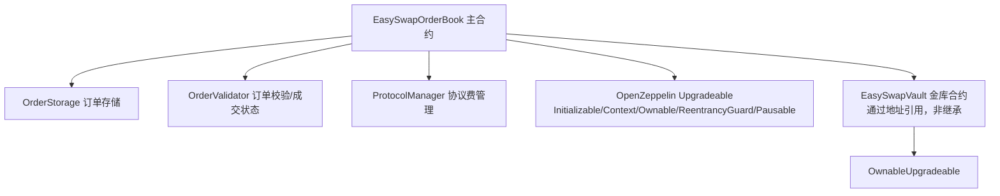
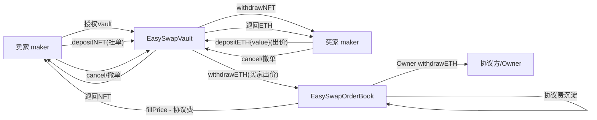

# EasySwapContract 模块解析

> 本文档用于团队内部理解 EasySwap 链上合约的**架构设计**与**业务功能**，目标是能够复刻出相似业务的 NFT 订单簿交易系统。重点覆盖资金/资产流向、订单模型、撮合逻辑、协议手续费、存储组织方式等关键细节。

---

## 1. 项目定位

EasySwapContract 是 EasySwap NFT 交易市场的**链上智能合约部分**，实现了一个基于**链上订单簿（OrderBook DEX）**模型的 NFT 交易系统，支持：

- **List（挂单）**：卖家锁定 NFT 出售
- **Bid（出价）**：买家锁定 ETH 出价
- **取消 / 编辑订单**
- **撮合成交**（单笔、批量、聚合调用）
- **协议手续费**抽取
- **链上订单查询**（含盘口最优价、分页查询）

技术栈：Solidity ^0.8.19/0.8.20 + Hardhat + OpenZeppelin Contracts Upgradeable（可升级代理）。

---

## 2. 目录与文件结构

```
EasySwapContract/
├── contracts/                      # 合约源码
│   ├── EasySwapOrderBook.sol       # 主合约：订单簿撮合逻辑（继承存储/验证/协议费）
│   ├── EasySwapVault.sol           # 金库合约：托管 ETH 与 NFT
│   ├── OrderStorage.sol            # 订单存储层：红黑树+链表组织订单
│   ├── OrderValidator.sol          # 订单校验与成交/取消状态
│   ├── ProtocolManager.sol         # 协议费比例管理
│   ├── interface/                  # IEasySwapOrderBook / IEasySwapVault / IOrderStorage
│   ├── libraries/                  # 底层库
│   │   ├── LibOrder.sol            # 订单结构与哈希
│   │   ├── LibPayInfo.sol          # 手续费单位与结构
│   │   ├── LibTransferSafeUpgradeable.sol  # 安全转账（ETH/ERC20/NFT）
│   │   └── RedBlackTreeLibrary.sol # 红黑树（价格排序）
│   ├── test/                       # 测试辅助合约（TestERC721 等）
│   └── upgradeable-initializer-pattern.md  # 可升级初始化模式说明
├── scripts/                        # deploy.js / interact.js / deploy_721.js 等
├── test/                           # TestEasySwap.js / common.js
├── hardhat.config.js               # 编译、网络、gas 报告等配置
├── package.json                    # 依赖清单
└── README.md                       # 项目背景与数据模型说明
```

---

## 3. 架构设计

### 3.1 合约分层（单一职责 + 模块化继承）

主合约 `EasySwapOrderBook` 通过**多重继承**组装各职责模块，各模块用 `__gap`（uint256[50]）预留升级存储空间：



各模块职责：

| 模块                  | 职责                                           |
| ------------------- | -------------------------------------------- |
| `EasySwapOrderBook` | 对外入口：make/cancel/edit/match/multicall；撮合核心逻辑 |
| `EasySwapVault`     | 独立托管合约，按 OrderKey 记账，托管 ETH 与 NFT            |
| `OrderStorage`      | 用红黑树+链表组织订单，提供最优价/分页查询                       |
| `OrderValidator`    | 校验订单参数合法性；维护 `filledAmount`（已成交量 / 取消标记）     |
| `ProtocolManager`   | 维护 `protocolShare` 协议抽成比例（仅 Owner 可改）        |

### 3.2 可升级代理模式（UUPS/Transparent 均支持）

- 全部合约使用 OpenZeppelin `Initializable`，构造函数逻辑搬到 `initialize()`。
- 采用 **`initialize` → `__X_init` → `__X_init_unchained`** 三层初始化链：
  - `initialize` 对外入口，加 `initializer` 修饰（全生命周期仅一次）；
  - `__X_init` 加 `onlyInitializing`，串联各继承模块的初始化；
  - `__X_init_unchained` 放本模块真正的初始化逻辑。
- 部署脚本 `deploy.js` 使用 `@openzeppelin/hardhat-upgrades` 的 `upgrades.deployProxy`，实际部署的是 **Proxy 合约**（Sepolia 测试网地址见脚本注释）。
- 每个合约尾部保留 `uint256[50] private __gap;` 供未来升级扩展存储。

### 3.3 订单簿存储结构（红黑树 + 链表，价格优先、时间优先）

这是本项目的**核心数据结构**，直接决定盘口排序与撮合效率：

```
priceTrees[collection][side]               // 红黑树：按价格排序的所有价位
orderQueues[collection][side][price]       // 某价位下的订单队列（head/tail 链表）
orders[orderKey] -> DBOrder{order, next}   // 订单详情 + 同价位队列中的 next 指针
```

- **价格维度**：每个 `collection + side` 一棵**红黑树**（`RedBlackTreeLibrary`），`Price` 类型为 `uint128`。Bid 侧 `last()` 取**最高价**（买方最优），List 侧 `first()` 取**最低价**（卖方最优），O(log n) 增删查。
- **时间维度**：同一 `collection + side + price` 下的订单用**单向链表（FIFO）**维护，同价先到先得。
- 提供 `getBestPrice` / `getNextBestPrice` / `getOrders`（分页）/ `getBestOrder`（最优可成交订单）等查询接口，供盘口展示与撮合遍历。

### 3.4 订单模型（LibOrder）

```solidity
enum Side { List, Bid }              // List=挂单(卖)，Bid=出价(买)
enum SaleKind { FixedPriceForCollection, FixedPriceForItem }  // 合集出价 / 单品出价

struct Asset { uint256 tokenId; address collection; uint96 amount; }  // NFT 资产
struct Order {
    Side side;
    SaleKind saleKind;
    address maker;         // 订单创建者
    Asset nft;             // NFT：collection + tokenId + amount(数量)
    Price price;           // 单价（uint128）
    uint64 expiry;         // 过期时间（0 = 永不过期）
    uint64 salt;           // 随机盐
}
```

- **OrderKey**：`type OrderKey is bytes32`，即订单的哈希 `LibOrder.hash(order)`，由 `ORDER_TYPEHASH + side + saleKind + maker + nft哈希 + price + expiry + salt` 的 `keccak256` 计算。
- **订单唯一性**：同一订单参数哈希唯一；`salt` 保证同参数可创建不同订单。
- **SaleKind 语义**：
  - `FixedPriceForItem`：针对**指定 tokenId** 的固定价（挂单/单品出价都用它）；
  - `FixedPriceForCollection`：针对**整个合集**的出价（collection bid，可匹配该合集内任意 tokenId 的挂单）。

> **术语对照（重要，新手易混）**：本项目的 `List` 是 NFT 市场黑话，专指**卖单**（上架出售，对应传统订单簿的 `Ask/Sell`，OpenSea 叫 `Listing`）；`Bid` 是**买单**（对应传统 `Bid/Buy`，OpenSea 叫 `Offer`）。传统订单簿里没有 "List" 这个标准术语，"挂单" 泛指下单（place an order）。

### 3.5 托管模型（Vault 金库）

- 资产**不直接存放在订单簿合约**，而是存入独立的 `EasySwapVault`，实现资产隔离与权限收敛。
- Vault 按 **OrderKey 维度**记账：
  - `ETHBalance[orderKey]`：该订单锁定的 ETH（Bid 订单出价）；
  - `NFTBalance[orderKey]`：该订单锁定的 NFT tokenId（List 订单）。
- **权限**：Vault 的存取款函数只允许 `orderBook` 地址调用（`onlyEasySwapOrderBook` 修饰符），杜绝任意转出。
- Vault 实现 `onERC721Received`，可接收 `safeTransferFrom` 转入的 NFT；实现 `receive()` 接收 ETH。

### 3.6 安全与可升级基础设施

- `ReentrancyGuardUpgradeable`：所有交易入口加 `nonReentrant` 重入保护。
- `PausableUpgradeable`：`pause()`/`unpause()` 紧急暂停，暂停后所有交易入口失效。
- `OwnableUpgradeable`：Owner 可设置金库地址、协议费比例、提取协议手续费、暂停合约。
- EIP-712：`OrderValidator` 继承 `EIP712Upgradeable`，初始化域名（`EasySwapOrderBook`/`1`）；库中已定义 `ASSET_TYPEHASH`/`ORDER_TYPEHASH`，当前链上校验以参数校验为主（预留链下签名验签能力，常量 `EIP_1271_MAGIC_VALUE` 已声明）。

---

## 4. 业务功能详解（含资金/资产流向）

### 4.1 创建订单 `makeOrders(Order[])`（批量）

> `makeOrders` 一次可混合创建卖单（List）和买单（Bid），按 `order.side` 分支处理，两流程相互独立。

**List 挂单流程（卖单）**：

1. 用户先 `setApprovalForAll(EasySwapVault, true)` 授权金库；
2. 调用 `makeOrders`，`side=List`、`nft.amount` 必须为 1（ERC721 单张）；
3. 合约调用 Vault `depositNFT`：`NFT` 从 `maker` 转入**金库**，`NFTBalance[orderKey]=tokenId`；
4. 订单写入 `OrderStorage`，发出 `LogMake`。

**Bid 出价流程（买单）**：

1. 用户调用 `makeOrders` 时附带 `msg.value` = 单价 × 数量；
2. `nft.amount` 不能为 0；
3. 合约调用 Vault `depositETH{value}`：`ETH` 从买家转入**金库**，`ETHBalance[orderKey] += ETH`；
4. 订单写入存储，发出 `LogMake`。

> 批量创建时多退少补：累计实际所需 ETH，`msg.value` 多出部分退回 `msg.sender`；不足则回滚。

**创建校验**：`maker == msg.sender`；`price != 0`；`salt != 0`；`expiry > now || expiry == 0`；订单未被取消/未完全成交。

### 4.2 取消订单 `cancelOrders(OrderKey[])`（批量）

- 仅 `maker` 本人可取消；已完全成交（`filledAmount >= nft.amount`）不可取消。
- 从存储移除订单，并 `_cancelOrder`（`filledAmount[key] = type(uint256).max` 标记 CANCELLED）。
- 资产退回：
  - **List**：Vault `withdrawNFT` → NFT 退回 `maker`；
  - **Bid**：Vault `withdrawETH(单价 × 未成交数量)` → ETH 退回 `maker`。

### 4.3 编辑订单 `editOrders(EditDetail[])`（批量，改价/改量）

编辑 = **取消旧单 + 创建新单**，限制：

- `saleKind/side/maker/nft(collection+tokenId)` 必须与旧单一致（**只能改 price 和 amount**）；
- 旧单不能已完全成交；新单必须有效。

资产处理：

- **List**：Vault `editNFT(oldKey, newKey)` 直接把 NFT 记账迁移到新订单；
- **Bid**：按新旧剩余金额差 `editETH`：
  - 新价 > 旧价 → 需要补 `msg.value` 差额（多退少补）；
  - 新价 < 旧价 → Vault 退回多余 ETH 给 `maker`；
  - 新价 == 旧价 → 直接迁移（Vault 已加固：相等且多打 ETH 时一并记入新订单，避免资金沉淀）。

### 4.4 撮合匹配 `matchOrder(sellOrder, buyOrder)`

匹配前置条件（`_isMatchAvailable`）：两单非同一单、`sell=List` 且 `buy=Bid`、`sell.saleKind=FixedPriceForItem`、`maker` 不同、资产匹配（buy 是 collection bid 或 collection+tokenId 一致）、两单均未完全成交。

支持两种调用场景：

**场景 1：卖家接受出价**（`msg.sender == sellOrder.maker`）

- `msg.value` 必须为 0；
- 成交价 `fillPrice = buyOrder.price`；
- 若 sellOrder 在链上存在则移除并标记完全成交；
- 资产流转：
  1. Vault `withdrawETH(buyOrderKey, fillPrice, 合约)` → 从金库提买家 ETH 到合约；
  2. `protocolFee = fillPrice * protocolShare / 10000`；
  3. 合约转 `fillPrice - protocolFee` 给**卖家**；**协议费留在合约**；
  4. NFT 从金库（或卖家）转给**买家**。

**场景 2：买家接受挂单**（`msg.sender == buyOrder.maker`）

- 成交价 `fillPrice = sellOrder.price`；
- 若 buyOrder 链上存在：从金库提 `buyPrice` 到合约、移除 buyOrder；否则要求 `msg.value >= fillPrice`；
- sellOrder 标记完全成交；
- 资产流转：
  1. 转 `fillPrice - protocolFee` 给**卖家**，协议费留合约；
  2. 若 `buyPrice > fillPrice`，退回差额给买家；
  3. NFT 从金库转给**买家**；
- 返回值 `costValue`：buyOrder 链上存在时为 0（钱已在金库），否则为 `buyPrice`（本次实付），供批量调用累计。

> 撮合时 ETH 先提到合约再分账，卖家收到的是**扣除协议费后的净额**，协议费累积在订单簿合约，由 Owner 通过 `withdrawETH` 提取。

### 4.5 批量原子匹配 `matchOrders(MatchDetail[])`

- 通过 `address(this).delegatecall` 调用 `matchOrderWithoutPayback`，在**同一存储上下文**下逐单匹配；
- 返回每单成功与否（失败不中断，记录 `BatchMatchInnerError`）；
- 用途：
  - **批量买入 NFT**：拿有效 sellOrder，构造匹配的 buyOrder（side=Bid、saleKind=FixedPriceForItem、maker=msg.sender、nft/price 与 sellOrder 一致）；
  - **批量卖出 NFT**：拿有效 buyOrder，构造匹配的 sellOrder（side=List，同理）。

### 4.6 聚合调用 `multicall(data[], revertOnFail)`

- 单笔交易内串联多个入口函数（仅限 `makeOrders/cancelOrders/editOrders/matchOrder/matchOrders`）；
- `delegatecall` 保持 `msg.sender` 为用户本人，兼容 maker 权限校验；
- 一次 multicall **最多 1 个可能消耗 `msg.value` 的子调用**（避免资金语义歧义）；
- `revertOnFail=true` 任一失败整笔回滚；`false` 仅记录失败继续。

### 4.7 协议手续费

- 单位：**基点制（basis point）**，`TOTAL_SHARE = 10000`（100%），`MAX_PROTOCOL_SHARE = 1000`（10% 上限）。
- 部署时默认 `protocolShare = 200`（即 2%）。
- 计算：`protocolFee = fillPrice * protocolShare / 10000`，从买家付款中扣除，**卖家收净额，手续费留在订单簿合约**，Owner 提取。

### 4.8 查询功能（链上订单视图）

- `getOrders(collection, tokenId, side, saleKind, count, price, firstOrderKey)`：按价格档分页遍历订单（跳过过期单、过滤 tokenId 不匹配的 Bid），供盘口展示。
- `getBestOrder(...)`：获取当前最优可成交订单（价格优先、同价时间优先）。
- `getBestPrice(collection, side)`：Bid 最高价 / List 最低价。

---

## 5. 资金 / 资产流向总览



要点：

- **NFT 流向**：卖家 → Vault（挂单锁定）→ 买家（成交）/ 卖家（撤单）。
- **ETH 流向**：买家 → Vault（出价锁定）→ 订单簿合约 → 卖家（成交净额）+ 合约（协议费）；撤单时 Vault → 买家。
- **协议费**：成交金额 × protocolShare / 10000，沉淀在订单簿合约，由 Owner 提取。
- **多退少补**：所有 `payable` 入口对 `msg.value` 均做差额处理，多余退回，不足回滚。

---

## 6. 复刻时需要注意的细节

1. **可升级三件套**：所有继承模块都实现 `initialize / __X_init / __X_init_unchained`，并用 `__gap` 预留存储。构造函数只能放 immutable 常量（如 `self = address(this)`，需标注 `oz-upgrades-unsafe-allow`）。
2. **immutable + delegatecall 检查**：`self` 记录部署时地址，`_checkDelegateCall()` 用 `address(this) != self` 判断是否处于 delegatecall，用于批量匹配内部函数 `matchOrderWithoutPayback` 的 `onlyDelegateCall` 限制。
3. **价格排序方向**：Bid 取红黑树 `last()`（最高价最优），List 取 `first()`（最低价最优）——这是订单簿「价优先」的基础，别搞反。
4. **时间优先**：同价位链表按插入顺序（FIFO），`_addOrder` 追加到 tail，`_removeOrder` 从 head 起匹配。
5. **Collection Bid 与 Item Bid 过滤**：查询时 Bid 侧 `FixedPriceForCollection` 会过滤掉 Item bid；`FixedPriceForItem` 会过滤掉 tokenId 不匹配的 bid——盘口聚合展示的关键逻辑。
6. **ERC721 单张限制**：List 订单 `nft.amount` 强制为 1；Bid 的 `amount` 可 >0（为 ERC1155 预留，但当前 Vault 的 NFT 记账按单 tokenId 设计）。
7. **取消标记与成交状态**：`filledAmount[key] = type(uint256).max` 表示已取消；`filledAmount[key] >= nft.amount` 表示完全成交，两者都不可再撮合。
8. **成交价的判定**：卖家接受出价按 `buyOrder.price` 成交；买家接受挂单按 `sellOrder.price` 成交，买家多付部分退回。
9. **协议费单位**：基点制（万分比），默认 200 = 2%，上限 1000 = 10%。
10. **msg.value 语义**：multicall 中最多 1 个 value-sensitive 子调用；批量匹配用 delegatecall 共享同一 `msg.value`，通过 `matchOrderWithoutPayback` 返回值累计实际花费后统一多退少补。
11. **授权对象是 Vault 而非订单簿**：挂单前用户需 `setApprovalForAll(EasySwapVault, true)`，NFT 由 Vault 收取与转出。
12. **Vault 记账要"收进来的都记账"**：`depositETH` 记录全部 `msg.value`；`editETH` 在改价相等时若多打 ETH 也应一并记入新订单，避免资金沉淀（当前已加固，`==` 与 `<` 合并为 `else` 分支）。
13. **编译配置**：`viaIR: true` + `optimizer.runs: 50`（降低部署成本），`metadata.bytecodeHash: none`（便于代理验证），网络 Sepolia/mainnet。

---

## 7. 事件（Event，供链下同步服务监听）

| 事件                                                                      | 含义                |
| ----------------------------------------------------------------------- | ----------------- |
| `LogMake(orderKey, side, saleKind, maker, nft, price, expiry, salt)`    | 创建订单              |
| `LogCancel(orderKey, maker)`                                            | 取消订单              |
| `LogMatch(makeOrderKey, takeOrderKey, makeOrder, takeOrder, fillPrice)` | 撮合成交              |
| `LogWithdrawETH(recipient, amount)`                                     | Owner 提取协议费       |
| `LogSkipOrder(orderKey, salt)`                                          | 订单创建/取消/编辑被跳过（失败） |
| `BatchMatchInnerError(offset, msg)`                                     | 批量匹配内部错误          |
| `MulticallInnerError(offset, msg)`                                      | multicall 子调用错误   |
| `LogUpdatedProtocolShare(newProtocolShare)`                             | 协议费比例更新           |

> 链下同步服务（EasySwapSync）依据这些事件同步订单/成交/取消数据到数据库（对应 README 中的 `ob_order_sepolia`、`ob_activity_sepolia` 等表）。

---

## 8. 部署

- `deploy.js`：先部署 `EasySwapVault`（`upgrades.deployProxy`，initializer 为 `initialize`），再部署 `EasySwapOrderBook`（initializer 参数：`protocolShare=200, vault地址, EIP712Name="EasySwapOrderBook", EIP712Version="1"`），随后部署时调用 `esVault.setOrderBook(esDex.address)` 绑定。
- Sepolia 已部署地址（脚本注释）：
  - `esVault` Proxy：`0xaD65f3dEac0Fa9Af4eeDC96E95574AEaba6A2834`
  - `esDex` Proxy：`0xcEE5AA84032D4a53a0F9d2c33F36701c3eAD5895`
- 编译：`npx hardhat compile`；测试：`npx hardhat test`；部署：`npx hardhat run scripts/deploy.js --network sepolia`。

---

## 9. 一句话总结

> EasySwapContract 是一套**可升级、模块化、资产隔离托管**的**链上 NFT 订单簿（OrderBook）**合约：用红黑树+链表实现「价格优先、时间优先」的盘口存储，用独立 Vault 按订单维度托管 ETH/NFT，支持挂单/出价/撤单/改单/撮合/批量/聚合调用，并从成交价中按基点制抽取协议手续费。
