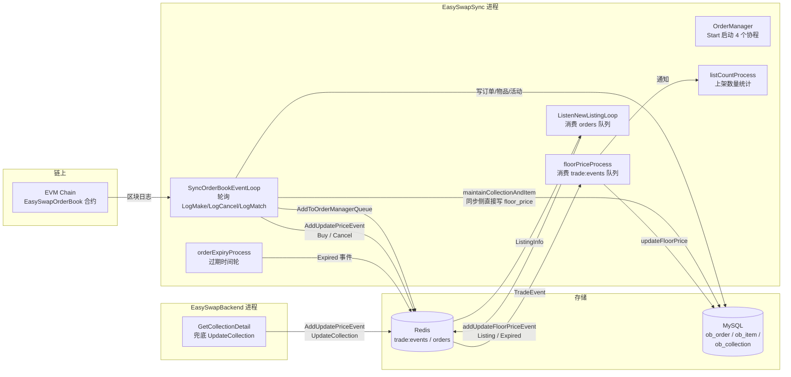

# EasySwap NFT 地板价（Floor Price）逻辑完整解析

> 本文档基于当前仓库代码逐行分析得出，覆盖地板价的**设计**、**实现逻辑**、**触发点**与**连锁操作**。
> 涉及代码文件：
> - `EasySwapBase/ordermanager/floorprice.go` —— 地板价核心处理（事件消费、队列维护、DB 写入）
> - `EasySwapBase/ordermanager/service.go` —— OrderManager 结构、启动、新订单监听
> - `EasySwapBase/ordermanager/expiredorder.go` —— 订单过期时间轮、过期事件生产
> - `EasySwapBase/ordermanager/queue.go` —— 优先级队列 `PriorityQueueMap`
> - `EasySwapBase/ordermanager/listcount.go` —— 联动：上架数量统计
> - `EasySwapSync/service/orderbookindexer/service.go` —— 链上事件索引、事件生产端、同步侧地板价
> - `EasySwapSync/service/collectionfilter/filter.go` —— 集合过滤器
> - `EasySwapBackend/src/dao/collection.go` —— 后端查询地板价 / 涨跌幅
> - `EasySwapBackend/src/service/v1/collection.go` —— 详情页兜底触发 `UpdateCollection`
> - `nft-market-fe/**` —— 前端展示

---

## 1. 核心概念：这个项目里"地板价"是什么

- **地板价（floor price）** 定义：**一个 Collection 中"当前可立即买入"的最低 listing 挂单价格**（不考虑 bid/offer）。
- 它不是一个单纯存储字段，而是由**内存优先级队列 + 数据库 + 事件流**共同维护的动态值。
- 有效 listing 的判定（整个项目统一，SQL 里的核心过滤条件）：

```sql
co.order_type = 1              -- 挂单类型为 Listing（卖单）
AND co.order_status = 0        -- 状态为 Active
AND lower(co.maker) = lower(ci.owner)   -- 挂单者必须是 token 当前 owner（防止已转手/已售出的无效挂单）
AND (ci.is_opensea_banned, co.marketplace_id) != (true, 1)  -- 排除被 OpenSea 标记违规且在 marketplace=1 的 item
-- 部分查询还会加：AND co.expire_time > now()  -- 未过期
```

其中 `(a,b)!=(true,1)` 是 MySQL 行构造器，等价于 `NOT(a=true AND b=1)`。

---

## 2. 关键数据结构

### 2.1 事件 `TradeEvent`（`floorprice.go`）

```go
type TradeEvent struct {
    EventType      EventType       // 事件类型
    CollectionAddr string
    TokenID        string
    OrderId        string
    OrderHash      string
    Price          decimal.Decimal
    From           string
    To             string
    TxHash         string
}
```

### 2.2 事件类型 `EventType`（`floorprice.go`）

| 值 | 名称 | 生产者 | 是否实际使用 |
|----|------|--------|--------------|
| 1  | `Buy` | `handleMatchEvent`（LogMatch 成交） | ✅ |
| 2  | `Mint` | 无 | ❌ 死代码 |
| 3  | `Listing` | `ListenNewListingLoop`（新挂单） | ✅ |
| 4  | `Cancel` | `handleCancelEvent`（LogCancel） | ✅ |
| 8  | `Transfer` | 无 | ⚠️ 有处理分支但当前无生产者 |
| 9  | `Expired` | `orderExpiryProcess`/`updateOrderState`/`loadOrdersToQueue` | ✅ |
| 10 | `ImportCollection` | 无 | ⚠️ 有处理分支但当前无生产者 |
| 11 | `UpdateCollection` | `GetCollectionDetail`（后端详情接口） | ✅ |

### 2.3 内存集合交易信息 `collectionTradeInfo`（`floorprice.go`）

```go
type collectionTradeInfo struct {
    floorPrice decimal.Decimal   // 内存中的地板价（对 DB 中 floor_price 的缓存）
    orders     *PriorityQueueMap // 该集合最低价的优先级队列（上限约 100 条）
}
```

挂在 `OrderManager.collectionOrders map[string]*collectionTradeInfo`，key 为**小写** collection 地址。

### 2.4 优先级队列 `PriorityQueueMap`（`queue.go`）

- 内部是"切片 + 每次 Add 后 `sort.Sort` 全量排序"的实现，不是真正的堆。
- 元素 `Entry{ orderID, priority(价格), maker, tokenID }`，`maker/tokenID` 存小写。
- 提供：
  - `Add(orderID, price, maker, tokenID)` —— 追加后排序，并做**容量裁剪**（保留最低价）；
  - `GetMin()` —— 返回队首（最低价订单）；
  - `GetMax()` —— 返回队尾（最高价订单）；
  - `Remove(orderID)` —— 删除指定订单（O(n) 重建切片）；
  - `RemoveMakerOrders(maker, tokenID)` —— 删除某 maker 在某 token 上的**所有**订单；
  - `Len()` —— 当前订单数。

> ⚠️ **容量裁剪的细节（易被忽略）**：
> ```go
> func (pqm *PriorityQueueMap) Add(...) {
>     if len(pqm.pq) > pqm.maxLen {           // 在 append 之前判断
>         delete(pqm.orders, pqm.pq[len(pqm.pq)-1].orderID)
>         pqm.pq = pqm.pq[0 : len(pqm.pq)-1]
>     }
>     ... append + sort ...
> }
> ```
> `maxLen = 100`。由于判断在 append 之前，队列实际容量会稳定在 **101** 条（第 100 次加入时 `100 > 100` 为假不裁剪，append 后变 101；之后每次先裁 1 再 append 又回到 101）。`GetMin()` 仍取排序后队首，所以**地板价本身始终正确**，只是"保留 100 条最低价"这个优化不严格是 100 条。

### 2.5 Redis Key（`floorprice.go` / `service.go` / `listcount.go`）

| Key | 用途 |
|-----|------|
| `cache:es:trade:events:{chain}` | 交易事件队列（RPUSH 生产 / LPOP 消费），**地板价事件管道** |
| `cache:es:orders:{chain}` | 新挂单原始信息队列（`ListingInfo`），由 `ListenNewListingLoop` 消费 |
| `cache:es:{chain}:collection:listed:{addr}` | 某集合的 listing 数量（listCount，联动功能） |

### 2.6 常量

- `maxQueueLength = 100` —— 每个集合队列保留的最低价订单数
- `MaxBatchReqNum = 100` —— 批量更新订单状态的单批条数
- `WheelSize = 3600` —— 过期时间轮大小（1s/格，1 小时一圈）

---

## 3. 整体架构与数据流



**要点**：
- **事件的生产端是 `EasySwapSync` 的链上索引器**；**消费端（真正算地板价、写库）是同一个 Sync 进程内的 `OrderManager.floorPriceProcess`**。
- `EasySwapBackend` **不跑** OrderManager，只做两件事：① 详情页实时用 SQL 算一次地板价，若与 DB 不一致就推 `UpdateCollection` 事件让 OrderManager 去校准；② 读取 floor_price 展示给前端。
- 数据流是**异步、Redis 队列解耦**的：链上事件 → 落库 + 推事件 → OrderManager 消费 → 更新内存队列 → 写回 DB。

---

## 4. 事件生产端：什么时机推送什么事件

### 4.1 新挂单（Listing 事件）——`handleMakeEvent` + `ListenNewListingLoop`

1. `SyncOrderBookEventLoop` 轮询到 `LogMake`（topic `0xfc37...ffe6`）→ `handleMakeEvent`：
   - 写 `ob_order`（订单，`OrderStatus=Active`）、写 item/activity；
   - `side == List`（卖单）时调用 `syncItemOnListing`（更新 item 的 `owner/list_price/sale_price`）与 `maintainCollectionAndItem`（内部 `updateCollectionFloorPrice`：用 `MIN(item.list_price)` **直接同步写** collection.floor_price，见 §8.4）；
   - 调 `s.orderManager.AddToOrderManagerQueue(...)` 把 `ListingInfo{ExpireIn,OrderId,CollectionAddr,TokenID,Price,Maker}` **RPUSH 到 `cache:es:orders:{chain}`**。
2. `ListenNewListingLoop`（后台常驻协程）`LPOP` 消费：
   - **若订单已过期**（`ExpireIn < now`）→ 更新订单状态为 Expired，并推一个 `Expired` 事件；
   - **若未过期** → 推一个 `Listing` 事件（含 `Price`、`From=Maker`）到 `trade:events`，同时 `addToOrderExpiryCheckQueue` 把该订单挂进过期时间轮（延迟 = `ExpireIn - now` 秒）。

> 即：**新挂单会同时进入"地板价更新管道"和"过期检查时间轮"两条异步链路**。

### 4.2 成交（Buy 事件）——`handleMatchEvent`

轮询到 `LogMatch`（topic `0xf629...b20e`）→ `handleMatchEvent`：
- 区分 make/take 谁是卖单，把**卖方订单**更新为 `Filled`（`order_status=4`，`quantity_remaining=0`，记录 taker）；
- 买方订单若 `quantity_remaining > 1` 则减 1，否则置 Filled；
- 更新 item.owner 为买方；`syncItemOnMatchOrCancel`（item 的 `supply=0, list_price=0, sale_price=成交价`）；
- 最后 `AddUpdatePriceEvent({EventType: Buy, OrderId: 卖单ID, CollectionAddr, TokenID, From: 卖方, To: 买方})` 推入 `trade:events`。

### 4.3 取消（Cancel 事件）——`handleCancelEvent`

轮询到 `LogCancel`（topic `0x0ac8...49bd`）→ `handleCancelEvent`：
- 更新该订单状态为 `Cancelled`（`order_status=3`）；
- 推 `{EventType: Cancel, OrderId, CollectionAddr, TokenID}`；
- 若是**卖单**取消，额外 `syncItemOnMatchOrCancel`（item 下架）。

### 4.4 过期（Expired 事件）——`expiredorder.go`

三条来源：
1. `orderExpiryProcess`：时间轮每秒扫描当前槽，`CycleCount==0` 的订单到期 → 异步 `updateOrderState`：
   - 更新订单状态为 `Expired`；
   - 推 `{EventType: Expired, OrderId, CollectionAddr}`。
2. `loadOrdersToQueue`（**启动时**）：加载所有 Active 订单，已过期的一批批置为 Expired，并逐个推 `Expired` 事件。
3. `ListenNewListingLoop`：新挂单进来时就发现已过期（见 §4.1）。

### 4.5 兜底校准（UpdateCollection 事件）——`EasySwapBackend`

`GetCollectionDetail`（用户打开集合详情页时）：
1. `QueryFloorPrice` 用 SQL **实时算**地板价（§8.3）；
2. 若 `SQL 算出的地板价 != collection.floor_price` 字段：
   - `AddUpdatePriceEvent({EventType: UpdateCollection, CollectionAddr, Price: SQL地板价})` 推入 `trade:events`；
3. 响应里返回给前端的是 **SQL 实时算出的地板价**（`FloorPrice: floorPrice`）。

> 这是一个"**自愈/校准**"通道：即使事件流有丢失，用户一访问详情页就会触发 OrderManager 重新加载该集合并修正 DB 中的 floor_price。

### 4.6 分叉（Fork）对订单/地板价的影响——`checkAndHandleFork`

`handleMakeEvent/handleMatchEvent/handleCancelEvent/handleApprovalEvent` 开头都会调 `checkAndHandleFork(blockNumber, txHash)`：若同一 tx_hash 在别的区块高度已存在（发生重组），则 `rollbackOrderStatus`：
- `Sale` 活动 → 恢复订单 `Active`、`quantity_remaining+1`、清空 taker、恢复 item.owner；
- `Cancel*` 活动 → 恢复订单 `Active`。
- 然后删除旧 activity。
> 注意：分叉回滚会改 `order_status`，进而影响"有效 listing"判定，但**该路径没有显式推送 Expired/Listing 事件**去校正地板价队列，属于一个值得留意的盲区。

### 4.7 当前无生产者的类型（死代码/预留）

- `Mint`（2）、`Transfer`（8）、`ImportCollection`（10）：`EventType` 已定义、`floorPriceProcess` 里也有对应分支，但**当前没有任何代码推送这三种事件**。`ImportCollection` 分支的"导入集合"能力实际由 Sync 的 `ensureCollectionExists`（LogMake 时自动建集合）替代。

---

## 5. OrderManager 启动与地板价主循环

### 5.1 启动（`service.go` `Start()`）

```go
func (om *OrderManager) Start() {
    threading.GoSafe(om.ListenNewListingLoop) // 新订单
    threading.GoSafe(om.orderExpiryProcess)   // 过期
    threading.GoSafe(om.floorPriceProcess)    // 地板价
    threading.GoSafe(om.listCountProcess)     // 上架数量
}
```

> 4 个常驻协程互相通过"Redis 队列 + 内存 channel"协作。OrderManager 在 **EasySwapSync** 的 `Service.Start()` 里启动（`service/service.go`），每个链一个实例。

### 5.2 启动初始化：`floorPriceProcess` 的前半段

```go
func (om *OrderManager) floorPriceProcess() {
    // ① 清空 trade:events 队列（Ltrim key 1 0）
    // ② loadCollectionTradeInfo()：从 DB 加载所有集合 + 订单，构建内存队列
    // ③ 进入 for 循环：LPOP 消费事件
}
```

**`loadCollectionTradeInfo()` 四步**（启动时一次性）：
1. 查 `ob_collection_{chain}` 全部集合的 `id, address, floor_price`，为每个集合初始化 `collectionTradeInfo{floorPrice: DB值, orders: NewPriorityQueueMap(100)}`；
2. 分页（每批 1000，按 `id` 游标）加载**所有** Active 的 Listing 订单（过滤条件同 §1），join item 表确保 `maker=owner`、排除 banned；
3. 把每个订单 `Add` 进所属集合的队列（队列容量裁剪后约保留 101 条最低价）；
4. 对每个集合：`orders.GetMin()` 与内存 `floorPrice` 比较，**不一致就 `updateFloorPrice` 写回 DB**（启动即做一次全量校准）。

> ⚠️ 启动时加载订单**不过滤 `expire_time > now`**。此时并发运行的 `orderExpiryProcess → loadOrdersToQueue` 会陆续把已过期订单置为 Expired 并推 `Expired` 事件；所以启动瞬间队列里可能短暂混入"已过期但还没被标记"的订单，随后由 Expired 事件校正。这是一个**可接受的启动竞态**，但要理解它存在。

### 5.3 主循环（消费事件）

```go
for {
    result, err := om.Xkv.Lpop(key)   // LPOP trade:events
    if err != nil || result == "" { time.Sleep(1s); continue }
    json.Unmarshal(result, &event)
    tradeInfo, ok := om.collectionOrders[strings.ToLower(event.CollectionAddr)]
    if !ok && event.EventType != ImportCollection { continue }  // 未跟踪的集合，丢弃
    if event.CollectionAddr != "" {
        om.collectionListedCh <- event.CollectionAddr   // ★ 联动 listCount（见 §9）
    }
    switch event.EventType { ... }   // 见 §6
}
```

**关键点**：
- 空队列时 sleep **1 秒**轮询（延迟最多 ~1s + 网络）。
- **每个非空事件都会往 `collectionListedCh` 发一条通知**，驱动 listCount 刷新（见 §9）。
- 未跟踪的集合直接丢弃（`ImportCollection` 除外，它用于新建跟踪）。

---

## 6. 六种事件类型的处理分支（`floorprice.go` switch）

### 6.1 `Listing`（新挂单）

```go
_, price := tradeInfo.orders.GetMax()
if price.GreaterThan(event.Price) || tradeInfo.orders.Len() == 0 {
    tradeInfo.orders.Add(event.OrderId, event.Price, event.From, event.TokenID)
}
checkAndUpdateFloorPrice(event.CollectionAddr)
```

- **只把"价格低于当前队尾最高价"或"队列为空"的新挂单加进队列**。因为队列只保留最低价订单，价格高于队尾的挂单对地板价无影响，直接丢弃，省内存。
- 随后统一 `checkAndUpdateFloorPrice`（见 §7.2）。

### 6.2 `Cancel` / `Expired`（取消 / 过期）

```go
tradeInfo.orders.Remove(event.OrderId)
if tradeInfo.orders.Len() == 0 {
    reloadCollectionOrders(event.CollectionAddr)  // 队列空了 → 从 DB 重载最低 100 单
}
checkAndUpdateFloorPrice(event.CollectionAddr)
```

- 从队列删掉该订单；**只有队列完全为空才重载**（否则新地板价已在队列内，无需查库）。
- 这是 `Remove` 语义下唯一的重载触发点之一。

### 6.3 `Buy` / `Transfer`（成交 / 转移）

```go
if event.EventType == Buy {
    tradeInfo.orders.Remove(event.OrderId)   // 删除被成交的那一单
}
if tradeInfo.orders.Len() == 0 {
    reloadCollectionOrders(...)              // 空则重载
} else {
    tradeInfo.orders.RemoveMakerOrders(event.From, event.TokenID) // 删除卖方在该 token 上的所有挂单
    orders, _ := getUserValidOrders(event.CollectionAddr, event.TokenID, event.To) // 取买方有效挂单
    for _, order := range orders {
        if !order.IsOpenseaBanned {
            _, maxPrice := tradeInfo.orders.GetMax()
            if maxPrice.GreaterThan(order.Price) { // 低于队尾才加入
                tradeInfo.orders.Add(order.OrderID, order.Price, order.Maker, order.TokenId)
            }
        }
    }
    if tradeInfo.orders.Len() == 0 { reloadCollectionOrders(...) }
}
checkAndUpdateFloorPrice(event.CollectionAddr)
```

**设计意图**：
- 成交后卖方不再是 owner，其所有挂单（`From + TokenID`）都失效，必须清掉（`RemoveMakerOrders`）；
- 买方刚获得该 token，若其名下已有有效挂单（如同笔交易里"买后立刻再挂"），需要把它们补进队列（`getUserValidOrders(..., To)`）；
- 只有当买方挂单价格**低于当前队尾**才加入（保证队列始终是"最低的一批"）；
- 队列空了才整单重载。
- `Transfer` 与 `Buy` 共用分支，差别仅是 **`Transfer` 不 `Remove(OrderId)`**（因为没有具体成交单）。当前 `Transfer` 无生产者。

### 6.4 `ImportCollection`（导入集合）

```go
if _, ok := om.collectionOrders[...]; ok { continue }  // 已存在则跳过
om.collectionOrders[lower(addr)] = &collectionTradeInfo{ floorPrice: 0, orders: NewPriorityQueueMap(100) }
```

- 仅**登记**一个空集合（地板价 0、空队列），不做加载。当前无生产者（见 §4.7）。

### 6.5 `UpdateCollection`（兜底校准）

```go
_, floorPrice := tradeInfo.orders.GetMin()
if floorPrice.Equal(event.Price) { continue }   // 队列当前最低价 == 事件携带价，无需处理
reloadCollectionOrders(event.CollectionAddr)     // 否则从 DB 重载最低 100 单
checkAndUpdateFloorPrice(event.CollectionAddr)
```

- 事件携带的 `Price` 是后端 SQL 实时算出的地板价；**与队列最低价相等就直接跳过**（避免无谓的重载与写库）；
- 不一致说明队列已过期（例如事件流丢失），于是**整单重载**并重新写库。这是第二个重载触发点。

---

## 7. 地板价的"校验 + 写库"核心函数

### 7.1 `reloadCollectionOrders(address)`（重载某集合）

1. 检查集合是否被跟踪；
2. `getLowestPrice100Orders`：SQL 取该集合**价格升序前 100 个**有效 listing（过滤条件同 §1）；
3. **新建** `NewPriorityQueueMap(100)` 并逐个 `Add`；
4. 写回 `om.collectionOrders`。

> 即：重载 = 放弃当前内存队列，以 DB 为准重建"最低 100 单"。它**不直接写 floor_price**，写库交给调用方之后的 `checkAndUpdateFloorPrice`。

### 7.2 `checkAndUpdateFloorPrice(address)`（核心：比较 + 写库）

```go
func (om *OrderManager) checkAndUpdateFloorPrice(address string) error {
    tradeInfo, ok := om.collectionOrders[lower(address)]
    if !ok { return errors.New("untracked collection") }

    _, newFloorPrice := tradeInfo.orders.GetMin()      // 队列最低价
    if !newFloorPrice.Equal(tradeInfo.floorPrice) {     // 只有变化才写
        tradeInfo.floorPrice = newFloorPrice            // 更新内存
        om.collectionOrders[lower(address)] = tradeInfo
        om.updateFloorPrice(address, newFloorPrice)     // 写 DB ob_collection.floor_price
        xzap.Info("update collection floor price", ...)
    }
    return nil
}
```

- **只有地板价发生变化才写数据库**（去抖：大量不改变最低价的事件不会触发 DB 写）。
- 注意：比较对象是**内存里的 `tradeInfo.floorPrice`**（启动时从 DB 加载的缓存），不是每次都对 DB 的列，因此写库频率较低。

### 7.3 `updateFloorPrice(collectionAddr, price)`

```sql
UPDATE ob_collection_{chain} SET floor_price = ? WHERE address = ?
```

---

## 8. 数据库层的查询与两条写库路径

### 8.1 常用 SQL（`floorprice.go` / `service.go` / `dao/collection.go`）

**① 加载全量订单（启动，`loadCollectionTradeInfo`）**
```sql
SELECT co.id, co.order_id, co.collection_address, co.price, co.maker, co.token_id
FROM ob_order_{chain} co
JOIN ob_item_{chain} ci
  ON co.collection_address = ci.collection_address AND co.token_id = ci.token_id
WHERE co.order_type = 1 AND co.order_status = 0
  AND co.maker = ci.owner
  AND (ci.is_opensea_banned, co.marketplace_id) != (true, 1)
  AND co.id > ?          -- 游标分页，每批 1000
ORDER BY co.id ASC
```

**② 取某集合最低 100 单（重载，`getLowestPrice100Orders`）**
```sql
...同①的过滤...
WHERE co.collection_address = ? AND ...
ORDER BY co.price ASC
LIMIT 100
```

**③ 取买方有效挂单（`getUserValidOrders`）**
```sql
...同①过滤 + 关联 is_opensea_banned...
WHERE co.collection_address = ? AND co.token_id = ? AND co.maker = ?
ORDER BY co.price ASC LIMIT 100
```

**④ 后端实时地板价（`QueryFloorPrice`，用于详情页展示 + 触发 UpdateCollection）**
```sql
SELECT co.price
FROM ob_item_{chain} ci
LEFT JOIN ob_order_{chain} co
  ON co.collection_address = ci.collection_address AND co.token_id = ci.token_id
WHERE co.collection_address = ?
  AND co.order_type = 1 AND co.order_status = 0
  AND co.maker = ci.owner
  AND (ci.is_opensea_banned, co.marketplace_id) != (true, 1)
ORDER BY co.price ASC
LIMIT 1
```
> 用 **LEFT JOIN**，若某 token 无有效挂单则该行 `co.price = NULL`，不会成为地板价。

### 8.2 数据过滤的一致性
所有"有效 listing"判定都基于同一组条件（order_type=1、order_status=0、maker=owner、非 banned+非 marketplace=1）。但**存在不一致点**：
- 地板价历史统计 `QueryCollectionsFloorPrice`（Sync，§10）**多了一个 `expire_time > now`** 过滤；
- 启动加载（`loadCollectionTradeInfo`）**没有** `expire_time` 过滤（靠过期事件后补校正）。

### 8.3 两条"写 floor_price 列"的路径

| 路径 | 触发 | 数据来源 | 实时性 |
|------|------|----------|--------|
| **A. OrderManager** `updateFloorPrice` | 每个交易事件 → `checkAndUpdateFloorPrice` | 内存优先级队列（最低 100 单） | 事件驱动，亚秒级 |
| **B. Sync** `updateCollectionFloorPrice` | 每个 LogMake 卖单 → `maintainCollectionAndItem` | `MIN(item.list_price)`（item 表） | 每个新挂单 |

> 两条路径都会写 `ob_collection.floor_price`，逻辑上**互为备份/自愈**。B 路径的数据源（`item.list_price`）由 `syncItemOnListing/syncItemOnMatchOrCancel` 维护；A 路径的数据源是订单队列。二者最终应收敛到同一值，但写库顺序不保证，极端情况下会互相覆盖（先写后写不定）。

---

## 9. 联动 ①：地板价事件 → 上架数量刷新（`listcount.go`）

- `floorPriceProcess` 处理**任意**交易事件时都会执行 `om.collectionListedCh <- event.CollectionAddr`（channel 容量 1000）。
- `listCountProcess` 消费该 channel，把集合地址记入内存 map；
- 每 **60 秒** ticker 一次性对记录到的所有集合执行 `countCollectionListed`（SQL 统计去重 token 的活跃挂单数），并 `SET` 到 `cache:es:{chain}:collection:listed:{addr}`；
- 后端 `QueryCollectionsListed / CacheCollectionsListed` 读写该缓存，用于前端"Listings"数量展示（`collections-table` 的 `list_amount` 等）。

> **结论：每一个影响地板价的事件，同时也会"记账"触发一次上架数量刷新（60s 内合并批量执行）。** 这是 `collectionListedCh` 把两个独立功能耦合起来的关键设计。

---

## 10. 联动 ②：地板价历史与涨跌幅（`ob_collection_floor_price_{chain}`）

这是**另一条独立于 OrderManager 的地板价链路**，服务于"24h 涨跌幅 / 排名"。

### 10.1 Sync 侧写入历史快照（`service.go` `UpKeepingCollectionFloorChangeLoop`）

两个定时器：
- **每 10 秒**（`MaxCollectionFloorTimeDifference`）：`QueryCollectionsFloorPrice` 用 SQL 对**所有集合**算一次 `MIN(price)`（过滤：order_type=1、status=0、`expire_time > now`、maker=owner），批量 `persistCollectionsFloorChange` **INSERT ... ON DUPLICATE KEY UPDATE** 写入 `ob_collection_floor_price_{chain}`（唯一键 `(collection_address, price, event_time)`）。
- **每 24 小时**（`DaySeconds`）：`deleteExpireCollectionFloorChangeFromDatabase` 删除 `event_time < now - 60 天`（`CollectionFloorTimeRange=2*30*24*3600`）的旧记录，防止表无限膨胀。

### 10.2 后端计算涨跌幅（`dao/collection.go` `QueryCollectionFloorChange`）

```sql
SELECT collection_address, price, event_time
FROM ob_collection_floor_price_{chain}
WHERE (collection_address, event_time) IN (         -- 每个集合最新一条
        SELECT collection_address, MAX(event_time) FROM ... GROUP BY collection_address
      )
   OR (collection_address, event_time) IN (         -- 每个集合在 timeDiff 之前最新一条
        SELECT collection_address, MAX(event_time) FROM ... WHERE event_time <= UNIX_TIMESTAMP() - ?
        GROUP BY collection_address
      )
ORDER BY collection_address, event_time DESC
```

- 取每个集合**最新**与 **timeDiff（如 24h）之前最近** 两条快照；
- 涨跌幅 = `(最新价 - 之前价) / 之前价`；之前价为 0 则记为 0；
- 供排名接口 `ranking.go` 的 `FloorChange` 使用，前端 `collections-table` 的 "24h %" 展示。

---

## 11. 联动 ③：后端读取与前端展示

### 11.1 集合详情页（`GetCollectionDetail`）
- `QueryFloorPrice`（SQL 实时算）→ 与 `collection.FloorPrice` 列比较 → 不等则推 `UpdateCollection` 事件（自愈）；
- 响应 `FloorPrice` 返回的是 **SQL 实时值**，而不是 DB 列值。

### 11.2 排名列表（`ranking.go`）
- `FloorPrice: collection.FloorPrice.String()`（读 DB 列）；
- `FloorChange: QueryCollectionFloorChange` 计算结果；
- `ListAmount` 来自 listCount 缓存（§9）。

### 11.3 钱包 Portfolio（`portfolio.go`）
- `chainInfo.ItemValue += itemCount * FloorPrice`（用 `collection.FloorPrice` 估算资产价值）。

### 11.4 前端展示（`nft-market-fe`）
- `collection-header.tsx`：`formatUnits(floor_price, 18)` 显示为 "X.XXXX ETH"，0 显示 "— ETH"；
- `market-hero.tsx`：首页轮播 5 个集合，展示 `floor_price` 与 `floor_price_change`；
- `collections-table.tsx`：Floor 列 + "24h %" 列（`floor_price_change`），并支持按 floor 排序；
- `item-detail-view.tsx`：item 详情展示集合 `floor_price`。

---

## 12. 触发关系总结（速查表）

| 链上/外部事件 | 落库操作 | 推送的事件 | 消费后动作 |
|---------------|----------|-----------|------------|
| `LogMake` 卖单 | 写 order/item/activity；`syncItemOnListing`；`updateCollectionFloorPrice`(B路径) | `AddToOrderManagerQueue` → `ListenNewListingLoop` → `Listing` 事件 + 入过期时间轮 | 条件性入队 + `checkAndUpdateFloorPrice` |
| `LogMake` 买单 | 写 order/activity | 无（买单不影响地板价；仅走过期链路） | — |
| `LogMatch` 成交 | 卖方订单→Filled、item 转手/下架 | `Buy` 事件 | 删单、删卖方该 token 挂单、补买方挂单、`checkAndUpdateFloorPrice` |
| `LogCancel` 取消 | 订单→Cancelled、item 下架 | `Cancel` 事件 | 删单、空则重载、`checkAndUpdateFloorPrice` |
| 订单到期（时间轮） | 订单→Expired | `Expired` 事件 | 删单、空则重载、`checkAndUpdateFloorPrice` |
| 启动 | 过期订单批量置 Expired | 每个过期单一个 `Expired` 事件 | 同上 |
| 用户打开详情页 | — | `UpdateCollection` 事件（后端 SQL 算出的价） | 价格不等则重载 + `checkAndUpdateFloorPrice` |
| 链重组（fork） | 回滚订单状态/所有权 | **无显式事件** ⚠️ | 队列可能短暂失真，等下一次事件/详情页自愈 |
| 任意交易事件 | — | `collectionListedCh` 通知 | 60s 内批量刷新该集合 listCount 缓存 |

---

## 13. 边界情况与潜在问题（阅读源码时的注意点）

1. **队列容量 101 vs 100**：`PriorityQueueMap.Add` 的裁剪判断在 append 前，实际保留约 101 条；不影响 `GetMin()` 正确性。
2. **重载时机过于保守**：只有 `Len()==0` 才重载。若同一集合大量订单在短时间内被移除（>100 条），而队列只在空时才重载，且 `checkAndUpdateFloorPrice` 只比较内存值，**理论上可能出现地板价与实际不符**（未命中的情况需要等 `UpdateCollection` 自愈或队列清空）。实际中因队列保留约 100 条且移除多走事件流，风险较低。
3. **两条写 floor_price 的路径**（§8.3）可能互相覆盖，写序不保证；依赖"最终收敛"而非"强一致"。
4. **启动竞态**：`floorPriceProcess` 与 `orderExpiryProcess` 并发启动，启动瞬间队列可能短暂包含已过期订单。
5. **1 秒轮询延迟**：`LPOP` 空时 `sleep(1s)`，地板价更新最多延迟 ~1s（事件流正常情况下）。
6. **channel 背压**：`collectionListedCh` 容量 1000，若 `listCountProcess` 消费慢，`floorPriceProcess` 发通知可能阻塞（影响地板价处理）。
7. **Fork 盲区**：分叉回滚订单状态后不推事件校正地板价队列（§4.6）。
8. **`UpdateCollection` 依赖用户访问**：兜底校准只在"有人打开详情页"时触发，冷门集合可能长期依赖事件流本身的正确性。
9. **DB 写频率**：`checkAndUpdateFloorPrice` 只在价格变化时写库，但高频交易下仍是"每次变化一次 UPDATE"，是潜在的写放大点。
10. **多实例部署**：若 `EasySwapSync` 多副本运行，多个 `floorPriceProcess` 会**同时 LPOP 同一 Redis 队列**，需确保仅单实例消费（或利用 LPOP 的原子性分散处理，但会破坏内存队列一致性）。当前代码假设单实例/单链单消费。

---

## 14. 典型场景时序

### 场景 A：新低价挂单上架
```
链上 LogMake(价格 0.5 ETH)
  → Sync: 写 order(A,0.5) / item / activity; syncItemOnListing; updateCollectionFloorPrice(B)
  → AddToOrderManagerQueue → Redis cache:es:orders
  → ListenNewListingLoop: 未过期 → RPUSH trade:events [Listing, 0.5]
      → 同时入过期时间轮
  → floorPriceProcess: GetMax()=1.0 > 0.5 → Add(0.5) → GetMin()=0.5 ≠ 内存0.6
      → UPDATE ob_collection.floor_price=0.5; 通知 listCount
```

### 场景 B：地板价订单被买走
```
链上 LogMatch(0.5 ETH)
  → Sync: 卖单→Filled; item 转手; syncItemOnMatchOrCancel
  → RPUSH trade:events [Buy, orderId, from, to]
  → floorPriceProcess:
      Remove(orderId); RemoveMakerOrders(from, token)
      getUserValidOrders(collection, token, to) → 若 to 有低价挂单则加入
      GetMin()=0.6 → UPDATE floor_price=0.6; 通知 listCount
```

### 场景 C：用户打开详情页发现 DB 地板价过期
```
GetCollectionDetail
  → QueryFloorPrice(SQL) = 0.5，而 DB 列 = 0.8
  → RPUSH trade:events [UpdateCollection, price=0.5]
  → floorPriceProcess: GetMin()=0.6 ≠ 0.5 → reloadCollectionOrders → checkAndUpdateFloorPrice → 写 0.5
  → 响应前端 floor_price=0.5
```

---

*本文档基于仓库当前代码整理；若代码演进（事件类型、队列实现、定时参数等）发生变化，请以最新源码为准。*
