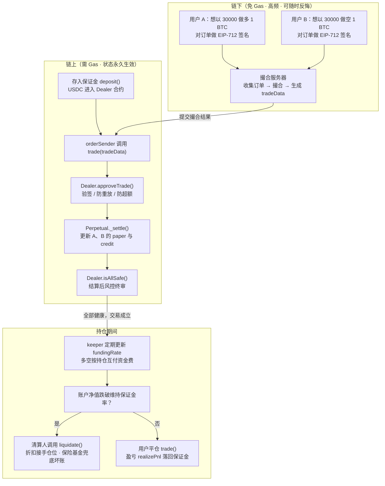
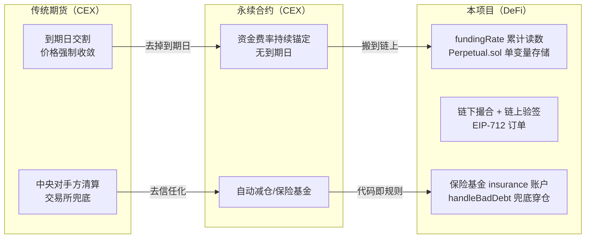

# 第 1 章：永续合约入门 — 为什么 DeFi 需要"永不交割的期货"

> 本章是全书的地基，不要求读任何一行代码也能看懂；但我们会随手把概念对应到本项目的真实代码位置（`src/Perpetual.sol`、`src/libraries/Types.sol` 等），让你后面读源码时每个名词都有"着落点"。

---

## 1. 本章导读

### 1.1 先从"期货"说起：一纸约定

假设你是一名面粉厂老板，三个月后要买 100 吨小麦。你担心小麦涨价，于是今天就和农场主签合同："三个月后，无论市价多少，我按 3000 元/吨买你 100 吨。"这张合同就是**期货合约（Futures）**——一份"约定在未来某天、以某价格、买卖某资产"的标准化协议。

期货解决的是"不确定性"问题：面粉厂锁定了成本，农场主锁定了销路。当然，市场上大部分参与期货的人并不真的需要小麦，他们只是**押注价格的涨跌**——看涨就先"买入"合约，看跌就先"卖出"合约，价格方向赌对了赚差价，赌错了亏差价。这就是期货市场的投机属性，也是它流动性充沛的原因。

传统期货有一个关键特征：**有到期日（交割日）**。到了那天，双方必须交割实物（或按结算价现金了结）。这带来一个麻烦：如果你想长期持有"看涨BTC"这个观点，每隔一段时间就得平掉旧合约、换到下一期的合约上（行话叫"移仓换月"），费时费力还产生交易成本。

### 1.2 永续合约：把"到期日"去掉的期货

**永续合约（Perpetual Swap）** 就是把交割日删掉的期货——2016 年由 BitMEX 推广开来的金融发明，如今是整个加密市场交易量最大的品种。没有到期日，意味着你可以"永远持仓"，观点不改变就永远不用移仓。

但去掉到期日会引出一个致命问题。回忆一下期货价格会在临近交割时**强制向现货价格收敛**——因为到期那天你手里的合约必须按现货结算，投机价格无论炒多高都得归位。而永续合约没有到期日，它的价格就**失去了天然锚**：如果大家都疯狂看涨，永续合约价格可以被炒到 40000，而现货只有 30000，两者长期脱节，"期货"就名存实亡了。

### 1.3 资金费率：用"持续的小额转账"代替"到期的大额交割"

去中心化交易所的解法非常巧妙：**用持续的资金费（Funding Fee）代替一次性的到期交割**。

规则很简单，每隔一段时间（通常 8 小时，本项目由链下 keeper 驱动）：

- **当永续价格高于现货价格**（市场过度看涨）→ 多头付钱给空头，抑制做多、奖励做空，把永续价格"压"回现货；
- **当永续价格低于现货价格**（市场过度看跌）→ 空头付钱给多头，把永续价格"托"回现货。

生活化类比：永续价格和现货价格就像两个手拉手的人。**资金费率就是连接两人的那根"橡皮筋"**——任何一方想挣脱走远，橡皮筋都会产生一股把他拉回来的力。价格偏离越大，橡皮筋的拉力（费率）越强，但橡皮筋永远不会把两人"拽"到同一点（它只施加力，不强制交割），所以收敛是软性的、持续发生的。

关键在于：**多空之间互相转账，平台本身不参与付费**——这保证了交易所（或协议）在资金费机制上是中性的。

### 1.4 杠杆与保证金：放大收益也放大风险的"借力"

光有价格机制还不够，永续合约的另一支柱是**保证金交易**。你不真的拿出 30000 USDC 买 1 个 BTC，而是先存一笔**保证金**（比如 3000 USDC），凭它开出价值 30000 USDC 的仓位——这就是 10 倍杠杆。

风险也随之放大：价格反向波动 10%，你的 3000 USDC 就亏光了。所以系统引入**清算（Liquidation）**机制：给账户设一条"最低健康线"（维持保证金率），账户净值跌破这条线时，任何人都可以把你的仓位"接管"过去（通常带一点折扣作为清算人的酬劳），防止亏损继续扩大、最终转嫁给系统。押金不够就收回房子——系统永远不能被亏穿。

### 1.5 那么问题来了：DeFi 为什么需要它？以及本项目怎么实现？

永续合约长期是 CEX 的天下，因为**撮合**（把买单卖单配对）和**清算**（盯盘、抢时效）都极其依赖高性能的中心化系统。把它搬上链有三个诱因：**资产自托管**（钱在自己钱包）、**无准入**（无需 KYC 即可交易）、**透明可验证**（规则写在代码里）。

但完全在链上做撮合代价高昂：每笔挂单、撤单、改价都是一笔交易，EVM 每秒只能处理几十笔，根本跟不上市场节奏。

本项目的答案是一条被 dYdX、Aperture 等验证过的路线：**链下撮合、链上结算（Off-chain Matching, On-chain Settlement）**——

- **链下**：用户对订单做 EIP-712 签名，发给中心化撮合服务器；服务器像"流水线配对员"一样高速撮合；
- **链上**：服务器把撮合结果提交给智能合约。合约本身**不懂撮合，只懂验证与记账**——验签（确认订单真的是用户签的）、记账（更新每个人的仓位与保证金）、风控（确保结算后没人爆仓）、清算。

打个比方：**撮合服务器是餐厅的"配菜员"，智能合约是"收银台兼保险柜"**。配菜员动作再快，钱必须经过收银台、锁进保险柜，而且收银台只认"带你亲笔签名的菜单"。

```
用户钱包(EIP-712签名) ──► 链下撮合服务器 ──► orderSender提交
                                              │
              ┌─────────────── 链上合约系统 ───────────────┐
              │  MetaNodeDealer(总行) ◄──► Perpetual(分行)   │
              │  验签 · 保证金 · 风控 · 清算    持仓 · 资金费 │
              └──────────────────────────────────────────┘
```

记住这句话，全书都在展开它：**"链上不做撮合，只做'验签 + 记账 + 风控'三件事"**。

---

## 2. 架构 / 流程图

### 2.1 一笔永续合约交易的完整生命周期（从开仓到平仓/清算）



### 2.2 CEX 传统期货 → 永续合约 → 本项目的概念映射



---

## 3. 核心代码拆解

本章目标是"用代码印证概念"，我们挑 8 个最能代表永续合约核心机制的代码点。看不懂的细节没关系，后续章节会逐个深挖。

### (1) `paper` 与 `credit` —— 仓位与资金的"双轨记账"

```solidity
// src/Perpetual.sol
struct balance {
    int128 paper;          // 仓位数量：正=做多，负=做空（"虚拟票据"的张数）
    int128 reducedCredit;  // 资金量锚点（配合 fundingRate 现算出真实 credit）
}
mapping(address => balance) balanceMap;   // 本市场每人的持仓账本
int256 fundingRate;                       // 本市场累计资金费率读数
```

**为什么这么设计？** 期货世界里"数量"和"钱"必须分开记：你持有 1 BTC 的多头（数量），但你这 1 张票据到底值多少钱，取决于入场价、已付的资金费、未实现的浮动盈亏（钱）。本项目用一对带符号的数字 `paper`/`credit` 表达这个二元组——**看 `paper` 知方向，看 `credit` 知盈亏**。`int128` 允许负数是刻意的：做空 = 负的 paper，负的 credit 代表你欠市场的钱，这样多空双方可以用同一套加减法记账，无需写两套逻辑。

### (2) 源码注释里的数值例子 —— 每个初学者都应该背下来的锚

```solidity
// src/Perpetual.sol 文件头注释（原文摘录）
/**
 * 举例：
 * - 以 $30,000 做多 1 BTC: paper = 1e18,  credit = -30000e6
 * - 以 $30,000 做空 1 BTC: paper = -1e18, credit = 30000e6
 */
```

读懂这一行，你就读懂了本项目的记账语言：

- 做多 1 BTC，意味着"拿到 1 张 BTC 票据、付出 30000 USDC"，所以 `paper = +1e18`（1 后面跟 18 个零，因为项目统一用 1e18 作为"1 个单位"的定点数表达），`credit = -30000e6`（付出 3 万，USDC 用 6 位小数所以是 1e6 基数）。
- 做空则完全镜像：拿到钱（credit 为正）、欠下票据（paper 为负）。
- **当 BTC 涨到 31000**：多头那张票据价值 +31000e6，他还欠着 30000e6，净赚 1000e6。这就是"盈亏 = 现值 − credit 绝对值"的直觉来源。

### (3) 资金费率的实现 —— 一个变量扛起整套机制

```solidity
// src/Perpetual.sol
function updateFundingRate(int256 newFundingRate) external onlyOwner {
    int256 oldFundingRate = fundingRate;
    fundingRate = newFundingRate;                        // 只写这一个槽！
    emit UpdateFundingRate(oldFundingRate, newFundingRate);
}

function balanceOf(address trader) external view returns (int256 paper, int256 credit) {
    paper = int256(balanceMap[trader].paper);
    // 真实 credit 是现算值：持仓 × 累计读数 + 存储锚点
    credit = paper.decimalMul(fundingRate) + int256(balanceMap[trader].reducedCredit);
}
```

**作者为什么这么设计？** 每次费率更新理论上要影响**全市场所有持仓者**的余额。如果逐人转帐结算，一次更新就是几万次存储写——gas 上完全不可行。这里把资金费设计成"累计读数"（类比**水表**）：所有人的账单 = 自己的持仓量 ×（读数变化），于是更新费率只需要写 1 个存储槽，全市场的 credit 就同时正确漂移了。源码注释里特意强调："fundingRate 是累计值，其绝对值没有意义，只有变化量才重要"——以及一个反直觉的方向约定：**本项目 fundingRate 上升 = 多头收 credit**，与多数 CEX 的符号习惯相反，第 10 章会专门拆解。

### (4) 杠杆倍数不是魔法 —— 它就是两个风险参数

```solidity
// src/libraries/Types.sol
struct RiskParams {
    uint256 initialMarginRatio;      // 初始保证金率：10% ⇔ 最大 10 倍杠杆
    uint256 liquidationThreshold;    // 维持保证金率：净值跌破 持仓×此值 即可被清算
    uint256 liquidationPriceOff;     // 清算折扣：给清算人的价格优惠
    uint256 insuranceFeeRate;        // 保险费率：从被清算者处抽取，注入保险基金
}
```

**设计思想**：链上代码不认识"10 倍杠杆"这个词，它只认识两个比率。开仓时要求 `净值 ≥ 持仓名义价值 × initialMarginRatio`（10% 的初始保证金 = 最多 10 倍杠杆），持仓期间跌破 `持仓 × liquidationThreshold` 就触发清算。每个市场（每个 Perpetual）可以配一套参数——BTC 波动小可以放得宽，山寨币波动大就收得紧。**风险参数化**是所有衍生品系统的通用做法。

### (5) 订单结构体 —— "链下撮合"的信任凭据长什么样

```solidity
// src/libraries/Types.sol
struct Order {
    address perp;            // 目标市场：绑定具体 Perpetual，防止跨市场重放
    address signer;          // 签名者 = 承担盈亏的人
    int128 paperAmount;      // 买卖方向与数量：正=买(做多)，负=卖(做空)
    int128 creditAmount;     // 资金：与 paperAmount 异号
    bytes32 info;            // 打包了费率/过期时间/nonce 等多个字段的"盒子"
}
// 价格隐含在订单里：price = |creditAmount| / |paperAmount|
// 买单：paper > 0 且 credit < 0（付出资金换票据）；卖单正好相反
```

注意 `creditAmount` 与 `paperAmount` **必须异号**——一张订单同时表达"方向、数量、限价"三件事，不需要单独的 price 字段（第 8 章细讲）。`info` 把四个小字段塞进一个 bytes32，是一个纯为 gas 服务的打包设计。这张结构体就是"链下撮合"信任模型的全部：**用户签的是这个结构，撮合服务器只是搬运工**。

### (6) 链上验证入口 —— 合约"不懂撮合"的体现

```solidity
// src/MetaNodeExternal.sol（approveTrade 节选，详见第 8 章）
function approveTrade(address orderSender, bytes calldata tradeData)
    external onlyRegisteredPerp returns (address[] memory, int256[] memory, int256[] memory)
{
    require(state.validOrderSender[orderSender], Errors.INVALID_ORDER_SENDER); // 白名单撮合员
    // 逐单：验签(EIP-712/EIP-1271) → 检查过期/异号/防跨市场/防自成交 → 累计成交量防超额
    // 最终由 Trading._matchOrders 计算每个人的 paper/credit 变化并返回
}
```

**为什么这么设计？** 撮合算法（谁和谁配对、价格是否公平）完全发生在链下，链上合约**重新计算一遍撮合结果是不可能的**（订单流是动态的），但它可以验证"这份结果没有作弊"：每张订单都有签名、没超量、没过期、确实属于这个市场。这是一种把"计算"留在链下、把"验证"放在链上的经典架构（类似 optimistic rollup 的思想雏形）。

### (7) 保证金的生命周期 —— 存入自由，取出设防

```solidity
// src/MetaNodeExternal.sol
function deposit(uint256 primaryAmount, uint256 secondaryAmount, address to) external nonReentrant { ... }
function requestWithdraw(address from, uint256 primaryAmount, uint256 secondaryAmount) external nonReentrant { ... }
function executeWithdraw(address from, address to, bool isInternal, bytes memory param) external nonReentrant { ... }
// state.withdrawTimeLock：取款时间锁（秒）
```

**存钱一步到位，取钱分两步走**——这是刻意的。取款请求后要等 `withdrawTimeLock` 才能执行，目的是给清算系统留出"反应窗口"：如果用户刚签了会让自己爆仓的大额订单、又抢在清算前闪电取款，系统就产生了坏账。时间锁等于给链下风控留了至少一个区块确认周期的缓冲。这也是链上金融与普通后端的最大不同之一：**每一次状态变更都可能成为攻击向量，必须预设"最坏情况下的退出通道"**。

### (8) 保险基金 —— 系统的最后防线

```solidity
// src/libraries/Types.sol（State 结构体节选）
address insurance;           // 保险账户：收取保险费 + 兜底坏账
address fundingRateKeeper;   // 链下费率机器人
uint256 maxPositionAmount;   // 单用户最大持仓市场数（限制风险敞口扩散）
```

穿仓（价格瞬间跳空，清算都来不及，用户亏成负数）在任何杠杆市场都无法根除，区别只是**谁来承担**。本项目由 `insurance` 账户兜底，其资金来自每次清算抽的 `insuranceFeeRate`。这是把 CEX 时代成熟的风控经验（保险基金 + 强平折扣）完整移植到链上。

---

## 4. Web3 特有机制

本章概念在落地为代码时，触碰到了这些链上特性，先混个脸熟：

1. **EIP-712 结构化签名**：用户不是对一串字节盲签，而是对一个人类可读的结构化订单签名，且签名绑定了合约地址与链 ID（`domainSeparator`），天然防跨链/跨合约重放。这是"链下撮合"能成立的前提。
2. **定点数与精度**：EVM 没有小数，全项目用 1e18（paper/费率）和 1e6（USDC）两种基数，用 `SignedDecimalMath.decimalMul` 这类手工定点乘法。**精度丢失与溢出**是链上金融数学的头号事故来源。
3. **Gas 优先的存储设计**：`fundingRate` 单槽更新替代全用户结算、`int128` 打包、`info` 字段打包 bytes32——每一个都是"以计算换存储"的取舍，因为链上**读 2100 gas / 写 20000 gas**，存储是第一贵的东西。
4. **重入防护 `nonReentrant`**：所有动真金白银的入口（`deposit`/`requestWithdraw`/`executeWithdraw`）都挂了 OpenZeppelin 的重入锁。存款和取款是外部代币回调（`transfer` 到合约可能触发接收方代码）的第一现场。
5. **时间作为风控手段**：`withdrawTimeLock`、订单 `expiration`——链上没有"客服冻结账户"，只能靠**把时间写进规则**来争取风控反应窗口。
6. **事件（event）作为链下系统的数据源**：`UpdateFundingRate`、`BalanceChange` 等事件是撮合服务器和前端重建状态的依据。链下系统对链上的一切感知，几乎都来自事件，而非主动查询。

---

## 5. 本章小结与思考题

### 5.1 核心知识点回顾

- **永续合约 = 去掉到期日的期货**，用**资金费率**（多空互付的持续转账）替代交割日的强制收敛，用"橡皮筋"而非"到期强制握手"来锚定现货。
- **保证金 + 清算**是杠杆的配套安全带：初始保证金率决定最大杠杆，维持保证金率决定清算线，清算折扣激励清算人，保险基金兜底穿仓。
- **本项目的架构定位是"链下撮合、链上结算"**：链上合约只做验签、记账、风控三件事，高性能留给链下。
- **记账语言**：`paper`（方向与数量）/`credit`（资金与盈亏）双轨制；`fundingRate` 是全市场共享的累计读数，个人 credit 现算不落盘。
- **风险参数化**：杠杆倍数、清算线等都不是写死的，而是按市场下发的 `RiskParams`。

### 5.2 思考题

1. **假设本项目的资金费结算改成"每次更新时给所有持仓者逐一转账结算"**，会出现什么后果？请从两个角度推演：(a) keeper 一次更新的 gas 成本随什么变量增长？(b) 如果某个持仓者是恶意合约、在接收资金费时故意 revert，会发生什么？（提示：这与第 2 章将要讲的"现算 credit / 单槽更新"设计直接呼应。）
2. **为什么"存入保证金"不需要时间锁，"取出保证金"却需要？** 请站在攻击者视角设计一个"没有取款时间锁时"的具体攻击剧本（提示：订单签名→撮合成交→账户亏损→抢在清算前提走保证金），并想一想时间锁具体切断了剧本中的哪一环。

---

## 6. 踩坑提示

1. **别把 CEX 的资金费符号直接套到本项目**：多数 CEX 惯例是"费率为正 → 多头付钱"，而本项目源码明确写着"fundingRate 上升 → 多头**收** credit"，keeper 在多头付费时会**下调**读数。读链下脚本或做套利策略时若沿用 CEX 直觉，方向会完全做反。
2. **双精度基数混用是新手事故高发区**：`paper`/费率用 1e18 基数，USDC 的 `credit` 用 1e6 基数，两者混算时若忘记换算，误差会高达 1e12 倍。写测试用例时永远先用 `Types.ONE` 和显式的 `* 1e6` 表达金额。
3. **`fundingRate` 的绝对值没有业务含义**：它从 0 开始一路累加，可能积累到很大的数字。任何"费率过高/过低"的判断都必须基于**两次读数之差**（即这一期真实的费率），而不是读数本身。
4. **"链下撮合"不等于"信任撮合服务器管钱"**：服务器只能决定"谁和谁成交、成交多少"，**动不了用户的保证金**（所有资金变化必须通过带签名的订单 + 链上验证）。评估这类系统安全性时，要问的问题是"服务器作恶的最坏结果是什么"（答案：拒绝服务/交易延迟，而非偷钱），而不是"服务器可不可信"。
5. **`RiskParams` 是管理员可随时修改的变量**：`initialMarginRatio` 突然调高，可能让大量现有仓位瞬间进入"不健康"状态并被清算。读源码时要意识到"当前参数"不等于"开仓时的参数"——这也是后续章节里 `_isSolidIMSafe` 等函数存在的意义之一。

---

> 下一章预告（第 2 章）：把镜头拉远，看清用户、撮合服务器、orderSender、Dealer、Perpetual、Oracle 六大角色如何协同，并画出完整的资金流与数据流地图。
