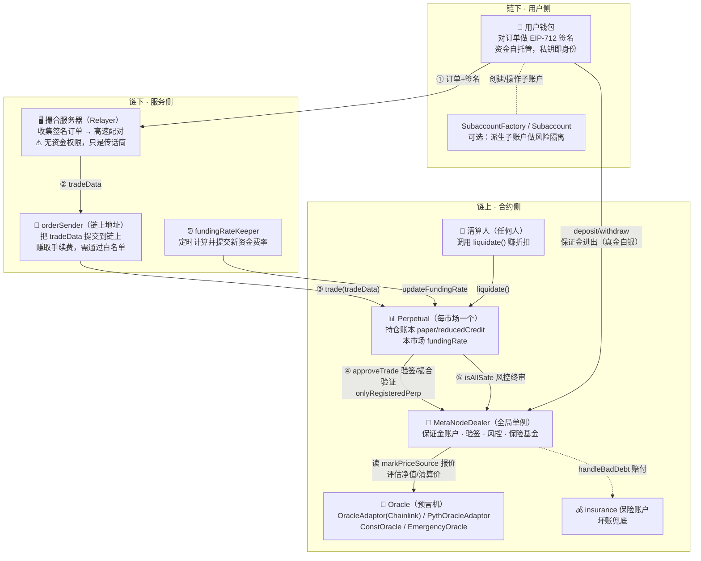
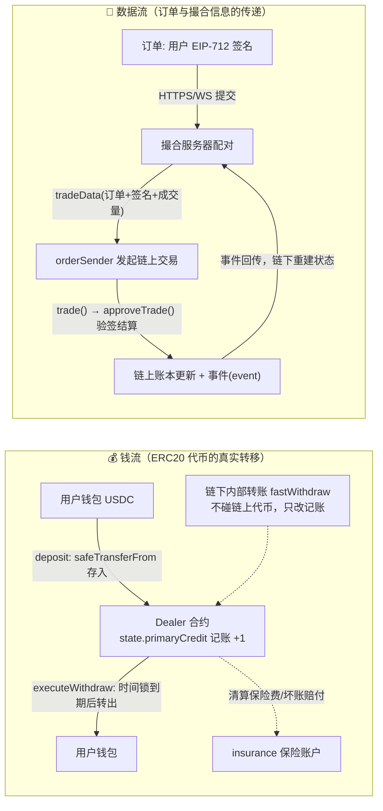

# 第 2 章：一张图看懂 MetaNode — 系统全景与角色分工

> 第 1 章我们回答了"永续合约是什么"；本章回答"这个项目由哪些角色组成、谁和谁说话、钱和数据各自怎么流"。读完本章，你拿到任何一个源文件都应该能立刻说出"它在系统里是干嘛的"。本章偏鸟瞰，代码只做印证，细节留给后续章节。

---

## 1. 本章导读

### 1.1 一个类比：一家证券交易所的完整班底

想象一家老式证券交易所开张，需要哪些"人"？

| 现实角色      | 本项目对应                  | 一句话职责                               |
| --------- | ---------------------- | ----------------------------------- |
| 股民        | **用户（钱包）**             | 出钱、下单，签订单就像签委托单                     |
| 撮合大厅      | **撮合服务器（Relayer，链下）**  | 高速收集委托单、配对买卖，自己**不碰钱**              |
| 场内红马甲     | **orderSender**        | 把撮合结果递进交易所大厅的"传单员"，由它在链上发起交易并垫付 gas |
| 登记结算中心    | **MetaNodeDealer**     | 管所有人的保证金账户、验委托单真伪、定风控规则、兜底赔付        |
| 各品种交易板    | **Perpetual**（每个市场一块板） | 只记本品种的持仓账本和资金费率                     |
| 报价台       | **Oracle（预言机）**        | 广播"BTC 现在值多少钱"的权威报价                 |
| 费率调度员     | **fundingRateKeeper**  | 定时触发资金费率更新                          |
| 收储商/秃鹫投资者 | **清算人（Liquidator）**    | 盯盘抢清算、赚折扣差价                         |
| 风险准备金     | **insurance 保险账户**     | 有人穿仓时赔钱                             |

这张表就是全系统的"演员表"。第 3 章会深入前两个合约（Dealer/Perpetual）的"总行与分行"关系，本章先把**每个角色为什么必须存在**讲清楚。

### 1.2 为什么角色这么多？—— 因为"去中心化"是把中心化交易所的一个部门拆成了多方

CEX（币安这类中心化交易所）里，上面所有角色都是**同一家公司的不同部门**：撮合是撮合部、风控是风控部、钱包是资金部。公司内部靠制度和信任协调。到了链上，"信任公司"行不通了，于是每个角色被拆给**利益不一致的独立参与方**：

- 撮合不能由"管钱的人"做 → 拆给链下撮合服务器，它只能撮合、动不了钱；
- 提交撮合结果需要有人付 gas → 拆给 orderSender，它靠手续费赚跑腿费；
- 报价不能由"开赌场的人"自己定 → 拆给第三方预言机（Chainlink/Pyth）；
- 清算不能靠交易所值班员盯盘 → 拆给**有赏金激励**的任何人（清算折扣就是赏金）；
- 兜底不能无限印钱 → 拆给事先注资的保险基金。

**"拆角色"的本质是拆信任：每个环节的作恶收益都小于作恶成本。** 这是理解所有 DeFi 架构的万能钥匙。

### 1.3 全景一句话

用户在钱包里对订单签名 → 撮合服务器链下配对 → orderSender 带着签名订单提交到 Perpetual → Perpetual 回调 Dealer 验签记账 → Dealer 回头读 Oracle 报价做风控 → 事后 keeper 更新资金费、清算人盯盘清算。资金始终锁在 Dealer 合约里，撮合服务器全程只是"传话筒"。

---

## 2. 架构 / 流程图

### 2.1 全景交互图：六大角色 + 三条辅助线



### 2.2 钱流 vs 数据流：两条方向不同的河

初学者最容易混淆"用户的钱去了哪"和"订单数据怎么走"。把它们分开画：



注意一个反直觉的点：**订单数据流全程不经过 Dealer 的资金账本之外的钱**——撮合服务器递上来的只是"纸面结果"，真正的资金变化是合约自己按结果改记账数字（`_settle`），USDC 代币本身从头到尾待在 Dealer 合约里不动。

---

## 3. 核心代码拆解

以下 10 个代码点，每个都对应全景图中的一个角色或一条边。

### (1) `MetaNodeDealer` 构造函数 —— 总行的"开户行"诞生

```solidity
// src/MetaNodeDealer.sol
contract MetaNodeDealer is MetaNodeExternal, MetaNodeOperation, MetaNodeView {
    constructor(address _primaryAsset) MetaNodeStorage() {
        state.primaryAsset = _primaryAsset;   // 本系统所有保证金都用这一种资产（通常是 USDC）
    }
}
```

**为什么这么设计？** 单一结算资产大幅简化风控：所有市场的净值都用同一把尺子度量，`isSafe` 才能把用户在 BTC-PERP 和 ETH-PERP 的持仓加总到一个账户里评估。如果允许"BTC 做保证金开 ETH 仓"，风控公式立刻复杂一个数量级（还要给抵押品打折）。系统留了一个 `secondaryAsset` 字段作为扩展位，但核心逻辑以 `primaryAsset` 为主。

### (2) `Types.State` 的"角色注册表"字段 —— 每个角色在链上的身份证

```solidity
// src/libraries/Types.sol（State 结构体节选）
struct State {
    address primaryAsset;          // 结算资产
    mapping(address => bool) validOrderSender;       // ② orderSender 白名单
    address fundingRateKeeper;                       // ③ keeper（单一指定）
    address insurance;                               // ④ 保险基金账户
    mapping(address => Types.RiskParams) perpRiskParams;  // ⑤ 各市场的参数包（内含 markPriceSource）
    address[] registeredPerp;                        // ⑥ 分行列表
    mapping(address => mapping(address => bool)) operatorRegistry; // ⑦ 用户授权的代签操作员
    ...
}
```

**设计思想**：不同角色用**不同的授权粒度**——orderSender 是开放注册的白名单（可以多个，撮合服务器可水平扩容）；fundingRateKeeper 是单一地址（费率计算必须全局一致，多写者会打架）；operatorRegistry 是**用户自授权**（用户可以授权一个机器人代自己签名订单，类似 CEX 的 API Key）。**"谁能做什么"全部显式写成映射，没有一个隐式的"内部约定"**——这是链上系统与后端微服务最大的风格差异。

### (3) `deposit` —— 钱流的入口

```solidity
// src/MetaNodeExternal.sol
function deposit(uint256 primaryAmount, uint256 secondaryAmount, address to) external nonReentrant {
    Funding.deposit(state, primaryAmount, secondaryAmount, to);  // 转入代币并记 primaryCredit[to] += amount
}
```

两个细节值得咀嚼：**其一**，`to` 参数允许"我存钱、给别人记账"——这为托管、充值返现等场景留了口子，也意味着前端要防钓鱼（别把账记到错误地址）。**其二**，`nonReentrant` 重入锁挂在资金入口上，因为 `safeTransferFrom` 会调用外部代币合约，恶意代币可以借回调重入。第 1 章提过"每一次状态变更都是攻击向量"，这里是教科书现场。

### (4) `Order` 结构体与签名 —— 用户唯一需要"亲自动手"的环节

```solidity
// src/libraries/Types.sol（节选）
struct Order {
    address perp;            // 目标市场——绑定具体 Perpetual，防跨市场重放
    address signer;          // 谁承担盈亏：签名的就是他（或他授权的操作员）
    int128 paperAmount;      // 正=买/做多，负=卖/做空
    int128 creditAmount;     // 与 paperAmount 异号；price = |credit| / |paper|
    bytes32 info;            // 打包: makerFeeRate | takerFeeRate | expiration | nonce
}
```

**用户全程只需要做一件事：对这张结构体签名。** 签完扔给撮合服务器，后面的一切（提交、gas、排队）都与用户无关。这就是"链下撮合"对用户的价值——**交易体验与 CEX 无异，但结算在链上**。`nonce` 防同一订单重复提交，`expiration` 让订单自带保鲜期，两者共同防止签名被拿去"过期后补交"。

### (5) `approveTrade` 的第一行 —— orderSender 的"海关检查"

```solidity
// src/MetaNodeExternal.sol
function approveTrade(address orderSender, bytes calldata tradeData)
    external onlyRegisteredPerp returns (...)
{
    require(state.validOrderSender[orderSender], Errors.INVALID_ORDER_SENDER);  // 白名单校验
    // 之后逐单验签、防重放、防超额……（第 8 章展开）
}
```

**注意这里校验的是函数参数 `orderSender`，不是 `msg.sender`**——因为 `msg.sender` 是 Perpetual（调用方），真正的提交者在 tradeData 里。为什么参数也可以信？因为它随后要参与**签名验证**：签名对了，说明订单真实；白名单对了，说明提交者有资格。**"验内容"与"验资格"分离**，是这套架构里精巧的一笔：任何人都能白嫖签名数据，但没有白名单身份就无法把它们变现成链上结算。

### (6) `Perpetual.trade` —— 数据流的终点站

```solidity
// src/Perpetual.sol
function trade(bytes calldata tradeData) external {   // 注意：无权限修饰符，人人可调
    (address[] memory traderList, int256[] memory paperChangeList, int256[] memory creditChangeList) =
        IDealer(owner()).approveTrade(msg.sender, tradeData);   // 交给总行验证
    for (uint256 i = 0; i < traderList.length;) {
        _settle(traderList[i], paperChangeList[i], creditChangeList[i]);  // 机械记账
        unchecked { ++i; }
    }
    require(IDealer(owner()).isAllSafe(traderList), "TRADER_NOT_SAFE");   // 风控终审
}
```

全景视角再看这段：**orderSender 调用的其实是 Perpetual 的 `trade`，而权限检查在 Dealer 的 `approveTrade` 里**。为什么让 `trade` 公开无权限？因为"谁提交"不重要——没有有效签名和白名单身份，提交者一无所获；有了它们，提交者就该获得手续费。开放接口 + 内容自证，是减少信任假设的常用手法。

### (7) 预言机家族 —— 报价台的四个话筒

```solidity
// src/oracle/OracleAdaptor.sol（Chainlink 适配器，节选）
uint256 public immutable heartbeatInterval;   // 心跳间隔：报价超过此秒数视为过期
bool public isSelfOracle;                     // 是否切换到自定义价格
uint256 public price;                         // 自定义价格（应急用）
uint256 public priceThreshold;                // 自定义价与 Chainlink 的最大允许偏离

function getMarkPrice() external view returns (uint256) {
    // 核心流程：资产/USD ÷ USDC/USD，换算成 1e18 精度返回
}
```

系统里有四种"话筒"，全部实现同一个 `getMarkPrice()` 接口：

| 话筒                | 文件                             | 用途                              |
| ----------------- | ------------------------------ | ------------------------------- |
| OracleAdaptor     | `oracle/OracleAdaptor.sol`     | 主力：读 Chainlink，减去 USDC 波动，做心跳检查 |
| PythOracleAdaptor | `oracle/PythOracleAdaptor.sol` | 备选：Pyth 拉取网（Pull 模式，更新更实时）      |
| ConstOracle       | `oracle/ConstOracle.sol`       | 测试桩：永远返回固定价格（写测试用）              |
| EmergencyOracle   | `oracle/EmergencyOracle.sol`   | 应急：Chainlink 挂掉时管理员手工喂价         |

**设计思想是"适配器模式 + 单一接口"**：市场（Perpetual）的 `RiskParams.markPriceSource` 只存一个地址，完全不关心背后是 Chainlink 还是 Pyth。换预言机 = 改一个地址参数，业务代码零改动。同时 `OracleAdaptor` 内置了两道保险：**心跳检查**（价格太旧就用不了，防止清算人用陈旧价薅羊毛）和**偏离保护**（应急价格与 Chainlink 偏差超阈值就拒绝，防止管理员喂价作恶）。

### (8) `MetaNodeView` —— 链下系统的"瞭望塔"

```solidity
// src/MetaNodeView.sol（节选，共 20+ 个只读函数）
function getMarkPrice(address perp) external view returns (uint256);        // 前端报价
function getTraderRisk(address trader) external view returns (...);          // 实时风险敞口
function getLiquidationPrice(address trader, address perp) external view returns (uint256); // 预估强平价
function isSafe(address trader) external view returns (bool);                // 账户健康检查
```

为什么单独立一个 View 合约？因为**清算人和前端大量"看"而极少"改"**。`getLiquidationPrice` 是清算人的猎枪准星（用户净值跌到哪我可以出手），`getMarkPrice`/`getTraderRisk` 是前端风险条的数据源。把查询集中在一个纯 view 合约里，既方便索引节点批量调用（`eth_call` 免费），又让业务合约保持精瘦。**链上状态 + 链下事件重建 + view 批量查询**，三者共同构成链下系统的完整数据面。

### (9) `liquidate` 与保险基金 —— 负反馈系统的闭合

```solidity
// src/Perpetual.sol（节选）
function liquidate(address liquidator, address liquidatedTrader, int256 requestPaper, int256 expectCredit) external {
    // ① Dealer 验证"此人确实该清算"，算出折扣价（清算人赚的就是这个折扣）
    (liqtorPaperChange, liqtorCreditChange, ...) = IDealer(owner()).requestLiquidation(msg.sender, liquidator, ...);
    // ② 价格保护：结果偏离清算人预期太多则整个交易 revert（防三明治夹击）
    // ③ 双方结算；④ 清算者自身必须健康；⑤ 仓位归零仍有负债 → handleBadDebt 由保险基金兜底
}
```

清算人不是"慈善风控员"，而是**被赏金（清算折扣）吸引来的猎手**——第 1 章说过，去中心化的本质是让每个环节的参与者"有利可图才会干活"。`expectCredit` 参数让清算人事先声明可接受的价格，超出即 revert，这是对 MEV（最大可提取价值，如抢先交易/三明治攻击）的正面防御。坏账最终由 `insurance` 账户赔付，风险闭环闭合。

### (10) 子账户系统 —— 大户的"分仓柜"

```solidity
// src/subaccount/SubaccountFactory.sol（角色印证）
// 工厂合约：为用户批量创建独立记账的子账户合约
// 主账户授权子账户操作自己的保证金，但持仓、风控彼此隔离
```

为什么要有子账户？大户（尤其是量化策略）常需要"同一笔保证金下多个策略互不拖累"或"给别人有限的操作权限"。子账户 = 一个由 Factory 代理创建的合约钱包，用户对它有完整控制权，而 Dealer 只把它当作一个普通地址记账。**系统核心代码完全不知道子账户的存在**——它只是复用了"任何地址都能开户"的通用性，这是良好抽象（开放参与权）带来的免费功能。

---

## 4. Web3 特有机制

本章全景涉及的面比较广，把链上机制按角色归纳：

1. **`msg.sender` 信任链与"传话筒"模式**：orderSender → Perpetual.trade → Dealer.approveTrade，每跳的 `msg.sender` 都被下一跳校验（白名单/onlyRegisteredPerp）。**链上无法伪造调用来源**，这是所有角色鉴权成立的技术根基；反过来，链下→链上的传递（订单提交）无法信任来源，所以靠**签名**自证。
2. **Gas 由谁付，决定了角色如何激励**：orderSender 垫付 gas 并赚取手续费；keeper 垫付费率更新的 gas（通常由协议补贴）；清算人垫付清算交易的 gas 并赚清算折扣。**每一次链上写入都要有人出钱**，出钱的人必然要图回报——设计激励机制时永远先问"这笔 gas 谁付、他图什么"。
3. **事件（event）是链下系统的数据总线**：`BalanceChange`、`UpdateFundingRate`、`AnswerUpdated`（预言机特意用 Chainlink 同名事件格式，方便监控工具复用）。撮合服务器、前端、风控引擎全部靠事件感知链上变化，主动 `eth_call` 只做补充。
4. **`view` 函数免费但状态读取有成本**：view 调用不花 gas（不上链），但节点要从最新状态算出结果；把查询集中在 `MetaNodeView` 让链下可以用 multicall 打包几十个查询，一次 RPC 拿全。
5. **Pull 型预言机（Pyth）与 Push 型（Chainlink）的差异**：Chainlink 由网络方持续推送更新（心跳间隔内数据"躺着等"）；Pyth 需要交易方提交价格证明并支付更新费（数据"现取现用"）。本项目两种适配器并存，是权衡实时性与成本的典型设计。
6. **重入锁（`nonReentrant`）守门资金入口**：`deposit/withdraw` 一族全部挂锁，因为 ERC20 转账是外部调用，恶意代币可借回调重入。原则：**凡是"外部代码会回话"的入口，都要假设它会捣乱**。

---

## 5. 本章小结与思考题

### 5.1 核心知识点回顾

- **六大核心角色**：用户（签单）、撮合服务器（链下配对，无资金权限）、orderSender（链上提交，白名单）、Dealer（保证金/验签/风控/保险）、Perpetual（每市场持仓与费率）、Oracle（外部报价）。
- **两条河分开看**：钱流（ERC20 真实转移，只在用户 ↔ Dealer ↔ insurance 之间）与数据流（订单、撮合结果、事件回传），前者慢而少，后者快而多。
- **拆角色的本质是拆信任**：每个环节独立参与方 + 经济激励，作恶收益 < 作恶成本。
- **角色授权粒度分层**：开放白名单（orderSender）、单一指定（keeper）、用户自授权（operator）、全局公共（清算人）。
- **接口统一**：预言机四兄弟同实现 `getMarkPrice()`，市场侧只认 `markPriceSource` 一个地址。

### 5.2 思考题

1. **撮合服务器被黑了，最坏能发生什么？** 请分别推演它能否：a) 偷走用户保证金；b) 用偷来的订单签名重放获利（提示：`domainSeparator` + `order.perp` 字段 + `orderFilledPaperAmount` 防超额三道闸各自挡住什么）；c) 恶意撮合"高价低卖"（提示：订单里的 `creditAmount` 就是限价，谁能保证成交价不劣于限价？）。想清楚后你会发现"链下被黑"的最坏后果其实是**拒绝服务**。
2. **如果去掉 orderSender 白名单（`validOrderSender`），任何人都能提交撮合结果，系统会立刻出事吗？** 从两个方向想：正常路径中签名验证是否已足够安全？出事的场景是什么（提示：手续费 `orderSenderFee` 记给了谁？恶意抢提交能否截胡别人的手续费或制造交易拥塞）？

---

## 6. 踩坑提示

1. **别把"去中心化交易所"理解为"没有链下组件"**：本项目的撮合、费率计算、清算盯盘全在链下。评估此类系统的正确姿势是枚举"每个链下组件的最坏作恶后果"，而不是笼统地问"是否中心化"。
2. **`deposit` 的 `to` 参数与操作员授权是钓鱼高发区**：前端诱导用户把保证金存进攻击者地址、或诱导 `setOperator` 授权恶意机器人代签订单，都能造成实际损失。读源码时注意 `Operation.setOperator` 只是记录映射，**没有二次确认机制**——安全责任部分转移到了用户侧。
3. **预言机的"应急模式"（isSelfOracle / EmergencyOracle）是双刃剑**：它既是 Chainlink 故障时的救命稻草，也是管理员作恶的通道。本项目的缓解手段是偏离阈值 `priceThreshold`（应急价与 Chainlink 偏差过大即拒绝），但阈值本身也是管理员可调的——审计此类"管理员后门"时要追问：**阈值调整是否有时间锁、是否有事件告警**。
4. **心跳过期不等于停止清算**：预言机报价过期后，`getMarkPrice` 可能 revert 或返回旧价——对清算系统而言，价格"冻结"期间净值被高估的用户反而**躲过了清算**（价格恢复后可能瞬间穿仓）。这是"价格暂停"场景的经典风险，第 12 章清算部分会再回到这个问题。
5. **手续费记给参数地址而非 msg.sender**：`state.primaryCredit[orderSender] += result.orderSenderFee` 中 `orderSender` 是参数。若集成方自己写网关代码时误把用户地址当 orderSender 传入，手续费会记错人。集成第三方协议时，参数与调用者的对应关系必须逐一对表。

---

> 下一章预告（第 3 章）：聚焦 Dealer 与 Perpetual 这对"总行与分行"——它们如何互相鉴权、调用链怎么走、paper/credit 两本账何时同步。
