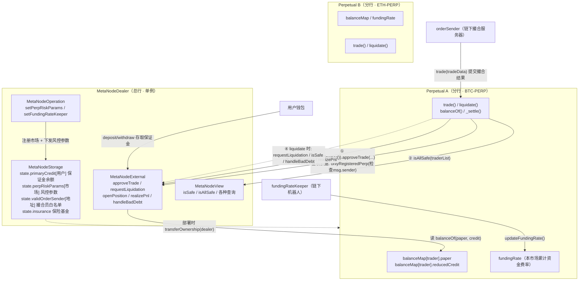
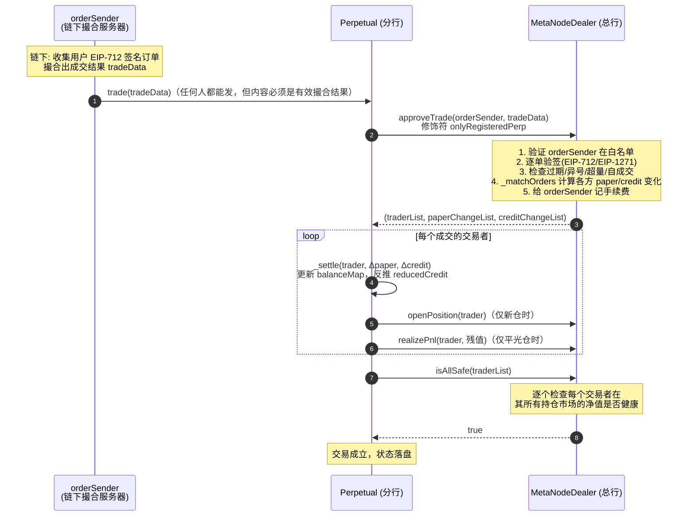

# 第 3 章：两大核心合约的"总行与分行"模式 — Dealer 与 Perpetual 的关系解密

> 涉及源码：`src/MetaNodeDealer.sol`、`src/Perpetual.sol`、`src/MetaNodeStorage.sol`、`src/MetaNodeExternal.sol`、`src/libraries/Types.sol`

---

## 1. 本章导读

### 1.1 用一家"连锁银行"来理解这套系统

想象一家全国连锁银行 **MetaNode 银行**，它的组织方式是这样的：

- **MetaNodeDealer（总行清算中心）**：全行只有一家。它管着所有客户的**保证金存款账户**（存 USDC）、全行的**风控规则**（每个市场允许多少杠杆、清算线设在哪）、**订单验签中心**（防止伪造订单）、以及一笔**保险基金**（有人穿仓时兜底）。
- **Perpetual（分行账本）**：每上线一个交易市场（比如 BTC-PERP、ETH-PERP），就开一家"分行"。每家分行只记自己市场的**持仓账本**：张三在这家分行持有多少 BTC 多头（`paper`）、李四持有多少空头，以及这家分行自己的**累计资金费率读数**（`fundingRate`）。

你把保证金存进**总行**，但在**分行**开仓交易；总行随时有权检查你在所有分行的持仓来评估你的账户健康度；一旦你的账户资不抵债，总行会启动清算流程。这就是这两个合约的全部关系。

对应到代码里，几个关键事实：

| 事实 | 代码体现 |
|---|---|
| 总行只有一家 | `MetaNodeDealer` 是一个可部署的单例合约 |
| 分行可以有多家 | 每个 `Perpetual` 实例代表一个市场，通过 Dealer 注册 |
| 总行是分行的上级 | `Perpetual` 构造时执行 `transferOwnership(dealer)`，即 **Dealer 是 Perpetual 的 `owner`** |
| 保证金存在总行 | `state.primaryCredit[用户]` 在 Dealer 的存储里，Perpetual 里完全没有 ERC20 转账逻辑 |
| 持仓存在分行 | `balanceMap`、`fundingRate` 是 Perpetual 自己的状态变量 |

### 1.2 为什么要拆成两个合约？而不是一个大合约？

这是初学者最常见的疑问，答案有三层：

1. **多市场全仓模式的需要**。一个用户可以在 BTC-PERP 和 ETH-PERP 同时持仓，但共享同一笔 USDC 保证金（交叉保证金）。持仓数据按市场隔离（每个市场一个 Perpetual），保证金数据全局共享（都在 Dealer），天然就是"一个总行 + N 个分行"的拓扑。
2. **业务演进解耦**。上线一个新市场只需部署一个新的 `Perpetual` 并在 Dealer 注册，不动总行的任何代码和存储。如果塞在一个合约里，每加一个市场要么新部署整个系统（用户资产要迁移），要么在存储里维护越来越复杂的"市场嵌套映射"。
3. **职责单一便于审计**。分行的代码（约 300 行）只管记账和结算，总行管验签、风控、资金。安全审计时可以分开审查信任边界。

### 1.3 本章要回答的三个问题

1. 两个合约**如何互相确认对方身份**（鉴权方向）？
2. 一笔交易、一次清算发生时，**调用链怎么走、数据怎么流**？
3. `paper`/`credit` 在两个合约里**各记在哪本账、何时同步**？

---

## 2. 架构 / 流程图

### 2.1 静态关系图：总行与分行的"双向握手"



**注意图中两条方向相反的鉴权链**——这是本章最重要的知识点：

- **Perpetual 认 Dealer**：靠 OpenZeppelin `Ownable`。Perpetual 的特权操作（如 `updateFundingRate`）要求 `msg.sender == owner()`，而 owner 就是 Dealer 合约地址。
- **Dealer 认 Perpetual**：**不是**靠 owner，而是靠白名单修饰符 `onlyRegisteredPerp`——检查 `state.perpRiskParams[msg.sender].isRegistered`。因为 Dealer 有很多 Perpetual "下属"，不能用单一的 owner 关系表达"哪些市场是我管辖的"。

### 2.2 动态时序图：一笔交易的完整生命周期



---

## 3. 核心代码拆解

下面按"分行 → 总行 → 连接点"的顺序拆解最重要的代码。为控制篇幅，只展示核心逻辑，完整实现请对照源文件。

### 3.1 分行侧：`Perpetual.sol`

#### (1) 账本结构体 `balance` —— 一行存储塞下两个 int128

```solidity
struct balance {
    int128 paper;          // 仓位数量（虚拟票据）：正=多头，负=空头
    int128 reducedCredit;  // 约减后的资金量（记账货币的"锚点"）
}
mapping(address => balance) balanceMap;  // 本市场的持仓账本
int256 fundingRate;                      // 本市场的累计资金费率读数
```

**作者为什么这么设计？**

- 一个 int128 是 16 字节，两个 int128 恰好 32 字节 = **1 个存储槽**。Solidity 的存储以 32 字节为最小读写单元，把这两个字段打包进一个结构体，`_settle` 时一次 SSTORE 就能把"数量"和"锚点"一起写盘，**每次结算省下约 20000 gas 的冷槽写入**。这是链上开发中非常典型的"存储打包"优化。
- 只存 `reducedCredit` 而不存 `credit`，是一个**以算力换存储**的经典权衡。真实的 credit 是随资金费率漂移的现算值：

```
credit = paper × fundingRate + reducedCredit
```

  资金费率每更新一次，全市场所有持仓者的 credit 都会"自动"变化——如果逐人存储 credit，keeper 每次更新费率都要遍历写所有用户（可能成千上万个槽），gas 上完全不可行。改成存锚点 `reducedCredit` 后，更新费率只需写 1 个槽（`fundingRate`），所有用户的现算 credit 便同时移动。你可以把它类比成"水表读数"：系统只记一个总读数 `fundingRate`，每个用户的账单 = 持仓量 ×（当前读数 − 他入账时的读数锚点）。

#### (2) 构造函数 —— "生下来就认总行"

```solidity
constructor(address _owner) Ownable() {
    transferOwnership(_owner);   // _owner 就是 MetaNodeDealer 的地址
}
```

部署 `Perpetual` 时必须把 Dealer 的地址传进来。此后 Perpetual 的一切特权操作（更新费率等）只认这个地址。**注意**：这里没有采用 `Ownable(_owner)` 的双参构造写法（旧版 OZ 的写法），而是先把自己设为 owner 再立刻转移——在部署原子交易内完成，不会留下无主窗口，但如果你自己仿写时务必保证部署和转移在同一笔交易里，否则会出现短暂的"无主合约"。

#### (3) `balanceOf` —— 总行看分行的"窗户"

```solidity
function balanceOf(address trader) external view returns (int256 paper, int256 credit) {
    paper = int256(balanceMap[trader].paper);
    // 现算 credit：仓位 × 累计费率读数 + 存储锚点
    credit = paper.decimalMul(fundingRate) + int256(balanceMap[trader].reducedCredit);
}
```

这是总行风控（`isSafe`/`isAllSafe`）回读分行持仓的唯一入口。**设计要点**：它是一个 `view` 函数，总行跨合约调用它不产生状态读取的额外风险，却能让总行实时拿到"经过资金费率调整后"的真实净值。如果没有这个现算机制，总行评估用户健康度时还得自己去算费率，两个合约就会纠缠不清。

#### (4) `updateFundingRate` —— 分行里唯一由总行直接写的状态

```solidity
function updateFundingRate(int256 newFundingRate) external onlyOwner {
    int256 oldFundingRate = fundingRate;
    fundingRate = newFundingRate;
    emit UpdateFundingRate(oldFundingRate, newFundingRate);  // 事件供链下对账
}
```

只有 `owner`（即 Dealer，而 Dealer 内部又限制只有 `fundingRateKeeper` 地址能发起）能改这个读数。**注意本项目的方向约定**：`fundingRate` 上升 = 多头**收** credit、空头**付** credit（与多数 CEX 的符号习惯相反），后续资金费章节会展开。

#### (5) `trade` —— 分行把自己"验货权"上交总行

```solidity
function trade(bytes calldata tradeData) external {
    // ① 回调总行：验证订单并拿到每个人的仓位/资金变化量
    (address[] memory traderList, int256[] memory paperChangeList, int256[] memory creditChangeList) =
        IDealer(owner()).approveTrade(msg.sender, tradeData);

    // ② 分行只负责记账：逐个结算
    for (uint256 i = 0; i < traderList.length;) {
        _settle(traderList[i], paperChangeList[i], creditChangeList[i]);
        unchecked { ++i; }   // 计数器不会溢出，去掉溢出检查省 gas
    }

    // ③ 回调总行做风控终审：所有人交易后必须仍然健康
    require(IDealer(owner()).isAllSafe(traderList), "TRADER_NOT_SAFE");
}
```

**作者为什么这么设计？** 注意 `trade` 本身**没有任何权限修饰符**——任何人都能调用。这是刻意的：身份和权限的校验被**推迟**到了 `approveTrade` 内部（`orderSender` 白名单 + 逐单验签）。分行假设"传进来的数据一定是总行验过的"，自己只做机械记账。这样职责切分非常干净：**验签逻辑（易错、复杂）集中在一处，记账逻辑（高频、简单）在另一处**。整个流程形成"总行验证 → 分行记账 → 总行终审"的三段式。

还有一个容易被忽略的顺序细节：`isAllSafe` 放在**所有 `_settle` 完成之后**。这保证了即使撮合结果本身合法，也不会出现"某一方成交后保证金瞬间跌破维持线"的漏网情况——风控检查用的是落盘后的最新账本。

#### (6) `_settle` —— 分行记账的核心，也是 paper/credit 两套体系交汇的地方

```solidity
function _settle(address trader, int256 paperChange, int256 creditChange) internal {
    bool isNewPosition = balanceMap[trader].paper == 0;
    int256 rate = fundingRate;              // 缓存到内存，避免多次 SLOAD

    // ① 算出新 credit = 旧 paper×费率 + 旧锚点 + 本次变化
    int256 credit =
        int256(balanceMap[trader].paper).decimalMul(rate)
        + int256(balanceMap[trader].reducedCredit) + creditChange;

    // ② 算出新 paper
    int128 newPaper = balanceMap[trader].paper + SafeCast.toInt128(paperChange);

    // ③ 关键一步：反推新锚点  reducedCredit = credit - newPaper × 费率
    int128 newReducedCredit = SafeCast.toInt128(credit - int256(newPaper).decimalMul(rate));

    balanceMap[trader].paper = newPaper;
    balanceMap[trader].reducedCredit = newReducedCredit;
    emit BalanceChange(trader, paperChange, creditChange);

    // ④ 新开仓 → 通知总行登记（维护 openPositions 列表）
    if (isNewPosition) IDealer(owner()).openPosition(trader);

    // ⑤ 全平仓 → 把残值锚点兑现成已实现盈亏，然后清零锚点
    if (newPaper == 0) {
        IDealer(owner()).realizePnl(trader, balanceMap[trader].reducedCredit);
        balanceMap[trader].reducedCredit = 0;
    }
}
```

**第 ③ 步是整个记账体系的灵魂**。为什么每次结算都要"反推锚点"？因为资金费率读数在持续漂移，如果不重写锚点，`credit = paper×fundingRate + reducedCredit` 这个恒等式就会把**历史费率的影响重复计算**。反推的数学本质是：把"应得的 credit"先算成绝对值，再减去新持仓在新读数下的贡献，剩下的差值就是与读数无关的纯锚点。这样无论读数怎么变，等式永远成立。

**第 ⑤ 步**：全平仓时 `paper == 0`，费率项贡献归零，锚点 `reducedCredit` 里剩下的就是这笔仓位生涯攒下的已实现盈亏（含历史资金费），于是把它作为 pnl 上缴总行计入用户保证金余额，然后本地锚点清零。若不清零，`paper=0` 时它不影响 credit 计算但会留脏数据，且下次开仓会被 `isNewPosition` 误判。

#### (7) `liquidate` —— 分行执行清算，总行出清算方案

```solidity
function liquidate(address liquidator, address liquidatedTrader, int256 requestPaper, int256 expectCredit)
    external returns (int256 liqtorPaperChange, int256 liqtorCreditChange)
{
    // ① 向总行申请：总行校验"被清算者确实不健康"，并算出双方的仓位/资金变化
    (liqtorPaperChange, liqtorCreditChange, liqedPaperChange, liqedCreditChange) =
        IDealer(owner()).requestLiquidation(msg.sender, liquidator, liquidatedTrader, requestPaper);

    // ② 价格保护：用交叉相乘避免除法，防止清算价格偏离预期太远（前端可被抢跑攻击时设置 expectCredit 保命）
    if (liqtorPaperChange < 0) {
        require(liqtorCreditChange * requestPaper <= expectCredit * liqtorPaperChange, "...");
    } else {
        require(liqtorCreditChange * requestPaper >= expectCredit * liqtorPaperChange, "...");
    }

    // ③ 双方结算
    _settle(liquidatedTrader, liqedPaperChange, liqedCreditChange);
    _settle(liquidator, liqtorPaperChange, liqtorCreditChange);

    // ④ 清算者自身必须健康（防止用将爆仓的账户接盘套利）
    require(IDealer(owner()).isSafe(liquidator), "LIQUIDATOR_NOT_SAFE");

    // ⑤ 若被清算者仓位已清零，请总行处理可能的坏账（穿仓由保险基金兜底）
    if (balanceMap[liquidatedTrader].paper == 0) {
        IDealer(owner()).handleBadDebt(liquidatedTrader);
    }
}
```

**设计权衡**：为什么方案由总行算、执行由分行做？因为"这个人是否该被清算"取决于他**所有市场**的净值（总行视角），而"清算"这个动作改变的是**单个市场的账本**（分行视角）。拆开后每个合约只做视角内的事。

**价格保护用乘法交叉比较而非除法**，避免了定点数除法的精度损失和除零问题，这是定点数运算的标准技巧，写自己的 DEX/永续合约时值得照抄。

### 3.2 总行侧：`MetaNodeDealer.sol` 与 `MetaNodeStorage.sol`

#### (8) 45 行的装配层

```solidity
contract MetaNodeDealer is MetaNodeExternal, MetaNodeOperation, MetaNodeView {
    constructor(address _primaryAsset) MetaNodeStorage() {
        state.primaryAsset = _primaryAsset;   // 通常传入 USDC 地址
    }
}
```

本体几乎没有逻辑，只是把 External（用户写操作 + Perpetual 回调入口）、Operation（管理员配置）、View（查询）三个抽象合约继承拼装。所有状态集中在共同基类 `MetaNodeStorage` 里声明，**保证三个子合约操作的是同一个 `state` 变量、同一块存储**（Solidity 禁止子合约重复声明同名状态变量，可用 `forge inspect MetaNodeDealer storage-layout` 验证 `state` 只出现一次）。

#### (9) 存储层与两个关键修饰符

```solidity
abstract contract MetaNodeStorage is Ownable, ReentrancyGuard {
    Types.State public state;                          // 全系统唯一账本
    bytes32 public immutable domainSeparator;          // EIP-712 签名域

    modifier onlyRegisteredPerp() {
        // 白名单鉴权：msg.sender 必须是已注册的 Perpetual 地址
        require(state.perpRiskParams[msg.sender].isRegistered, Errors.PERP_NOT_REGISTERED);
        _;
    }
}
```

`onlyRegisteredPerp` 就是"总行认分行"的全部机制：**它信任的不是某个人，而是`msg.sender` 这个合约地址是否在注册表里**。由于 EVM 里 `msg.sender` 无法伪造（你不能冒充另一个合约地址发起调用），这个鉴权是可靠的。对比之下，如果用 `tx.origin` 或者让分行传自己的地址当参数，就会被钓鱼/伪造——这是 Web3 鉴权与 Web2 session 最本质的区别之一。

#### (10) 市场注册：总行开"分行"的手续

```solidity
// libraries/Operation.sol（节选）
function setPerpRiskParams(Types.State storage state, address perp, Types.RiskParams calldata param) external {
    // ...首次注册时:
    state.registeredPerp.push(perp);          // 记入分行列表
    state.perpRiskParams[perp] = param;       // 下发该市场的风控参数
}
```

`RiskParams` 携带该市场的杠杆与清算规则：`initialMarginRatio`（初始保证金率，决定最大杠杆）、`liquidationThreshold`（维持保证金率，清算线）、`liquidationPriceOff`（清算折扣）、`insuranceFeeRate`（保险费率）。**每个市场一套参数**，所以新分行上线时可以灵活设定"BTC 稳一点、山寨币紧一点"的差异化管理。

#### (11) 总行暴露给分行的四个回调入口（`MetaNodeExternal.sol`）

```solidity
function openPosition(address trader) external onlyRegisteredPerp;   // 新仓登记
function realizePnl(address trader, int256 pnl) external onlyRegisteredPerp;  // 平仓兑现盈亏
function requestLiquidation(address executor, address liquidator, address liquidatedTrader, int256 requestPaperAmount)
    external onlyRegisteredPerp returns (四种变化量);
function handleBadDebt(address liquidatedTrader) external onlyRegisteredPerp; // 坏账兜底
```

四个入口全部被 `onlyRegisteredPerp` 保护。**为什么要让分行回调总行？**

- `openPosition`：总行维护 `state.openPositions[trader]`（用户持仓市场列表）。没有这份名单，`isSafe` 就不知道该去哪些分行查这个用户的持仓——**这是交叉保证金能工作的前提**。
- `realizePnl`：分行的 credit 只是"分行内的记账符号"，用户真正能提走的钱是总行的 `primaryCredit`。平仓产生的盈亏必须从分行账本"落地"到总行账本，用户才真正赚到了钱。
- `requestLiquidation` / `handleBadDebt`：清算资格判断与坏账兜底都是全局视角的活。

#### (12) `approveTrade` 节选 —— 总行的"验货 + 定盘"中枢

```solidity
function approveTrade(address orderSender, bytes calldata tradeData)
    external onlyRegisteredPerp returns (address[] memory, int256[] memory, int256[] memory)
{
    // ① 验明正身：必须是白名单撮合服务器
    require(state.validOrderSender[orderSender], Errors.INVALID_ORDER_SENDER);

    // ② 解码链下撮合结果：订单数组 + 签名数组 + 成交量数组
    (Types.Order[] memory orderList, bytes[] memory signatureList, uint256[] memory matchPaperAmount) =
        abi.decode(tradeData, (Types.Order[], bytes[], uint256[]));

    for (uint256 i = 0; i < orderList.length;) {
        bytes32 orderHash = EIP712._hashTypedDataV4(domainSeparator, Trading._structHash(order));
        // ③ 验签：EOA 直接恢复地址；合约钱包走 EIP-1271；也可通过 operatorRegistry 授权代签
        // ④ 合法性四连检查：
        //    未过期 / paper与credit异号(防负价格) / order.perp == msg.sender(防跨市场重放) / 防自成交
        // ⑤ 累计成交量并检查不超额
        state.orderFilledPaperAmount[orderHash] += matchPaperAmount[i];
        require(state.orderFilledPaperAmount[orderHash] <= int256(order.paperAmount).abs(), Errors.ORDER_FILLED_OVERFLOW);
        unchecked { ++i; }
    }

    // ⑥ 纯函数撮合：算出每个交易者的 paper/credit 变化与手续费
    Types.MatchResult memory result = Trading._matchOrders(state, orderHashList, orderList, matchPaperAmount);

    // ⑦ 手续费记给撮合服务器；若手续费为负(它要付费)，还得检查它自己是不是健康的
    state.primaryCredit[orderSender] += result.orderSenderFee;
    if (result.orderSenderFee < 0) {
        require(Liquidation._isSolidIMSafe(state, orderSender), Errors.ORDER_SENDER_NOT_SAFE);
    }
    return (result.traderList, result.paperChangeList, result.creditChangeList);
}
```

**这里最重要的设计是 `order.perp == msg.sender` 这一行**。同一个订单哈希（含 perp 地址字段）绑定了特定分行，任何分行拿到别家市场的撮合数据来结算都会被拒——否则攻击者可以在 A 市场签单、拿到 B 市场重放（两个市场的价格和费率状态完全不同）。这就是"防跨市场重放"，与 `domainSeparator` 的"防跨合约/跨链重放"配合，构成订单防重放的双保险。

### 3.3 一张总表：两本账各记什么

| 数据 | 记在哪 | 为什么 |
|---|---|---|
| USDC 保证金余额 `primaryCredit` | Dealer（总行） | 全局共享的清算资金，与具体市场无关 |
| 持仓量 `paper` / 锚点 `reducedCredit` | Perpetual（分行） | 按市场隔离，同一个人在不同市场持仓互不混淆 |
| 累计资金费率 `fundingRate` | Perpetual（分行） | 每个市场供需不同，费率独立漂移 |
| 风控参数 `RiskParams` | Dealer（总行） | 风控是全局规则，但按市场下发参数 |
| 已成交订单量 `orderFilledPaperAmount` | Dealer（总行） | 验签与防重放属于撮合域，不该污染分行账本 |
| 持仓市场列表 `openPositions` | Dealer（总行） | 供 `isSafe` 跨市场汇总净值 |

---

## 4. Web3 特有机制

本章模块集中体现了多个链上特性，逐一说明：

1. **跨合约鉴权的两个方向**（本章核心）：
   - Perpetual → Dealer：用 `owner()` 表达"唯一的上级"，天然一对一。
   - Dealer → Perpetual：用 `onlyRegisteredPerp` 白名单表达"多个下级"，鉴权依据是 `msg.sender` 地址而非任何人传参。**永远不要用函数参数传递"我是谁"**，那在链上等于没设防。
2. **存储槽打包（Gas 优化）**：`balance` 结构体用两个 `int128` 拼 1 个槽；同时 `_settle` 里 `int256 rate = fundingRate` 把状态读缓存进内存——Solidity 对状态变量不会自动缓存，循环里反复 SLOAD 是新手最常见的 gas 浪费点。
3. **`unchecked` 循环计数器**：`unchecked { ++i; }` 省掉每次自增的溢出检查（约 40+ gas/次）。安全前提是 `i` 由 `traderList.length` 严格约束、不可能溢出。
4. **Solidity 0.8+ 的溢出保护与 `SafeCast`**：默认算术溢出会 revert，但 `int256 → int128` 的**截断转换**不检查溢出，所以代码用 `SafeCast.toInt128` 显式防护——这是"编译器保护不了的地方要自己补"的典型例子。
5. **事件作为链下对账源**：`BalanceChange`、`UpdateFundingRate` 都带完整变化量。链上存储昂贵，链下服务（撮合引擎、费率计算器、前端）依赖事件重建状态，事件就是这些系统的"免费数据库"。
6. **回调式架构（Inversion of Control）**：分行不主动拉总行数据，而是在关键节点（开仓/平仓/清算）**回调**总行登记。这让"分行账本"可以保持极度精简，复杂的全局簿记全部留在总行。
7. **重入面分析**：`Perpetual.trade/liquidate` 自身没有 `nonReentrant`，而 `_settle` 内部有对 Dealer 的外部调用（`openPosition`/`realizePnl`）。之所以安全，是因为这些回调入口都要求 `msg.sender` 是注册分行——恶意合约无法在回调中伪装成分行再倒打一耙。但这也意味着**信任模型的正确性高度依赖 `onlyRegisteredPerp` 不被绕过**，审计时要重点盯注册入口 `setPerpRiskParams` 的权限（`onlyOwner`）。

---

## 5. 本章小结与思考题

### 5.1 核心知识点回顾

- **拓扑**：1 个 Dealer（总行：保证金、验签、风控、保险基金）+ N 个 Perpetual（分行：paper/reducedCredit 账本 + 本市场 fundingRate）。
- **双向鉴权**：分行认总行靠 `Ownable`（owner = Dealer）；总行认分行靠 `onlyRegisteredPerp` 白名单。两个方向、两种机制，各取所长。
- **分工铁律**：总行"验证 + 定方案 + 记全局账"，分行"记账 + 执行 + 本地状态"。
- **记账核心**：分行只存锚点，credit 现算（`credit = paper×fundingRate + reducedCredit`），每次 `_settle` 反推新锚点；全平仓时残值锚点经 `realizePnl` 落入总行保证金。
- **交易三段式**：总行验单（approveTrade）→ 分行结算（_settle 循环）→ 总行终审（isAllSafe）。

### 5.2 思考题

1. **如果一个新 `Perpetual` 部署后忘记在 Dealer 注册，会发生什么？** 提示：分别从"用户直接调它的 `trade()`"和"keeper 调它的 `updateFundingRate()`"两条路径推演，看流程会卡在哪一步、资金是否安全。
2. **`_settle` 为什么必须在"算新 credit"和"反推锚点"两步之间使用同一个 `rate`？** 假设把第 ② 步新 paper 计算和第 ③ 步锚点反推改成读取两次 `fundingRate`，且中间恰好发生了一次费率更新（在同一个交易里这可能吗？如果不可能，这种"防御式写法"还有什么价值？）。
3. **进阶**：`trade()` 没有加 `nonReentrant`，请画出一次完整的调用栈，说明为什么恶意第三方无法通过构造一个"假的 Perpetual"在 `_settle` 的回调中重入 Dealer 的存款函数套利。（关键线索：`openPosition` 的 `onlyRegisteredPerp` 检查的是什么值？）

---

## 6. 踩坑提示（源码中值得注意的设计点）

1. **自成交检查不彻底**：`approveTrade` 中防自成交的逻辑是 `require(i == 0 || order.signer != orderList[0].signer)`——只保证后续订单签名者**不等于第一个订单**的签名者。如果一笔撮合里订单 2 和订单 3 由同一人签署（但不同于订单 1），这两单之间可以互相成交。虽然"自己和自己成交"在价格异号的约束下未必能直接获利，但可用于刷交易量等目的，属于实现与意图之间的缝隙，读源码时应当意识到这个边界。
2. **错误信息风格不统一**：Perpetual 侧用裸字符串（`"TRADER_NOT_SAFE"`），Dealer 侧用 `Errors.sol` 的自定义错误常量。自定义错误（`error XXX()`）比字符串 revert 省 gas 且利于链下解析，新项目应统一采用。
3. **`liquidate` 的乘法交叉比较存在理论溢出风险**：`liqtorCreditChange * requestPaper` 两个 int256 相乘，在 0.8.x 下溢出会 revert 而非错误结果，安全性有底线保障，但极端大数值会导致清算无法执行（DoS 面）。真实攻击可行性取决于 decimal 精度设定，审计时应做上界推演。
4. **`_settle` 内的外部调用顺序**：先写 `balanceMap` 再回调 Dealer。**先更新自己的状态、最后才外部调用**是防重入的正确姿势（Checks-Effects-Interactions），这里做对了——仿写时千万别把回调挪到状态更新之前。
5. **`trade()` 无权限设计是特性不是缺陷，但要配套**：任何人可调 `trade()`，安全性完全押在 `approveTrade` 的验签与白名单上。如果未来有人改动了验签逻辑而放松了 `validOrderSender` 校验，整条防线会瞬间失守——修改这一区域代码时务必保持"验证优先于记账"的顺序。

---

> 下一章预告（第 4 章）：深入 Dealer 内部的代码组织——为什么本体只有 45 行，四大抽象合约如何拼装、Solidity 继承的"拍平"机制，以及 `state` 为什么全系统只有一份。
