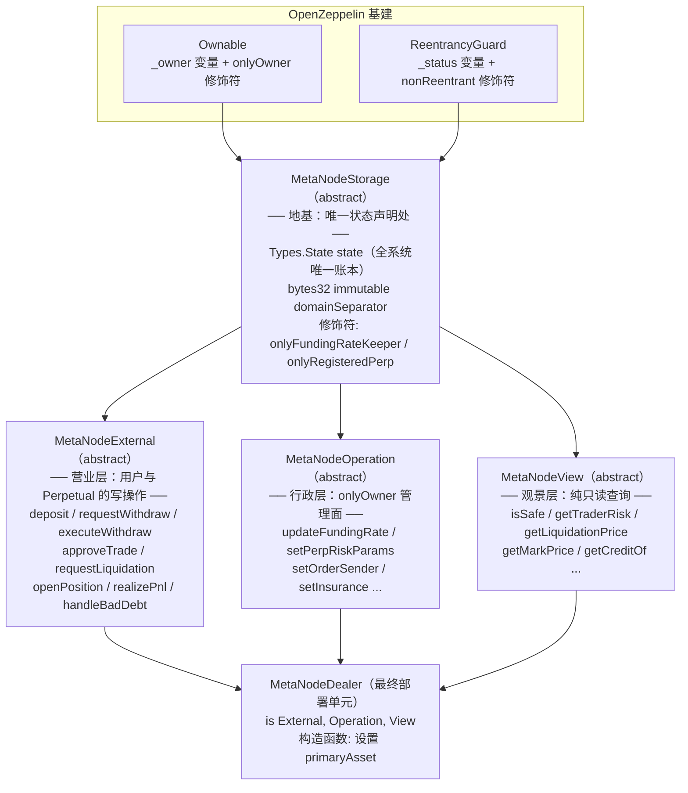
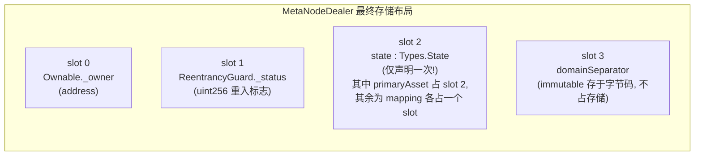

# 第 4 章：继承的艺术 — MetaNodeDealer 的 45 行外壳与四大抽象合约拼装术

> 涉及源码：`src/MetaNodeDealer.sol`、`src/MetaNodeStorage.sol`、`src/MetaNodeExternal.sol`、`src/MetaNodeOperation.sol`、`src/MetaNodeView.sol`
> 本章是全书"代码组织"篇：回答一个初学者最容易懵的问题——**一个合约文件里怎么会有好几个合约？它们到底是怎么变成一个部署单元的？**

---

## 1. 本章导读

### 1.1 先看一个"怪现象"

打开 `src/MetaNodeDealer.sol`，你会怀疑自己拿错了文件——这个号称"永续合约交易系统主入口"的合约，本体只有 45 行，几乎没有逻辑：

```solidity
contract MetaNodeDealer is MetaNodeExternal, MetaNodeOperation, MetaNodeView {
    constructor(address _primaryAsset) MetaNodeStorage() {
        state.primaryAsset = _primaryAsset;
    }
}
```

而真正的业务代码（存款、取款、验签、清算、查询）散落在三个以 `abstract contract` 声明的"半成品"里。**为什么要把一个合约拆碎再拼回去？**

### 1.2 类比：装修一栋大楼

把最终部署的 `MetaNodeDealer` 想成一栋竣工的大楼。开发团队没有把水电、消防、电梯各写一份独立图纸（那样是三个合约），而是把大楼按**功能楼层**拆成四份"施工段"：

- **MetaNodeStorage（地基与总电闸）**：所有管线（状态变量）从地基里走，全楼共用一套；
- **MetaNodeExternal（营业楼层）**：面向大众的服务窗口（存款/取款/交易/清算）；
- **MetaNodeOperation（行政楼层）**：只允许经理（owner）进出的配置间（注册市场、改参数）；
- **MetaNodeView（观景层）**：随便参观不收钱（全部只读查询）。

最后用一句 `is A, B, C` 把三个楼层**浇筑成一个整体**。竣工后你得到的是**一栋楼**（一个合约地址），而不是三栋楼——这一点是理解 Solidity 继承的起点。

### 1.3 Solidity 继承的本质：编译期"拍平"

这是本章最重要的一个认知：**Solidity 的继承不是"运行时调用父类"，而是编译时把整条继承链上的代码复制合并成一个合约**。这一点与 Java/Python 等语言的"动态绑定"心智模型完全不同：

- 部署 `MetaNodeDealer` 时，编译器把 External、Operation、View、Storage（以及它们继承的 OpenZeppelin `Ownable`、`ReentrancyGuard`）的**字节码全部拍平合并**成一个部署单元；
- 运行时不存在"父合约"，只有**一份合并后的代码**；
- 所以拆分的收益**不是**"部署多个合约、职责隔离"（那是代理模式干的事），而是**开发期的代码可维护性 + 权限语义清晰 + 避免单文件几千行的地狱**。

用一句话总结本章：**"拆是给程序员看的，合是给 EVM 看的。"**

---

## 2. 架构 / 流程图

### 2.1 继承树：四层拼装 + 两次"菱形"



注意图中"菱形"结构：`state` 沿三条路（经 External/Operation/View）到达根部。**C3 线性化算法保证 MetaNodeStorage 在最终合约里只被"实例化"一次**——这与第 3 章讲的"全系统只有一本账"在语言机制上闭环了。

### 2.2 存储布局：拍平后只剩一本账

用 `forge inspect MetaNodeDealer storage-layout` 可以看到拍平后的真实存储（节选）：



**关键事实**：`state` 只出现在 slot 2 **一次**。三个 abstract 子合约里写的 `state.primaryCredit[...]`、`state.perpRiskParams[...]`，编译后全部指向同一块存储空间。**Solidity 禁止子合约重复声明同名状态变量**，正是语言层面强制保证了"同一本账"。

---

## 3. 核心代码拆解

### (1) 顶层装配：45 行的"总装车间"

```solidity
// src/MetaNodeDealer.sol（几乎全文）
contract MetaNodeDealer is MetaNodeExternal, MetaNodeOperation, MetaNodeView {
    constructor(address _primaryAsset) MetaNodeStorage() {
        state.primaryAsset = _primaryAsset;   // 初始化唯一一份 state 的第一个字段
    }

    function version() external pure returns (string memory) {
        return "MetaNodeDealer V1.1";         // 版本号供链下识别协议版本
    }
}
```

**两个细节值得停下来想**：

- **`is` 后面的顺序有讲究**。Solidity 用 C3 线性化决定基类构造函数的执行顺序（**从最基础的基类开始**，即 Storage → External → Operation → View → 本合约）。本项目的基类构造函数都是无参的，顺序不影响正确性；但如果你的继承树里构造函数有参数、或有初始化依赖，`is` 的排列和 C3 的顺序就可能成为 bug 来源——这是继承写法的第一大坑。
- **`MetaNodeStorage()` 显式写出来**。虽然编译器也能自己推导基类构造，但显式声明让"谁初始化了什么"一目了然，属于防御式写法。

### (2) `MetaNodeStorage`：地基上的两根支柱

```solidity
// src/MetaNodeStorage.sol（核心部分）
abstract contract MetaNodeStorage is Ownable, ReentrancyGuard {
    Types.State public state;                  // 支柱一：全系统唯一的状态结构体
    bytes32 public immutable domainSeparator;  // 支柱二：EIP-712 签名域分隔符

    constructor() Ownable() {
        // 部署时固化签名域：协议名+版本+本合约地址，防跨链/跨合约重放
        domainSeparator = EIP712._buildDomainSeparator("MetaNode", "1", address(this));
    }

    modifier onlyFundingRateKeeper() {                 // 自定义角色修饰符 ①
        require(msg.sender == state.fundingRateKeeper, Errors.INVALID_FUNDING_RATE_KEEPER);
        _;
    }

    modifier onlyRegisteredPerp() {                    // 自定义角色修饰符 ②
        require(state.perpRiskParams[msg.sender].isRegistered, Errors.PERP_NOT_REGISTERED);
        _;
    }
}
```

**作者为什么把两个 modifier 放在 Storage 层？** 因为修饰符要被**多个子合约共用**：`onlyFundingRateKeeper` 只给 Operation 用，但 `onlyRegisteredPerp` 在 External 里保护了四个 Perpetual 回调入口。**共用逻辑上提**是继承拆分的基本功——放太低（比如每个函数里手写 require）会重复，放太高（比如放 Dealer 本体）子合约又够不着。

`abstract contract` 关键字本身也有语义：**声明"此合约不能独立部署，必须被继承"**。这既是给读者的文档（别部署这个），也让编译器检查是否有未实现的函数。

### (3) 三个子合约的"签名统一格式"

```solidity
// 三个 abstract 子合约的声明头，注意它们的共同点
abstract contract MetaNodeExternal is MetaNodeStorage, IDealer { ... }    // 业务写操作
abstract contract MetaNodeOperation is MetaNodeStorage, IDealer { ... }   // 管理面
abstract contract MetaNodeView is MetaNodeStorage, IDealer { ... }        // 查询面
```

三个都 `is MetaNodeStorage, IDealer`，这不是巧合：

- **继承 `MetaNodeStorage`**：拿到同一份 `state` 和那两个修饰符（菱形继承的入口）；
- **继承 `IDealer` 接口**：`IDealer` 声明了 `openPosition`、`realizePnl`、`handleBadDebt` 等函数。让 **External 和 Operation 都实现同一接口的不同部分**，这样 Perpetual 合约只需要 `import "./interfaces/IDealer.sol"` 就能用 `IDealer(owner()).xxx()` 安全地回调总行——**接口是跨合约调用的"合同文本"，继承拆分让"谁实现了哪部分合同"可以按楼层分配**。

### (4) 共享状态的实际使用：三个楼层写同一本账

```solidity
// MetaNodeExternal（营业层）写：
state.primaryCredit[orderSender] += result.orderSenderFee;   // 交易手续费记账

// MetaNodeOperation（行政层）写：
Operation.setPerpRiskParams(state, perp, param);              // 修改同一 state 里的市场参数

// MetaNodeView（观景层）读：
params = state.perpRiskParams[perp];                          // 读的就是上面写进去的参数
```

三段代码分属三个不同文件，操作的是**同一块存储**。如果你在 Operation 里新加一个字段却在 View 里读不到，第一反应应该检查的是：**字段是不是加在了 `Types.State` 结构体里**（必须改 `libraries/Types.sol`），而不是各楼层自己声明的变量——这是本项目存储模型的铁律：**所有状态只进 `Types.State`，所有状态只由 `MetaNodeStorage` 持有**。

### (5) 用工具亲眼验证"拍平"

```bash
# 查看合并后的存储布局
forge inspect MetaNodeDealer storage-layout
# 输出节选：
# + slot 0 | _owner        | address          (来自 Ownable)
# + slot 1 | _status       | uint256          (来自 ReentrancyGuard)
# + slot 2 | state         | Types.State      ← 只出现一次！
# + slot 2(+n) | state.primaryAsset 等 mapping 各占一个槽

# 查看合并后的函数选择器
forge inspect MetaNodeDealer method-identifiers
# 你会看到 External/Operation/View 三个合约的函数全部混排在一起，
# 归属于同一个合约——这就是"拍平"的直接证据
```

**建议动手做**：这个命令 10 秒钟就能跑完，是"眼见为实"理解继承的最快路径。还可以对比 `forge inspect MetaNodeStorage storage-layout`，观察子合约在 slot 0-1 插入了 Ownable/ReentrancyGuard 的变量——**基类变量永远排在派生类前面**，这是 Solidity 存储布局的固定规则（也是代理升级合约必须遵守的规则）。

### (6) 楼层内部：为什么业务函数还要再转手给 library？

```solidity
// MetaNodeExternal 里的典型模式：薄入口 + 库实现
function handleBadDebt(address liquidatedTrader) external {
    Liquidation.handleBadDebt(state, liquidatedTrader);       // 真逻辑在 libraries/Liquidation.sol
}

// MetaNodeOperation 同样如此：
function setPerpRiskParams(address perp, Types.RiskParams calldata param) external onlyOwner {
    Operation.setPerpRiskParams(state, perp, param);          // 真逻辑在 libraries/Operation.sol
}
```

注意双层的拆分维度不一样：**abstract 合约按"调用者身份"分层（谁在用），library 按"业务域"分层（算的是什么）**。把 library 函数写成 `function xxx(Types.State storage state, ...)` 的形式（显式传 storage 指针），库代码就能像"租借进合约的代码"一样直接读写合约存储。这个"合约分权限层 + 库分业务域"的双向拆解，是本项目代码组织的精髓，值得写自己项目时借鉴。

### (7) `version()` —— 小函数，大用途

```solidity
function version() external pure returns (string memory) {
    return "MetaNodeDealer V1.1";
}
```

纯字符串返回却值得单独一提：链下系统（前端、索引器、监控）需要一个**不依赖事件也能随时探测**的协议版本号，以便适配不同版本的接口差异。用 `pure` 让它零成本。生产级协议几乎都有类似函数（如 Uniswap 的 `FACTORY`、`feeToSetter` 常量位），属于容易被忽略但很重要的链下-链上契约。

### (8) 反面教材：为什么**不**用三个独立合约 + 组合？

设想另一种写法：部署 `DealerExternal`、`DealerOperation`、`DealerView` 三个独立合约，互相通过地址调用。对比一下：

| 维度 | 继承拼装（本项目） | 多合约组合 |
|---|---|---|
| 状态共享 | 直接共享同一 `state`，零成本 | 必须跨合约读写，或复制状态（灾难） |
| 调用开销 | 内部跳转（JUMP），几乎免费 | 每次跨合约 CALL 多花约 700+ gas |
| 部署/升级 | 一个地址，状态原子一致 | 三个地址，状态可能不一致 |
| 事务边界 | 一笔交易内自然回滚 | 跨合约失败处理复杂 |

**状态共享需求决定了继承是这里的正确工具**。什么时候该用多合约组合？当各部分需要**独立升级**或**独立信任假设**时（比如 Perpetual 与 Dealer 就必须分开——它们生命周期不同）。"按生命周期拆合约，按权限拆继承"是本项目给出的组织范式。

---

## 4. Web3 特有机制

1. **EIP-170 合约大小限制（24KB）**：这是拆分的现实推手之一。一个大 DEX 合约轻松超过 24KB 部署上限；把函数挪进 library（`internal` 库编译时内联，`external` 库独立部署复用）是标准瘦身手段。本项目全部用 library 承载重逻辑，与继承拆分配合控制体积。
2. **存储布局 = 合约的"宪法"**：拍平后 slot 0 起 `_owner → _status → state` 的顺序由继承结构唯一决定，**不可插队**。将来若升级合约（代理模式），新版本必须保持前几个槽位的类型与顺序不变，否则数据会错位读取——理解本章的布局图是将来学代理升级的必修前置。
3. **`immutable` 不占存储槽**：`domainSeparator` 标记为 immutable 后，编译器把它直接嵌进字节码常量区，比普通状态变量**读起来更省 gas**（无需 SLOAD），且只能构造期赋值。适合"部署后永不变"的值。
4. **`public` 状态变量自动生成 getter**：`Types.State public state` 会生成一个 `state()` 函数，但注意 mapping 类型的字段无法一次性取回，逐字段查并不好用——这也是为什么要专门做一层 `MetaNodeView` 手写语义化查询。
5. **修饰符（modifier）是"准入门"不是"包装器"**：`onlyOwner`、`nonReentrant`、自定义的两个修饰符在拍平后就是普通的调用前检查代码。一个函数可叠多个修饰符，执行顺序**从左到右**——如果顺序错了（比如把 `nonReentrant` 放在会先改状态的修饰符之后），防重入就形同虚设。
6. **函数选择器混排**：拍平后所有函数共享一个选择器表。理论上有"选择器碰撞"（不同函数哈希前 4 字节相同）的概率问题，Solidity 0.8 编译器会在编译期检测到同名同参冲突，这个风险基本被语言层面消解了。

---

## 5. 本章小结与思考题

### 5.1 核心知识点回顾

- **Solidity 继承 = 编译期拍平**：`MetaNodeDealer is External, Operation, View` 部署后是一个合约，不存在运行时的"父合约"。
- **四层职责划分**：Storage（唯一状态 + 共用修饰符）/ External（用户与 Perpetual 的写操作）/ Operation（onlyOwner 管理面）/ View（只读查询）。
- **菱形继承只实例化一次**：C3 线性化保证 `state` 在最终合约里只占一份存储（slot 2），"全系统一本账"由此在语言机制上成立。
- **双向拆解范式**：abstract 合约按调用者身份分层，library 按业务域分层（显式传 `Types.State storage`）。
- **选型判断**：需要状态共享 → 继承拼装；需要独立升级/信任隔离 → 多合约组合（Perpetual 与 Dealer 的拆分属于后者）。

### 5.2 思考题

1. **如果把 `state` 变量从 `MetaNodeStorage` 挪到 `MetaNodeExternal` 里声明（并在 Operation/View 里也各声明一份 `Types.State state`），编译器会怎么做？** 提示：先回忆"Solidity 禁止什么"，再想如果编译器不禁止（比如用三个不同名变量），`Operation` 修改的参数和 `View` 读到的参数还会是同一份吗？由此体会"状态上提到共同基类"这一纪律的必要性。
2. **`MetaNodeView` 是纯只读合约层，理论上可以单独部署成一个独立合约、由链下直接查询——项目为什么没这么做？** 从三个角度对比：(a) 它需要读 `state`（状态在哪？）；(b) `isAllSafe` 被谁调用、调用开销多少；(c) 独立部署后 `state` 变化的可见性问题。想清楚后你会对"view 层也必须继承 Storage"有体感。

---

## 6. 踩坑提示

1. **继承是"代码组织"工具，不是"权限隔离"工具**：三个楼层拍平后共用同一存储与同一 owner。如果你以为"External 层的 bug 不会影响 Operation 层"，就大错特错——**任何一层的重入、溢出、权限漏洞都会波及整栋楼**。安全分析必须以拍平后的完整合约为单位。
2. **`is A, B` 的书写顺序影响 C3 线性化结果**：本项目所有基类构造函数无参、无函数覆盖，顺序无关紧要；但一旦出现**函数重载覆盖**（override）或带参构造，顺序错误会导致"调用了错误的实现"或"初始化顺序错乱"。复制本项目模式时，保持"先基础后派生"的书写习惯。
3. **不要在子合约里声明与基类同名的状态变量**——编译器会直接报错（`DeclarationError`），这其实是好事：语言替你挡住了"两本账"事故。但要注意**不报错的相邻陷阱**：在 library 里用 `Types.State storage state` 参数名很方便，但如果你误把 `storage` 写成 `memory`，函数会在副本上操作、改动全部丢失——且编译不报错、测试可能也测不出来（只读测试碰巧通过）。传结构体进 library 时永远检查 storage 关键字。
4. **加字段必须改 `Types.State`，且只能在结构体末尾追加**：在 mapping 大行其道的存储里插入新字段会改变后续所有字段的槽位分配。虽然本项目不打算升级代理，但养成"追加不插队"的习惯能避免未来的血泪。
5. **`forge inspect` 是理解继承项目的第一工具**：拿到任何"多合约继承拼装"的项目，先跑 `storage-layout` 和 `method-identifiers` 建立拍平后的真实视图，再去读源文件，比按文件顺序硬读效率高一个数量级。

---

> 下一章预告（第 5 章）：进入地基内部，逐字段拆解 `Types.State`——一个结构体如何撑起整个交易所的保证金、市场、订单、权限四本账。
