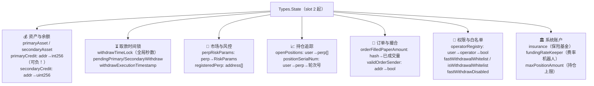
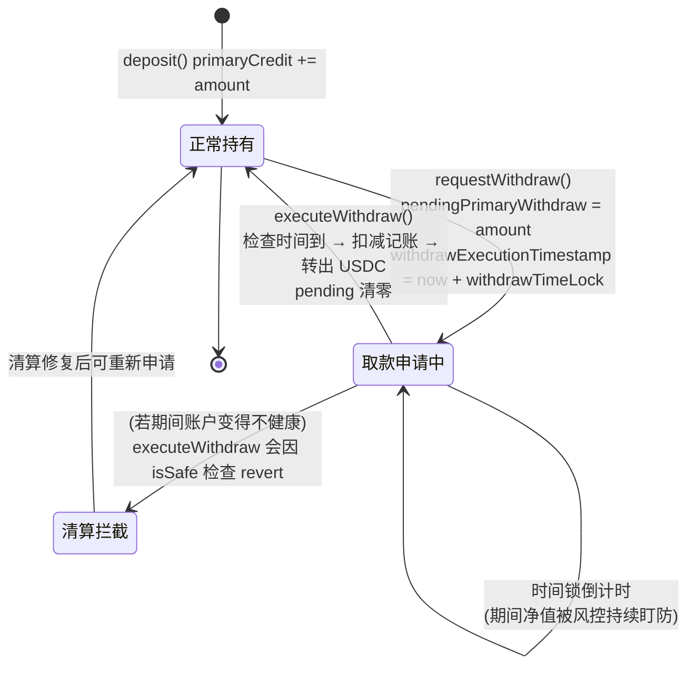

# 第 5 章：全局账本 MetaNodeStorage — 一个结构体撑起整个交易所

> 涉及源码：`src/libraries/Types.sol`（主角）、`src/MetaNodeStorage.sol`（持有者）、`src/libraries/Funding.sol`、`src/libraries/Position.sol`（使用现场）
> 上一章我们知道了 `state` 是"全系统唯一的状态变量"；本章钻进这个变量内部，逐字段拆解这本"总账"。

---

## 1. 本章导读

### 1.1 类比：一本"万能总账"

如果把 MetaNodeDealer 比作银行的清算中心，那么 `Types.State` 就是柜台上那本**万能总账**——翻开它，你会看到不同的"页签"：

- **存款页**：每个客户存了多少 USDC（`primaryCredit`）；
- **取款登记页**：谁申请了取款、什么时候能拿到（`pendingWithdraw` / `withdrawExecutionTimestamp`）；
- **营业部登记页**：交易所开了哪些品种、每个品种的风控规则（`perpRiskParams` / `registeredPerp`）；
- **客户持仓索引页**：每个客户在哪些品种有仓位（`openPositions`）；
- **订单流水页**：每张订单已经成交了多少（`orderFilledPaperAmount`）；
- **授权页**：谁有权替谁签字（`operatorRegistry`）；
- **金库钥匙页**：保险基金、费率机器人是谁（`insurance` / `fundingRateKeeper`）。

一个 Solidity 结构体里塞下所有这些 mapping，看似粗暴，实则精准回应了链上开发的一个硬约束：**跨合约共享状态很贵，单合约内的结构体分页是免费的**。

### 1.2 为什么所有状态塞进一个结构体？（三条理由）

1. **library 模式的传送带**。本项目的库函数签名清一色是 `function xxx(Types.State storage state, ...)`——库函数想读写合约存储，最方便的方式就是收一个 storage 指针参数。把全部状态收进一个结构体，**任何库函数只需要一个参数就能访问它需要的一切**，签名统一、语义清晰。
2. **存储槽一次分配，永远稳定**。结构体在 slot 2 起占位，内部字段按声明顺序各自定槽。只要"只追加不插队"，这套布局永不重排。
3. **心智上的单点真理**。审计、升级、调试时只需盯一个变量。"状态在哪"这个问题的答案永远是：`state`。

### 1.3 本章学习法

本章采用"字段分组 + 使用现场"的讲法：每讲一组字段，就立刻看一段**真正读写它的代码**（`Funding`/`Position` 库），避免"背字段名"式的假学习。读完请完成附录式的自测：合上文档，默写 `Types.State` 的 7 个功能分组。

---

## 2. 架构 / 流程图

### 2.1 `Types.State` 字段地图：七大页签



### 2.2 取款时间锁的状态机：一个字段组的完整生命周期



注意时间锁保护的对象：**"申请了取款但还没到时间"的资金依然算在 `primaryCredit` 里**，风控依然算得上它——时间锁只是把"最终转出"延迟，不是把资金冻结出账本。

---

## 3. 核心代码拆解

### (1) `Types.State` 全景（按功能分组摘录）

```solidity
// src/libraries/Types.sol
struct State {
    // ── 资产页 ──
    address primaryAsset;        // 结算资产（USDC），部署时定死
    address secondaryAsset;      // 次级资产（可选扩展位）

    // ── 余额页 ──
    mapping(address => int256) primaryCredit;    // 主资产余额：可以是负数！
    mapping(address => uint256) secondaryCredit; // 次级余额：永不为负

    // ── 取款页 ──
    uint256 withdrawTimeLock;                          // 全局时间锁（秒）
    mapping(address => uint256) pendingPrimaryWithdraw;   // 待取款金额
    mapping(address => uint256) withdrawExecutionTimestamp; // 可执行时间戳

    // ── 市场页 ──
    mapping(address => Types.RiskParams) perpRiskParams; // perp → 风控参数包
    address[] registeredPerp;                            // 已注册市场列表

    // ── 持仓页 ──
    mapping(address => address[]) openPositions;         // user → 持仓市场列表
    mapping(address => mapping(address => uint256)) positionSerialNum; // 仓位轮次号

    // ── 订单页 ──
    mapping(bytes32 => uint256) orderFilledPaperAmount;  // 订单哈希 → 已成交量
    mapping(address => bool) validOrderSender;           // 撮合员白名单

    // ── 权限页 ──
    mapping(address => mapping(address => bool)) operatorRegistry; // 代签授权
    mapping(address => bool) isWithdrawalWhitelist;      // 取款目标白名单
    bool fastWithdrawDisabled;

    // ── 系统账户页 ──
    address insurance;          // 保险基金
    address fundingRateKeeper;  // 费率机器人
    uint256 maxPositionAmount;  // 单用户最大持仓市场数
}
```

下面逐页深挖最值得咀嚼的设计点。

### (2) `primaryCredit` 用 `int256`（可负）vs `secondaryCredit` 用 `uint256`——一个不对称的深意

```solidity
mapping(address => int256) primaryCredit;     // 保证金余额，允许为负
mapping(address => uint256) secondaryCredit;  // 次级资产余额，永不为负
```

**作者为什么这么设计？** 保证金账户**必须**允许负数：清算的瞬间、坏账发生的瞬间，净值就是负的——`handleBadDebt` 的工作正是"把负数抹平、保险基金补齐"。如果用 uint256，负余额会在下溢检查下 revert，清算代码根本写不出来。而次级资产只是扩展位，不允许负数，uint256 既省一层检查又防止逻辑误用。

**风险与代价**：int256 余额意味着"账面上的钱"可以超过"合约里实际锁着的 USDC"（纸面富余），全靠风控（`isSafe`）+ 清算 + 保险基金这套组合拳兜底。审计这类系统时，**每一个能让 primaryCredit 变负或从负恢复的路径都要单独验证**——这是本项目风险最高的一类状态转换。

### (3) 余额页的写入现场：存取款如何记账

```solidity
// src/libraries/Funding.sol
function deposit(Types.State storage state, uint256 primaryAmount, uint256 secondaryAmount, address to) external {
    // 先收钱（safeTransferFrom 从 msg.sender 转入本合约），再记账：
    state.primaryCredit[to] += SafeCast.toInt256(primaryAmount);  // uint256→int256 显式转换
    ...
}

function requestWithdraw(Types.State storage state, address from, uint256 primaryAmount, uint256 secondaryAmount) external {
    // 注意：这里只登记，不扣 primaryCredit！
    state.pendingPrimaryWithdraw[from] = primaryAmount;
    state.withdrawExecutionTimestamp[from] = block.timestamp + state.withdrawTimeLock;  // 记下解禁时刻
    emit RequestWithdraw(from, primaryAmount, secondaryAmount, state.withdrawExecutionTimestamp[from]);
}

function executeWithdraw(Types.State storage state, address from, address to, ...) external {
    require(state.withdrawExecutionTimestamp[from] <= block.timestamp, Errors.WITHDRAW_PENDING); // 时间锁检查
    uint256 primaryAmount = state.pendingPrimaryWithdraw[from];
    state.pendingPrimaryWithdraw[from] = 0;   // 先清零（CEI：防重入时余额已被扣）
    // ...随后做净值/安全性检查，最后真正扣 primaryCredit 并转出代币
}
```

**三步式取款的设计权衡**：`requestWithdraw` **不**扣减余额，只是"登记待取金额"——期间用户仍可继续交易（体验好），但 `executeWithdraw` 在转出前会重新检查账户健康度，期间若被清算打爆，取款会被拒绝。**登记不冻结**，是"用户体验"与"风控窗口"之间的折中。另外注意 `SafeCast.toInt256`：uint256→int256 的转换若数值超过 2^255 会溢出为负，SafeCast 会 revert——又一个"编译器保护不到的边界要自己补"的例子。

### (4) 市场页：`perpRiskParams` 与 `registeredPerp` 的双轨制

```solidity
mapping(address => Types.RiskParams) perpRiskParams;  // 主索引：按地址查参数（高频）
address[] registeredPerp;                             // 副索引：全量枚举（低频）

// libraries/Operation.sol 注册现场
function setPerpRiskParams(Types.State storage state, address perp, Types.RiskParams calldata param) external {
    if (!state.perpRiskParams[perp].isRegistered) {
        state.registeredPerp.push(perp);   // 首次注册才入列表
    }
    state.perpRiskParams[perp] = param;    // 参数可反复更新（含 isRegistered 开关）
}
```

**为什么同一个信息存两份？** 两种访问模式决定两种数据结构：日常交易里"给一个地址查参数"是 O(1) mapping 的主场；而管理后台"列出所有市场"需要数组。代价是**两份数据必须人工保持一致**（取消注册时记得从数组里摘除）——双轨制是链上数据结构中常见的"用一致性风险换查询效率"。`isRegistered` 还兼任开关：置 false 即可"软下架"一个市场，已注册列表里仍留有痕迹。

### (5) 持仓页：`openPositions` 与 `positionSerialNum` —— 交叉保证金的心脏

```solidity
// src/libraries/Position.sol
function _openPosition(Types.State storage state, address trader) internal {
    // 关键闸门：持仓市场数量有上限（maxPositionAmount）
    require(state.openPositions[trader].length < state.maxPositionAmount, Errors.POSITION_AMOUNT_REACH_UPPER_LIMIT);
    state.openPositions[trader].push(msg.sender);   // msg.sender 就是那个 Perpetual
}

function _realizePnl(Types.State storage state, address trader, int256 pnl) internal {
    state.primaryCredit[trader] += pnl;                        // 盈亏落进总账
    state.positionSerialNum[trader][msg.sender] += 1;          // 轮次号 +1
    address[] storage positionList = state.openPositions[trader];
    for (uint256 i = 0; i < positionList.length;) {
        if (positionList[i] == msg.sender) {
            positionList[i] = positionList[positionList.length - 1];  // swap：把最后一个搬过来
            positionList.pop();                                       // pop：删掉末尾
            break;
        }
        unchecked { ++i; }
    }
}
```

**`openPositions` 为什么必须有长度上限？** 因为风控要**遍历**这个数组来汇总用户在所有市场的净值（`isSafe`）。若无上限，恶意用户开 1 万个市场各 1 张最小仓，`isSafe` 遍历成本爆炸，**所有**涉及该用户的交易和清算都会因 gas 超限而失败——这是教科书级的"griefing 攻击"（恶心人攻击），`maxPositionAmount` 就是那个闸门。

**swap-and-pop 的代价**：移除元素 O(1) 但会打乱数组顺序——链下系统**绝不能假设 `openPositions` 的顺序稳定**。`positionSerialNum`（每次全平 +1）就是为此准备的"轮次号"：链下盈亏分析靠 `(用户, 市场, 轮次号)` 三元组区分同一市场的多段仓位生涯。

### (6) 订单页：`orderFilledPaperAmount` —— 防超额成交的流水账

```solidity
// MetaNodeExternal.approveTrade 内
state.orderFilledPaperAmount[orderHash] += matchPaperAmount[i];   // 累加本次成交量
require(
    state.orderFilledPaperAmount[orderHash] <= int256(order.paperAmount).abs(),
    Errors.ORDER_FILLED_OVERFLOW                                  // 累计不得超过订单总量
);
```

一张 EIP-712 签名的订单可以被**部分成交多次**（比如 1 BTC 的单分 5 次成交），所以必须有个地方记"这张单已经吃了多少"。key 是订单哈希（含 nonce），天然防重放。注意存储的是 **paper（数量）** 而非金额——因为订单的约束就是数量上限。

### (7) 权限页：`operatorRegistry` —— 链上版"API Key"

```solidity
// 用户本人调用，授权 operator 代自己签订单
function setOperator(address operator, bool isValid) external {
    Operation.setOperator(state, msg.sender, operator, isValid);   // 注意授权主体是 msg.sender
}
// approveTrade 验签时：
// 恢复出签名者地址后，检查 state.operatorRegistry[order.signer][recoverSigner]
```

量化团队的经典需求：老板管钱，策略机器人下单。链上版"API Key"的巧妙之处在于**授权和资金分离**——operator 只能"以用户的身份签名订单"，而订单能造成什么后果仍由订单内容 + 风控决定，operator 拿不到提款权（那是 `approveFundOperator` 另一档授权的事）。**细粒度授权分层**是安全设计的常用套路：给最少的权限，而不是一把万能钥匙。

### (8) 系统账户页：两个"全局单点"

```solidity
address insurance;          // 保险基金：handleBadDebt 的资金来源与 insuranceFee 的去向
address fundingRateKeeper;  // 唯一有权推动所有市场 fundingRate 演进的地址
uint256 maxPositionAmount;  // 见上文，griefing 闸门
```

`fundingRateKeeper` 是单一地址而非白名单——因为**费率读数是全局单调演进的序列**，两个写者会互相踩踏（后写覆盖先写，读数可能倒退），单写者是分布式系统里"防止脑裂"的链上表达。

### (9) 存储布局的隐含知识：mapping 与数组在结构体里怎么占槽

```solidity
Types.State public state;
// state.primaryAsset        → slot 2（定长，值就存在槽里）
// state.primaryCredit       → slot 3（mapping 只占一个槽，实际数据藏在 keccak(键,3)）
// state.registeredPerp      → slot 9（数组同理：槽里只存 length，元素藏在 keccak(9)+i）
// state.insurance           → slot 12 ...
```

**理解这个是读懂"高级存储"问题的门票**：mapping/array 变量本身不存数据，只存"根槽号"，真实数据散布在 `keccak256` 派生的槽位上。这也是为什么① `forge inspect` 输出里 mapping 字段都只标一个 slot；② offline 证明（如存储证明、zk 系统验证余额）需要用键值去派生槽位。在结构体里**新增一个字段会把后面所有字段的槽号 +1**——第 4 章说的"只追加不插队"在这里看到物理后果。

### (10) `MatchResult`：结构体即"结算指令单"

```solidity
struct MatchResult {
    address[] traderList;      // 参与者（第 0 个是 taker，其余 maker）
    int256[] paperChangeList;  // 每人的持仓变化
    int256[] creditChangeList; // 每人的资金变化（已扣手续费）
    int256 orderSenderFee;     // 撮合员的总手续费
}
```

三个平行数组而非"结构体数组"，是 EVM 的现实选择：`Perpetual.trade` 拿到后要按索引循环 `_settle`，平行数组在 ABI 解码上更省。**这份结构体就是"链下撮合 → 链上结算"的交接单**：approveTrade 生成它，Perpetual 消费它，双方对它的格式达成接口契约（`IDealer`）。

---

## 4. Web3 特有机制

1. **mapping 的槽位派生（keccak256(key, slot)）**：状态是"摊平"在海量槽位上的，单用户余额读一次就是一次独立的 SLOAD（冷 2100 / 热 100 gas）。这就是为什么 `Perpetual._settle` 要把 `balanceMap[trader]` 的两个字段一次打包读写、`Funding` 里缓存后再判空——**围绕 SLOAD/SSTORE 组织代码是链上开发与后端开发最大的肌肉记忆差异**。
2. **int256 余额与下溢保护**：0.8.x 让算术溢出默认 revert，但也意味着"负余额"这种业务上合法的值必须有符号类型承载。类型选择（int vs uint）在链上不只是习惯问题，而是业务模型的一部分。
3. **数组遍历的 gas 上限即安全边界**：`openPositions` 上限、清算时遍历用户持仓、`isAllSafe` 遍历交易者列表——任何"无界循环"都是潜在 DoS。看到 `for` 循环就要问一句：**长度被什么约束住了？**
4. **swap-and-pop 省 gas**：数组尾部删除 O(1)（约省数千 gas），代价是顺序不稳定。链下系统消费这类数组时要么按轮次号重建语义，要么接受乱序。
5. **事件与存储的双写纪律**：`RequestWithdraw` 事件携带的 `withdrawExecutionTimestamp` 与存储值必须一致——链下系统以事件重建索引，事件写错等于给下游喂假数据。事件参数尽量带上"决策所需全量"，避免链下回头查存储。
6. **`calldata` 参数的省 gas 用法**：`setPerpRiskParams(..., Types.RiskParams calldata param)` 用 calldata 而非 memory，因为参数从交易数据直接读取、不拷贝内存——对大结构体参数是可感知的优化。

---

## 5. 本章小结与思考题

### 5.1 核心知识点回顾

- `Types.State` 按七大页签组织：资产余额 / 取款时间锁 / 市场风控 / 持仓追踪 / 订单撮合 / 权限白名单 / 系统账户。
- **不对称类型学**：`primaryCredit` 是 int256（允许负余额，服务清算与坏账），`secondaryCredit` 是 uint256（永不透支）。
- **登记不冻结**的取款模型：request 只记时间戳，execute 时才验健康、才动余额。
- **双轨索引**（mapping 主查 + array 枚举）与**无界循环防护**（`maxPositionAmount`）是市场页和持仓页的安全核心。
- `positionSerialNum` + swap-and-pop 的组合提示我们：**链上存储是给链下消费的，格式设计要同时服务两边的读取习惯**。

### 5.2 思考题

1. **假设去掉 `maxPositionAmount` 限制，请设计一个完整攻击剧本**：攻击者如何用极少的资金让某个无辜大户的清算交易永远无法上链？（提示：大户要被清算，清算人必须调用 `isSafe` → 遍历大户的 `openPositions`。攻击者能影响这个数组的长度吗？顺带思考：如果 `openPosition` 不需要用户签名，这个攻击会更可怕吗——本项目靠什么挡住了这一层？）
2. **`pendingPrimaryWithdraw` 登记后不冻结余额，`executeWithdraw` 里才做健康检查**。请推演时间窗口内发生的两种情形：(a) 用户期间开新仓导致不健康；(b) 用户期间被部分清算。两种情形下 executeWithdraw 会分别在哪一步 revert？这个设计让"取款申请"承担了怎样的业务语义（它更像什么现实中的凭证）？

---

## 6. 踩坑提示

1. **`primaryCredit` 可负是一把双刃剑**：全系统大量代码隐含假设"负余额已被 isSafe/handleBadDebt 兜住"。新增任何写余额的代码路径时，必须回答"这一步能不能把余额写成负数？写成负数后谁负责恢复？"——回答不出就先别合代码。
2. **不要假设 `openPositions` 数组顺序**：swap-and-pop 会让元素乱序。链下若按数组顺序对账，会在某次平仓后对不上。请一律通过 `(user, perp, positionSerialNum)` 三元组定位仓位生涯。
3. **双轨数据的一致性靠纪律不靠机制**：`registeredPerp` 数组与 `perpRiskParams[perp].isRegistered` 可能失同步（例如软下架后忘记清理数组）。写新的管理函数时，凡是动其中一份，先检查另一份该不该动。
4. **`requestWithdraw` 可被重复调用覆盖**：后一次请求会覆盖前一次的金额和时间戳（`pendingPrimaryWithdraw[from] = primaryAmount` 是赋值不是累加）。链下若有"多笔待取款"假设，会算错账。
5. **struct 里新增字段 = 全体槽位重排**：`Types.State` 中间插字段会让所有 mapping 根槽号 +1。对已部署合约这等于数据错位灾难；即便在开发期，也会让旧测试的存储假设全部失效。**永远在结构体末尾追加字段**。

---

> 下一章预告（第 6 章）：聚焦本项目最核心的记账原语 paper 与 credit——为什么必须"双轨"，credit 为什么是现算值不落盘，以及"水表读数"类比如何解释 reducedCredit 锚点的反推。
