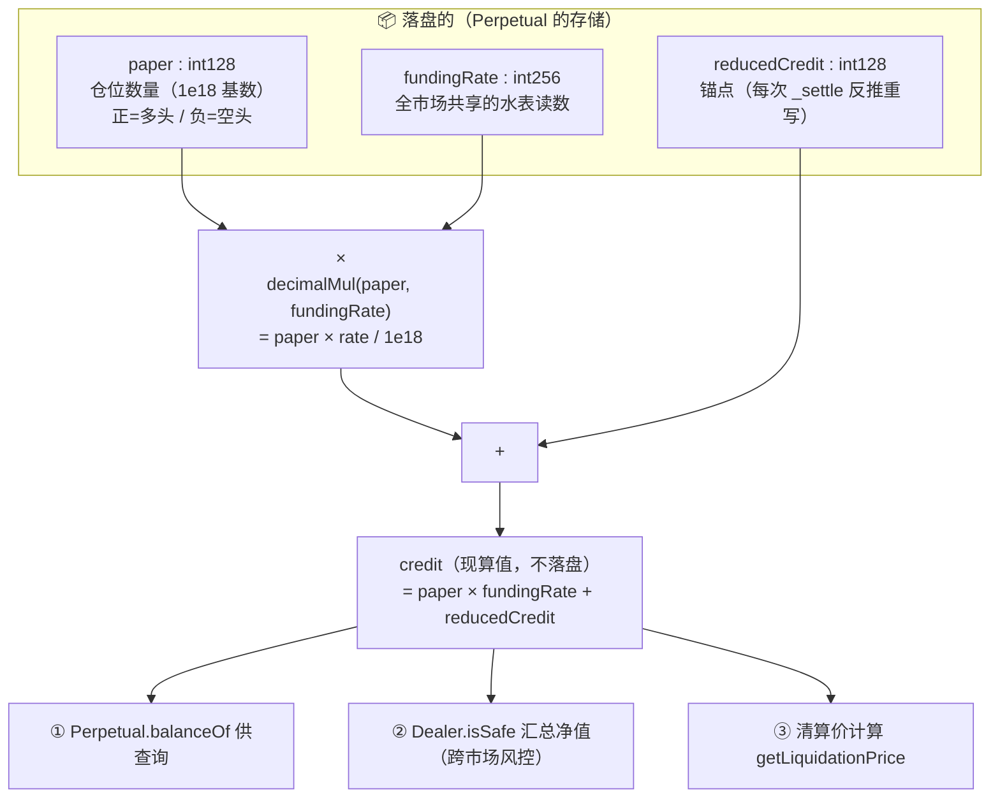
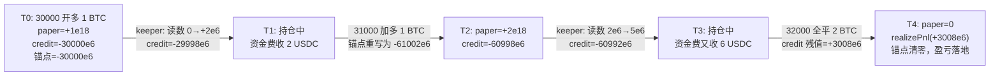

# 第 6 章：paper 与 credit — 理解仓位记账的"虚拟票据 + 记账货币"双轨制

> 涉及源码：`src/Perpetual.sol`（balance 结构体、balanceOf、updateFundingRate、_settle）、`src/libraries/SignedDecimalMath.sol`、`src/libraries/Position.sol`、`src/libraries/Liquidation.sol`（净值公式印证）
> 前面几章你反复见到 `paper`、`credit`、`reducedCredit`、`fundingRate` 这几个词。本章把它们的语义一次讲透——这是全书的"概念最高点"，读懂本章，后面交易、资金费、清算三章都会变得轻松。

---

## 1. 本章导读

### 1.1 类比：一个股票账户的两栏

打开你的券商 App，账户页面其实只有两栏数字：

- **持股数量栏**：你持有 100 股茅台——**数量**，可正可负（融券卖出是负持有）；
- **资金栏**：你的现金余额、浮动盈亏——**钱**，随时在变。

本项目给永续合约仓位设计的正是这两栏：

| 券商 App | 本项目 | 表达什么 |
|---|---|---|
| 持股数量 | **paper**（仓位数量） | 正 = 多头（"持有"票据），负 = 空头（"欠"票据） |
| 资金栏 | **credit**（资金量） | 这张票据背后沉淀的资金，正负号表达你收了钱还是付了钱 |

关键区别在于：券商 App 的"浮动盈亏"是**服务器随时重算的显示值**；而链上没人能"随时重算给你看"——每一次余额变动都要花真金白银的 gas。于是本项目的资金栏被进一步拆成**两个可组装的零件**：

```
credit（现算值，不落盘） = paper × fundingRate（现算部分） + reducedCredit（落盘锚点）
```

记住这个恒等式，本章的一切都围绕它展开。

### 1.2 "水表读数"：为什么 credit 必须现算

`fundingRate` 是全市场共享的一个**累计读数**，像一块水表：它从 0 开始只进不退地累积，每次 keeper 更新就往前走一格。每个用户的资金费账单 = 自己的持仓量 ×（读数变化量）。

现在设想两个相反的实现方案：

- **方案 A（逐人结算）**：每次读数前进，就给全市场每个持仓者的存储余额里加一笔资金费。读数走 1 格 = 上万次 SSTORE = 天价 gas，且任何人都能阻挡这次更新。
- **方案 B（本项目的选择）**：只更新水表本身（1 个槽），每个人的资金费"欠账"**在读取的那一刻**用公式现算出来——`paper × fundingRate` 这一项。

方案 B 的精妙在于：**"用户 A 该收多少资金费"这个信息从未被存储过，却在任何时刻都能被精确还原**。这就是"credit 是现算值、不落盘"的含义（你之前学习时验证过这一点：源头存储只有 paper / reducedCredit / fundingRate 三样）。

而 `reducedCredit`（约减后的 credit）扮演**锚点**的角色：把与水表无关的部分（入场时付出的钱、历史费率、已结算盈亏）固化下来，使得恒等式在任何读数下都成立。每当持仓变化，`_settle` 会**反推并重写锚点**（详见 3.6 节的数值推演）。

### 1.3 一个必须先钉死的符号约定

本项目源码注释明确写了（且与你此前验证的结论一致）：

> "如果 fundingRate 在某次更新中增加了 5：每持有 1 paper 多头，你将**获得** 5 credit；每持有 1 paper 空头，你将**支付** 5 credit。"

即 **fundingRate 上升 = 多头收钱**。这与多数 CEX"费率为正 = 多头付钱"的符号习惯**相反**。原因在后文数值推演里能看出来：credit 是"你欠票据 opposite 的钱"方向的记账，符号体系整体翻转了。请把这条钉在脑子里，第 10 章会回到它。

---

## 2. 架构 / 流程图

### 2.1 credit 恒等式的"三零件"组装图



### 2.2 一笔仓位的一生（数值时间线，可与 3.6 节对照）



这五个时刻在 3.6 节会逐步笔算验证。**建议你亲手算一遍**——paper/credit 体系的所有微妙之处都藏在数字里。

---

## 3. 核心代码拆解

### (1) `balance` 结构体：双轨的物理形态

```solidity
// src/Perpetual.sol
struct balance {
    int128 paper;          // 轨道一：数量（虚拟票据）。正=多头，负=空头
    int128 reducedCredit;  // 轨道二：资金锚点。与 paper 配合现算 credit
}
mapping(address => balance) balanceMap;   // 本市场每人的"股票账户"
int256 fundingRate;                       // 本市场的水表读数
```

**为什么两个轨道必须同时存在？** 只存 paper 不存资金 → 不知道你入场成本和已实现盈亏；只存资金不存数量 → 不知道你的方向和敞口。而把"资金"拆成"现算部分 + 落盘锚点"，则是为了 1.2 节说的 gas 问题。三个字段各司其职，一个都不能少。

`int128` 的选择同样是三赢：① 允许负数；② 两个 int128 打包进一个 32 字节槽（第 3 章讲过）；③ int128 上限约 1.7×10^38，对 1e18 基数的业务量绰绰有余。计算时临时升位到 int256 防溢出——**小类型存储、大类型计算**是定点数系统的标准姿势。

### (2) `balanceOf`：恒等式的落地实现

```solidity
// src/Perpetual.sol
function balanceOf(address trader) external view returns (int256 paper, int256 credit) {
    paper = int256(balanceMap[trader].paper);                      // int128 → int256 升位
    credit = paper.decimalMul(fundingRate)                         // 现算部分：数量 × 水表读数
           + int256(balanceMap[trader].reducedCredit);             // 加上落盘锚点
}
```

注意返回的两个值：paper 是**存储值**，credit 是**计算值**。任何下游（风控、清算、链下索引）拿到的 credit 永远反映"当下读数下"的真实资金——这就是第 5 章说的"现算不落盘"在接口层的体现。

### (3) 单位制：三套基数如何咬合（最容易懵的地方）

```solidity
// Types.sol
uint256 public constant ONE = 1e18;              // paper / 比率的基数

// Perpetual.sol 源码注释：
// 以 $30,000 做多 1 BTC:  paper = 1e18,  credit = -30000e6
```

| 量 | 基数 | 1 个业务单位 |
|---|---|---|
| paper（BTC 数量） | 1e18 | 1 BTC = 1e18 |
| credit（USDC 资金） | 1e6 | 1 USDC = 1e6 |
| fundingRate（每 paper 的费率） | 直接以 credit 单位记 | 读数 +5e6 = 每 1 BTC 仓位收 5 USDC |

因为 `decimalMul(paper, rate) = paper × rate / 1e18`，当 paper = 1e18（恰好 1 BTC）时结果恰好等于 rate——**fundingRate 的数值直接就是"每 1 BTC 持仓收多少 USDC（1e6 基数）"**。三套基数在这一步咬合成一个整体。混淆基数是本系统新手事故第一名，务必按这张表建立直觉。

### (4) `SignedDecimalMath.decimalMul`：定点乘法与"向下取整"

```solidity
// src/libraries/SignedDecimalMath.sol
int256 constant SignedONE = 10 ** 18;

function decimalMul(int256 a, int256 b) internal pure returns (int256) {
    return (a * b) / SignedONE;     // 先乘后除；Solidity 整数除法向零取整
}

function abs(int256 a) internal pure returns (uint256) {
    return a < 0 ? uint256(a * -1) : uint256(a);   // 注意：int256 最小值会溢出（业务上不会触达）
}
```

**为什么先乘后除？** EVM 没有浮点，`(a/1e18) × b` 会先损失精度再计算；`(a×b)/1e18` 把精度损失推迟到最后一步。即便如此仍会取整——**每一笔小数运算都有最多 1 个最小单位的舍入误差**，这在资金费长期累积、清算价贴线判断等场景会放大，是审计定点数系统的必修课（Solidity 的除法是向零取整，正数即向下取整）。

### (5) `updateFundingRate`：只动水表，不动账本

```solidity
// src/Perpetual.sol
function updateFundingRate(int256 newFundingRate) external onlyOwner {
    int256 oldFundingRate = fundingRate;
    fundingRate = newFundingRate;                     // 全函数只写这一个槽！
    emit UpdateFundingRate(oldFundingRate, newFundingRate);  // 差值留给链下对账用
}
```

对照 1.2 节的方案 A/B：无论市场有多少持仓者，这一次更新的 gas 是**常数**。所有用户账面资金的变化由 `balanceOf` 在读取时"追认"。事件里带上新旧读数，链下系统用差值对账——**链上存读数、链下算账单**是这对搭档的分工。

### (6) `_settle` 的锚点反推：本章的心脏（逐步笔算）

```solidity
// src/Perpetual.sol
function _settle(address trader, int256 paperChange, int256 creditChange) internal {
    bool isNewPosition = balanceMap[trader].paper == 0;
    int256 rate = fundingRate;                                   // 缓存：全程用同一读数！

    // ① 现算旧 credit，加上本次变化 → 新 credit（绝对量）
    int256 credit =
        int256(balanceMap[trader].paper).decimalMul(rate)
        + int256(balanceMap[trader].reducedCredit) + creditChange;

    // ② 更新数量
    int128 newPaper = balanceMap[trader].paper + SafeCast.toInt128(paperChange);

    // ③ 反推新锚点：credit 恒等式移项 → reducedCredit = credit − newPaper × rate
    int128 newReducedCredit = SafeCast.toInt128(credit - int256(newPaper).decimalMul(rate));

    balanceMap[trader].paper = newPaper;
    balanceMap[trader].reducedCredit = newReducedCredit;
    ...
}
```

**为什么每次都要反推？** 恒等式 `credit = paper×rate + reducedCredit` 里，`credit` 是"这次结算后我应得的账面资金"，`rate` 是当前读数。把新的 `paper` 和当前 `rate` 代入移项，得到的 `reducedCredit` 就是一个**与读数无关的纯锚点**——将来无论水表怎么走，恒等式都自动成立。如果不重写，旧锚点是按旧持仓配平的，新持仓会被旧锚点"张冠李戴"。

**逐步笔算验证（对照 2.2 的时间线）**：

- **T0 开仓**：30000 做多 1 BTC，`creditChange = -30000e6`。旧状态全零 → `credit = 0 + 0 + (-30000e6)`；`newPaper = 1e18`；`新锚点 = -30000e6 − 1e18×0/1e18 = -30000e6`。✔
- **T1 费率 0→+2e6**（不动 `_settle`，只改读数）：`balanceOf = 1e18×2e6/1e18 + (-30000e6) = -29998e6`。多头账面 +2 USDC（资金费收入）。✔
- **T2 加仓**：31000 再做多 1 BTC，`creditChange = -31000e6`：
  - 新 credit = `1e18×2e6/1e18 + (-30000e6) + (-31000e6) = -60998e6`；
  - 新 paper = `2e18`；
  - 新锚点 = `-60998e6 − 2e18×2e6/1e18 = -61002e6`。
  - 验算：`2e18×2e6/1e18 + (-61002e6) = -60998e6` ✔
- **T3 费率 2e6→+5e6**：`credit = 2e18×5e6/1e18 − 61002e6 = -60992e6`，比 T2 改善 6e6 = 2 BTC × 3e6 读数增量。✔

### (7) 全平仓：残值兑现与锚点清零

```solidity
// src/Perpetual.sol（_settle 末尾）
if (newPaper == 0) {
    // paper=0 时费率项贡献为零，锚点里剩下的就是"仓位一生攒下的净盈亏"
    IDealer(owner()).realizePnl(trader, balanceMap[trader].reducedCredit);
    balanceMap[trader].reducedCredit = 0;   // 兑现后清零，不留脏锚点
}
```

- **T4 全平**：32000 卖出 2 BTC，`creditChange = +64000e6`：
  - 新 credit = `2e18×5e6/1e18 + (-61002e6) + 64000e6 = +3008e6`；
  - 新 paper = 0 → 新锚点 = `3008e6 − 0 = +3008e6` → `realizePnl(3008e6)`。
  - **交叉验证盈亏**：价格差 `(32000−30000)×2 = +3000` USDC；资金费累计 `2 + 3×2 = +8` USDC；合计 **3008** ✔。分毫不差。

`realizePnl` 在 Dealer 侧的实现（第 5 章见过）把这 3008e6 记进 `primaryCredit[trader]`——**分行账本（仓位盈亏）落地为总行账本（可提保证金）**，两个世界的桥就是这一步。随后锚点清零、序列号 +1、从 openPositions 移除，账户在该市场"查无此人"。

### (8) 净值公式：credit 语义的"终审"

```solidity
// src/libraries/Liquidation.sol（getTotalExposure 核心，节选）
// 每个市场的持仓贡献 = paper × 标记价格 + credit
int256 positionValue = paperAmount.decimalMul(price) + creditAmount;
exposure += paperAmount.decimalMul(price).abs();      // 敞口用"价值"的绝对值累加
...
netValue = netPositionValue + state.primaryCredit[trader] + secondaryCredit[trader];
// 净值 = Σ(每市场: 票据现值 + credit) + 保证金余额
```

这段代码从风控侧反向印证了 credit 的语义：**一个仓位的当前价值 = paper × 市价，持仓占用的资金 = credit，两者相加才是这个仓位此刻"值多少"**。用 T0 的例子验证：1 BTC 市价 31000 时，价值 = 31000e6，credit = −30000e6，相加 = +1000e6 = 浮盈 1000 USDC ✔。做空的镜像读者可自行推演：paper 为负、credit 为正，价格下跌时 `paper×price + credit` 变大。

### (9) `getCreditOf`：把"现算"暴露给链下

```solidity
// src/MetaNodeView.sol（节选）
function getCreditOf(address trader) external view returns (...) {
    // 逐个遍历 trader 的 openPositions，
    // 调用各 Perpetual.balanceOf 取回现算 credit，汇总返回
}
```

链下系统（前端的风险条、清算机器人）需要"这个用户此刻的全部账面资金"。由于 credit 不落盘，**唯一正确的获取方式是跨合约现算汇总**——这正是第 5 章 `openPositions` 索引存在的意义：它告诉你"该去哪几个分行现算"。

### (10) 设计总复盘：为什么不用"每期资金费逐笔落账"

| 维度 | 逐笔落账（方案 A） | 现算 + 锚点（本项目） |
|---|---|---|
| keeper 更新 gas | O(持仓人数)，万级用户不可行 | O(1)，一个槽 |
| 单用户精度 | 精确到每期 | 每次结算时按当期读数校准 |
| 存储占用 | 每期 × 每人 | 每人恒定 2 个 int128 |
| 依赖假设 | 无 | 读数单调演进、结算时统一读数 |

现算方案唯一付出的代价是：**所有 credit 的读取都要带一次乘法**，且结算瞬间必须用同一读数（`_settle` 里 `int256 rate = fundingRate` 缓存的原因）——用可忽略的计算成本，换掉了不可行的存储成本。这是全项目最漂亮的一次"以算力换存储"。

---

## 4. Web3 特有机制

1. **存储与计算的定价差**：SSTORE 冷写 ~20000 gas vs 一次 `decimalMul` ~几十 gas，相差三个数量级。"能算出来的绝不存储"是链上系统的第一设计公理，本章的 credit 现算是它的最佳注脚。
2. **定点数与舍入方向**：Solidity 整数除法向零取整，`decimalMul` 的误差恒定为"对用户略不利或持平"（多数场景），但**多头/空头两端取整方向可能不同**，极端套利者可利用取整差。成熟协议会显式控制取整方向（round up/down 按角色分配），本项目未做区分，是一个可改进点。
3. **同一读数内的原子性**：`_settle` 缓存 `rate` 保证一次结算内恒等式自洽。因为 EVM 交易是原子的，交易中途不可能有第二次费率更新——**"缓存状态变量"在单交易内是绝对安全的**，这依赖链上与后端截然不同的并发模型。
4. **int128 存储打包**：两个字段一个槽，写入时编译器生成位运算拼装。读取半槽只花"温槽"价格，写半槽却要全槽重写——所以 `_settle` 同时更新 paper 和锚点，恰好凑成一次完整槽写。
5. **跨合约 view 汇总**：`getCreditOf` 演示了"链上没有 join"的现实——mapping 无法跨合约聚合，只能靠 openPositions 索引 + 循环调用模拟。链下系统通常改用事件重建 + 本地计算来批量获得同样结果（省 RPC 往返）。

---

## 5. 本章小结与思考题

### 5.1 核心知识点回顾

- **双轨记账**：paper = 数量（正多负空），credit = 资金；合起来表达一个仓位的全部状态。
- **credit 恒等式**：`credit = paper × fundingRate + reducedCredit`，前项现算（水表×用量），后项落盘（锚点）。
- **三套基数**：paper/比率 1e18、credit/USDC 1e6、fundingRate 数值即"每 1e18 paper 的 credit 量"。
- **锚点反推**：每次 `_settle` 用当前读数把新 credit"折算"成新锚点，恒等式永远成立；全平时残值锚点经 `realizePnl` 落入保证金并清零。
- **净值终审公式**：仓位价值 = `paper × markPrice + credit`，账户净值 = 各仓位价值之和 + 保证金余额。
- **方向约定**：本项目 fundingRate 上升 = 多头收 credit，与 CEX 习惯相反。

### 5.2 思考题

1. **把 T2 加仓的例子改成"减仓"再算一遍**：T2 时刻（paper=2e18，锚点=−61002e6，读数 5e6）以 32000 卖出 1 BTC（`paperChange=−1e18, creditChange=+32000e6`），请手算新 credit、新锚点，并验证 `balanceOf` 在新旧两种读数下都还原同一 credit。（算完你会发现：减仓会"提前兑现"一部分盈亏进锚点，这正是锚点机制吸收部分平仓的方式。）
2. **如果 `_settle` 里忘写 `int256 rate = fundingRate` 缓存、直接三处引用 `fundingRate`**，在什么情况下会出 bug？想清楚"同一次交易内读数不可能变"后，再反过来思考：这个缓存真正的收益是什么（提示：SLOAD vs MLOAD 的 gas 差，以及代码可读性）？由此体会"防御式写法"与"必要写法"的区别。

---

## 6. 踩坑提示

1. **三套基数混淆**：paper 1e18、credit 1e6、fundingRate 混合单位。写测试或脚本时，先用 `1e18`/`1e6` 的字面常量构造数字并打印中间值，肉眼确认量纲后再往下推——任何"数字对不上"先查基数。
2. **方向约定反直觉**：fundingRate 上升 = 多头收钱。把它与 CEX 直觉混用，做策略或对账时会系统性地把多空盈亏算反。建议在自己笔记里写死："本项目读数 ↑ = 多头credit ↑"。
3. **取整误差的单向累积**：`decimalMul` 向零取整，资金费按期累积时多头、空头可能各损失最小单位级别的零头。单笔可忽略，但做精确对账（如审计费率机器人）时必须用与合约**完全相同**的取整规则，不能用浮点或四舍五入近似。
4. **锚点不是"入场成本"**：`reducedCredit` 会随着每次加减仓被重写、随每次资金费漂移被"追认"，全平时还会被兑现清零。把它当成"入场价"去推盈亏一定算错——它只是"使恒等式成立的补数"。
5. **credit 永远要"现查现用"**：任何缓存 credit 数值的链下流程（风控预警、清算机器人）必须在每个新读数事件后刷新缓存，否则用的是过期读数下的假 credit。清算机器人尤其要订阅 `UpdateFundingRate` 事件并即时重算。

---

> 下一章预告（第 7 章）：进入交易主线第一站——EIP-712 签名订单：domainSeparator 如何防跨链重放，订单哈希怎么算，以及为什么"用户签名、服务器提交、链上验签"在密码学上站得住脚。
