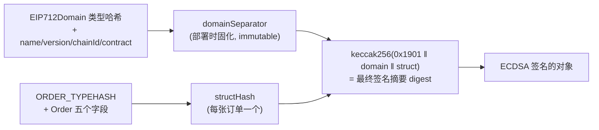

# 第 7 章：EIP-712 签名订单 — 链下撮合的可信根基

> 涉及源码：`src/libraries/EIP712.sol`（主角）、`src/libraries/Types.sol`（ORDER_TYPEHASH、Order 结构体）、`src/libraries/Trading.sol`（_structHash、info 位解析）、`src/MetaNodeExternal.sol`（approveTrade 验签现场）
> 从本章起进入"交易主线"三部曲：第 7 章讲**订单如何变得可信**，第 8 章讲**可信的订单如何被撮合结算**，第 9 章讲**盈亏如何落地**。

---

## 1. 本章导读

### 1.1 一个问题：凭什么链下签的字，链上敢认？

第 2 章的全景图里有一条最关键的"信任凭据"：用户在链下对订单签名，撮合服务器把签名订单递上链，合约验签后照单结算。整座大厦的地基是一行密码学断言：

> **"这份撮合结果里的每张订单，确实出自该用户本人之手，且只在这些条件下有效。"**

本章回答三件事：**签名签的是什么（EIP-712 结构化数据）、怎么防止被挪用（域分隔符三层防重放）、链上怎么验（ecrecover 与 EIP-1271）**。

### 1.2 类比：从"盲签空白纸"到"公证处签合同"

先理解 EIP-712 解决了什么痛点。以太坊最早的签名方式（`eth_sign` / `personal_sign`）本质上是"对一串十六进制字节签名"——**钱包用户看到的是天书**。恶意前端可以让你"确认一条普通消息"，实际签的却是一份授权 transferFrom 全部资产的恶魔合同。这相当于**让你在一张盖住内容的纸上签字**。

EIP-712（Typed Structured Data Signing）的改革是：签名对象变成**带类型声明的结构体**，钱包可以把它渲染成人类可读的表格——你签的是"卖出 1 BTC @30000，3 小时后过期"这样一张**看得懂的委托单**。相当于把签字地点从暗室搬进了公证处。

但"看得懂"只是体验改进，EIP-712 真正的杀手锏是**域分隔符（domainSeparator）**：签名被自动绑死在"某个协议 + 某个版本 + 某条链 + 某个合约"上。类比：合同上加盖了**骑缝章**——"本合同仅限 MetaNode V1 协议、仅限以太坊主网、仅限 0xABC… 这家分行使用"。拿这份签名去别的链、别的协议、别的合约上用，验签必然失败。**签名从"一张纸"变成了"一张带防伪水印的合同"**。

### 1.3 本项目的三层防重放体系（先建地图，后看代码）

| 层 | 机制 | 挡住什么 | 代码位置 |
|---|---|---|---|
| ① 协议域层 | `domainSeparator`（含 chainId + 合约地址） | 签名被拿到**其他链/其他协议**重放 | `MetaNodeStorage` 构造函数 |
| ② 订单内容层 | `Order.perp` 字段（目标市场写进订单本体） | 订单被拿到**同一协议的其他市场**重放 | `Types.Order` |
| ③ 数量账本层 | `orderFilledPaperAmount[orderHash]` 累计 + `info.nonce` | 同一订单被**超额成交/重复提交** | `approveTrade` |

三层层层递进：哪怕攻击者完整偷到签名数据，每一层都堵死一条重放路径。理解这张表，本章的代码就有骨架了。

---

## 2. 架构 / 流程图

### 2.1 签名的诞生与验证：链下三次哈希，链上三次哈希

```mermaid
flowchart TB
    subgraph OFF["链下 · 用户钱包"]
        O["构造 Order 结构体<br/>perp / signer / paperAmount / creditAmount / info"]
        H1["第①次哈希<br/>structHash = keccak256(ORDER_TYPEHASH ‖ 各字段)"]
        H2["第②次哈希（链下 SDK 或合约视角预演）<br/>digest = keccak256(0x1901 ‖ domainSeparator ‖ structHash)"]
        SIG["第③步：私钥对 digest 做 ECDSA 签名<br/>(v, r, s) —— 这就是订单的'公章'"]
        O --> H1 --> H2 --> SIG
    end

    subgraph ON["链上 · approveTrade 内"]
        R1["收到 order + signature"]
        H3["第③次哈希：重算 structHash<br/>Trading._structHash(order)"]
        H4["第④次哈希：重算 digest<br/>EIP712._hashTypedDataV4(domainSeparator, structHash)"]
        REC["ECDSA.tryRecover(digest, signature)<br/>从签名反推出签名人地址"]
        CHECK{"恢复地址 == order.signer<br/>或 == 授权 operator？"}
        F1271["不是 EOA？走 EIP-1271<br/>合约钱包自验签名"]
        OK["验签通过 → 进入撮合"]
        R1 --> H3 --> H4 --> REC --> CHECK
        CHECK -- "否 & signer 是合约" --> F1271 --> OK
        CHECK -- "是" --> OK
    end
```



**核心原理一句话**：链上并不存储任何签名，它做的是**用同样的原料重算一遍哈希，再用 ECDSA 数学（ecrecover）从签名里"提取"出签名者地址**，与订单声明的 `signer` 比对。原料里的任何一粒沙子不同（哪怕一个字段、一条链），哈希就面目全非，签名自然对不上——**防伪的本质是"原料不可篡改地参与了哈希"**。

### 2.2 哈希的"三层套娃"结构



记住这个套娃：**域哈希（一合约一个）套订单哈希（一单一发）得到签名摘要**。外层管"在哪签"，内层管"签了什么"。

---

## 3. 核心代码拆解

### (1) `Order` 结构体与 `ORDER_TYPEHASH`：签名的"正文"与"模板"

```solidity
// src/libraries/Types.sol
bytes32 public constant ORDER_TYPEHASH =
    keccak256("Order(address perp,address signer,int128 paperAmount,int128 creditAmount,bytes32 info)");

struct Order {
    address perp;            // 目标市场——写进签名正文，防跨市场重放（防重放第②层）
    address signer;          // 承担盈亏的人
    int128 paperAmount;      // 正=买/做多，负=卖/做空
    int128 creditAmount;     // 与 paperAmount 异号；price = |credit| / |paper|
    bytes32 info;            // 打包: makerFeeRate | takerFeeRate | expiration | nonce
}
```

**TYPEHASH 为什么必须和结构体逐字段严格对应？** EIP-712 的规范要求：类型哈希 = 对"类型声明的规范字符串"做 keccak256。字段顺序、类型、名字任何一个字节不同，算出的 TYPEHASH 就完全不同，链上链下各自算的 `structHash` 将无法对齐，验签必然失败。**TYPEHASH 就是链下钱包与链上合约之间的"合同模板编号"**——双方必须背同一份模板才能对上暗号。

### (2) `_buildDomainSeparator`：骑缝章的铸造

```solidity
// src/libraries/EIP712.sol
function _buildDomainSeparator(
    string memory name,
    string memory version,
    address verifyingContract
) internal view returns (bytes32) {
    bytes32 hashedName = keccak256(bytes(name));
    bytes32 hashedVersion = keccak256(bytes(version));
    // EIP-712 规定的域类型哈希（固定模板）
    bytes32 typeHash =
        keccak256("EIP712Domain(string name,string version,uint256 chainId,address verifyingContract)");
    return keccak256(abi.encode(
        typeHash, hashedName, hashedVersion,
        block.chainid,          // ← 绑定链：此签名只在本链有效（防重放第①层之一）
        verifyingContract       // ← 绑定合约：只在 Dealer 地址下有效（第①层之二）
    ));
}

// MetaNodeStorage 构造函数里的使用现场：
constructor() Ownable() {
    domainSeparator = EIP712._buildDomainSeparator("MetaNode", "1", address(this));
}
```

**三个设计点**：

- **`block.chainid` 与 `address(this)` 双保险**：跨链重放（同一签名拿到另一条链）和跨合约重放（拿到同链的仿冒合约）都因原料不同而失效。
- **部署时一次性固化、存成 `immutable`**：域分隔符不随状态变化，每次验签读取它是字节码常量而非 SLOAD，省 gas 且不可篡改。
- **name/version 参与**：协议若做 V2 大版本，新合约新域分隔符，旧签名自动作废——版本治理写进了密码学里。

### (3) `_hashTypedDataV4`：最后的封装

```solidity
function _hashTypedDataV4(bytes32 domainSeparator, bytes32 structHash) internal pure returns (bytes32) {
    return ECDSA.toTypedDataHash(domainSeparator, structHash);
}
// 等效于 keccak256(abi.encodePacked("\x19\x01", domainSeparator, structHash))
```

`\x19\x01` 是 EIP-712 规定的固定前缀，作用是让"结构化数据签名"与 EIP-191 个人消息等其他签名格式**在哈希空间上隔离**——同一份数据用不同格式签名，得到的摘要不同，无法互相伪造。一行前缀，一个签名命名空间。

### (4) `_structHash`：一段值得逐行啃的汇编

```solidity
// src/libraries/Trading.sol
function _structHash(Types.Order memory order) internal pure returns (bytes32 structHash) {
    bytes32 orderTypeHash = Types.ORDER_TYPEHASH;
    assembly {
        let start := sub(order, 32)      // order 指针往前退一个字：结构体内存头的前一格
        let tmp := mload(start)          // 备份那格原有的值（结构体内存头的长度字段）
        mstore(start, orderTypeHash)     // 把 TYPEHASH 临时"插队"写到结构体正前方
        structHash := keccak256(start, 192)  // 192 = (1个TYPEHASH + 5个字段) × 32 字节
        mstore(start, tmp)               // 恢复内存（Flush 后不留下脏数据）
    }
}
// 高级写法的等效版本（可读性更好，gas 略高）：
// keccak256(abi.encode(ORDER_TYPEHASH, order.perp, order.signer,
//                      order.paperAmount, order.creditAmount, order.info))
```

**作者为什么这么设计？** `abi.encode` 版本要把结构体字段逐个拷贝、重新排布内存，多花几百 gas。汇编版利用了一个事实：Solidity 的结构体在内存里是**连续的字段槽**，直接把 TYPEHASH 写到它前面，一次性对 192 字节做 keccak256，**零拷贝完成哈希**，然后恢复被借用的那格内存。这是"内存布局知识 + gas 敏感"的典型优化——**读懂它需要先懂 Solidity 内存模型**（memory 指针指向数据区、头部有长度字），是本项目汇编含金量最高的一段。仿写时务必像原作者一样恢复内存，否则会污染后续逻辑。

### (5) `info` 位域打包：一个 bytes32 当四个字段用

```solidity
// src/libraries/Trading.sol（解析方向）
function _info2MakerFeeRate(bytes32 info) internal pure returns (int256) {
    return int256(int64(uint64(uint256(info) >> 192)));   // 最高 64 位：maker 费率（负数=返佣）
}
function _info2TakerFeeRate(bytes32 info) internal pure returns (int256) {
    return int256(int64(uint64(uint256(info) >> 128)));   // [128,192) 位：taker 费率
}
function _info2Expiration(bytes32 info) internal pure returns (uint256) {
    return uint256(uint64(uint256(info) >> 64));          // [64,128) 位：过期时间戳
}
// [0,64) 位：nonce —— 防重放第③层的"订单身份证号"

/*
 内存布局（源码注释原版）：
 ╔═══════════════════╤═════════╗
 ║ makerFeeRate      │ int64   ║  [192,256)
 ║ takerFeeRate      │ int64   ║  [128,192)
 ║ expiration        │ uint64  ║  [64,128)
 ║ nonce             │ uint64  ║  [0,64)
 ╚═══════════════════╧═════════╝
*/
```

**为什么打包？** 四个独立字段若分开存/签，Order 结构体从 5 个字变 8 个字：**签名数据更大（链下传输）、哈希更贵（链上计算）、ABI 解码更贵（链上调用）**。一个 bytes32 全包，所有字段随签名整体不可拆改——**打包即防篡改**：想改过期时间？整张订单哈希变了，签名作废。代价是可读性（ hence 需要这一组移位解析函数）和 64 位上限（int64 费率、uint64 时间戳，用到 2106 年以后完全够）。

### (6) 验签现场：`approveTrade` 的密码学分诊

```solidity
// src/MetaNodeExternal.sol（节选）
bytes32 orderHash = EIP712._hashTypedDataV4(domainSeparator, Trading._structHash(order));
orderHashList[i] = orderHash;                    // 哈希顺路存下，防超额成交要用

(address recoverSigner,) = ECDSA.tryRecover(orderHash, signatureList[i]);  // 从签名提取地址
// 分诊 ①：EOA 直签 或 授权 operator 代签？
if (recoverSigner != order.signer && !state.operatorRegistry[order.signer][recoverSigner]) {
    // 分诊 ②：signer 是合约钱包 → EIP-1271 由合约自己判断签名真伪
    if (Address.isContract(order.signer)) {
        require(
            IERC1271(order.signer).isValidSignature(orderHash, signatureList[i]) == 0x1626ba7e,
            Errors.INVALID_ORDER_SIGNATURE      // 0x1626ba7e 是 EIP-1271 规定的"有效"魔数
        );
    } else {
        revert(Errors.INVALID_ORDER_SIGNATURE); // 纯 EOA 却验不过 → 直接拒绝
    }
}
```

**两条分诊路径各对应一种账户**：EOA（普通钱包）用 ecrecover 数学验签；合约钱包（如 Safe 多签、 argent）没有私钥、无法产出标准 ECDSA 签名，EIP-1271 允许**把验签请求转交给合约自己**——它返回魔数 `0x1626ba7e` 即认可。这体现了 EVM 生态的账户抽象演进：**验签标准必须同时服务"有私钥的人"和"没私钥的合约"**。

另一个细节：用 `tryRecover` 而非 `recover`——遇到格式非法的签名返回 `address(0)` 而不是直接 revert，让后续分支统一处理，避免"恶意构造的签名导致整批订单异常回滚"的不一致。

### (7) 防重放第②③层：订单哈希的"人口登记"

```solidity
// approveTrade 内（续）
require(order.perp == msg.sender, Errors.PERP_MISMATCH);   // 订单声明市场 == 当前分行
...
state.orderFilledPaperAmount[orderHash] += matchPaperAmount[i];  // 累计成交量
require(state.orderFilledPaperAmount[orderHash] <= int256(order.paperAmount).abs(),
        Errors.ORDER_FILLED_OVERFLOW);                 // 累计不超订单总量
```

`orderHash` 包含了 `perp` 与 `info`（含 nonce），因此它是**全网唯一的订单身份证**。三个检查构成漏斗：哈希不在本市场 → 拒；身份证已登记的成交量累计超限 → 拒；nonce 重复 → 哈希相同 → 走同一本"已成交量"账，天然防重复提交。**用内容哈希当主键，是链上"幂等记账"的通用模式**。

### (8) 限价藏在订单里：`price = |credit| / |paper|`

```solidity
// 订单合法性的价格前提（approveTrade 内）：
require(
    (order.paperAmount < 0 && order.creditAmount > 0) ||   // 卖单：付 paper 收 credit
    (order.paperAmount > 0 && order.creditAmount < 0),     // 买单：付 credit 收 paper
    Errors.ORDER_PRICE_NEGATIVE
);
```

订单**没有显式 price 字段**，限价就是 `creditAmount/paperAmount` 这对异号数的比值——"卖 1 BTC 收 30000e6"与"买 1 BTC 付 30000e6"是同一张订单的两个视角。这个设计把方向、数量、限价压缩进两个 int128，也让第 8 章 `_priceMatchCheck` 的撮合规则（以 Maker 价成交、Taker 价兜底）有了纯粹的数学表达。

### (9) 链下签名视角：钱包里到底发生了什么

```text
// 链下 JavaScript（示意，非项目源码）：
const domain = { name: "MetaNode", version: "1", chainId: 1,
                 verifyingContract: "0xDealer地址" };
const types  = { Order: [
    { name: "perp",         type: "address" },
    { name: "signer",       type: "address" },
    { name: "paperAmount",  type: "int128" },
    { name: "creditAmount", type: "int128" },
    { name: "info",         type: "bytes32" }]};
const value  = { perp: ..., signer: user, paperAmount: 1e18,
                 creditAmount: -30000e6, info: packedInfo };
const signature = await signer.signTypedData(domain, types, value);  // 钱弹窗展示结构化表格
```

**这份 JS 与链上代码是"模板的两半"**：domain 与 types 必须与 `_buildDomainSeparator`、`ORDER_TYPEHASH` 的字符串逐字符一致。任何一端改了模板而不同步另一端，验签全线失效——所以生产项目会把 TYPEHASH 字符串写进共享测试，链上链下双向断言。阅读本项目时可以对照 `script/` 或前端仓库找这"另一半"。

### (10) 设计总复盘：为什么不用"链上挂单簿"

| 维度 | 链上挂单簿（AMM 之外的订单簿） | 签名订单 + 链下撮合（本项目） |
|---|---|---|
| 挂单/撤单 | 每笔都是交易，费时费钱 | 免费（纯链下） |
| 撮合延迟 | 受出块时间限制 | 服务器毫秒级 |
| 抢跑/夹击 | 内存池公开挂单，被 MEV 盯上 | 订单不上内存池，撮合后才上链 |
| 信任需求 | 无（全自动） | 撮合服务器有"挑单/延迟"权力，但**动不了钱** |

签名订单模式的本质：**把"高频、易变、公开有害"的信息留在链下，只把"低频、确定、可验证"的成交结果推上链**。用户失去的只是"挂单必然被执行"的保证，换来的是零 gas 挂单与 MEV 隐蔽性——对高频交易者，这笔交易通常划算。

---

## 4. Web3 特有机制

1. **`ecrecover`（预编译合约 1 号）**：从 `(hash, v, r, s)` 恢复出签名人地址，gas 仅 3000。它是链上身份验证的最底层原语——**没有用户名密码，只有"谁能签出这个签名"**。
2. **签名可塑性（Malleability）**：ECDSA 签名 `(r, s)` 与 `(r, n−s)` 都合法——同一订单存在两个"等效"签名。OpenZeppelin 的 `ECDSA` 库已强制 s 处于半区间（EIP-2 规则）来消除此歧义，否则"已用签名"去重逻辑可能被绕过。**使用任何签名库前先确认它处理了 malleability**。
3. **EIP-1271 合约验签**：`isValidSignature(hash, sig) == 0x1626ba7e` 魔数。它让多签/智能钱包能参与签名经济，但也意味着"验签正确性"外包给了 signer 合约——审计时要检查本协议对 signer 合约的额外信任假设。
4. **`immutable` + 构造期哈希**：`domainSeparator` 部署时算好、写进字节码。对比每次验签重算（多花数千 gas），是"永不变量"的最佳实践。
5. **keccak256 与内存布局的亲密关系**：`_structHash` 的汇编证明——链上 gas 优化的上限，取决于你对 EVM 内存模型（free memory pointer、字对齐）的理解深度。这类优化属于"读得懂、慎模仿"级别。
6. **域分隔符与链分叉（fork）**：本项目在**部署时**读取 `block.chainid` 固化进域分隔符。若未来发生链分叉且分叉链改了 chainId，固化的旧 chainId 反而"不分叉"——两边的 Dealer 域分隔符相同，理论上签名可跨分叉重放（主流做法是在**验签时**动态引用 `block.chainid`，或部署后校验）。这是本章最值得记住的一个安全边界，详见踩坑第 1 条。

---

## 5. 本章小结与思考题

### 5.1 核心知识点回顾

- **EIP-712 = 可读的结构化签名 + 域分隔符防伪**：把用户从"盲签字节"解放为"签看得懂的委托单"，且签名绑死协议/版本/链/合约。
- **三层防重放**：域分隔符（跨链/跨协议）→ `Order.perp`（跨市场）→ `orderFilledPaperAmount` + nonce（超额/重复）。
- **哈希套娃**：TYPEHASH + 字段 → structHash；domainSeparator + structHash → digest；ECDSA 签 digest。链上验签 = **重算哈希 + ecrecover + 比对**。
- **info 位域打包**：费率/过期/nonce 塞进一个 bytes32，gas、传输、防篡改三赢。
- **双账户体系兼容**：EOA 走 ecrecover，合约钱包走 EIP-1271 魔数。

### 5.2 思考题

1. **假设把 `Order.perp` 字段从结构体中删掉**（订单不声明目标市场），第②层防重放消失。请设计一个具体的攻击获利路径：攻击者在 A 市场（比如流动性差的山寨市场）截获用户签名订单后，如何在 B 市场重放它？（提示：两市场的 `fundingRate` 与标记价格完全不同，同一订单在 B 市场结算出的 credit 是按什么价格折算的？由此体会"perp 字段把订单与市场的价格语境绑死"的深意。）
2. **`info.nonce` 与 `expiration` 都在防"旧订单复活"**，但它们防的场景不同。请分别构造场景说明：a) 只靠 expiration 不够；b) 只靠 nonce 不够。（提示：a 想想"过期前无限次重复提交同一单"；b 想想"长期有效订单的批量提交"。）想通后你会发现两者组合覆盖了"同一订单的时间维度"与"订单族的空间维度"。

---

## 6. 踩坑提示

1. **域分隔符固化 chainId 的分叉隐患**：如 4.6 所述，本项目的 `domainSeparator` 在部署时嵌入 `block.chainid`。绝大多数情况下这没问题（chainId 不会变），但**共识分叉**场景（如经典 DAO 分叉、潜在的重放战役）下，两侧若都沿用原 chainId，签名可跨分叉重放。更稳的模式是验签时动态拼 `block.chainid`（OpenZeppelin 5.x 的 `EIP712` 合约即如此）。学习时理解这两种取舍：**省 gas（固化）vs 分叉韧性（动态）**。
2. **TYPEHASH 字符串是"契约级"常量**：改动 `Order` 结构体字段顺序/类型/命名而不同步 TYPEHASH 字符串与链下 SDK，验签会以最迷惑的方式失败（报"签名无效"而非"模板不一致"）。任何签名相关改动，先跑一遍"链下签→链上验"的端到端测试。
3. **`tryRecover` 返回 `address(0)` 不是"零地址用户"**：它是"签名非法"的哨兵值。后续判断必须先排除零地址，本项目通过 `recoverSigner != order.signer` 的比对天然规避了（正常 signer 不会是零地址），但仿写时若用零地址做特殊语义就会踩雷。
4. **`info` 的 64 位 expiration 是 UTC 秒，不是区块号**：链下生成订单时用 `Math.floor(Date.now()/1000)`，若误传毫秒，订单"永不过期"（数值大到永远不会小于当前时间戳）——这不是安全漏洞但会让废弃订单长期可成交，属于高频出现的真实事故。
5. **EIP-1271 信任是外包的**：合约钱包返回魔数即通过，但**那个合约是否安全与本项目无关**。恶意的"签名器合约"可以让任何人冒充它下单——不过盈亏也由它自己承担，属于"自担风险"而非协议漏洞。评估协议时要把这类信任记录在案。

---

> 下一章预告（第 8 章）：签名订单如何被撮合成账本变化——`_matchOrders` 的 Taker/Maker 模型、Maker 价格成交与 Taker 限价保护、手续费分配，以及 `approveTrade` 到 `_settle` 的完整接力。
