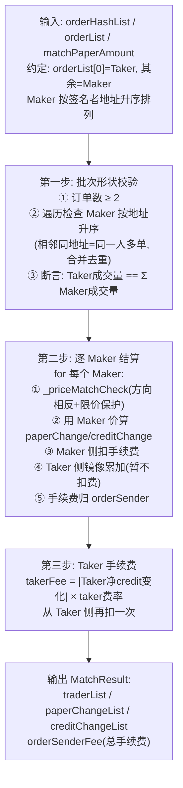
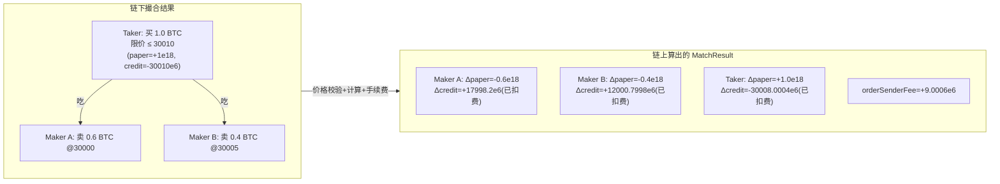

# 第 8 章：撮合成交全流程 — trade() 函数与 approveTrade 验证链路

> 涉及源码：`src/MetaNodeExternal.sol`（approveTrade）、`src/Perpetual.sol`（trade）、`src/libraries/Trading.sol`（_matchOrders、_priceMatchCheck，本章主角）
> 第 7 章解决了"订单可信"，本章解决"订单如何变成账本变化"：一张 Taker 单怎么和若干 Maker 单配对、按什么价格成交、手续费怎么分、结果怎么写进 paper/credit。

---

## 1. 本章导读

### 1.1 类比：菜市场里的"吃单者"与"摊主"

理解撮合模型只需要一个菜市场的画面：

- **Maker（挂单方）**：像**摆摊的摊主**，先立好牌子——"白菜 3 元/斤，共 100 斤"。挂单不着急成交，等人来买。本项目里 Maker 订单就是那张 EIP-712 签名：数量、限价、过期时间都写死了。
- **Taker（吃单方）**：像**拎着购物篮的顾客**，我现在就要，直接把摊上符合我心意的菜全部买走。Taker 订单也有限价（"白菜高于 3.1 元我就不买"），它是**保护线**，不是成交价。
- **成交价用谁的？** 用**摊主（Maker）的标价**。顾客按摊主的牌价付款；如果买了两个摊的菜，就分别按两个摊的价付。Taker 的限价只用来把"太贵的摊"直接排除在外。
- **手续费给谁？** 给**撮合服务器（orderSender）**——它是在链上递单的"市场管理员"，每一方按成交额交一点"摊位费"。

本项目的一个撮合批次（一笔链上交易）的固定形状是：**1 个 Taker + ≥1 个 Maker**，Taker 的成交量必须恰好等于所有 Maker 成交量之和（顾客买的斤数 = 各摊卖出的斤数之和，不许多也不许少——"找零"在链下由服务器提前算好）。

### 1.2 本章要回答的四个问题

1. 链上如何验证"这批撮合结果的**形状**是合法的"（数量守恒、排序、去重）？
2. **价格匹配**的数学判据是什么，Taker 限价如何被强制执行？
3. 每个参与者的 paper/credit 变化和手续费是怎么**逐项算出来**的？
4. 算完之后，结果如何**接力**给 Perpetual 落账、再被风控终审？

### 1.3 全链路鸟瞰（与第 3 章时序图配合看）

```
orderSender                Perpetual                 Dealer(Trading库)
   │ trade(tradeData)          │                          │
   ├──────────────────────────►│                          │
   │                           ├─ approveTrade ──────────►│ 验签(第7章)
   │                           │                          ├─ 校验批次形状(数量守恒/排序)
   │                           │                          ├─ 逐Maker价格匹配
   │                           │                          ├─ 计算各方Δpaper/Δcredit/手续费
   │                           │◄─ MatchResult ───────────┤
   │                           ├─ 循环 _settle() 落账       │
   │                           ├─ realizePnl(若平光) ─────►│
   │                           ├─ isAllSafe 终审 ─────────►│
   │                           │ 交易成立                   │
```

记住这个接力棒顺序：**Dealer 只算不改账，Perpetual 只改账不判断，风控在最后**。每一棒职责单一，这是理解撮合安全性的框架。

---

## 2. 架构 / 流程图

### 2.1 `_matchOrders` 内部三步曲



### 2.2 数值实例总览：一笔两 Maker 的真实撮合



> 全部数字在 3.4–3.6 节逐步笔算，费率假设：Maker 费率 0.01%（1e14），Taker 费率 0.02%（2e14）。Taker 实际均价 30008.0004 ≤ 限价 30010，限价保护生效。

---

## 3. 核心代码拆解

### (1) 入口接力：`tradeData` 的"包裹格式"

```solidity
// src/Perpetual.sol → Dealer.approveTrade 内
(Types.Order[] memory orderList,      // 订单数组: [Taker, Maker1, Maker2...]
 bytes[] memory signatureList,        // 与订单一一对应的签名
 uint256[] memory matchPaperAmount    // 每张订单本次的成交量(paper 数量)
) = abi.decode(tradeData, (Types.Order[], bytes[], uint256[]));
```

链下撮合服务器把"订单 + 签名 + 成交量"三个**平行数组**打包成一个 `bytes` 递上链。三个数组同下标一一对应——这是 EVM 上传递"结构体数组"的省 gas 变体（避免每项打包成新结构体再解码）。**注意语义**：`matchPaperAmount` 允许部分成交（Maker 单可以分好几次吃），链上会累加校验总额。

### (2) 第一步：批次形状校验（数量守恒 + 排序 + 去重）

```solidity
// src/libraries/Trading.sol → _matchOrders
require(orderList.length >= 2, Errors.INVALID_TRADER_NUMBER);   // 至少 Taker+1个Maker
uint256 uniqueTraderNum = 2;
uint256 totalMakerFilledPaper = matchPaperAmount[1];

for (uint256 i = 2; i < orderList.length;) {
    totalMakerFilledPaper += matchPaperAmount[i];
    if (orderList[i].signer > orderList[i - 1].signer) {
        uniqueTraderNum = uniqueTraderNum + 1;       // 地址变大 → 新交易者
    } else {
        // 不是更大就必须相等: 同一人的多张单必须相邻
        require(orderList[i].signer == orderList[i - 1].signer, Errors.ORDER_WRONG_SORTING);
    }
    unchecked { ++i; }
}
// 铁律: Taker 吃到的总量 == 所有 Maker 卖出的总量
require(matchPaperAmount[0] == totalMakerFilledPaper, Errors.TAKER_TRADE_AMOUNT_WRONG);
```

**三个校验各挡一种作弊**：

- **数量守恒**：没有这条，撮合结果可以"凭空创造/吞噬"仓位——这是记账系统的守恒律，相当于会计的借贷平衡。
- **地址升序 + 同者相邻**：这不是美观要求，而是为**去重合并**服务——同一交易者的多张 Maker 单在结果里必须合并成一条 Δpaper/Δcredit（不然 `MatchResult` 里同一地址出现多次，`_settle` 会对同一人多次记账）。链下按地址排序，链上只**校验**排序结果——**计算在链下、断言在链上**的又一例。
- **订单数下限**：1 个 Taker 至少要吃 1 张 Maker，防退化输入。

### (3) 价格匹配：`_priceMatchCheck` 的交叉相乘判据

```solidity
function _priceMatchCheck(Types.Order memory takerOrder, Types.Order memory makerOrder) private pure {
    int256 temp1 = int256(makerOrder.creditAmount) * int256(takerOrder.paperAmount);
    int256 temp2 = int256(takerOrder.creditAmount) * int256(makerOrder.paperAmount);

    if (takerOrder.paperAmount > 0) {          // Taker 买入
        require(makerOrder.paperAmount < 0, Errors.ORDER_PRICE_NOT_MATCH);  // 对手必须卖出
        require(temp1 <= temp2, Errors.ORDER_PRICE_NOT_MATCH);              // Maker价 ≤ Taker限价
    } else {                                    // Taker 卖出
        require(makerOrder.paperAmount > 0, Errors.ORDER_PRICE_NOT_MATCH);
        require(temp1 >= temp2, Errors.ORDER_PRICE_NOT_MATCH);
    }
}
```

**判据推导**（源码注释里有完整版）：买入 Taker 的诉求是"Maker 的卖价 ≤ 我的买限价"，即

$$\frac{makerCredit}{|makerPaper|} \le \frac{|takerCredit|}{|takerPaper|}$$

两边均为正数，交叉相乘消去除法：`makerCredit × takerPaper ≤ takerCredit × makerPaper`（注意符号在两边同负抵消）。**交叉相乘的妙处**：避免定点数除法，精度零损失，且天然处理整数溢出边界（0.8.x 下溢出即 revert，宁可失败不可算错）。这份"用乘法代替除法比较价格"的写法在第 3 章 `liquidate` 的价格保护里见过同款——本项目把这条技巧贯彻得很一致。

### (4) Maker 侧成交计算：按"摊主标价"结算

```solidity
// 方向: paperChange 的符号与 Maker 订单方向一致, 大小=本次成交量
int256 paperChange = orderList[i].paperAmount > 0
    ? SafeCast.toInt256(matchPaperAmount[i])       // Maker 是买方(开多)
    : -1 * SafeCast.toInt256(matchPaperAmount[i]); // Maker 是卖方(开空)

// 按_maker自己的订单价格折算资金变化: Δcredit = Δpaper × (credit/paper)
int256 creditChange = (paperChange * orderList[i].creditAmount) / orderList[i].paperAmount;
```

逐字读懂这两行，撮合就通了一大半：

- **符号**：Maker A 的订单是卖单（`paperAmount=-1e18`），本次成交 0.6 BTC → `paperChange = -0.6e18`（卖出后持仓更空）。
- **价格**：`creditAmount/paperAmount = 30000e6 / -1e18`，就是这张单**自己声明的单价**（异号所以商为负价——30000/1 的负表达）。于是 `creditChange = (-0.6e18) × (30000e6/-1e18) = +18000e6`：卖出 0.6 BTC，**收进 18000 USDC**。
- **为什么用 Maker 价？** 成交价由"先挂单者"锁定，Taker 的限价只兜底。这让价格来源**完全可复现**（纯函数，不依赖服务器良心），服务器唯一的自由度是"选哪些单来配"，而选单的每种组合都会被限价校验。

### (5) Maker 手续费：扣在 Maker 侧，返佣也支持

```solidity
int256 fee = SafeCast.toInt256(creditChange.abs()).decimalMul(_info2MakerFeeRate(orderList[i].info));
emit OrderFilled(orderHashList[i], orderList[i].signer, msg.sender,
                 paperChange, creditChange - fee, serialNum, fee);
// Maker 净变化 = creditChange - fee；fee 归撮合引擎
result.paperChangeList[currentTraderIndex] += paperChange;
result.creditChangeList[currentTraderIndex] += creditChange - fee;
result.paperChangeList[0] -= paperChange;      // Taker 镜像：方向相反、数量相同
result.creditChangeList[0] -= creditChange;    // 注意：镜像的是"未扣费"的 creditChange
result.orderSenderFee += fee;
```

四个累加方向构成一个**零和骨架**（手续费除外）：

- Maker 之间各自记自己的变化；
- Taker 对每个 Maker 的变化做**镜像**（我买的 = 你卖的，我付的 = 你收的）；
- 手续费从 Maker/Taker 侧扣除后汇入 `orderSenderFee`。

**注意镜像用的是未扣费的 `creditChange`**：撮合层面的对手盘交换是完整金额，手续费是**每个参与者单独另付**的——这样"价格守恒"与"费用归集"两条线互不干扰，账目清晰。

**负费率 = 返佣**：`makerFeeRate` 是 int64，可以为负——`creditChange - fee` 中 fee 为负时等于给 Maker 加钱（撮合引擎倒贴钱抢流量）。这是 CEX "maker 返佣"营销的原生支持，由订单签名锁死，链上无需信任。

### (6) 同人多单合并：去重索引的运转

```solidity
if (i >= 2 && orderList[i].signer != orderList[i - 1].signer) {
    currentTraderIndex = currentTraderIndex + 1;               // 新交易者 → 结果数组开新位
    result.traderList[currentTraderIndex] = orderList[i].signer;
}
...
result.paperChangeList[currentTraderIndex] += paperChange;     // 同一人的多张单累加到同一位
```

因为第一步已保证"同地址的订单相邻"，这里只需一个游标 `currentTraderIndex`：地址变了才前进一格，没变就在原位累加。**排序（链下）+ 相邻判断（链上）= 免去哈希表的 O(n) 去重**——链上做不了高效的 map，就用"约定输入有序"来绕，这是 EVM 算法的经典妥协。

### (7) Taker 手续费与事件

```solidity
// 第三步: 基于扣费前的 Taker 净 credit 变化计费
int256 takerFee = SafeCast.toInt256(result.creditChangeList[0].abs())
                      .decimalMul(_info2TakerFeeRate(orderList[0].info));
result.creditChangeList[0] -= takerFee;     // Taker 再付自己的费
result.orderSenderFee += takerFee;

emit OrderFilled(orderHashList[0], orderList[0].signer, msg.sender,
                 result.paperChangeList[0], result.creditChangeList[0],
                 state.positionSerialNum[orderList[0].signer][msg.sender], takerFee);
```

每张订单（无论 Taker/Maker）都发一枚 `OrderFilled` 事件，携带**最终净变化与手续费**：链下交易所历史、用户对账单、前端 K 线全部靠它。`positionSerialNum` 把成交归属到"第几段仓位生涯"（第 5、6 章的轮次号在此消费），链下能精确画出每段仓位的开平明细。

### (8) 回到 Dealer：手续费落账与撮合员风控

```solidity
// MetaNodeExternal.approveTrade 末尾
Types.MatchResult memory result = Trading._matchOrders(state, orderHashList, orderList, matchPaperAmount);

state.primaryCredit[orderSender] += result.orderSenderFee;   // 手续费记给撮合引擎
if (result.orderSenderFee < 0) {                              // 费率为负 = 撮合员倒贴钱
    require(Liquidation._isSolidIMSafe(state, orderSender), Errors.ORDER_SENDER_NOT_SAFE);
}
return (result.traderList, result.paperChangeList, result.creditChangeList);
```

**为什么负手续费还要做风控检查？** 返佣场景下撮合员"付费买成交"，如果它自己是个负债账户，这笔倒贴会让它更接近穿仓——协议要求"付得起的人才许付"。细节虽小，体现了**"任何资金流出方向的变化都要过风控"**的偏执，正是这种偏执把系统兜死。

### (9) 交给 Perpetual：MatchResult 的消费端

```solidity
// src/Perpetual.sol → trade()（第 3 章讲过，本章看数据视角）
(traderList, paperChangeList, creditChangeList) = IDealer(owner()).approveTrade(msg.sender, tradeData);
for (uint256 i = 0; i < traderList.length;) {
    _settle(traderList[i], paperChangeList[i], creditChangeList[i]);  // 逐人落账+锚点反推
    unchecked { ++i; }
}
require(IDealer(owner()).isAllSafe(traderList), "TRADER_NOT_SAFE");   // 终审
```

`MatchResult` 的三个平行数组与 `trade` 的循环严格同构——**Dealer 产出的格式就是 Perpetual 消费的格式**，接口 `IDealer` 是两合约间的"传送带截面"。`_settle` 里会发生本章主角们的最后一幕：锚点反推（第 6 章）、新仓登记/平仓兑现（`openPosition`/`realizePnl`）。最后 `isAllSafe` 对**本次所有参与者**做净值终审，任何一方不健康则整笔 revert——撮合结果与账本更新在同一个原子事务里，不存在"成交了但没记账"的中间态。

### (10) 数值实例全笔算（对照 2.2 的图）

费率假设：maker 费率 1e14（0.01%），taker 费率 2e14（0.02%）。

- **Maker A**（卖 0.6 BTC @30000）：
  - `paperChange = -0.6e18`；
  - `creditChange = (-0.6e18 × 30000e6) / (-1e18) = +18000e6`；
  - `fee = |18000e6| × 1e14 / 1e18 = 1.8e6`；
  - **净 credit = +17998.2e6**（收 17998.2 USDC）。
- **Maker B**（卖 0.4 BTC @30005）：
  - `paperChange = -0.4e18`；
  - `creditChange = +12002e6`；`fee = 1.2002e6`；
  - **净 credit = +12000.7998e6**。
- **Taker**（买 1 BTC，限价 30010）：
  - `paperChangeList[0] = +0.6e18 + 0.4e18 = +1e18`；
  - 扣费前 `creditChangeList[0] = -(18000 + 12002)e6 = -30002e6`（镜像 Maker 的**未扣费**金额）；
  - `takerFee = 30002e6 × 2e14 / 1e18 = 6.0004e6`；
  - **净 credit = -30008.0004e6**。实付均价 30008.0004 ≤ 限价 30010 ✔
- **orderSenderFee** = 1.8 + 1.2002 + 6.0004 = **9.0006e6**（约 9 USDC）。
- **守恒验算**：paper 侧 ΣΔ = -0.6 - 0.4 + 1.0 = 0 ✔；credit 侧（不含手续费）ΣΔ = 18000 + 12002 - 30002 = 0 ✔；手续费 9.0006 从交易者侧流出、进入 orderSender——**除了摩擦，无人凭空得利**。

---

## 4. Web3 特有机制

1. **纯函数撮合与链上可复现性**：`_matchOrders` 是 `internal pure`（除了读 serialNum/发事件，计算部分不依赖可变状态）——同一批输入永远得到同一结果。**"结算结果不信任服务器，只信任数学"**是链下撮合模式的安全根基。
2. **用 require 断言链下计算的先决条件**：排序、守恒、价格匹配全部以 `require` 校验而非重新计算。合约像一位只验货不生产的车间主任——这是"Optimistic 验证"的最朴素形态：默认链下是对的，但每一条都对得上才能通过。
3. **整数除法的取整归属**：`creditChange = paperChange × credit / paper` 向零取整，微小零头可能让 Maker 少收/Taker 少付（随符号而定）。单笔最多损失 1 个最小单位，但高频对账时**必须用与合约一致的取整规则**复现数字。
4. **`unchecked` 循环与游标**：`_matchOrders` 两段循环都用 `unchecked { ++i; }`；`currentTraderIndex` 游标靠有序输入保证正确——性能敏感代码里"有序性换数据结构"是常见交换。
5. **事件即成交记录**：`OrderFilled` 带 `indexed` 的 orderHash/trader/perp，链下可以按三个维度高效检索。注意事件里发的是**净变化（已扣费）**，与链下撮合预览可能有费差——对账系统要以事件为准。
6. **原子性终审**：`isAllSafe` 失败回滚整笔交易，包括 Dealer 侧已写的手续费记账。EVM 的事务边界天然保证"撮合、落账、风控"三者要么全发生、要么全没发生，这是链上结算相对传统结算（T+N 清算）的根本优势。

---

## 5. 本章小结与思考题

### 5.1 核心知识点回顾

- **批次形状**：1 Taker + N Maker，Taker 量 == Σ Maker 量（守恒律），Maker 按签名者地址升序、同人相邻。
- **价格规则**：按 **Maker 订单自身价格**成交，Taker 限价用交叉相乘判据强制兜底；无显式价格字段，价格藏在异号字段对里。
- **手续费**：Maker 费逐张扣在 Maker 侧、Taker 费按净变化扣，全部归 `orderSenderFee`；负费率原生支持返佣，且撮合员倒贴时需通过 IM 风控。
- **接力结构**：Dealer 算（MatchResult）→ Perpetual 落账（_settle 循环）→ Dealer 终审（isAllSafe），三段在一个原子事务里。
- **零和 + 摩擦**：除手续费外所有 paper/credit 变化严格镜像对消。

### 5.2 思考题

1. **为什么成交价用 Maker 订单的价格，而不是让撮合服务器定一个"双方各让一步"的中间价？** 从四个角度论证：(a) 纯函数可复现性——链上如何校验一个"中间价"；(b) 限价语义——Taker 签名里承诺的是什么；(c) 信任最小化——服务器自由度缩小到哪个维度；(d) 与传统交易所 price-time priority 的对照。想清楚后你会明白"服务器的全部权力 = 挑单 + 排序 + 定量"，一分不多。
2. **`matchPaperAmount[0] == totalMakerFilledPaper` 强制"整批精确对消"**。如果不做这个校验（允许 Taker 少吃一点，剩余 Maker 变化按比例缩水），代码哪里会先出问题——是守恒被破坏，还是后续 `_priceMatchCheck` 失去意义？反过来推：这个校验让链下撮合服务器承担了什么额外责任（提示：部分成交的"找零"必须在链下一次性算干净）？

---

## 6. 踩坑提示

1. **排序是协议契约不是建议**：链下撮合器必须按 `signer` 地址**升序**排列 Maker（且同人相邻），否则 `ORDER_WRONG_SORTING` 让整笔交易 revert。自己实现撮合引擎时，把排序写进单测；跨语言实现（Go/Rust 撮合器）注意地址比较大小的字典序规则要与 EVM 的 bytes20 一致（大端字节序比较）。
2. **自成交防护的已知缝隙**（第 3 章提过，本章补全上下文）：`approveTrade` 只检查 Maker 的 signer ≠ Taker 的 signer，但**不同 Maker 之间**没有防同签者检查——同一人可以在一批撮合里放两张 Maker 单互相"对敲"（第 6 章的合并逻辑还会把它们合并到一个交易者头上，但两单之间的 credit 流向仍是零和的自买卖）。可用来刷交易量/制造虚假成交记录，难以直接套利，但审计报告里应如实记录。
3. **镜像金额与扣费金额的差异是"特性"**：Taker 镜像的是 Maker 未扣费金额，Maker 实收是扣费后金额——中间的差全部进了 orderSenderFee。链下做盈亏分析时，若用"对手方变化"推导自己的变化，必须把手续费补回去，否则差一个费率的账。
4. **`creditChange` 的除法分母是订单自身的 `paperAmount`**：它因"异号校验"恒非零，不会除零；但若有人仿写撮合时删掉了异号校验，这里会立即变成除零 revert。**前置校验是后续算术的安全网**，删校验的连锁后果往往出现在很远的地方。
5. **`trade()` 无权限 + `tradeData` 可见性**：任何人都能调用 trade()，撮合结果在 mempool 里公开——orderSender 的交易可能被抢单（看到别人提交的 tradeData 后抢先提交）。由于手续费记给参数 `orderSender` 而非 `msg.sender`，抢单者拿不到手续费但能复现结果，实际动机有限；不过这正是**私有 mempool/批量拍卖**等撮合提交策略的存在理由，链下工程团队需要考虑。

---

> 下一章预告（第 9 章）：盈亏的兑现与减仓——realizePnl 如何把分行账本的残值落到总行保证金，reducedCredit 锚点重写与已实现盈亏的关系，以及"浮盈能不能提走"这个经典问题的链上答案。
