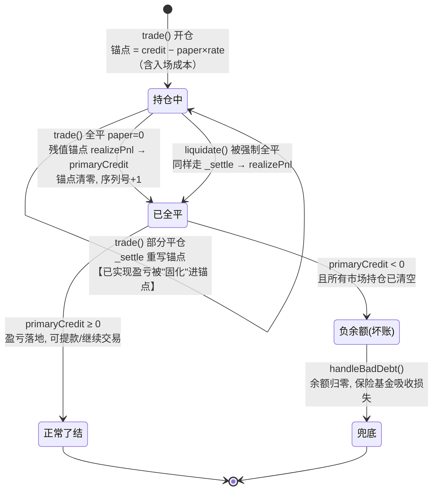
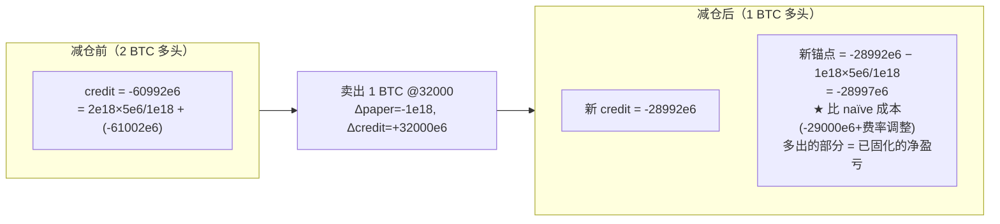

# 第 9 章：PnL 盈亏结算与减仓 — realizePnl 与 reducedCredit 的残值兑现机制

> 涉及源码：`src/Perpetual.sol`（_settle 尾部的兑现分支）、`src/libraries/Position.sol`（_openPosition/_realizePnl）、`src/libraries/Liquidation.sol`（handleBadDebt、requestLiquidation 保险费）、`src/MetaNodeView.sol`（getCreditOf）
> 本章回答一个每个交易者都关心、每个记账系统都必须回答的问题：**"我赚的钱，什么时候、以什么形式变成'真钱'？"** 以及它的镜像问题：**"我亏的钱，最坏会以什么形式由谁承担？"**

---

## 1. 本章导读

### 1.1 类比：浮盈是"纸面数字"，落袋才是"银行卡余额"

炒股的人都懂这个区别：

- 持有期间账户显示"浮动盈利 5000 元"——这是**纸面数字**，随行情分秒跳动，不能拿去买菜；
- 卖出之后"到账 5000 元"——这才能付房租。

本项目把这套常识做成了两条铁律：

1. **浮动盈亏永远留在分行的 `credit` 里**。你在 BTC-PERP 持仓期间，无论浮盈多少，总行的 `primaryCredit`（真正的保证金余额）**一分不动**。行账本只是"市场内记账符号"，随行情和水表读数实时变化。
2. **只有全平仓那一刻，残值才"落地"为真钱**。`_settle` 检测到 `newPaper == 0` 时，把锚点 `reducedCredit` 里攒下的残值（= 这段仓位生涯的全部已实现盈亏 + 资金费净额）通过 `realizePnl` 转进总行的 `primaryCredit`。**从这一刻起，盈亏才与行情无关、才能参与提款。**

那么**部分平仓（减仓）**呢？它介于两者之间：卖掉一半仓位，那一半的盈亏总得有个去处。本项目的答案藏在第 6 章埋下的伏笔里——**锚点重写会"顺手"把已实现的那部分盈亏固化进锚点**，等全平时一次性兑现。本章会用笔算把这条路径彻底展开。

### 1.2 反面视角：盈亏的另一头连着坏账

`realizePnl` 的参数 `pnl` 是 int256——**可以是负数**。全平时如果锚点残值为负（亏损平仓且资金费也没救回来），它会把用户的 `primaryCredit` 往下砸，极端情况砸成负数：**纸面亏损变成真实负债**。此时系统进入"坏账"分支：`handleBadDebt` 把负余额整个抹平，损失转嫁给保险基金。本章后半段就讲这条兜底链路。

### 1.3 本章的两个主角与一个配角

- **主角一 `realizePnl`**：分行 → 总行的"盈亏落地"通道（双合约的又一次协作）；
- **主角二 `reducedCredit` 锚点**：浮动盈亏的"暂存区"，减仓时部分固化、全平时全额兑现；
- **配角 `handleBadDebt`**：盈亏走到极端（负余额）时的最后兜底。

---

## 2. 架构 / 流程图

### 2.1 一段仓位生涯的资金流转状态机



### 2.2 减仓时"盈亏固化"的机制图（本章核心，3.4 节笔算）



关键认知：**锚点从"入场成本"变成了"剩余仓位的成本 + 已固化盈亏"的混合体**——这正是第 6 章踩坑提示里"锚点不是入场成本"的完整解释。

---

## 3. 核心代码拆解

### (1) 触发点：`_settle` 尾部的兑现分支

```solidity
// src/Perpetual.sol（_settle 末尾）
if (newPaper == 0) {
    // paper=0 → 费率项贡献为零 → 锚点残值 = 这段仓位生涯的全部净盈亏
    IDealer(owner()).realizePnl(trader, balanceMap[trader].reducedCredit);
    balanceMap[trader].reducedCredit = 0;   // 兑现后清零，不留脏锚点
}
```

**为什么只在 `paper == 0` 时兑现？** 恒等式 `credit = paper × rate + reducedCredit` 中，paper 为零时费率项消失，锚点的"纯盈亏"含义自动显形——**不需要额外判断、不需要另设"已实现盈亏"字段，数学结构自己给出了兑现时机**。这是把业务规则压进数据结构的典范：分支少了，出错的面就窄了。

### (2) `Position._realizePnl`：盈亏落地的三件事

```solidity
// src/libraries/Position.sol
function _realizePnl(Types.State storage state, address trader, int256 pnl) internal {
    // ① 盈亏落进总行保证金（pnl 可正可负！）
    state.primaryCredit[trader] += pnl;
    // ② 轮次号 +1：链下据此区分"同市场第几段仓位生涯"
    state.positionSerialNum[trader][msg.sender] += 1;

    // ③ 从持仓索引里摘掉这个市场（swap-and-pop）
    address[] storage positionList = state.openPositions[trader];
    for (uint256 i = 0; i < positionList.length;) {
        if (positionList[i] == msg.sender) {
            positionList[i] = positionList[positionList.length - 1];  // 用末尾元素补位
            positionList.pop();                                        // 删掉末尾
            break;
        }
        unchecked { ++i; }
    }
}
```

**三件事的每一件都不可省**：不落账则盈亏"蒸发"；轮次号不加则链下把新旧两段仓位生涯混为一谈（第 8 章 `OrderFilled` 事件里的 serialNum 正是为此）；不摘索引则风控会继续遍历一个"空仓市场"，浪费 gas 还可能让 `handleBadDebt` 的前置条件永远不成立。

### (3) `Position._openPosition`：闭环的另一端

```solidity
function _openPosition(Types.State storage state, address trader) internal {
    require(state.openPositions[trader].length < state.maxPositionAmount,
            Errors.POSITION_AMOUNT_REACH_UPPER_LIMIT);   // 持仓市场数上限（防风控遍历 DoS）
    state.openPositions[trader].push(msg.sender);
}
```

由 `_settle` 在 `isNewPosition`（此前 paper 为零）时回调。**全平后再开仓**会重新走这条路：索引重新 push、锚点从零开始、轮次号在旧值上 +1——上一段生涯的锚点已被清零，**资金费历史不会漏进新仓位**。一开一关，索引、锚点、轮次号三者精确闭环。

### (4) 减仓的笔算：盈亏如何被"固化"进锚点

沿用第 6 章 T2 时刻的状态（2 BTC 多头，读数 5e6，锚点 -61002e6，credit -60992e6），以 32000 卖出 1 BTC：

```
Δpaper = -1e18,  Δcredit = +32000e6

① 新 credit = 2e18×5e6/1e18 + (-61002e6) + 32000e6
            = 10e6 - 61002e6 + 32000e6 = -28992e6

② 新 paper  = 1e18

③ 新锚点   = -28992e6 - 1e18×5e6/1e18 = -28997e6
```

**解读这个 -28997e6**：如果只看入场成本（30000 与 31000 各买 1，卖掉 1），朴素直觉里剩余 1 BTC 的"账面成本"应为 -30000e6 或 -31000e6。而实际锚点是 -28997e6——多出来的 +3003e6，就是**这一笔减仓提前兑现的盈亏**（价格差 + 资金费净额，精确数字取决于摊到哪张单，锚点不区分，它只保证恒等式成立）。这部分盈亏已经**脱离行情**：此后 BTC 价格再怎么跌，恒等式算出的 credit 中，这 +3003e6 稳稳躺在锚点里。

**这正是"减仓结算"的精妙之处**：不调用任何专门的"部分兑现"函数、不新增任何存储字段，锚点反推这个第 6 章的记账动作**顺带完成了部分兑现**。一次运算，两份职责。

### (5) 全平的笔算：残值兑现（第 6 章 T4 的延续）

上一步状态（1 BTC，锚点 -28997e6，读数 5e6）以 32000 卖出最后 1 BTC：

```
新 credit = 1e18×5e6/1e18 + (-28997e6) + 32000e6 = +3008e6
新 paper = 0 → 残值锚点 = +3008e6 → realizePnl(+3008e6)，锚点清零
```

与第 6 章 T4 的直接全平殊途同归：**分批兑现 + 最终兑现 = 一次性全平**。锚点机制的数学一致性保证了无论怎么拆单，用户最终拿到的已实现盈亏完全相同。建议动手验算一遍这条路径，是理解锚点体系最有效的练习。

### (6) 双合约接力：`realizePnl` 的权限与语义

```solidity
// 分行侧（Perpetual._settle 内）：回调总行
IDealer(owner()).realizePnl(trader, balanceMap[trader].reducedCredit);

// 总行侧（MetaNodeExternal）：入口
function realizePnl(address trader, int256 pnl) external onlyRegisteredPerp {
    Position._realizePnl(state, trader, pnl);
}
```

`onlyRegisteredPerp` 保证只有注册过的分行能推动盈亏落地。**语义要点：`pnl` 是"市场内记账符号"向"可提保证金"的一次汇率 1:1 的兑换**——分行 credit 与总行 primaryCredit 用同一种 USDC 计价，所以兑换没有损耗；两者真正的区别不在"值多少"，而在"受不受行情和水表影响"。

### (7) 负 PnL 与提款：浮盈到底能不能提？

```solidity
// Liquidation.isSafe 家族（节选）
netValue = Σ(paper × markPrice + credit) + primaryCredit + secondaryCredit;
// IM Safe: netValue >= Σ(exposure × initialMarginRatio)   → 允许开新仓/提款
// MM Safe: netValue >= Σ(exposure × liquidationThreshold) → 不会被清算
```

**"浮盈能不能提走"的标准答案**：浮盈本身没落地（还在 credit 里），但它**计入 netValue**——用户可以提出"提走后净值仍 ≥ 初始保证金"的部分。换句话说，浮盈提供的是**提款额度**，而不是可直接转走的余额。这是风控视角下唯一自洽的答案：既不让用户白嫖未来利润（提走后立刻资不抵债），也不无谓地冻结合法利润。

### (8) 坏账检测：`handleBadDebt` 的守门条件

```solidity
// src/libraries/Liquidation.sol
function handleBadDebt(Types.State storage state, address liquidatedTrader) external {
    // 双重前置：① 所有市场持仓已清空 ② 账户仍不健康
    if (state.openPositions[liquidatedTrader].length == 0 && !Liquidation._isMMSafe(state, liquidatedTrader)) {
        int256 primaryCredit = state.primaryCredit[liquidatedTrader];
        uint256 secondaryCredit = state.secondaryCredit[liquidatedTrader];
        state.primaryCredit[liquidatedTrader] = 0;                 // 余额清零（一笔勾销）
        state.secondaryCredit[liquidatedTrader] = 0;
        state.primaryCredit[state.insurance] += primaryCredit;     // 保险基金吸收（负数即亏损）
        state.secondaryCredit[state.insurance] += secondaryCredit;
        emit HandleBadDebt(liquidatedTrader, primaryCredit, secondaryCredit);
    }
}
```

**条件②为什么写成 `!_isMMSafe`？** 注意一个精巧的退化：当用户没有持仓时，净值 = primaryCredit + secondaryCredit，维持保证金 = 0，于是 `isMMSafe ⟺ netValue ≥ 0 ⟺ 余额非负`。**"没仓位但不健康"恰好等价于"余额为负"**——用现成的风控函数拼出了坏账判定，无需新写"余额 < 0"的判断。复用的代价是可读性略降，但正确性由数学保证。

**双重前置为什么必要？** 想象删掉它们：任何能触达此函数的调用者都可以把**健康用户**的余额清零划给保险基金——直接抢劫。双重条件把"可被勾销的账户"严格限定为"仓位全清 + 资不抵债"的破产者。这个守门的严格性值得在自己写任何"清算/注销"类函数时照搬：**先回答"谁有资格被这个函数处理"，再写处理逻辑**。

### (9) 保险基金的两条腿：收费与赔付

```solidity
// 收入腿：每次清算从被清算者处抽保险费（requestLiquidation 内）
state.primaryCredit[state.insurance] += SafeCast.toInt256(insuranceFee);
liqedCreditChange = liqtorCreditChange * -1 - SafeCast.toInt256(insuranceFee);
//                                    被清算者承受清算损失 + 额外的保险费

// 支出腿：坏账赔付（handleBadDebt 内）
state.primaryCredit[state.insurance] += primaryCredit;   // primaryCredit 为负 → 保险基金变少
```

保险基金不是一个"特殊账户类型"，就是一个**普通地址的 `primaryCredit`**——收入时加正数（保险费），赔付时加负数（坏账）。没有任何特权逻辑。**用最普通的机制承载最关键的功能**，是本项目代码风格的典型气质；审计时也因此更容易追踪保险基金的每一笔进出（全靠两个写入点 + 事件）。

### (10) 链下视角：`getCreditOf` 与仓位生涯重建

```solidity
// src/MetaNodeView.sol（节选）
function getCreditOf(address trader) external view returns (...) {
    // 遍历 openPositions，逐市场调用 balanceOf 现算汇总
}
```

链下重建用户的盈亏历史依赖两个锚：**`OrderFilled` 事件**（每次成交的净变化 + serialNum，第 8 章）和 **`BalanceChange`/`HandleBadDebt` 事件**（每次结算与勾销）。链下按 `(trader, perp, serialNum)` 分段聚合事件，就能完整重放出每段仓位生涯的开仓价、资金费、已实现盈亏——**链上只存"现在"，链下负责"历史"**，这是本项目数据架构的一贯分工。

---

## 4. Web3 特有机制

1. **int256 余额的负值语义**：`primaryCredit += pnl` 中 pnl 为负时余额可能穿零。第 5 章讲过类型选择是业务模型，本章看到它的"用武之地"——**没有 int 就没有坏账的真实表达**，uint 体系下的下溢 revert 会让清算在最后一步死锁。
2. **数学结构替代业务分支**："paper==0 才兑现" 不是一条 if 出来的业务规则，而是恒等式在 paper=0 处的自然退化。**让数据结构替你记住规则**，能消灭整类"忘写规则"的 bug。
3. **事件完整携带状态变化**：`HandleBadDebt` 事件带上了勾销前的完整余额（正负、双资产），链下无需回溯即可记账。坏账是低频高价值事件，事件自足性比省 gas 更重要。
4. **复用风控函数做资格判定**：`!_isMMSafe` 在零持仓下的数学退化承担了"余额是否为负"的判定。复用提升了正确性保障（一处计算处处一致），但要求读者对公式退化形态有数学敏感——**读懂复用型代码的成本，写进了后人的学习曲线里**。
5. **守恒律作为隐式测试**：整章所有笔算都在验证"锚点体系分批兑现 = 一次性兑现"。写 Foundry 测试时，这类守恒律（swap 前后总量不变、结算前后 credit 恒等式成立）是不变量测试（invariant test）的最佳素材。
6. **外部调用后置**：`_settle` 先更新 `balanceMap`、发事件，最后才回调 Dealer 的 `realizePnl`——Checks-Effects-Interactions 顺序（第 3 章踩坑提过），配合 `onlyRegisteredPerp` 构成双层防重入。

---

## 5. 本章小结与思考题

### 5.1 核心知识点回顾

- **盈亏两段式**：浮盈浮亏留在分行 credit（随行情/水表漂移）；全平时残值锚点经 `realizePnl` 落入总行 primaryCredit，成为真钱（或真负债）。
- **减仓即部分兑现**：锚点反推顺带把已实现盈亏固化进锚点，无需专门的"部分结算"逻辑；分批兑现与一次性兑现结果严格相等（数学一致性）。
- **realizePnl 的三件事**：落账（可正可负）、轮次号 +1、持仓索引摘除（swap-and-pop）。
- **浮盈与提款**：浮盈计入 netValue、转化为提款额度，但余额本身不动——"能给额度，不给余额"。
- **坏账兜底**：双重守门（持仓清空 + !isMMSafe ≡ 余额为负）→ 双资产勾销 → 保险基金吸收；保险基金只是普通地址的 primaryCredit。

### 5.2 思考题

1. **为什么不设计成"每次减仓就把已实现部分立刻转进 primaryCredit"，而要固化在锚点里等到全平？** 从三个角度权衡：(a) gas——每次兑现多一次跨合约回调；(b) 风控——提前落地的已实现盈亏会不会影响 isSafe 的计算结果（提示：netValue 公式里两者都会被计入，最终健康度结论是否相同？）；(c) 简洁性——`_settle` 的分支数量。想清楚 (b) 之后你会发现两个方案在风控上等价，选择只是效率与简洁的偏好。
2. **把 `handleBadDebt` 的双重前置删掉其中一个，分别构造攻击场景**：a) 只留 `openPositions.length == 0`（删掉 !isMMSafe）；b) 只留 `!isMMSafe`（删掉持仓清空）。两种残缺版本下，合法 Perpetual 的正常清算流程会怎样误伤用户？由此体会"资格条件"设计的完备性思维：**每删一个条件，都要能回答"现在谁会被误处理"**。

---

## 6. 踩坑提示

1. **"已实现盈亏"没有独立字段**：它分散在锚点的历次重写里，最后一次性出现在 `realizePnl`。链下对账若想输出"这笔仓位生涯赚了多少"，必须用事件按 serialNum 分段重建，不能指望链上给你一个 `realizedPnl` mapping。
2. **负 pnl 会静默地拉低保证金余额**：亏损全平后用户的 primaryCredit 可能变负，而交易本身成功（没有 revert）——账户随即无法提款、无法开仓（isSafe/isIMSafe 拦截），直到保险基金勾销。前端必须主动展示这种"交易成功但账户已破产"的状态，否则用户体验会非常困惑。
3. **全平清零锚点后，资金费历史不会重复计算**——这是特性，但链下统计"累计资金费支出"时不能只看当前锚点（它已清零），必须从事件重建，否则统计结果少掉最后一段。
4. **`handleBadDebt` 只清余额，不清风控"前科"**：用户被勾销后余额归零，可以立刻重新入金交易。协议没有"破产惩罚"机制（黑名单、禁交易期），这是产品设计选择——对清算人而言意味着同一个账户可以反复被清算，套利机器人在设计策略时要考虑这类"僵尸账户"的重复出现。
5. **减仓方向选择的会计不可见性**：卖出 1 BTC 时，系统不区分"卖的是 30000 那张还是 31000 那张"（没有 FIFO/LIFO 概念），锚点只保证总量恒等。链下若做税务级别的逐笔成本核算，需要自行假设摊销规则并与协议语义明确区分。

---

> 下一章预告（第 10 章）：资金费率引擎——fundingRate 读数由谁计算、怎么计算，多空互付的完整数学，以及 keeper 与指数价格在链上链下如何配合。
