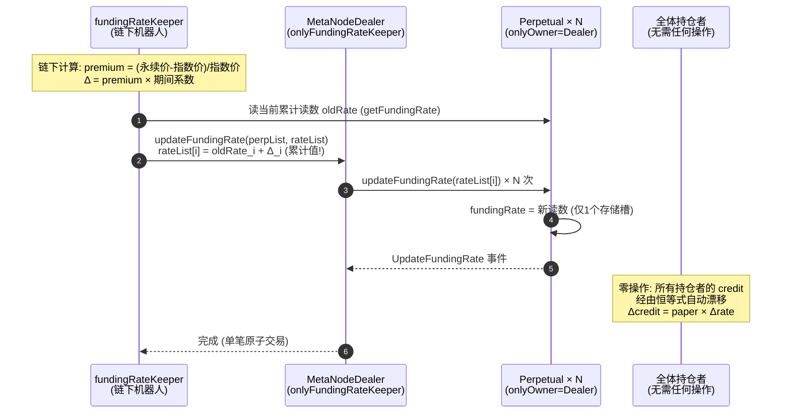
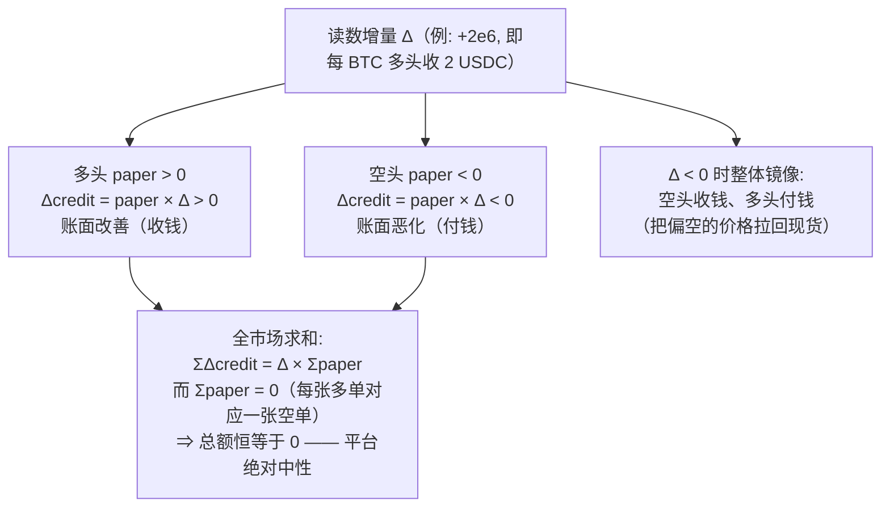

# 第 10 章：资金费率引擎 — Funding 库与"水表读数"类比

> 涉及源码：`src/MetaNodeOperation.sol`（updateFundingRate 入口）、`src/libraries/Operation.sol`（批量更新）、`src/Perpetual.sol`（updateFundingRate / balanceOf）、`src/MetaNodeStorage.sol`（onlyFundingRateKeeper）
> 第 1 章我们用"橡皮筋"理解了资金费的**目的**（锚定现货），第 6 章用"水表读数"理解了它的**记账形态**（累计值现算）。本章把引擎的**全貌**拼齐：读数由谁算、怎么传上链、账单如何在多空之间镜像流动，以及这条链路上的权限设计。

---

## 1. 本章导读

### 1.1 回顾：资金费要解决什么问题

永续合约没有交割日，价格失去天然锚。资金费的解法（第 1 章的橡皮筋）：**每隔一段时间，让多空之间互付一笔小额资金**——永续价格高于现货时压多头、低于时压空头，把价格软性地拽回现货。关键性质：**多空互付，平台本身一分不赚**。本章末尾会用一行数学证明这个"中性"。

### 1.2 谁在拨动水表？——抄表员 keeper

水表读数（`fundingRate`）不会自己走。每个结算周期（典型 8 小时），一位链下的"**抄表员**"——`fundingRateKeeper`——完成三步：

1. **读表**：取当前累计读数 `oldRate`（从各 Perpetual 的 `getFundingRate()`）；
2. **算增量**：在链下计算本周期应付的费率增量 Δ——核心输入是**永续价格与指数（现货）价格的偏离**（premium）：永续价贵 → Δ 为正（本项目的符号约定下多头收钱、空头掏钱抑制做多）……注意这里出现了符号歧义，1.3 节马上处理；
3. **写表**：把 `oldRate + Δ` 作为**新的累计读数**提交上链。

类比完整版：水表装在交易所墙上，抄表员每小时来抄一次，把"本户本期用量 = 新读数 − 旧读数"写进账单——**账单金额 = 各户用量 × 读数增量**，而"用量"在本项目里就是持仓量 `paper`。

### 1.3 一个必须当面戳破的坑：注释与数学打架

你此刻打开源码，会看到两条**互相矛盾**的注释：

```solidity
// Perpetual.sol（与数学一致 ✅）：
//   "如果 fundingRate 在某次更新中增加了 5
//    每持有 1 paper 多头，你将获得 5 credit"        ← 读数涨 = 多头收钱

// MetaNodeOperation.sol（与 CEX 惯例一致、与数学矛盾 ⚠️）：
//   "正资金费率：多头支付空头
//    负资金费率：空头支付多头"                      ← 读数涨 = 多头付钱？
```

**数学站在哪边？** `credit = paper × rate + reducedCredit`。读数上涨（rate 增大）时，`paper > 0`（多头）的 credit 变**大**——credit 变大对多头意味着账面改善，即**多头收钱**。所以 Perpetual.sol 的注释才是真话，MetaNodeOperation 的注释是照抄 CEX 惯例的笔误。这个真实存在的文档矛盾就是本章踩坑提示的第 1 条——**读注释不如读恒等式**。

### 1.4 本章学习法

先把"读数 → 账单"的数学关系吃透（多空镜像 + 全市场零和），再顺着 keeper 的一笔链上交易走完整条权限链，最后站在协议设计者角度评估"单写者 + 原子批量"这两个选择的代价。

---

## 2. 架构 / 流程图

### 2.1 keeper 的一次费率更新：从链下计算到全市场账本漂移



### 2.2 读数增量 Δ 对多空的镜像影响（方向约定的数学图解）



**这张图就是资金费引擎的全部数学**。剩下的代码只是把"写读数"这一件事安全地做完。

---

## 3. 核心代码拆解

### (1) 权限链：一次更新要过两道关卡

```solidity
// 第一关：MetaNodeStorage 的自定义修饰符
modifier onlyFundingRateKeeper() {
    require(msg.sender == state.fundingRateKeeper, Errors.INVALID_FUNDING_RATE_KEEPER);
    _;
}

// 第二关：Perpetual 侧的 Ownable
function updateFundingRate(int256 newFundingRate) external onlyOwner {
    ...
}
```

调用链是 `keeper → Dealer.updateFundingRate → Perpetual.updateFundingRate`，两道关卡分别检查：

- Dealer 侧：**发起者是不是 keeper**（`onlyFundingRateKeeper`）；
- Perpetual 侧：**调用者是不是 Dealer**（`onlyOwner`，owner 就是 Dealer 地址）。

**为什么不在 Dealer 侧一次性做完**（比如 Dealer 直接写各市场的费率存储）？因为费率是**每个 Perpetual 自己的状态变量**——它必须与该市场的 paper/锚点体系活在同一份存储里，恒等式才成立。Dealer 无权跨合约写别人的存储（EVM 隔离），于是只能"总行发文、分行执行"：Dealer 做身份中转，Perpetual 做存储落笔。第 3 章"分行认总行靠 Ownable"在此得到最典型的应用。

### (2) 批量入口：一次交易更新所有市场

```solidity
// src/MetaNodeOperation.sol
function updateFundingRate(
    address[] calldata perpList,     // 本批要更新的市场
    int256[] calldata rateList       // 对应的新累计读数
) external onlyFundingRateKeeper {
    Operation.updateFundingRate(perpList, rateList);
}

// src/libraries/Operation.sol
function updateFundingRate(address[] calldata perpList, int256[] calldata rateList) external {
    require(perpList.length == rateList.length, Errors.ARRAY_LENGTH_NOT_SAME);  // 形状校验
    for (uint256 i = 0; i < perpList.length;) {
        int256 oldRate = IPerpetual(perpList[i]).getFundingRate();    // 读旧值——仅为事件
        IPerpetual(perpList[i]).updateFundingRate(rateList[i]);       // 写新值
        emit UpdateFundingRate(perpList[i], oldRate, rateList[i]);    // 事件带全前后值
        unchecked { ++i; }
    }
}
```

**三个值得咀嚼的细节**：

- **`oldRate` 只为事件服务**：写入本身不需要旧值（直接覆盖），读它纯粹为了让事件携带"前后读数对"，链下据此算出本周期 Δ 并对账。**gas 花在可观测性上**，是有意的取舍。
- **批量循环无 try/catch**：任何一个市场地址非法/合约异常，**整批 revert**——所有市场的费率一起冻结。这是"原子性"的双刃剑，3.8 节专门讨论。
- **`unchecked ++i`**：循环计数器受 `perpList.length` 约束，溢出不可能发生，省掉每次自增的检查 gas。

### (3) 落笔点：分行侧的"一槽更新"（第 6 章回顾 + 权限视角）

```solidity
// src/Perpetual.sol
function updateFundingRate(int256 newFundingRate) external onlyOwner {
    int256 oldFundingRate = fundingRate;
    fundingRate = newFundingRate;                          // 唯一的存储写：1 个槽
    emit UpdateFundingRate(oldFundingRate, newFundingRate);
}
```

无论市场里有多少持仓者、总敞口多大，这次更新的 gas 恒定。**对比"逐人转账结算"方案**（第 1 章思考题 1 的答案）：那需要 O(持仓人数) 次存储写，且任何一个持仓者是恶意合约就能 revert 整个更新——keeper 将被轻松 Griefing 到瘫痪。单槽更新把攻击面压缩到"keeper 自己"这一个点。

### (4) 账单如何"自动"产生：恒等式的读数敏感度

```solidity
// src/Perpetual.sol
function balanceOf(address trader) external view returns (int256 paper, int256 credit) {
    paper = int256(balanceMap[trader].paper);
    credit = paper.decimalMul(fundingRate) + int256(balanceMap[trader].reducedCredit);
}
```

对读数求增量：`Δcredit = paper × Δrate`。**持仓者零操作、零交易**，其账面资金随 keeper 的每一次写读数自动漂移。这一"幻术"的全部原理就是第 6 章的现算机制——本章只是从费率视角再看一遍：**存储的是读数，流动的是账单**。

### (5) 方向约定的完整数学证明（把 1.3 节的钉子钉死）

设某多头 paper = +1e18（1 BTC），某空头 paper = -1e18，读数增量 Δ = +2e6：

```
多头 Δcredit = 1e18 × 2e6 / 1e18 = +2e6   → 账面 +2 USDC（收钱）
空头 Δcredit = -1e18 × 2e6 / 1e18 = -2e6  → 账面 -2 USDC（付钱）
```

**结论与 CEX 惯例方向相反**：本项目读数上升 = 多头收钱。在 CEX 直觉里"正费率多头付钱"，其根因是 CEX 的资金费通常以"溢价为正时多头付费"定义并直接记金额；本项目则把"premium 的符号"在**链下 keeper 计算 Δ 时**消化掉（premium 为正 → 让多头受益的方向…或相反，取决于 keeper 的实现），链上只忠实地执行 `paper × rate`。**符号约定在哪里被决定，是跨系统对账时最容易踩的坑**——链上代码只提供机制，符号政策全在链下。

### (6) 中性定理：平台为什么一分钱也赚不到

对任一市场全体持仓者求和：

$$\sum_i \Delta credit_i = \Delta rate \times \sum_i paper_i = \Delta rate \times 0 = 0$$

$\sum paper = 0$ 恒成立，因为撮合保证每张多单都有对手空单（第 8 章的守恒律），多空持仓总量必然相抵。所以**资金费是纯粹的体内转移**：系统账本只改变"谁欠谁"，总量纹丝不动。这与保险费、手续费形成鲜明对比——那些是系统向参与者的**抽水**。一个衍生品协议的设计健康度，很大程度上看它的"水"流到哪里：本项目资金费零抽水、手续费给撮合员、保险费进保险基金、坏账由保险基金兜——**每一条资金流的去向都值得在设计文档里写明**。

### (7) 数值实例：一个完整周期（与第 6 章时间线衔接）

场景：BTC-PERP，8 小时结算一次。T1 时刻读数 0→+2e6（多头每 BTC 收 2 USDC）。

| 参与者 | paper | Δcredit | 备注 |
|---|---|---|---|
| 多头甲（1 BTC） | +1e18 | +2e6 | 收 2 USDC |
| 空头乙（1 BTC） | -1e18 | -2e6 | 付 2 USDC |
| 多头丙（0.5 BTC） | +0.5e18 | +1e6 | 按 paper 线性分摊 |
| **合计** | **0** | **0** | **零和 ✔** |

随后第 6 章的丙在 T2 加仓时，这份 +1e6 已经体现在其 credit 中，并被锚点反推固化——资金费引擎与记账引擎在数字上严丝合缝地咬合。

### (8) 原子批量的双刃剑：无错误隔离的代价

```solidity
// 没有 try/catch：一个坏地址，全批阵亡
for (uint256 i = 0; i < perpList.length;) {
    int256 oldRate = IPerpetual(perpList[i]).getFundingRate();   // 若 perpList[i] 非法 → revert
    IPerpetual(perpList[i]).updateFundingRate(rateList[i]);      // 若该市场异常 → 全批 revert
    ...
}
```

原子性带来的一致性红利是"所有市场费率同批更新、绝无半更新状态"；代价是**任何一个市场的异常都会冻结全部市场的费率**——包括那些完全健康的市场。Keeper 的缓解手段是链下先 `eth_call` 模拟一遍、剔出问题市场后再上链；协议层面的根治手段是 per-item try/catch（成本是接受"部分更新"的中间态）。**这是分布式系统"全有或全无 vs 尽力而为"的经典权衡在链上的投影**，没有免费午餐。

### (9) 累计值语义对 keeper 的纪律要求

```solidity
// rateList[i] 必须是"新的累计读数"，不是"本期增量"！
IPerpetual(perpList[i]).updateFundingRate(rateList[i]);
```

如果 keeper 误把 Δ 当累计值提交（比如连续传 +2e6, +3e6 而非 2e6, 5e6），读数会来回震荡，用户账单完全错乱。合约不做防御（不检查单调性），因为"增量还是累计"是链下计算策略，链上无从判断——**接口语义的正确性责任完全在调用方**。链下集成此类合约时，第一件事就是把"rateList 是绝对值"写进代码注释和测试。

### (10) 资金费如何影响风控：与清算的接缝

```solidity
// Liquidation.getLiquidateCreditAmount（节选，第 12 章展开）
netValuePrime += paperAmountPrime.decimalMul(price) + creditAmountPrime;
//                                                   ↑ credit 里含着资金费漂移
```

清算价推导公式中的 `creditAmount` 是**现算值**——包含了资金费漂移。所以资金费不只是"每期小钱"：**长期单边行情下，持续付费的一方会被资金费一点点磨穿保证金**，即使价格本身没动。这是永续合约特有的"钝刀放血"效应，也是 keeper 正常运转对清算体系重要的原因——**费率冻结时，付费一方的损失暂停，定价锚也一并失效**，整个市场的经济激励随之扭曲。

---

## 4. Web3 特有机制

1. **单写者模式（Single Writer）**：`fundingRateKeeper` 是单一地址而非白名单。读数是全局单调序列，两个写者会互相覆盖（后写覆盖先写、读数可能倒退），单写者从根上避免"脑裂"。代价是**单点可用性**：keeper 掉线 = 费率冻结 = 定价锚失效。成熟协议会配"keeper 降级方案"（如超时后开放公共更新），本项目未做——这是一个值得记录的设计空白。
2. **权限链的中转设计**：keeper 没有 Perpetual 的任何权限，必须借 Dealer 之手中转（Dealer 是分行的 owner）。**分行只信总行，总行替它筛选谁可以发文**——两级信任让"添加/更换 keeper"（`setFundingRateKeeper`）不需要触碰任何 Perpetual。
3. **批量交易的 gas 经济**：N 个市场一次更新的 gas ≈ N × (外部调用 + 一槽写入 + 事件)。gas 由 keeper 支付，构成协议的**隐性运营成本**——市场数量越多，keeper 补贴越贵。这也是协议倾向"少而精的市场"的经济原因。
4. **事件三要素对账**：`UpdateFundingRate(perp, oldRate, newRate)` 把"谁、从多少、到多少"一次带全，链下对账无需回查存储。低频高价值事件的事件自足性原则（第 9 章提过）再次体现。
5. **calldata 参数**：`address[] calldata / int256[] calldata` 直接引用交易数据，不拷贝内存——对批量接口是标配优化。
6. **无单调性/界限检查的信任边界**：合约不检查新读数是否合理（增幅过大？倒退？），因为"合理"是链下定价策略。**链上做机制、链下做政策**的分工要求集成者对每一层职责有清晰地图。

---

## 5. 本章小结与思考题

### 5.1 核心知识点回顾

- **引擎三步**：链下算 Δ（premium 驱动）→ keeper 提交新累计读数 → 恒等式让全体 credit 自动漂移（`Δcredit = paper × Δrate`）。
- **双重权限**：Dealer 侧 `onlyFundingRateKeeper`（发文权）+ Perpetual 侧 `onlyOwner`（落笔权），分行只信总行。
- **单槽更新**：O(1) gas 的代价是读取时多一次乘法；它同时消灭了"逐人结算"的 gas 炸弹与恶意持仓者 Griefing。
- **中性定理**：`Δ × Σpaper = 0`，资金费是纯体内转移，平台零抽水。
- **方向约定**：读数上升 = 多头收 credit（数学如此）；源码注释存在一处与数学矛盾的 CEX 式描述，以恒等式为准。
- **原子批量双刃剑**：一致性 vs 错误隔离，本项目选择了前者，由 keeper 链下模拟来兜异常。

### 5.2 思考题

1. **keeper 掉线 24 小时会发生什么？** 请顺着三个链条推演：(a) 定价链——永续价格失去橡皮筋，与现货的偏离会怎样演化；(b) 风控链——持续付费方的保证金消耗暂停，清算分布会怎么变化；(c) 攻击链——攻击者能否利用"费率冻结"构造确定性套利（提示：费率冻结不影响已持仓的 credit，但影响"预期未来成本"，把预期翻译成现货套利窗口）。想完后设计一个你自己的"keeper 降级方案"，并分析它引入的新风险。
2. **把批量更新改成 per-item try/catch（失败市场跳过）**，协议会获得什么、失去什么？请具体到"部分更新"期间的数据一致性：两个市场的读数时间戳不同步时，跨市场套利者的行为会怎样？对比原子方案的失效模式，说明为什么本项目"宁死不脏"的选择在衍生品场景尤其合理（提示：费率读数参与清算价计算，错乱的读数 = 错乱的清算）。

---

## 6. 踩坑提示

1. **源码注释自相矛盾（真实发现）**：`MetaNodeOperation.sol` 的"正资金费率：多头支付空头"与 `Perpetual.sol` 的"读数增加 5 → 多头获得 5 credit"方向相反，且后者与恒等式数学一致。**一切以 `credit = paper × rate + reducedCredit` 的数学为准**，文档（包括本章）都只是参考。这也是"注释驱动开发"的反面教材——注释与代码漂移无人发现，因为方向约定藏在链下 keeper 里。
2. **累计值 vs 增量混用**：`rateList` 是绝对累计值。链下机器人若用"增量模式"调用，读数将震荡、账单错乱，且**合约不会报错**（语法完全合法）。集成时先写一条端到端测试：连续两期更新，断言用户 Δcredit 恰为两期 Δ 之和。
3. **批量无错误隔离**：一个坏地址冻结全部市场费率。运行 keeper 的团队必须在链下预演（simulate）并在 CI 里固化"剔除异常市场"的逻辑，否则一次注册失误就是全平台费率停摆。
4. **费率冻结是清算盲区**：清算价公式里的 credit 含资金费项，费率停更期间付费方的保证金消耗暂停——**价格横盘但费率僵死的组合，会让某些仓位"看似该清却永远清不动"**。做清算策略时把 keeper 的心跳健康度纳入信号源。
5. **keeper 私钥是高价值目标**：它能拨动全市场的水表。虽然单次更新的幅度受链下策略约束（链上无限制！），一旦私钥泄露，攻击者可把读数拉到任意值，直接重写所有人的 credit。**链上没有幅度闸门**——生产部署应把 keeper key 隔离在专用签名机、配合链下监控"Δ 异常"告警，必要时用 `setFundingRateKeeper` 轮换。

---

> 下一章预告（第 11 章）：风控体检——isSafe 家族的完整公式（净值/敞口/初始保证金/维持保证金），IM Safe 与 MM Safe 的分工，以及"Solid IM Safe"里那个 secondaryCredit 特判的用意。
