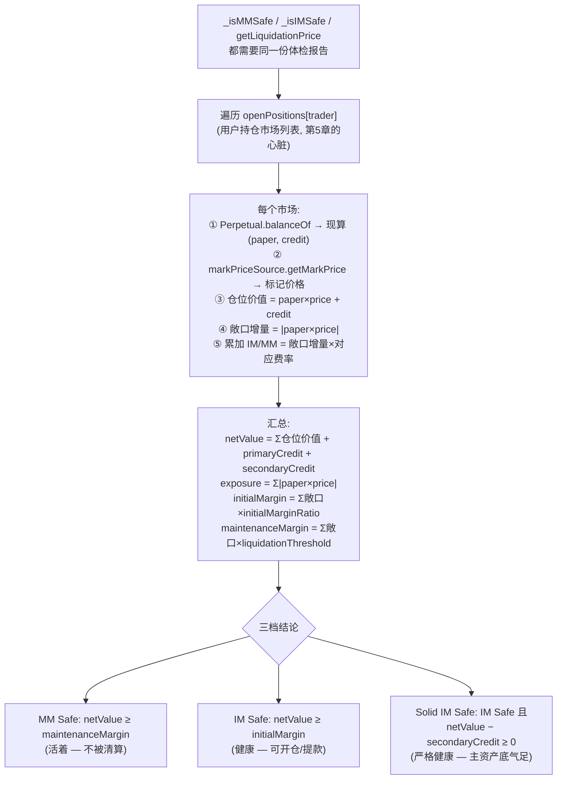
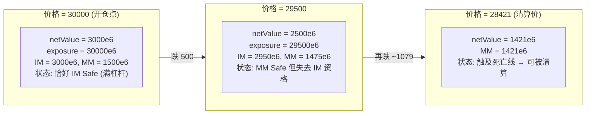

# 第 11 章：风控体检 — isSafe / margin、maintenanceMargin 与风险参数体系

> 涉及源码：`src/libraries/Liquidation.sol`（getTotalExposure、_isMMSafe/_isIMSafe/_isSolidIMSafe、getLiquidationPrice、getLiquidateCreditAmount）、`src/libraries/Types.sol`（RiskParams）、`src/MetaNodeView.sol`（isSafe 家族的对外出口）
> 上一章结束时多头可能被资金费"钝刀放血"；本章回答风控的核心问题：**系统用什么指标判断"这个人还能不能玩"？** 这是理解第 12 章清算的前置课——先知道"谁该被清算"，再看"怎么清"。

---

## 1. 本章导读

### 1.1 类比：一套"三档体检"制度

把账户风控想象成一场**持续进行的体检**，系统随时给每个交易者出一张体检报告，上面有四个指标、三档结论：

| 体检指标 | 本项目对应 | 含义 |
|---|---|---|
| 全身家当（现金 + 资产市值 − 负债） | **netValue 净值** | 你此刻"值多少" |
| 全部占用资源（不管买的多空，都算你占用了系统风险额度） | **exposure 敞口** | 你让系统背了多少价格风险 |
| 参加剧烈运动的最低身体要求 | **initialMargin 初始保证金** = 敞口 × 初始保证金率 | **开新仓/提款**的资格线 |
| 住进 ICU 的临界指标 | **maintenanceMargin 维持保证金** = 敞口 × 维持保证金率 | **被清算**的死亡线 |

三档结论由两个比较产生：

- **MM Safe**（净值 ≥ 维持保证金）：**活着**——没人能碰你的仓位；
- **IM Safe**（净值 ≥ 初始保证金）：**健康**——可以开新仓、可以提款；
- **Solid IM Safe**：**严格的健康**——开新仓的资格还**不能靠次级资产垫**，用于提主资产等敏感操作。

初始保证金率 > 维持保证金率（比如 10% vs 5%），中间是一条**缓冲带**：从"不能开新仓"到"被清算"之间有距离，给行情波动和清算动作留反应时间。这条缓冲带是整个杠杆体系的呼吸空间。

### 1.2 本章要回答的四个问题

1. 四个指标**怎么算出来**——尤其净值凭什么把多个市场、浮盈浮亏、资金费漂移全部汇总？
2. 三档体检**各自把守哪扇门**（开仓、提款、清算、接手续费）？
3. **清算价**是怎么从这套指标里推导出来的？
4. 为什么需要第三档"Solid"——它防的是什么攻击？

### 1.3 一个贯穿本章的数值例子

设定：BTC-PERP，账户存 3000 USDC，以 30000 开多 1 BTC（10 倍杠杆）。市场参数：初始保证金率 10%（1e18 基数的 0.1e18）、维持保证金率 5%。本章所有公式都用这组数字落地验算。

---

## 2. 架构 / 流程图

### 2.1 体检报告的生成流程：`getTotalExposure`



**注意净值与敞口的方向性差异**：净值里多空盈亏**相互抵消**（代数和），敞口却**多空分开计**（绝对值和）。这不是笔误——1.2 节先记住，3.3 节解释为什么对冲仓位要付"双份敞口"。

### 2.2 数值例子的体检报告随行情变化



（推导见 3.7 节。缓冲带 = IM 与 MM 之间的 2950−1475 ≈ 1500e6 空间，正好是"不许加仓但还活着"的地带。）

---

## 3. 核心代码拆解

### (1) 风险参数：杠杆的"出厂设置"

```solidity
// src/libraries/Types.sol
struct RiskParams {
    uint256 initialMarginRatio;      // 初始保证金率: 0.1e18 = 10% ⇔ 最大 10 倍杠杆
    uint256 liquidationThreshold;    // 维持保证金率: 0.05e18 = 5% (清算线)
    uint256 liquidationPriceOff;     // 清算折扣: 给清算人的价格优惠幅度
    uint256 insuranceFeeRate;        // 保险费率: 清算时抽取
    address markPriceSource;         // 标记价格来源 (预言机适配器)
    string name;                     // 市场名
    bool isRegistered;               // 注册开关
}
```

每个市场一套参数、管理员可调（`setPerpRiskParams`）。**四个数字定义了一个市场的全部风险性格**：杠杆上限（IMR 倒数）、清算灵敏度（LT）、清算人的赏金厚度（priceOff + insuranceFeeRate）。调参即调性格——BTB 市场可以宽（低 IMR），山寨市场必须紧（高 IMR + 高 LT）。

### (2) `getTotalExposure`：体检报告的生成器（本章心脏）

```solidity
// src/libraries/Liquidation.sol
function getTotalExposure(Types.State storage state, address trader)
    public view returns (int256 netValue, uint256 exposure, uint256 initialMargin, uint256 maintenanceMargin)
{
    int256 netPositionValue;
    for (uint256 i = 0; i < state.openPositions[trader].length;) {       // 遍历持仓市场
        // ① 跨合约现算仓位: paper 与 credit(含资金费漂移)
        (int256 paperAmount, int256 creditAmount) = IPerpetual(state.openPositions[trader][i]).balanceOf(trader);
        Types.RiskParams storage params = state.perpRiskParams[state.openPositions[trader][i]];
        // ② 读标记价格 (预言机)
        int256 price = SafeCast.toInt256(IPriceSource(params.markPriceSource).getMarkPrice());

        netPositionValue += paperAmount.decimalMul(price) + creditAmount;   // 盈亏可正可负(代数和)
        uint256 exposureIncrement = paperAmount.decimalMul(price).abs();    // 敞口取绝对值!
        exposure += exposureIncrement;
        maintenanceMargin += (exposureIncrement * params.liquidationThreshold) / Types.ONE;
        initialMargin     += (exposureIncrement * params.initialMarginRatio) / Types.ONE;
        unchecked { ++i; }
    }
    netValue = netPositionValue + state.primaryCredit[trader] + SafeCast.toInt256(state.secondaryCredit[trader]);
}
```

**四个关键设计点**：

- **净值代数和、敞口绝对值和**：对冲仓位（例如 BTC-PERP 多 1、ETH-PERP 空 1 的组合在统计意义上互保）在净值上互相抵消，但在敞口上**双双计入**。3.3 节展开动机。
- **credit 现算进风控**：`balanceOf` 返回的 credit 已含资金费漂移（第 10 章的"钝刀放血"在这里变成真实的风控压力）。
- **分市场的费率**：每个市场用自己的 RiskParams 计算增量——同一个账户在不同市场按不同杠杆标准受审。
- **循环长度受 `maxPositionAmount` 闸门约束**（第 5 章的防 Griefing 设计在此消费）：这个 view 函数会被**清算交易**内联调用，gas 有限，循环必须有界。

### (3) 三档体检函数：三个 return 的差距

```solidity
function _isMMSafe(Types.State storage state, address trader) internal view returns (bool) {
    (int256 netValue,,, uint256 maintenanceMargin) = getTotalExposure(state, trader);
    return netValue >= SafeCast.toInt256(maintenanceMargin);      // 第一档: 活着
}

function _isIMSafe(Types.State storage state, address trader) internal view returns (bool) {
    (int256 netValue,, uint256 initialMargin,) = getTotalExposure(state, trader);
    return netValue >= SafeCast.toInt256(initialMargin);          // 第二档: 健康
}

function _isSolidIMSafe(Types.State storage state, address trader) internal view returns (bool) {
    (int256 netValue,, uint256 initialMargin,) = getTotalExposure(state, trader);
    return netValue - SafeCast.toInt256(state.secondaryCredit[trader]) >= 0   // ★ 扣掉次级资产
        && netValue >= SafeCast.toInt256(initialMargin);
}
```

第三档多出的那个条件值得单独解释：**把次级资产从净值里剔除后，剩下的"主资产 + 仓位盈亏"必须仍然 ≥ 0**。意图是：主资产（USDC）才是系统真正的偿付媒介，次级资产只是扩展位的辅助抵押——**不能拿"次级资产的估值"当理由去动主资产**。数值例：净值 4000（含次级 3500），IM 3000 → IM Safe；但 Solid 检查 4000−3500=500 ≥ 0 也通过。若次级 5000、主资产与仓位合计 −1000：IM Safe（4000≥3000）但 Solid 失败（−1000 < 0）——**次级再值钱也垫不动主资产的窟窿**。

### (4) 使用场景全景：哪扇门配哪把锁

| 场景 | 检查档位 | 源码位置 | 拦住什么 |
|---|---|---|---|
| trade() 撮合落账后 | `isAllSafe`（对每个成交者查 MM） | Perpetual.trade | 成交后立刻爆仓的撮合 |
| liquidate() 清算者侧 | `isSafe`（MM） | Perpetual.liquidate | 用将爆仓账户接盘套利 |
| handleBadDebt() | `!isMMSafe`（反向用作坏账判定） | Liquidation | 误勾销健康账户（第 9 章） |
| 取款 executeWithdraw | IM 级检查 | Funding | 提款后立即穿仓 |
| orderSender 负手续费 | `_isSolidIMSafe` | approveTrade | 撮合员倒贴钱把自己贴爆 |

**设计规律**：越靠近"资金离开系统"的操作，检查越严格（Solid）；纯持仓风险用第一档；批量终审用最快失败的单档。**锁的强度与门后资产的流动性成正比**。

### (5) `getLiquidationPrice`：清算价的解析推导

```solidity
// 推导骨架(源码注释原文翻译):
// 生存条件: netValue' + paper×price + credit >= MM' + |paper|×price×threshold
// 多头(paper>0): 移项得 price >= (MM' − netValue' − credit)/paper/(1−threshold)
// 空头(paper<0): price <= (MM' − netValue' − credit)/paper/(1+threshold)
int256 multiplier = paperAmount > 0
    ? SafeCast.toInt256(Types.ONE - state.perpRiskParams[perp].liquidationThreshold)   // 1−LT
    : SafeCast.toInt256(Types.ONE + state.perpRiskParams[perp].liquidationThreshold);  // 1+LT
int256 liqPrice = (maintenanceMarginPrime - netValuePrime - creditAmount)
                      .decimalDiv(paperAmount).decimalDiv(multiplier);
return liqPrice < 0 ? 0 : uint256(liqPrice);   // 负值 → 绝对安全, 报 0
```

**推导直觉**：把"其他所有市场"打包成常量（`netValue'`、`MM'`），生存条件里唯一随目标市场价格变的就是 `paper×price` 与它的维持保证金 `|paper|×price×LT`。两项合并系数（多头 1−LT，空头 1+LT——注意空头是 **1+**，因为空头仓位价值随价格上升而恶化），解出**恰好触线的价格**。

**数值例验证**（1 BTC 多头，primaryCredit=3000e6，credit=−30000e6，LT=5%，无其他仓位）：

```
liqPrice = (0 − 3000e6 + 30000e6) / 1e18 / 0.95e18
         = 27000e6 ÷ 0.95 = 28421e6  → 约 28421
验算: 价格 28421 时, 仓位价值 = 28421−30000 = −1579e6
      netValue = 3000 − 1579 = 1421e6
      MM = 28421 × 5% = 1421.05e6  → 恰好触线 ✔
```

前端展示的"预估强平价"就是这个函数；清算机器人用它做猎物探测。

### (6) `getLiquidateCreditAmount`：清算资格与清算价格

```solidity
require(!_isMMSafe(state, liquidatedTrader), Errors.ACCOUNT_IS_SAFE);   // 资格: 确实不健康才能清
require(requestPaperAmount * brokenPaperAmount > 0, ...);               // 方向: 只能减对方仓位
liqtorPaperChange = requestPaperAmount.abs() > brokenPaperAmount.abs()
    ? brokenPaperAmount : requestPaperAmount;                            // 数量: 不超实际持仓

uint256 priceOffset = (price * params.liquidationPriceOff) / Types.ONE;
price = liqtorPaperChange > 0 ? price - priceOffset : price + priceOffset;
// 清算者接多仓 → 打折买(便宜); 接空仓 → 溢价接(贵卖)。折扣 = 赏金

liqtorCreditChange = -1 * liqtorPaperChange.decimalMul(SafeCast.toInt256(price));
insuranceFee = (liqtorCreditChange.abs() * params.insuranceFeeRate) / Types.ONE;  // 再抽保险费
```

**三重约束 + 双层赏金**：资格（必须真的 MM 不安全——防止对健康账户发起"恶意清算"）、方向（只能顺对方的仓位方向减）、数量（截断到实际持仓）。赏金 = 价格折扣 `liquidationPriceOff` + 保险费抽成给保险基金的差额（清算者按折扣价成交，被清算者承受折扣损失 + 保险费）。**赏金定价是清算系统的核心激励工程**：折扣太薄没人清，太厚则清算变成对用户的过度惩罚——参数化（而非写死）让治理可以校准。

### (7) `isAllSafe`：终审的快速失败

```solidity
function _isAllMMSafe(Types.State storage state, address[] calldata traderList) internal view returns (bool) {
    for (uint256 i = 0; i < traderList.length;) {
        if (!_isMMSafe(state, traderList[i])) return false;   // 任何一个失败立即返回
        unchecked { ++i; }
    }
    return true;
}
```

撮合终审不需要"谁不健康"的明细，只需要布尔答案——**第一个失败者立刻短路返回**，省掉剩余的跨合约体检。这是 view 循环 gas 优化的通用形：能早退就早退。

### (8) 数值例全景复盘（对照 2.2）

| 时刻 | 价格 | 仓位价值 | netValue | exposure | IM | MM | 结论 |
|---|---|---|---|---|---|---|---|
| 开仓 | 30000 | 0 | 3000e6 | 30000e6 | 3000e6 | 1500e6 | 恰好 IM Safe |
| 下跌 | 29500 | −500e6 | 2500e6 | 29500e6 | 2950e6 | 1475e6 | MM Safe，失 IM 资格 |
| 触线 | 28421 | −1579e6 | 1421e6 | 28421e6 | 2842e6 | 1421e6 | 触 MM 线 → 可清算 |

注意 IM 在价格下跌后**变大**了（敞口虽降，但基数不同——29500×10% = 2950 > 3000×10%×(30000/29500)…直观看：跌价后亏损吃掉了缓冲），这正是"10 倍杠杆账户几乎不允许浮亏"的数学表达：**从开仓点起，任何浮亏都会先剥夺 IM 资格，再走向 MM 线**。

### (9) 风控与预言机的依赖：价格是体检的"血压计"

`getMarkPrice`（`markPriceSource` → 预言机适配器）在每次体检中都被调用。**风控的可信度上限 = 预言机的可信度上限**：价格陈旧（心跳过期）→ 体检报告过期；价格被操纵（低流动性时刻）→ 健康账户被误清。第 2 章说"拆角色的本质是拆信任"，在风控这里体现为：**协议把"行情事实"的裁判权外包给了预言机，并用第 7 章讲过的心跳/偏离保护约束它**。读风控代码必须同步追问价格从哪来。

### (10) 风控检查的时点哲学：事前拦 vs 事后清

本项目的风控检查全部是**"操作时点"检查**（开仓时、结算后、清算时），没有链上定时巡检——**链上没有"后台监控进程"**。持续盯盘这件事被外包给了清算人（第 2 章的赏金猎人）。这套"事前拦截 + 赏金事后清"的组合拳，本质是把传统风控部门的"7×24 监控"职能市场化。理解这一点，你就明白为什么 RiskParams 里的 `liquidationPriceOff` 与 `insuranceFeeRate` 不是"参数"，而是**风控体系能运转的工资单**。

---

## 4. Web3 特有机制

1. **view 循环的 gas 约束**：`getTotalExposure` 在清算交易中执行，循环上界 = `maxPositionAmount`。任何"按用户聚合"的风控都受此制约——这是链上风控与后端风控（内存里随便遍历）最刚性的差异。
2. **跨合约现算汇总**：体检时对每个市场调用 `balanceOf`，credit 的资金费漂移被实时纳入。**风控永远基于"此刻"，不存在快照过期问题**（代价是 gas）。
3. **绝对值敞口与对冲不互抵**：多空对冲仓位付双份敞口的保证金。看似浪费，实为保守：各市场价格波动不相关，净额假设会低估尾部风险。**保守的数学，是存活 3 年以上协议的共同特征**。
4. **require 作为清算资格门槛**：`require(!_isMMSafe(...))` 使"清算健康账户"在合约层面不可能——清算人的自由度被限定在"向不健康者出手"。赏金激励 + 资格限制的组合防止了恶意清算 Griefing。
5. **整数除法的保证金计算**：`(exposureIncrement × threshold) / ONE` 向零取整 → 要求的保证金**略微偏少**（对用户有利、对系统略不利）。方向性取整在风控里应该"对系统有利"（向上取整），本项目未区分——一个可改进点，审计时应记录。
6. **标记价格 vs 成交价格的分离**：清算、体检全用 `markPriceSource`（预言机聚合价），**不用**最近成交价。防止用一笔小额操纵交易把价格打穿来触发清算（价格操纵攻击的经典防线）。

---

## 5. 本章小结与思考题

### 5.1 核心知识点回顾

- **四指标**：netValue（代数净值）、exposure（绝对值敞口）、initialMargin、maintenanceMargin；每市场按自己的 RiskParams 累加。
- **三档体检**：MM Safe（活着）→ IM Safe（健康，可开仓/提款）→ Solid IM Safe（主资产底气足，用于敏感操作）。
- **缓冲带**：IMR > LT 造成的"不许加仓但还活着"地带，是清算系统的反应窗口。
- **清算价**：把其他市场打包成常量、对目标市场价格解方程，multiplier = 1±LT；返回 0 有三重含义（无仓/绝对安全/已清算）。
- **清算激励工程**：价格折扣（liquidationPriceOff）+ 保险费（insuranceFeeRate）构成清算人工资单；`require(!_isMMSafe)` 是资格门槛。

### 5.2 思考题

1. **为什么 exposure 用绝对值求和，而不用净敞口？** 请构造一个具体情形说明净额算法的风险：用户在 BTC-PERP 多 1 BTC、在 ETH-PERP 空"等值 1 BTC 名义"的仓位，净敞口为 0 → 净额算法下 IM/MM 双零。然后推演两种场景：a) 两市场价格相关性突然断裂；b) 用户用同一笔保证金在两市场各自加到 5 倍对冲。算完净额与绝对值两种算法下的保证金需求，体会"保守的代价 vs 幸存的收益"。
2. **Solid IM Safe 删掉 `netValue − secondaryCredit ≥ 0` 会怎样？** 构造完整攻击：用户存入少量 USDC + 大量次级资产（假设次级有估值），开仓让仓位盈亏把主资产侧面掏空，然后提走 primaryCredit……走到哪一步会被原版拦住？由此总结"多抵押品体系里，**偿付媒介与估值资产必须区别对待**"的设计原则。

---

## 6. 踩坑提示

1. **对冲者会被"双份敞口"误伤**：净敞口为零的对冲组合仍按两份敞口计保证金。做跨市场对冲策略前先算清成本；这也意味着协议对"跨市场价差套利"并不友好——设计上它是交易所，不是对冲基金的基础设施。
2. **`getLiquidationPrice` 返回 0 的语义歧义**：无仓位、绝对安全、已进入清算三种情况都返回 0。链下消费时若把 0 当"强平价 0 美元"渲染，前端会显示荒谬结果——必须结合仓位状态解释。
3. **保证金计算取整方向对系统略不利**：向零取整让"要求的保证金"略少。单次误差最小单位级，但清算线附近的仓位可能因此晚清算一笔极小金额。审计此类系统时，取整方向审查是必修项（正确做法：风控要求的量向上取整）。
4. **风控的可信度被预言机钳制**：`markPriceSource` 指向的适配器若被配置到低质量价格源（比如测试用的 ConstOracle 忘了换），整个市场的清算将基于假价格运行。**配置审查（哪个市场用了哪个价格源）应纳入上线 checklist**。
5. **IM 检查是"时点检查"不是"状态保证"**：通过 IM 检查只代表"此刻健康"，下一块价格波动立刻可能 MM 不安全——协议没有义务也没有能力保证你继续健康。把它理解成"体检合格可以出门"，不是"健康保险"。

---

> 下一章预告（第 12 章）：清算全流程——liquidate() 从资格校验到双方结算的完整执行、expectCredit 价格保护如何防三明治夹击、部分清算与全清的路径选择，以及保险基金在穿仓时的最后兜底。
