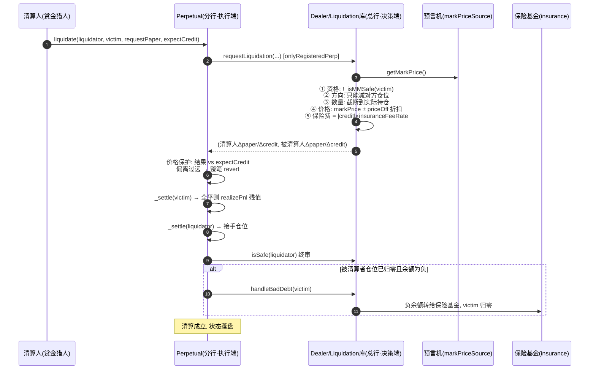
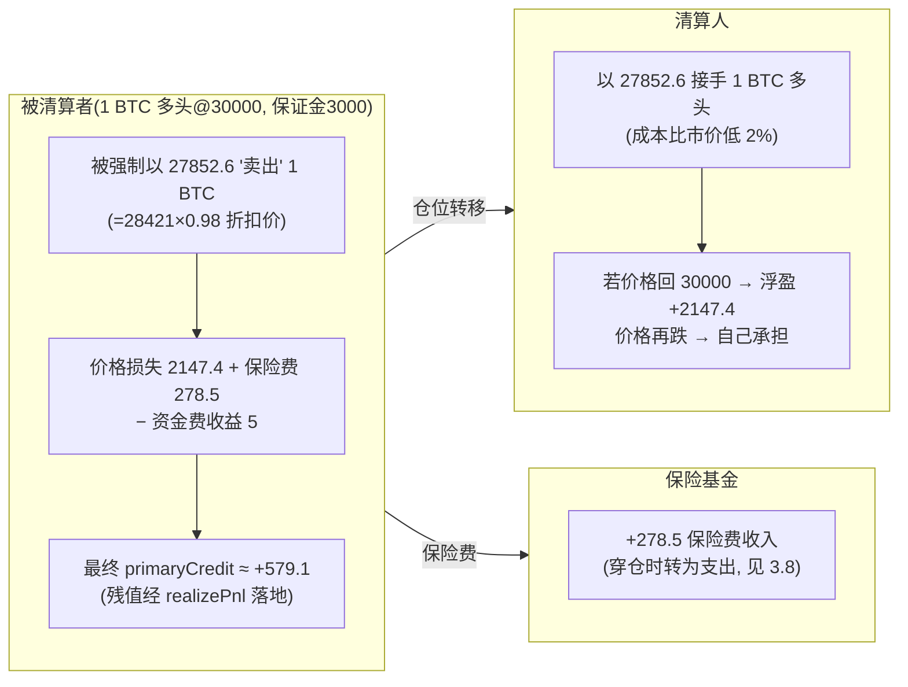

# 第 12 章：清算全流程 — Liquidation 库、requestLiquidation 与坏账处理

> 涉及源码：`src/Perpetual.sol`（liquidate 执行端）、`src/libraries/Liquidation.sol`（requestLiquidation、getLiquidateCreditAmount、handleBadDebt）、`src/MetaNodeExternal.sol`（onlyRegisteredPerp 入口）
> 第 11 章我们建立了"体检报告"（净值/敞口/保证金线），本章让体检结论真正长出牙齿：**判定不健康之后，系统如何把风险从账户上剥下来**。这是风控三部曲（11→12→9 的坏账）的执行章，也是赏金猎人（清算人）的赚钱手册。

---

## 1. 本章导读

### 1.1 类比：一套"法拍房"流程

把爆仓仓位想象成一套资不抵债的法拍房：

| 法拍环节 | 本项目对应 |
|---|---|
| 房主断供（净值跌破维持线） | 交易者 MM 不安全 |
| 法院挂牌（任何人可参与竞拍） | `liquidate()` 无权限修饰符，赏金猎人随时出手 |
| 拍卖折扣（通常低于市价成交） | `liquidationPriceOff` 价格折扣 |
| 中介/法院费用 | `insuranceFeeRate` 保险费 |
| 买家直接过户持有（不是帮你卖掉） | 清算人**接手仓位**（paper/credit 转移） |
| 拍卖款不够抵债 → 银行核销 | 全清后余额仍负 → `handleBadDebt` 保险基金兜底 |

**最反直觉也最精妙的一环**：清算人不是"帮爆仓者把仓位卖掉换现金"，而是**自己把仓位接过来**。为什么？因为链上原子交易里"接仓"一步就能完成，而"代卖"还需要第二轮市场流动性——接仓模式让清算在**一笔交易内闭环**，且风险与赏金同体：折扣就是你的利润空间，价格继续暴跌也是你的亏损。

### 1.2 本章要回答的五个问题

1. 一次清算的**完整调用链**是什么？谁验资格、谁算价格、谁落账？
2. **部分清算**和**全清**分别怎么走？
3. `expectCredit` 价格保护**防的是什么攻击**（本章最重要的安全设计）？
4. 被清算者、清算人、保险基金**三方各自的账**怎么记？
5. 穿仓（价格跳空）时坏账兜底的**触发与执行**细节。

### 1.3 贯穿本章的数值例

延续第 11 章：多头 1 BTC @30000，保证金 3000 USDC，维持保证金率 5%。价格跌至 **28421**（清算价）触线。市场参数：清算折扣 `liquidationPriceOff = 2%`，保险费率 `insuranceFeeRate = 1%`。本章算出三方各自的最终账单。

---

## 2. 架构 / 流程图

### 2.1 一次清算的完整接力（含三道安全闸）



### 2.2 三方账单总览（数值例的最终结果）



---

## 3. 核心代码拆解

### (1) 执行端总装：`Perpetual.liquidate` 的五段式

```solidity
// src/Perpetual.sol
function liquidate(address liquidator, address liquidatedTrader, int256 requestPaper, int256 expectCredit)
    external returns (int256 liqtorPaperChange, int256 liqtorCreditChange)
{
    // ① 决策: 回调总行——验资格、算折扣价、抽保险费(3.2/3.3)
    (liqtorPaperChange, liqtorCreditChange, int256 liqedPaperChange, int256 liqedCreditChange) =
        IDealer(owner()).requestLiquidation(msg.sender, liquidator, liquidatedTrader, requestPaper);

    // ② 价格保护: 结果偏离清算人预期 → 整笔 revert(3.4)
    if (liqtorPaperChange < 0) {
        require(liqtorCreditChange * requestPaper <= expectCredit * liqtorPaperChange, "LIQUIDATION_PRICE_PROTECTION");
    } else {
        require(liqtorCreditChange * requestPaper >= expectCredit * liqtorPaperChange, "LIQUIDATION_PRICE_PROTECTION");
    }

    // ③ 执行: 双方落账(锚点反推, 全平则兑现残值)
    _settle(liquidatedTrader, liqedPaperChange, liqedCreditChange);
    _settle(liquidator, liqtorPaperChange, liqtorCreditChange);

    // ④ 终审: 清算者接仓后自身必须健康
    require(IDealer(owner()).isSafe(liquidator), "LIQUIDATOR_NOT_SAFE");

    // ⑤ 兜底: 被清算者仓位归零 → 检查坏账
    if (balanceMap[liquidatedTrader].paper == 0) {
        IDealer(owner()).handleBadDebt(liquidatedTrader);
    }
}
```

与 `trade()` 同构的接力模式：**总行出方案、分行执行、总行终审**。注意⑤的触发条件是**本次清算后**对方 paper 归零——坏账检查只在"清完"时才有意义（第 9 章的双重守门还要求其所有市场持仓清空 + 余额为负）。

### (2) 决策端：`requestLiquidation` 的身份与资格

```solidity
// src/libraries/Liquidation.sol
require(
    executor == liquidator || state.operatorRegistry[liquidator][executor],
    Errors.INVALID_LIQUIDATION_EXECUTOR      // 执行者必须是清算人本人或其授权操作员
);
require(liquidatedTrader != liquidator, Errors.SELF_LIQUIDATION_NOT_ALLOWED);  // 禁止自我清算
```

**清算者可以授权机器人代执行**（operatorRegistry 复用第 5 章的授权体系）——清算竞争毫秒级，手动玩家必须上自动化。**禁止自我清算**防的是"自己清自己的套利"：折扣价是系统让渡的补贴，自清 = 左手倒右手白拿折扣，还绕开了 MM 检查的时点意义。

### (3) 折扣价与保险费：`getLiquidateCreditAmount`（第 11 章 3.6 节回顾 + 账单视角）

```solidity
require(!_isMMSafe(state, liquidatedTrader), Errors.ACCOUNT_IS_SAFE);       // 资格门槛
liqtorPaperChange = requestPaperAmount.abs() > brokenPaperAmount.abs()
    ? brokenPaperAmount : requestPaperAmount;                                // 数量截断

uint256 priceOffset = (price * params.liquidationPriceOff) / Types.ONE;
price = liqtorPaperChange > 0 ? price - priceOffset : price + priceOffset;
// 接多仓 → 折价买(便宜接); 接空仓 → 溢价接(贵卖)。折扣就是赏金

liqtorCreditChange = -1 * liqtorPaperChange.decimalMul(SafeCast.toInt256(price));
insuranceFee = (liqtorCreditChange.abs() * params.insuranceFeeRate) / Types.ONE;
```

数值例（接 1 BTC 多头，标记价 28421，折扣 2%）：

```
折扣价 = 28421 × (1 − 2%) = 27852.58
清算人 Δpaper = +1e18, Δcredit = −27852.6e6   (付 27852.6 USDC 接走 1 BTC 多头)
保险费   = 27852.6e6 × 1% = 278.5e6
```

**折扣的经济学**：清算人按低于市价 2% 的成本接仓，这 2% 就是承担"接仓后价格继续下跌"风险的报酬。注意折扣基于**标记价格**而非清算触发价——清算人赚的是"折扣 vs 未来价格"，不是"触发价 vs 折扣价"的差。

### (4) 保险费的不对称账单：`liqedCreditChange = −liqtorCreditChange − insuranceFee`

```solidity
liqedCreditChange = liqtorCreditChange * -1 - SafeCast.toInt256(insuranceFee);
liqedPaperChange = liqtorPaperChange * -1;
```

逐项读懂：仓位变化是**严格镜像**（我接的你减，零和），但资金变化**多扣一笔保险费**——被清算者承受"折扣损失 + 保险费"双重代价，清算人拿折扣，保险基金拿费用。数值例：

```
被清算者 Δpaper = −1e18, Δcredit = +27852.6e6 − 278.5e6 = +27574.1e6
```

**为什么费用只从被清算者抽？** 因为保险基金兜的是"他的"穿仓风险——风险受益者付费。这是链上保险最朴素的定价逻辑。

### (5) 价格保护：`expectCredit` 防三明治（本章最重要安全设计）

```solidity
// 清算人提交交易时声明可接受的极限价格 expectCredit
// 执行价 = liqtorCreditChange / liqtorPaperChange 的反向
if (liqtorPaperChange < 0) {
    // 接空仓: 执行价必须 ≥ 期望价
    require(liqtorCreditChange * requestPaper <= expectCredit * liqtorPaperChange, "...");
} else {
    // 接多仓: 执行价必须 ≤ 期望价
    require(liqtorCreditChange * requestPaper >= expectCredit * liqtorPaperChange, "...");
}
```

**它防什么？** 三明治攻击（MEV）：清算交易在内存池里可见，攻击者在它前面插入一笔交易**把标记价格砸得更深**（操纵预言机或打薄流动性），让清算以更差的折扣价成交、自己再回补获利。清算人察觉风险，于是**预先声明底线**：执行结果比底线差，交易 revert——宁可放弃这单，不吃暗亏。

**为什么用交叉相乘？** 与第 8 章 `_priceMatchCheck`、第 3 章 liquidate 价格保护同款技巧：`执行价 ≤ 期望价` 等价于 `liqtorCredit × requestPaper ≥ expectCredit × liqtorPaper`（异号两对交叉相乘），避免除零与定点除法精度损失。**这个项目把"乘法比较价格"用成了品牌一致性**。

### (6) 双方落账与残值兑现：与第 6/9 章的会师

```solidity
_settle(liquidatedTrader, liqedPaperChange, liqedCreditChange);
_settle(liquidator, liqtorPaperChange, liqtorCreditChange);
```

复用普通结算函数——**清算在账本层面与交易无异**，只是变化量的来源不同。被清算者若全清，走熟悉的路径：`realizePnl(残值)` → `primaryCredit` 落账 → 锚点清零 → `openPositions` 摘除 → 轮次号 +1。**清算不需要任何专属记账逻辑**，这是锚点体系一致性的红利。

### (7) 清算人的终审：接仓不是免死金牌

```solidity
require(IDealer(owner()).isSafe(liquidator), "LIQUIDATOR_NOT_SAFE");
```

接仓后的清算人**多了一个敞口**，_settle 落账后立刻按第 11 章体检——接的仓位把自己搞不健康，整笔 revert。这堵住了"用濒爆仓的账户无限吃折扣套利"的漏洞：**赏金猎人必须带着健康的资产负债表来打猎**。

### (8) 穿仓兜底：价格跳空场景的坏账演算

场景：价格跳空直接砸到 25000（跳过 28421），全清 1 BTC：

```
清算价 = 25000 × 0.98 = 24500
被清算者总损失 = (30000 − 24500) + 24500×1%保险费 = 5500 + 245 = 5745
保证金只有 3000 → 全清后 primaryCredit = 3000 − 5745 + 5(资金费) ≈ −2740 (负数!)
仓位归零 + 余额为负 → handleBadDebt: 余额勾销为 0, 保险基金吸收 −2740
```

对照第 9 章：`handleBadDebt` 的双重守门（openPositions 空 + !isMMSafe）在此触发，保险基金从"收保险费的银行"变成"赔付的承保人"。**保险基金的资金池规模必须覆盖极端跳空的期望损失**——这就是为什么每次清算都要抽保险费：**风险成本前置分摊，兑现在尾部事件**。

### (9) 部分清算的路径：Dutch 式渐进

```solidity
// 清算数量由清算人自选 requestPaper, 只要方向一致、不超持仓即可
liqtorPaperChange = requestPaperAmount.abs() > brokenPaperAmount.abs()
    ? brokenPaperAmount : requestPaperAmount;    // 请求超过持仓 → 截断为全清
```

清算人可以只吃一部分仓位（比如先吃一半，观察价格），剩下的留给下一个清算人或等爆仓者自救。**部分清算让市场决定清仓节奏**，也给了被清算者"半血复活"的机会（剩余仓位回到缓冲带上方就安全了）。与之配套，每次部分清算都会重新校验资格（`require(!_isMMSafe)`）——价格回升出缓冲带后，剩余仓位自动免疫。

### (10) 三方账单全笔算（对照 2.2 的图，汇总表）

| 参与方 | 仓位变化 | 资金变化 | 最终状态 |
|---|---|---|---|
| 被清算者 | paper −1e18（清零） | +27574.1e6 → 残值 realizePnl(−2420.9e6) | primaryCredit ≈ +579.1e6（损失 2425.9：价格 2147.4 + 保险费 278.5，含资金费 +5 微调） |
| 清算人 | paper +1e18（接仓） | −27852.6e6（按折扣价接仓） | 持有 1 BTC 多头，成本 27852.6，需通过 isSafe |
| 保险基金 | — | +278.5e6（保险费） | 资金池增厚，备战穿仓 |
| **守恒检查** | Σpaper = 0 ✔ | Σ(不含保险费) = 0 ✔ | 保险费是被清算者单方承担的摩擦 |

---

## 4. Web3 特有机制

1. **赏金猎人的市场化风控**：链上没有定时巡检进程，"持续盯盘"由逐利的清算人承担。协议用 `liquidationPriceOff`（折扣）+ `insuranceFeeRate`（给基金）两个参数给这条产业链发工资——**风控外包的定价设计**是本章的灵魂。
2. **`expectCredit` 与 MEV 防御**：清算交易公开在内存池 → 可被三明治。事前声明价格底线 + 链上强制执行，让攻击收益归零（交易直接 revert）。同类思路也见于第 8 章 Taker 限价——**所有"价格敏感"的操作都应携带用户底线并原子校验**。
3. **清算的原子闭环**：接仓模式让"风险转移 + 双方记账 + 终审 + 坏账检查"在一笔交易内完成，无中间态。对比传统交易所"强平 → 挂单卖出 → 结算"的多步流程，链上原子性消灭了清算流程中的对手方违约风险。
4. **事件三连发**：`BeingLiquidated` / `JoinLiquidation` / `ChargeInsurance` 一次清算三枚事件，被清算者、清算人、保险基金三方各自的链下系统各取所需。高频清算市场上，事件索引质量直接决定清算机器人的响应速度。
5. **预言机依赖的再确认**：折扣价基于标记价格——预言机心跳（第 7 章）决定清算窗口的开合。价格冻结时清算暂停（第 10 章的清算盲区在清算端的镜像）。
6. **revert 即竞标失败**：多个清算人抢同一仓位时，后提交者因资格检查（`_isMMSafe` 已被前者清掉）或数量截断失败——**清算竞争天然是 gas 竞价**，这在以太坊上催生了专用 MEV 基础设施（私有交易、bundle）。

---

## 5. 本章小结与思考题

### 5.1 核心知识点回顾

- **五段式接力**：决策（资格/方向/数量/折扣价/保险费）→ 价格保护（expectCredit 交叉相乘）→ 双方 _settle → 清算人 isSafe 终审 → 全清时 handleBadDebt。
- **接仓模式**：清算人按 `markPrice ± priceOff` 接手仓位而非代卖，折扣是承担后续价格风险的报酬，一步原子闭环。
- **不对称账单**：仓位严格镜像（零和），资金上被清算者额外承担保险费——风险受益者付费。
- **双层数量约束**：请求量截断到实际持仓，方向必须与对方仓位一致；部分清算让市场决定节奏。
- **穿仓兜底链**：极端损失 → 余额为负 → 双重守门的 handleBadDebt → 保险基金吸收；保险费是这条链的保费来源。

### 5.2 思考题

1. **为什么设计成"清算人接仓"而不是"清算人代卖换现金"？** 请从四个角度对比两方案：(a) 原子性——代卖需要几步、中间态有什么风险；(b) 流动性依赖——代卖在深度不足的市场会发生什么；(c) 激励相容——折扣在两方案下分别如何变现；(d) 对被清算者的影响——两方案下他的最终损失是否不同？想完后反过来问：接仓模式的代价是什么（提示：清算人被迫持有一个他可能不想要的敞口，谁最终吸收了这部分风险？）。
2. **把 `expectCredit` 价格保护删掉，构造一个完整的三明治攻击**：观察者看到清算交易（接 1 BTC 多头，预期折扣价 27852）在 mempool 里排队，它如何用一笔前置交易让清算人付出更差的价格、并在后置交易中获利？再推演：有了 expectCredit 后，攻击者的前置交易把价格砸多深，清算交易才会 revert？这个"硬度"由什么参数决定（提示：markPrice 的操纵成本 vs 清算人底线的距离）。

---

## 6. 踩坑提示

1. **折扣价 ≠ 保底利润**：清算人按 `markPrice ± priceOff` 接仓，收益取决于**接仓后**的价格走势。极端行情下"折扣"不足以覆盖跳空（3.8 节的清算人若在 28421 接仓、价格再跌到 25000，他自己变成被清算者）。清算机器人的风控核心是接仓后敞口的即时对冲，不是"看到折扣就冲"。
2. **保险费从被清算者的 credit 结算而非 primaryCredit 扣**：被清算者可能"看起来还剩不少保证金"却被清到只剩零头——保险费是清算当笔的摩擦成本，不是期末账单。做被清算者损益归因时，三项成本（价格损失、折扣让渡、保险费）要分开列。
3. **`requestPaperAmount` 方向写错会直接 revert**：方向约束 `requestPaper × brokenPaper > 0` 要求"顺对方仓位方向减"。清算机器人把多头标的的清算请求写成负数（空头习惯）会持续失败——这是清算机器人开发最高频的低级 bug。
4. **多清算人竞争的失败成本**：资格被抢（别人先清完）或数量被截断后，本笔交易 revert，gas 白付。生产级清算策略应：用 `eth_call` 预演、监控同标的的其他清算人、必要时走私有提交。**清算的竞标成本是这条产业链的隐性税**。
5. **被清算者的"半血复活"窗口**：部分清算后剩余仓位若回到缓冲带上方，立即免疫。但注意资金费（第 10 章）与价格双重消耗下，"复活"窗口可能极短。同时部分清算的保险费按当笔抽——**碎片化的多笔部分清算对被清算者更贵**，清算人也可能故意碎片化清仓多抽保险费（参数 `insuranceFeeRate` 与最小清算粒度的治理联动值得审计关注）。

---

> 下一章预告（第 13 章）：价格预言机体系——oracle/ 目录的适配器家族如何用统一接口服务 Chainlink、Pyth 与应急场景，心跳、偏离保护与精度换算的完整实现。
