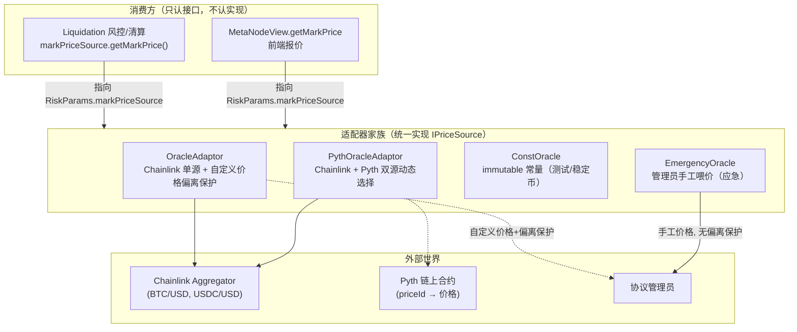
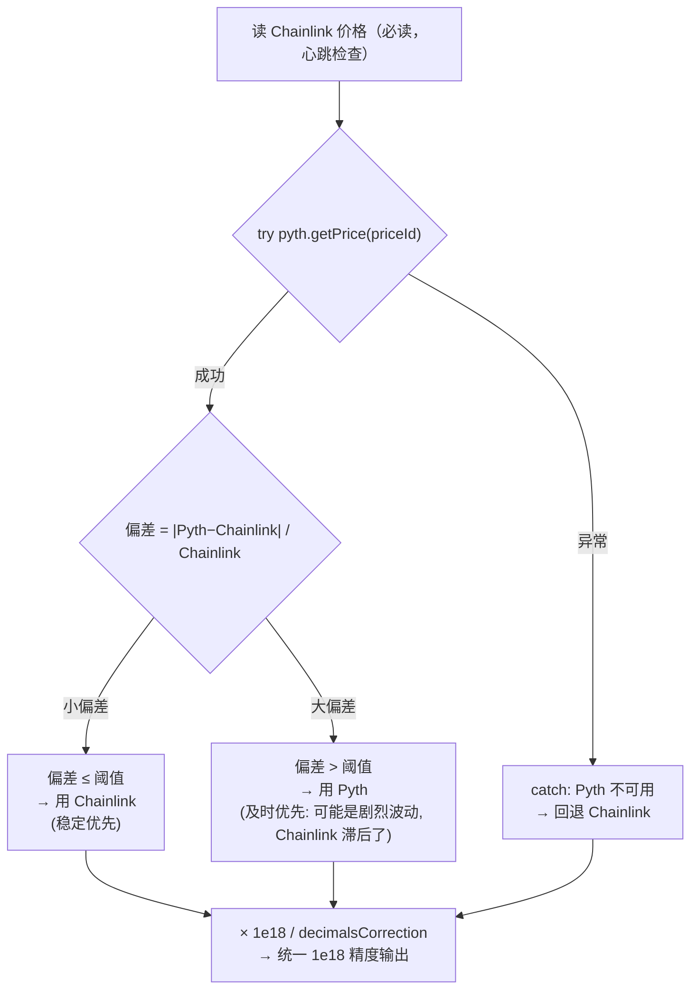

# 第 13 章：价格预言机体系 — OracleAdaptor、Chainlink 与 Pyth 的接入之道

> 涉及源码：`src/oracle/`（OracleAdaptor.sol、PythOracleAdaptor.sol、ConstOracle.sol、EmergencyOracle.sol）、`src/interfaces/internal/IPriceSource.sol`、`src/libraries/Types.sol`（RiskParams.markPriceSource）
> 第 11 章说"风控的可信度被预言机钳制"，本章打开这个钳子：**市场价格从哪来、怎么被标准化、被谁保护、坏了怎么办**。预言机是这类协议最依赖外部信任的模块，也是审计的必争之地。

---

## 1. 本章导读

### 1.1 类比：交易所的"报价台"与四路通讯社

永续合约的一切风控（体检、清算价、清算资格）都依赖一个数字：**标记价格**。这个数字不能由协议自己拍脑袋定（既当运动员又当裁判），必须由外部权威提供。本项目把"报价台"抽象成一个极简接口：

```solidity
interface IPriceSource {
    function getMarkPrice() external view returns (uint256);   // 唯一必需的方法
}
```

然后接了**四路"通讯社"**，全部实现这一个接口：

| 通讯社 | 文件 | 定位 | 价格来源 |
|---|---|---|---|
| OracleAdaptor | `oracle/OracleAdaptor.sol` | 主力 | Chainlink（Push 型，官方持续推送） |
| PythOracleAdaptor | `oracle/PythOracleAdaptor.sol` | 混合增强 | Chainlink + Pyth 双源校验 |
| ConstOracle | `oracle/ConstOracle.sol` | 测试桩 | 部署时写死的常量 |
| EmergencyOracle | `oracle/EmergencyOracle.sol` | 应急 | 管理员手工喂价 |

类比：交易所前台挂一块大屏，**无论报价来自哪路通讯社，屏上格式统一**（1e18 精度、USDC 计价）。市场（Perpetual）通过 `RiskParams.markPriceSource` 指向其中一路，完全不关心背后是谁——**换通讯社 = 改一个地址参数**，业务代码零改动。这就是适配器模式在预言机场景的标准应用。

### 1.2 为什么预言机模块要这么复杂？

"取个价格"听起来是一行代码，实际要回答四个刁钻问题：

1. **精度对齐**：Chainlink 返回 8 位小数，系统内部统一 1e18——换算错了，价格会差 1e10 倍（灾难级）。
2. **计价基准**：风控公式里的净值以 USDC 计价，但 Chainlink 报的是"资产/USD"——严格说要用"资产/USD ÷ USDC/USD"换算成"资产/USDC"。
3. **新鲜度**：一条三小时前的价格对清算毫无意义——心跳检查强制"价格必须足够新"。
4. **可用性**：Chainlink 故障时市场不能停摆——应急通道 + 双源冗余。

本章的代码就是这四个问题的工程答案，每个答案都带自己的权衡。

### 1.3 Push 与 Pull：两种预言机哲学

- **Chainlink（Push 型）**：网络方持续把价格**推**上链，任何合约随时读——"水龙头拧开就有水"。代价：心跳间隔内的价格是滞后的，极端行情下滞后致命。
- **Pyth（Pull 型）**：价格先在链下聚合，交易者需要时**付费拉**最新价上链——"现取现用"。优点：几乎零滞后；代价：每次使用前必须有人付 update 费用并提交证明。

本项目的 `PythOracleAdaptor` 同时接两路，用"偏差判断"动态选择——这是本章最有意思的设计，3.7 节展开。

---

## 2. 架构 / 流程图

### 2.1 预言机家族的适配器拓扑



### 2.2 `PythOracleAdaptor.getPrice` 的三岔决策（本章最有意思的逻辑）



**反直觉点先标出来**：偏差**大**时反而用 Pyth。多数人会以为"偏差大说明某一路错了，应该保守"——但作者的推理是：偏差大通常发生在**剧烈波动**中，Chainlink 的推送有心跳延迟，此刻它才是"旧价格"；Pyth 的链下聚合更及时，应该信新的。这个判断对不对，取决于你对两路数据源的信任排序——3.7 节和踩坑第 1 条会给出攻击视角的反思。

---

## 3. 核心代码拆解

### (1) `ConstOracle`：最小实现，定义了"适配器"的形状

```solidity
// src/oracle/ConstOracle.sol
contract ConstOracle {
    uint256 public immutable price;          // 部署时定死, 永不改变

    constructor(uint256 _price) { price = _price; }

    function getMarkPrice() external view returns (uint256) { return price; }
}
```

**为什么从最傻的开始讲？** 因为它是接口的"教科书实现"：无状态、无外部调用、行为完全确定——Foundry 测试里所有市场的标记价格都由它提供（30000e18 就是 30000 美元），这让交易、清算、资金费的测试**完全可复现**。写协议时先做一个 ConstOracle 作为测试桩，是工程节奏上的正确选择。注释里还点了一个真实用例：**稳定币市场可以直接用 ConstOracle(1e18)**——对 USDC 本位的永续，1 美元恒定，无需报价。

### (2) `EmergencyOracle`：救命稻草与双刃剑

```solidity
// src/oracle/EmergencyOracle.sol（节选）
contract EmergencyOracle is Ownable {
    uint256 public price;          // 可由管理员随时改写
    uint256 public roundId;        // 递增轮次, 供链下追踪

    function getMarkPrice() external view returns (uint256) { return price; }

    function setPrice(uint256 newPrice) external onlyOwner {   // 手工喂价
        price = newPrice;
        emit AnswerUpdated(SafeCast.toInt256(newPrice), roundId, block.timestamp);
        roundId += 1;                                           // 事件格式与 Chainlink 对齐
    }
}
```

**两个细节**：其一，事件特意用 Chainlink 同名格式（`AnswerUpdated`），让监控工具**无需区分价格来自哪路**——链下可观测性的贴心设计。其二，注意它与 `OracleAdaptor` 的自定义价格有一个关键差别：**EmergencyOracle 没有任何偏离保护**（它自己是独立适配器，没有 Chainlink 基准可对比）。管理员在这里拥有无约束的定价权——它是"Chainlink 彻底挂掉"时的最后手段，启用它等于把定价权临时交给团队。治理与安全含义见踩坑第 4 条。

### (3) `getChainLinkPrice`：双源读取与精度换算（本章最易懵的一段）

```solidity
// src/oracle/OracleAdaptor.sol
function getChainLinkPrice() public view returns (uint256) {
    int256 rawPrice; uint256 updatedAt;
    (, rawPrice,, updatedAt,) = IChainlink(chainlink).latestRoundData();       // 资产/USD (8位小数)
    (, int256 usdcPrice,, uint256 usdcUpdatedAt,) = IChainlink(usdcSource).latestRoundData(); // USDC/USD
    require(block.timestamp - updatedAt <= heartbeatInterval, "ORACLE_HEARTBEAT_FAILED");     // 心跳①
    require(block.timestamp - usdcUpdatedAt <= usdcHeartbeat, "USDC_ORACLE_HEARTBEAT_FAILED");// 心跳②
    uint256 tokenPrice = (SafeCast.toUint256(rawPrice) * 1e8) / SafeCast.toUint256(usdcPrice);
    //            ↑ 换算成"资产/USDC", 保持 8 位小数刻度
    return tokenPrice;
}
// 外层再归一: return (getPrice() * 1e18) / decimalsCorrection;   → 1e18 精度
```

**逐步数值演算**（假设 BTC/USD = 30000，USDC/USD = 1.00000000，decimalsCorrection = 1e8）：

```
Chainlink 原始值: BTC/USD = 3000000000000  (即 30000 × 1e8)
                  USDC/USD = 100000000     (即 1 × 1e8)

tokenPrice = (3000000000000 × 1e8) / 100000000 = 3000000000000
           → 30000 × 1e8, 即"资产/USDC"的 8 位小数表达

归一化: 3000000000000 × 1e18 / 1e8 = 30000e18   → 1e18 精度的 30000 ✔
```

**两个换算步骤的目的各不相同**：除以 USDC/USD 是把"USD 计价"修正为"USDC 计价"（USDC 脱锚 1% 时，系统眼里的 BTC/USDC 价格会同步偏移——**计价基准的波动被如实计入**，这对以 USDC 结算的保证金体系是正确且必要的）；乘以 `1e18/decimalsCorrection` 则是纯精度搬运。两件事在代码里被乘在一起，初读极易看混——拆开演算是唯一可靠的读法。

### (4) 心跳检查：新鲜度的强制执行

```solidity
require(block.timestamp - updatedAt <= heartbeatInterval, "ORACLE_HEARTBEAT_FAILED");
```

Chainlink 的推送有心跳间隔（如 BTC/USD 每 1 小时必更新一次，异常时更频繁）。若当前时间减去最后更新时间**超过**心跳间隔，说明数据源本身出问题了（网络方停止服务）——此时宁可让整个市场"价格冻结"（getMarkPrice revert → 一切风控操作失败），也不允许用陈旧价格做清算。**"没有价格"比"有过期价格"安全**——这是清算体系的一条铁律（第 10 章清算盲区的另一面：冻结总比错清好）。

### (5) 自定义价格的偏离保护：给管理员后门加锁

```solidity
function getPrice() internal view returns (uint256) {
    uint256 chainLinkPrice = getChainLinkPrice();       // 无论如何先读 Chainlink 作为基准
    if (isSelfOracle) {
        uint256 MetaNodePrice = price;                   // 管理员设置的自定义价
        uint256 diff = MetaNodePrice >= chainLinkPrice
            ? MetaNodePrice - chainLinkPrice : chainLinkPrice - MetaNodePrice;
        require((diff * 1e18) / chainLinkPrice <= priceThreshold, "deviation is too big");
        return price;                                    // 偏差 ≤ 阈值才放行
    }
    return chainLinkPrice;
}
```

**设计意图**：`isSelfOracle` 是给团队的手动干预通道（例如 Chainlink 心跳正常但价格明显异常的罕见场景），而 `priceThreshold`（如 3%）保证自定义价**永远不能偏离 Chainlink 太远**——管理员可以"微调"，不能"重定价"。注意它**仍然要先读 Chainlink**：偏离保护必须有一个客观基准，拿掉基准，阈值就形同虚设。这是"给后门上锁"的标准姿势：**权限可以特殊，规则必须普适**。

### (6) `PythOracleAdaptor.getPrice`：try/catch 的三岔决策

```solidity
function getPrice() internal view returns (uint256) {
    uint256 chainLinkPrice = getChainLinkPrice();               // 主基准
    try pyth.getPrice(priceId) returns (PythStructs.Price memory pythPriceStruct) {
        uint256 pythPrice = SafeCast.toUint256(pythPriceStruct.price);
        uint256 diff = pythPrice >= chainLinkPrice ? pythPrice - chainLinkPrice : chainLinkPrice - pythPrice;
        if ((diff * 1e18) / chainLinkPrice <= priceThreshold) {
            return chainLinkPrice;    // 一致 → 信 Chainlink (多轮验证的稳定源)
        } else {
            return pythPrice;         // 分歧大 → 信 Pyth (及时性优先, Chainlink 可能滞后)
        }
    } catch {
        return chainLinkPrice;        // Pyth 不可用 → 安全回退
    }
}
```

**Solidity 的 try/catch 只捕获外部调用异常**——`pyth.getPrice` 可能因 Pyth 合约未更新该价格流、参数错误等 revert，catch 后回退 Chainlink，保证**任何单源故障都不阻断报价**。三岔逻辑的信任排序是：一致时信"权威"（Chainlink），分歧时信"新鲜"（Pyth），缺失时信"可用"。读者应意识到这是一个**动态信任分配**策略——它假设两路数据源各自独立、不同时坏。3.7 的思考题会挑战这个假设。

### (7) 接线方式：`markPriceSource` 让换源变成改配置

```solidity
// 市场注册时指定价格源 (libraries/Operation.setPerpRiskParams)
state.perpRiskParams[perp] = param;   // param.markPriceSource = 某个适配器地址

// 消费端 (Liquidation.getTotalExposure 内):
int256 price = SafeCast.toInt256(IPriceSource(params.markPriceSource).getMarkPrice());
```

**依赖倒置的教科书应用**：消费方依赖接口（`IPriceSource`），不依赖实现。新市场上线而 Chainlink 尚未支持该资产？先指向 EmergencyOracle 手工喂价，Chainlink 上线后一笔 `setPerpRiskParams` 切换过去——**预言机的演进不牵动业务代码**。配套的治理要求：切换动作应有事件告警与（理想情况下）时间锁，因为换价格源 = 换风控基准（踩坑第 4 条）。

### (8) 精度策略总表：三套刻度一家亲

| 层 | 刻度 | 例（BTC=30000） | 出处 |
|---|---|---|---|
| Chainlink 原始值 | 8 位小数 | 3000000000000 | `latestRoundData()` |
| 适配器中间值（资产/USDC） | 8 位小数 | 3000000000000 | `getChainLinkPrice` |
| 系统统一值（getMarkPrice 出口） | 1e18 | 30000e18 | `(price × 1e18) / decimalsCorrection` |
| 系统内部（paper/费率） | 1e18 | — | `Types.ONE` |
| USDC credit | 1e6 | 30000e6 | USDC 原生精度 |

`decimalsCorrection = 10 ** _decimalsCorrection` 在构造函数里由部署参数算出（Chainlink 全家桶是 8，所以传 8）——**它是一个"必须与所接数据源匹配"的部署配置**，配错就是灾难（踩坑第 3 条）。

### (9) Pyth 的 Pull 模型：本项目的一个值得注意的简化

```solidity
try pyth.getPrice(priceId) returns (PythStructs.Price memory pythPriceStruct) { ... }
```

按 Pyth 的标准用法，读取前应先由调用者支付 update 费用（`pyth.updatePriceFeeds{value: fee}(priceIds)`）把最新证明拉上链，`getPrice` 读到的才是"现在"的价格。本适配器**只读不拉**：读到的永远是"最后一次有人付费更新"的价格。日常交易频繁时总有别人顺手更新，问题不大；冷清时段 Pyth 路的价格可能同样陈旧。这是教学化简（或权衡了集成成本），但**读代码的人必须知道这个缺口**——踩坑第 1 条。

### (10) 设计总复盘：预言机的"信任分层"

| 层 | 信任对象 | 保护机制 |
|---|---|---|
| 正常 | Chainlink 网络共识 | 心跳检查（新鲜度） |
| 波动 | Pyth 链下聚合 | 偏差触发切换（及时性） |
| 应急 | 协议管理员 | 自定义价阈值（OracleAdaptor 内）/ 无（EmergencyOracle） |
| 测试 | 无 | ConstOracle 常量 |

一句话总结：**每往下一层，保护越少、权力越大**。正常路径有多重数学护栏，应急路径只剩治理纪律。评估这类系统时，最重要的一个问题永远是：**"应急路径平时锁着吗？谁有钥匙？钥匙转动的瞬间有没有人能看到？"**

---

## 4. Web3 特有机制

1. **Push vs Pull 预言机**：Chainlink 心跳推送（读便宜、有滞后）与 Pyth 付费拉取（新鲜、有使用成本）。双源混用是当前 DEX 衍生品的主流趋势——**用 Push 打底、Pull 补时效**。
2. **`try/catch` 的适用边界**：只能捕获外部调用的异常（含 precompile/合约 revert），不能捕获本合约逻辑错误。它在这里承担"单源故障降级"的关键职责——没有它，Pyth 一抖，全市场报价瘫痪。
3. **事件格式对齐（生态互操作）**：`AnswerUpdated` 与 Chainlink 同名同参，监控/索引基础设施零成本复用。**向生态标准靠拢**是降低集成成本的隐形设计。
4. **`immutable` 配置 + 构造期校验**：价格源地址、心跳、精度因子全部 immutable——部署后不可篡改（防管理员偷换数据源），代价是改配置必须重部署适配器。**配置的安全性与可运维性在此对立**，本项目选了安全。
5. **跨合约外部调用的 gas 与风险**：`getMarkPrice` 是外部调用（不是 view 编译器内联），风控循环里每个市场调一次。失败模式（revert）会传染给清算交易——预言机故障时，清算交易 revert，这在拥堵期会形成"清算挤兑"（大家抢着在价格恢复前清算，全部 revert）。
6. **整数除法的偏差计算**：`(diff * 1e18) / chainLinkPrice` 先乘后除保精度，与全项目 `decimalMul/Div` 风格一致；注意分母是 Chainlink 价（假设它非零——若数据源返回 0 会除零 revert，心跳检查间接兜底）。

---

## 5. 本章小结与思考题

### 5.1 核心知识点回顾

- **适配器模式**：四路通讯社统一实现 `IPriceSource.getMarkPrice()`，市场通过 `RiskParams.markPriceSource` 一个地址接线，换源零代码改动。
- **双源读取与精度链**：资产/USD ÷ USDC/USD → 资产/USDC（8 位）→ ×1e18/decimalsCorrection → 系统统一 1e18；两步换算语义不同（计价修正 vs 精度搬运）。
- **心跳检查**：数据源停更 → 价格冻结（revert）→ 宁停不错。
- **偏离保护两级**：OracleAdaptor 的自定义价被阈值锁死（管理员可微调不可重定价）；PythOracleAdaptor 的三岔决策（一致信权威、分歧信新鲜、缺失信可用）。
- **信任分层**：正常 → 波动 → 应急 → 测试，越往下保护越少、权力越大。

### 5.2 思考题

1. **`PythOracleAdaptor` 读 Pyth 价格时没有检查 `publishTime` 新鲜度**。请构造一个攻击场景：在 Pyth 价格流长时间无人付费更新（冷门时段）的前提下，攻击者如何利用"旧 Pyth 价 + 剧烈新行情"的组合，让 `getPrice` 选出对攻击者有利的陈旧价格？（提示：Chainlink 正常推送了新价、Pyth 停在旧价 → 偏差必然超阈值 → 系统选 Pyth——**"分歧大 = 信新鲜"的推理前提是 Pyth 确实新鲜**。）修复方案是什么（在 try 分支里加什么检查）？
2. **为什么 `OracleAdaptor` 的自定义价格要先读 Chainlink 做基准，而 `EmergencyOracle` 可以完全没有基准？** 两者在"信任模型"上的本质区别是什么（提示：前者是"同一适配器内的降级开关"，管理员权力被同一合约内的数学限制；后者是"独立合约"，启用它 = 风控配置层把整个市场切换到人治）。由此总结多源预言机系统里"配置审计"要检查哪几件事。

---

## 6. 踩坑提示

1. **Pyth 读价未校验新鲜度（本项目的真实缺口）**：如思考题 1 所析，陈旧的 Pyth 价恰好会在"偏差大"分支被优先采用——**最信任它及时性的分支，恰恰最需要新鲜度检查**。修复很简单：`require(block.timestamp - pythPriceStruct.publishTime <= pythInterval)`。读第三方集成的预言机代码时，永远检查"它有没有读 publishTime/updatedAt"。
2. **`decimalsCorrection` 配错 = 价格错 10^n 倍**：接入不同小数位的 Chainlink feed（8 位是 crypto 主流，外汇/商品可能不同）时若照抄 8，清算价与净值全部失真。上线 checklist 必须含"价格数值量级断言"（如 BTC 价应在 1e4~1e5 之间）——一句 assert 能拦住灾难。
3. **双源读取的连带故障**：USDC/USD 是所有市场的公共依赖，它心跳失败时**全市场报价瘫痪**（每个 getChainLinkPrice 都会 revert）。这是"共享基础设施单点"问题：公共依赖越少越好，或为 USDC 这类准稳定资产提供 ConstOracle(1e18) 降级方案（偏离风险 vs 可用性的权衡）。
4. **EmergencyOracle 无偏离保护**：它作为 `markPriceSource` 时，管理员价格直达风控核心。与 `OracleAdaptor.isSelfOracle`（有阈值锁）不同，这把锁不存在。启用应急源应当是**多方签 + 时间锁 + 链下全员告警**的仪式级操作，代码层面无法防御，只能靠治理流程兜底。
5. **清算挤兑与预言机故障的组合**：预言机恢复的瞬间，积压的清算交易集中释放，且都以恢复后的新价格执行——上一刻"该清没清"的仓位可能被新价格直接穿透（跳过缓冲带）。做清算策略要监控预言机健康状态，把"恢复瞬间"视为高风险窗口；做协议审计则要问：恢复后的第一笔清算用的是不是连续的价格序列。

---

> 下一章预告（第 14 章）：子账户系统——SubaccountFactory 如何用最小合约给大户提供风险隔离，代理创建的 gas 权衡，以及"系统核心不知道子账户存在"的抽象红利。
