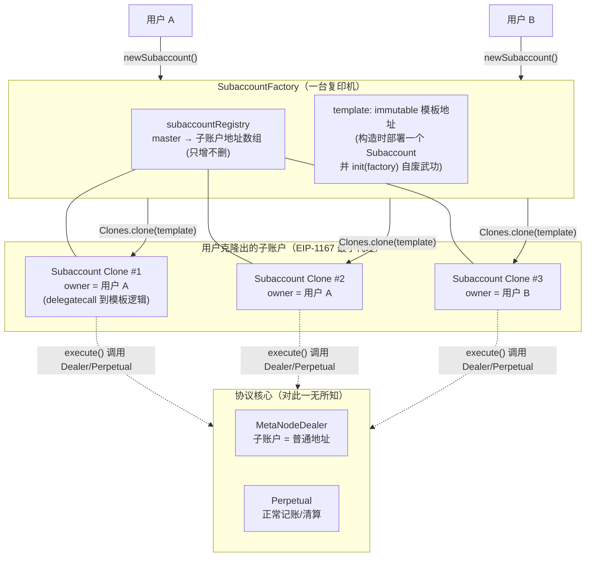
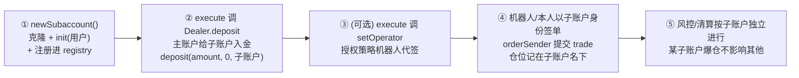

# 第 14 章：子账户系统 — Subaccount 与 SubaccountFactory 的隔离记账

> 涉及源码：`src/subaccount/Subaccount.sol`、`src/subaccount/SubaccountFactory.sol`
> 本章是源码精读的最后一站，代码量最少（两个合约合计不到 300 行）但模式密度很高：**EIP-1167 最小代理、可初始化模式、万能调用网关**。读完它，你对"链上账户体系"的理解将补上最后一块拼图。

---

## 1. 本章导读

### 1.1 为什么大户需要"一拖 N"的账户？

想象一个量化团队在交易所里跑三个策略：趋势跟踪、期现套利、做市。如果三个策略共用一个账户——

- 趋势策略爆仓，做市策略的保证金被交叉清算**连坐**；
- 账单混在一起，绩效无法归因；
- 授权给三个策略机器人的 API Key 权限难以切分。

解决方案人尽皆知：**开三个独立账户**。但链上有两个现实障碍：其一，每个新地址都要重新入金、配置，运营繁琐；其二，链上"开账户"其实是"部署合约"，直接部署一次要烧约 20 万 gas。

本项目的答案是一个**极小的"空壳账户"合约**（Subaccount）+ 一台**复印机**（SubaccountFactory，用 EIP-1167 最小代理克隆空壳，成本降到约 1/4）。类比：**母公司备好一份标准章程模板，每开一家子公司只需复印盖章，而不是重新立法**。

### 1.2 最关键的设计哲学：系统核心不知道子账户的存在

回看第 5 章的 `Types.State` 和第 3 章的全景图——**你找不到任何"子账户"字段**。子账户在 Dealer 眼里就是一个普通地址：能存款、能开仓、能被清算。它的全部魔力来自三个通用机制的自然组合：

1. **任何地址都能开户交易**（开放参与权）；
2. **`deposit` 允许"我存钱、记到别人账上"**（`deposit(..., to)` 参数）；
3. **`setOperator` 允许授权他人代签订单**（用户自授权体系）。

子账户 = 一个由你完全控制的合约地址 + 这三个通用机制的组合用法。**协议核心零改动，功能白拿**——这是抽象设计给你的红利，也是本章要传递的最重要的架构思想。

### 1.3 本章的三个技术看点

1. **EIP-1167 最小代理（Clone）**：如何用约 45 字节的"转发器"实现合约复印；
2. **可初始化模式（init pattern）**：为什么不用 constructor，以及配套的安全细节；
3. **万能调用网关（execute）**：一个函数如何让子账户操作整个 DeFi 世界，错误转发为什么要用汇编。

---

## 2. 架构 / 流程图

### 2.1 Factory、模板与克隆的全景



### 2.2 一个子账户从出生到交易的完整流程



**注意第②步的资金方向**：主账户调用**子账户的 `execute`**，由子账户自己去调 `Dealer.deposit`，钱从主账户转出、记账到子账户名下。子账户是合约、不能主动掏主账户的钱——**资金流向永远由 master 发起**。

---

## 3. 核心代码拆解

### (1) `Subaccount` 的存储与可初始化模式

```solidity
// src/subaccount/Subaccount.sol
contract Subaccount {
    address public owner;          // 子账户的主人
    bool public initialized;       // 一次性初始化开关

    modifier onlyOwner() {
        require(owner == msg.sender, "Ownable: caller is not the owner");
        _;
    }

    function init(address _owner) external {
        require(!initialized, "ALREADY INITIALIZED");   // 只许初始化一次
        initialized = true;                             // 先改开关再写 owner (CEI 习惯)
        owner = _owner;
    }
}
```

**为什么不用 constructor？** 这是理解本章的钥匙。constructor 只在**部署时**执行，而 Clone 模式的核心是"**只部署一次逻辑，之后零部署复制**"——复制品不执行 constructor（它们根本不是"部署"出来的，见 3.4）。所以逻辑合约必须把初始化从 constructor 挪到普通的 `init` 函数里，让每个克隆事后自行设定 owner。这就是 OpenZeppelin `Initializable` 模式的手写版。

### (2) 不可转让的 owner：与标准 Ownable 的一个刻意的不同

```solidity
/// @dev 与标准 Ownable 不同，所有权不可转让
address public owner;
```

标准 Ownable 有 `transferOwnership`，这里的 owner **永远不可更换**。**为什么？** 子账户的生命周期绑定"当前控制者"：允许转让 = 允许"出售爆仓边缘的子账户""钓鱼转移""误操作后无法挽回"等一整类风险，而收益（换手管理权）几乎为零——大不了新开一个子账户。**用"不可变"消灭一整类攻击面**，是链上安全设计的常用狠招（类似第 7 章 immutable 的配置）。

### (3) Factory 构造：模板的"自废武功"

```solidity
// src/subaccount/SubaccountFactory.sol
address immutable template;

constructor() {
    template = address(new Subaccount());       // 部署逻辑模板
    Subaccount(template).init(address(this));   // ★ 关键一步: 模板 owner 设为工厂自身
}
```

这一行 `init(address(this))` 是防错设计的点睛之笔。回想 `init` 的语义："第一个调用我的人成为 owner"。模板是所有克隆的逻辑源，但它自己**也是一个可调用的合约实例**——如果留着它不初始化，任何人都可以抢跑 `init(攻击者)` 把模板据为己有（虽然模板没有资金，危害有限，但会造成状态混乱与钓鱼空间）。把 owner 设为工厂合约（一个没有任何私钥、不会发起调用的地址），**等于给模板贴上"此件非卖品"的封条**。每个克隆的存储独立，模板的状态永远污染不到它们。

### (4) `newSubaccount`：复印一次的全过程

```solidity
function newSubaccount() external returns (address subaccount) {
    subaccount = Clones.clone(template);            // ① 复印: EIP-1167 最小代理
    Subaccount(subaccount).init(msg.sender);        // ② 初始化: 调用者成为 owner
    subaccountRegistry[msg.sender].push(subaccount); // ③ 登记: 注册进名下列表
    emit NewSubaccount(msg.sender, subaccountRegistry[msg.sender].length - 1, subaccount);
}
```

三步原子完成。**为什么 clone 和 init 必须在同一笔交易？** 分开的话，clone 出来的地址处于 `initialized == false` 的"无主"状态——任何旁观者（或抢跑机器人）都可以抢先 `init` 把你的子账户偷走。原子性让"出生即有主"，没有抢跑窗口。这与第 3 章 Perpetual 构造函数"部署 + transferOwnership 原子完成"是同一条纪律：**初始化过程不留给世界任何可插入的空档**。

### (5) EIP-1167 最小代理：45 字节的复印术

```solidity
// OpenZeppelin Clones.clone 的产物是一个这样的合约:
//
// 0x363d3d373d3d3d363d73 <模板地址20字节> 5af43d82803e903d91602b57fd5bf3
//
// 它的运行逻辑等价于:
//   fallback() external payable {
//       delegatecall 到模板地址;   // 用子账户的存储执行模板的代码
//       转发返回值/错误;
//   }
```

**delegatecall 是复印术的灵魂**：克隆合约**没有自己的逻辑**，收到调用后把模板代码借来，但**读写的是克隆自己的存储**。于是"owner = 用户 A"存在克隆 A 的存储里，"owner = 用户 B"存在克隆 B 的存储里——**一份代码，N 套账本**。gas 对比如源码注释：直接部署约 200,000，克隆约 45,000——**批量开户场景下成本差一个数量级**，且克隆字节码极短，链上验证负担也小。

代价也要清楚：克隆的 `extcodesize` 探测、部分与部署相关的特性（如 `immutable` 在克隆中不可用——所以 `Subaccount` 里没有 immutable 变量）与直接部署存在差异。用 EIP-1167 前要确认逻辑合约"没有 constructor 依赖"。

### (6) `execute`：万能调用网关

```solidity
function execute(address to, bytes calldata data, uint256 value)
    external payable onlyOwner returns (bytes memory)
{
    require(to != address(0), "execute address is empty");
    require(msg.value == value, "TRANSFER_PAYMENT_NOT_MATCH");   // ETH 数量对账
    (bool success, bytes memory returnData) = to.call{ value: value }(data);
    if (!success) {
        assembly {                                              // 转发错误信息
            let ptr := mload(0x40)
            let size := returndatasize()
            returndatacopy(ptr, 0, size)
            revert(ptr, size)
        }
    }
    emit ExecuteTransaction(owner, address(this), to, data, value);
    return returnData;
}
```

**这是子账户唯一的"手脚"**：owner 可以让它调用**任意合约的任意函数**（可带 ETH）。源码注释给出了两个标准用法：

```text
// 给自己(子账户)存保证金:
execute(dealer, abi.encodeWithSelector(IDealer.deposit.selector, amount, 0, address(this)), 0)
// 授权策略机器人代签:
execute(dealer, abi.encodeWithSelector(IDealer.setOperator.selector, operator, true), 0)
```

注意第一个用法里 `to = address(this)` 参数——**存款记账对象是子账户自己**，资金从 owner 钱包（或主账户）转入 Dealer 并记在子账户名下。

**为什么错误转发要用汇编？** 直接 `require(success)` 会把失败信息压成一句干巴巴的 revert，链下调试无从下手；汇编三连（`returndatasize / returndatacopy / revert`）把底层调用的**原始错误**原样向上抛——你在 Etherscan 上看到的错误就是 Dealer 内部的真实错误。这是"包装合约"的调试友好标配。

### (7) 登记表：只增不删的索引

```solidity
mapping(address => address[]) subaccountRegistry;   // 用户 → 子账户列表
// 源码注释: 子账户只能添加, 不能删除
```

**为什么不支持"注销/删除"？** 链上无法真正"销毁"一个有历史的地址；从登记表摘除只会让链下丢索引，而地址本身照样存在（还可能持有仓位！）。"只增不删"避免了"删除后子账户仍在市场上活跃"的假象。链下若要标记"弃用"，应该在应用层维护状态，而不是欺骗登记表。

### (8) 子账户 vs `setOperator`：两种"代操作"的对照

| 维度 | setOperator（第 5 章） | 子账户 |
|---|---|---|
| 身份 | 操作员**用你的身份**签单（订单 signer 还是你） | 合约**用自己的地址**独立开户 |
| 风险隔离 | ❌ 与主账户完全共账 | ✔ 独立保证金、独立清算 |
| 保证金共享 | 是（全仓） | 否（除非手动互相 deposit） |
| 适用 | 单人多机器人 | 机构多交易员 / 多策略 / 对外托管 |
| 实现成本 | 一个 mapping | 一份合约 + 复印机 |

**选型口诀**：只要"代下单"→ operator；要"隔离爆仓半径"→ 子账户。两者还能叠加：子账户 owner 再 setOperator 给策略机器人。

### (9) 风控视角：子账户在体检与清算中的样子

第 11 章的 `getTotalExposure` 遍历的是**地址**的 `openPositions`——子账户作为独立地址，体检完全独立。**交叉保证金的边界从此变成"地址"**：主账户与子账户之间、子账户与子账户之间，互不连坐。代价与收益同样明显：收益是爆炸半径隔离；代价是资金利用率下降（每个子账户都要各自留缓冲带，无法跨策略共享保证金）。**隔离与效率的权衡，是账户体系设计的永恒主题**——本项目把它交给用户自己选择（开几个子账户随你）。

### (10) 设计总复盘：三个通用机制 = 一个新功能

```text
子账户功能 = 开放参与权(任何地址可交易)
           + deposit(…, to) 的记账自由
           + setOperator 的授权体系
           + (本模块) 一个可克隆的万能调用壳
```

**协议核心的 0 行改动**换来了机构级功能。反观中心化系统，加一个"子账户"要动账户表、权限表、清算引擎……链上系统之所以能做到这种"涌现式扩展"，是因为它的底层原语（地址、记账、签名授权）足够通用。**把通用性做进地基，让组合发生在应用层**——这是全项目架构给我们的最后一课。

---

## 4. Web3 特有机制

1. **EIP-1167 最小代理（Minimal Proxy/Clone）**：~45 字节的 `delegatecall` 转发器。gas 约为直接部署的 1/4；注意克隆不执行 constructor、不可用 immutable、`EXTCODESIZE` 行为一致但创建码不同。
2. **`delegatecall` 的存储语义**：代码借自模板，存储用克隆自己的——"一份代码 N 套账本"的机制根源。这也意味着**模板存储与克隆存储完全隔离**（模板的自废武功 init 不会影响任何克隆）。
3. **可初始化模式（init pattern）**：constructor 的 Clone 替代品。安全三要素：一次性开关（`initialized`）、与 clone 同笔交易执行、模板预初始化防抢跑。
4. **汇编错误转发**：`returndatasize/returndatacopy/revert` 三连，把底层 revert 的原始原因冒泡给链下调试工具——包装合约的必备礼仪。
5. **"地址即账户"的通用性**：协议不区分 EOA、合约钱包、子账户——**凡是地址都能被记账**。这是链上系统与 Web2 用户体系最深层的架构差异：身份层没有"用户"概念，只有可签名的地址。
6. **事件驱动的注册表镜像**：`NewSubaccount` 带 indexed master + index，链下可完全重建 `subaccountRegistry`——链上存一份、事件存一份的双写纪律（第 5 章的老朋友）。

---

## 5. 本章小结与思考题

### 5.1 核心知识点回顾

- **子账户 = 可克隆的万能调用壳**：owner 不可转让、`init` 一次性、`execute` 网关三件套。
- **Factory = 复印机**：`Clones.clone + init + 登记` 原子三连，模板 `init(factory)` 自废武功。
- **EIP-1167**：delegatecall 让一份逻辑服务 N 套存储，gas 降一个数量级。
- **协议核心零感知**：子账户功能由"开放参与权 + deposit(to) + setOperator"三个通用机制涌现，一行核心代码未改。
- **隔离与效率的交换**：地址级风控隔离换资金利用率下降，选择权交给用户。

### 5.2 思考题

1. **如果把 Factory 构造函数里的 `Subaccount(template).init(address(this))` 删掉**，具体会发生什么？请推演攻击者的完整动作：谁能在什么时机 init 模板？成为模板 owner 后，`execute` 能调用什么、造成什么实际损失（提示：模板没有资金，但想想它有 `initialized=true` 后对"新建克隆"有没有影响？再想想钓鱼场景——一个"看起来正常"但被陌生地址控制的模板对生态意味着什么）？由此体会"预初始化防抢跑"的真正保护对象。
2. **设计"主账户给子账户注资 1000 USDC"的完整调用链**：涉及几次外部调用？每次的 `to/data/value` 是什么？如果要求"子账户把利润转回主账户"，调用链又是什么（提示：`executeWithdraw` 的 `from` 可以是子账户、`to` 是主账户；或比较 `fastWithdraw` 的 isInternal 路径）。做完你会发现：**子账户间的资金调度全部要经由 owner 手动编排**——这是"隔离"的另一面账单。

---

## 6. 踩坑提示

1. **`init` 抢跑窗口**：如果集成方不通过 Factory、自己 `Clones.clone` 再补 init，两笔交易之间的空档足以让抢跑者偷走子账户（`init(攻击者)`）。**永远用原子路径**（Factory 或同笔交易内 clone+init），或用 CREATE2 + 预计算地址校验。
2. **`execute` 是万能钥匙，钓鱼面极大**：owner 被诱导对一个恶意合约调用 execute（如伪装的"质押合约"），资金直接转移。前端应展示完整 calldata 解码结果；协议层面无法防御——**合约钱包的钓鱼防护只能靠签名 UX**（参考 EIP-712 的可读性改进思路）。
3. **克隆的存储成本错觉**：EIP-1167 省的是**部署** gas；每个克隆仍要为 `owner/initialized` 及后续在 Dealer 的记账付正常存储费用。"便宜的是开壳，不便宜的是使用"。
4. **`maxPositionAmount` 按地址计**：多子账户 = 多份持仓市场数配额。这既是大户绕开风控遍历成本的结构性通道（每地址成本有界，总体成本线性增长），也是做市商扩容的合理方式——审计风控压力模型时要按"地址数 × maxPositionAmount"估计全局最坏遍历规模。
5. **模板地址不是"官方实例"**：任何人都能部署自己的 Factory 与自己的克隆家族。链下服务识别"某地址是否为合法子账户"时，应验证其 EIP-1167 转发目标是否为你信任的 Factory 的模板——否则一个长得一模一样的克隆可能出自攻击者的复印机（转发到钓鱼逻辑）。**验证转发目标，而不是验证长得像**。

---

> 下一章预告（第 15 章）：MetaNodeView 与 Operation——只读查询面与管理员治理面的完整函数清单，把前 13 章的功能按"谁来调用"重新编排成一张速查地图。
