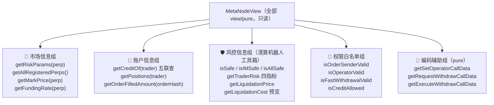
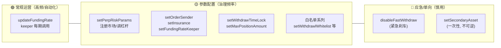

# 第 15 章：MetaNodeView 与 Operation — 只读查询面与管理员治理面

> 涉及源码：`src/MetaNodeView.sol`（30+ 个只读函数）、`src/MetaNodeOperation.sol`（管理员配置全家桶）、`src/libraries/Operation.sol`（实现层）
> 前面各章按"业务线"精读了核心逻辑；本章换一个切片——**按"谁在调用"重新编排**，把 View（查询面）与 Operation（治理面）梳理成一张速查地图。它是读完全书后的"总复习" + 接入开发的"工具手册"。

---

## 1. 本章导读

### 1.1 类比：银行大堂的两种窗口

回看第 4 章的大楼 metaphor：MetaNodeDealer 这栋楼里，External 是营业大厅（人人可进出），剩下的两个楼层是——

- **MetaNodeView（自助查询大厅）**：装了一排查询机，谁都能按，不要钱，只出报告不出钱。前台、清算机器人、做市商、审计员都是这里的常客。
- **MetaNodeOperation（行长办公室）**：只有一把钥匙（`onlyOwner`）外加一把专属钥匙（`onlyFundingRateKeeper`），改的都是"规则本身"——开哪个市场、杠杆多高、谁有资格撮合。

这两个楼层自己**几乎不产生新逻辑**：View 是对 `Liquidation` 库和 state 的只读包装，Operation 是对 `Operation` 库的鉴权包装。它们的价值不在计算，而在**组织信息的视角**：View 把散落各处的状态按"使用者关心的问题"重新聚合；Operation 把所有权力集中到一个门口，让审计一眼看到"权力清单"。

### 1.2 View 面向的三类客人

| 客人 | 关心什么 | 主要函数 |
|---|---|---|
| 前端/行情站 | 报价、账户资金、持仓 | `getMarkPrice` / `getCreditOf` / `getPositions` / `getFundingRate` |
| 清算机器人 | 谁不健康、清算价多少、清算能赚多少 | `isSafe` / `getTraderRisk` / `getLiquidationPrice` / `getLiquidationCost` |
| 撮合/集成方 | 订单余量、白名单、授权状态 | `getOrderFilledAmount` / `isOperatorValid` / `isCreditAllowed` |

### 1.3 Operation 的三组钥匙

1. **市场管理**：`setPerpRiskParams`（注册市场 + 下发风控参数）；
2. **系统角色**：`setFundingRateKeeper` / `setInsurance` / `setOrderSender`——给第 2 章的角色演员分配工牌；
3. **安全阀与开关**：`setWithdrawTimeLock` / `disableFastWithdraw` / 白名单系列——紧急时刻的刹车与通道。

本章末尾会做一次"权力清单审计"：如果 owner 私钥被盗，哪一条最危险？

---

## 2. 架构 / 流程图

### 2.1 View 层函数地图：按使用场景分组



### 2.2 Operation 层的权力光谱：从"常规运营"到"核按钮"



越往右，操作的不可逆性与影响力越大，治理流程（多签/时间锁）应当相应升级——这是配置函数设计的"危险度光谱"。

---

## 3. 核心代码拆解

### (1) 声明头：View 也是"半张 IDealer"

```solidity
// src/MetaNodeView.sol
abstract contract MetaNodeView is MetaNodeStorage, IDealer {
    // 全部函数 view 或 pure
}
```

与 External/Operation 一样继承 `IDealer`——因为 `isAllSafe`、`getLiquidationPrice` 等既是链下查询，也是清算流程里被 Perpetual 回调的逻辑（第 11 章的 `_isMMSafe` 家族在此露出对外接口）。**同一份实现，两种消费视角**：view 调用（免费查询）与交易内调用（风控强制）。

### (2) 账户信息组：`getCreditOf` 的"五联查"

```solidity
function getCreditOf(address trader)
    external view returns (
        int256 primaryCredit,              // 主资产余额（可为负）
        uint256 secondaryCredit,           // 次级资产余额
        uint256 pendingPrimaryWithdraw,    // 待取款主资产
        uint256 pendingSecondaryWithdraw,  // 待取款次级资产
        uint256 executionTimestamp         // 取款可执行时间戳
    )
{ /* 依次读取五个 mapping，一次调用全部返回 */ }
```

**为什么聚合？** 这五个字段天然同屏出现（钱包页的"可用余额/提现中/解冻时间"），拆成五个调用 = 五次 RPC 往返；聚合后一次 `eth_call` 拿全。**View 层的设计准则是"按消费场景聚合，不按存储结构罗列"**——它是对 state 的一次"人机接口翻译"。

### (3) 风控信息组：清算机器人的完整工具箱

```solidity
function isSafe(address trader) external view returns (bool)              // 活着吗（MM）
function isIMSafe(address trader) external view returns (bool)            // 能开新仓吗（IM）
function isAllSafe(address[] calldata l) external view returns (bool)    // 批量终审
function getTraderRisk(address trader)
    external view returns (int256 netValue, uint256 exposure, uint256 initialMargin, uint256 maintenanceMargin)
function getLiquidationPrice(address trader, address perp) external view returns (uint256)
function getLiquidationCost(address perp, address liquidatedTrader, int256 requestPaperAmount)
    external view returns (int256 liqtorPaperChange, int256 liqtorCreditChange)
```

清算机器人的标准工作流恰好是一遍这些函数：`getTraderRisk` 扫描猎物（保证金率逼近清算线）→ `getLiquidationPrice` 定瞄准镜 → `getLiquidationCost` 预估收益 → 链下决策 → 发起 `liquidate`。**View 层把"清算决策所需的一切"做成了可免费预演的纯函数**——第 11 章的计算逻辑在这里全部变成"试算"服务。

### (4) `getLiquidationCost`：清算的"模拟器"

```solidity
function getLiquidationCost(address perp, address liquidatedTrader, int256 requestPaperAmount)
    external view returns (int256 liqtorPaperChange, int256 liqtorCreditChange)
{
    (liqtorPaperChange, liqtorCreditChange,) =
        Liquidation.getLiquidateCreditAmount(state, perp, liquidatedTrader, requestPaperAmount);
}
```

直接复用清算的定价函数（只丢弃保险费返回值）。**清算前能精确预知"吃下这单能拿多少 paper/credit"**——这既是清算人的福利，也意味着**所有清算人看到的收益完全一致**，清算竞争的胜负不在信息差，而在速度与 gas 策略（第 12 章的竞标格局由此定型）。

### (5) 订单查询：链下预检的守门员

```solidity
function getOrderFilledAmount(bytes32 orderHash) external view returns (uint256 filledAmount) {
    filledAmount = state.orderFilledPaperAmount[orderHash];
}
```

撮合服务器在链下配对前，可用它检查每张订单的剩余可成交量，避免组装出一笔"必 revert"的 tradeData。**把"会失败的交易"提前拦截在链下**，是这个函数的全部价值——链上 revert 不退 gas，预检就是省钱。

### (6) 编码辅助组：为第 14 章的 `execute` 配的"标准插头"

```solidity
// src/MetaNodeView.sol（pure 函数）
function getSetOperatorCallData(address operator, bool isValid) external pure returns (bytes memory) {
    return abi.encodeWithSignature("setOperator(address,bool)", operator, isValid);
}
function getRequestWithdrawCallData(address from, uint256 primaryAmount, uint256 secondaryAmount)
    external pure returns (bytes memory) { ... }
function getExecuteWithdrawCallData(address from, address to, bool isInternal, bytes memory param)
    external pure returns (bytes memory) { ... }
```

这三位的消费场景正是子账户的 `execute(to, data, value)`（第 14 章）：需要把"调 Dealer 的某个函数"打包成 calldata 传给子账户时，用它们**在链上、按官方模板**拼装。**设计意图是"消灭手拼 calldata 的拼写错误"**——不过这里用的是 `encodeWithSignature`（字符串签名），拼错字符串会在**运行时**悄悄产生错误的 selector（调用失败或打错函数），不如 `encodeWithSelector` 编译期可查（见踩坑第 2 条）。一个有意思的品味问题：**协议官方提供"标准插头"，但插头本身用的是偏弱的插口标准**。

### (7) Operation 全家桶速览

```solidity
// src/MetaNodeOperation.sol 函数清单（按危险度排列）
function updateFundingRate(address[] calldata, int256[] calldata) external onlyFundingRateKeeper; // 常规运营
function setPerpRiskParams(address perp, Types.RiskParams calldata) external onlyOwner;  // 市场注册+风控参数
function setFundingRateKeeper(address) external onlyOwner;
function setInsurance(address) external onlyOwner;
function setMaxPositionAmount(uint256) external onlyOwner;
function setWithdrawTimeLock(uint256) external onlyOwner;
function setOrderSender(address, bool) external onlyOwner;
function setFastWithdrawalWhitelist(address, bool) external onlyOwner;
function setWithdrawlWhitelist(address, bool) external onlyOwner;   // ← 注意函数名拼写
function disableFastWithdraw(bool) external onlyOwner;              // 应急刹车
function setSecondaryAsset(address) external onlyOwner;             // 一次性
```

每个实现都转手给 `Operation` 库（第 4 章讲的"薄入口 + 库实现"），Operation 层的价值=**把全部权力收进一个门 + 每个函数配一个语义化名字**。

### (8) `disableFastWithdraw`：唯一的功能开关

```solidity
function disableFastWithdraw(bool disabled) external onlyOwner {
    Operation.disableFastWithdraw(state, disabled);   // 紧急情况一键停用快速取款
}
```

这是全系统唯一的"功能熔断开关"（circuit breaker）。快速取款绕过时间锁（第 1 章），风险敞口本来就比普通取款大——出事时第一刀砍它，普通取款的时间锁流程继续为健康用户提供出口。**熔断要打在"高收益高风险"的捷径上，而不是砍断大动脉**——关闭一切存取看似安全，实际会把系统锁死成金库（对恐慌用户是二次伤害）。

### (9) `setSecondaryAsset`：一次性的配置

```solidity
// libraries/Operation.sol（节选）
function setSecondaryAsset(Types.State storage state, address _secondaryAsset) external {
    // 次级资产只能设置一次（首次设置后不可更改），且要求小数位与主资产一致
}
```

"只能设置一次"是链上配置的经典保护：资产类型决定全系统的估值与风控语义，**中途换资产 = 所有历史账目失去可比性**。宁可锁死，不可暧昧。同类思路还有第 7 章 immutable 的 domainSeparator。

### (10) 权力清单审计：owner 私钥被盗，哪条最致命？

| 函数 | 作恶动作 | 破坏力 |
|---|---|---|
| `setPerpRiskParams` | 把某市场 `markPriceSource` 换成假预言机、抬高 `liquidationPriceOff` | ★★★★★ 定价权 + 清算赏金通吃，全市场仓位可被精准误清 |
| `setInsurance` | 指向自己的钱包 | ★★★★★ 保险费与坏账兜底资金全部改道 |
| `setOrderSender` | 加自己为撮合员 | ★★★☆☆ 可提交任意合法签名订单（仍需真签名，但可抢手续费/审查交易） |
| `setWithdrawTimeLock` | 设为 0 | ★★★★☆ 拆掉取款缓冲，配合钓鱼可加速抽干 |
| `setFundingRateKeeper` | 自任 keeper | ★★★★☆ 任意拨动全市场水表（第 10 章无幅度闸门） |

结论：**没有时间锁的多签，这串函数就是一颗顶两颗的核弹**。生产部署的第一课：`onlyOwner` 的 owner 不该是 EOA，而应是多签 + 时间锁。本项目把权限收拢成"一个门"（利于审计），但门后没有第二道闸——**收拢权力与制衡权力是两件事**。

---

## 4. Web3 特有机制

1. **view 调用免费但有隐性成本**：`eth_call` 不花 gas，但依赖节点的最新状态计算；`getTraderRisk` 内部循环 + 跨合约调用，重查询在高并发下有节点负载成本——链下通常用事件重建 + 本地计算替代高频 view（第 9 章的分工）。
2. **multicall 组合查询**：View 层按场景聚合 + 链下 multicall 打包，是"一次 RPC 拿全决策信息"的标配组合。清算机器人的扫描频率高，这两个优化直接决定竞争力。
3. **pure 编码函数与选择器安全**：`encodeWithSignature`（字符串）vs `encodeWithSelector`（编译期常量）。前者灵活但拼写错误只在运行时暴露；后者靠编译器把关。**给别人的"标准件"，尽量用编译期可校验的方式造**。
4. **熔断开关（circuit breaker）**：`disableFastWithdraw` 属于"暂停类治理"，业界惯例是**暂停权限与升级权限分离**（guardian 只能暂停、不能改参数）——本项目未做此分离，guardian 若持有 owner 全权，"暂停"可以变"永久"。
5. **一次性配置（setSecondaryAsset）**：用 require 把"不可逆决策"固化在代码里，比文档约定可靠。
6. **函数名拼写也是接口**：`setWithdrawlWhitelist`（漏了 i）一旦部署即成永久事实——集成方、事件监听、文档都得以它为准。**链上改名等于破坏性升级**。

---

## 5. 本章小结与思考题

### 5.1 核心知识点回顾

- **View = 按消费场景聚合的只读层**：市场组 / 账户组 / 风控组 / 权限组 / 编码辅助组五块，服务前端、清算机器人、集成方三类客人。
- **清算工具箱**：`getTraderRisk → getLiquidationPrice → getLiquidationCost` 构成免费试算闭环，清算竞争因此变成速度竞争。
- **Operation = 权力的唯一门**：常规运营（keeper）与治理配置（owner）分级；`disableFastWithdraw` 是唯一熔断器；`setSecondaryAsset` 是一次性不可逆配置。
- **权力清单审计**：`setPerpRiskParams`（换价格源）与 `setInsurance` 是最危险的两条；`onlyOwner` 收拢了权力但没有制衡，生产环境需要多签 + 时间锁。
- **编码辅助函数服务子账户 execute**，但 `encodeWithSignature` 的运行时校验是个品味瑕疵。

### 5.2 思考题

1. **为 `disableFastWithdraw` 设计"guardian/owner 权限分离"**：guardian 只能置 `disabled = true`，只有 owner 能恢复 `false`。写出这个修饰符/函数集的代码草图，并推演：如果 guardian 私钥被盗，攻击者能造成什么（最大损失是什么？是资金损失还是可用性损失？）。对比"owner 单人掌握全部开关"的方案，说明**"能暂停"与"能改规则"分离**为什么是治理设计的黄金准则。
2. **给 View 层新增一个 `getAccountSummary` 函数**（一次返回：净值、敞口、保证金率、清算价、各市场持仓数量）。它会调用哪些现有函数？循环几次预言机？在清算机器人 0.1 秒轮询一次的负载下，这个设计比"机器人自己组合 5 个现有查询"好还是差？由此体会 **"聚合层次"与"通用性"的权衡**——不是越聚合越好。

---

## 6. 踩坑提示

1. **真实的函数名拼写笔误**：`setWithdrawlWhitelist`（正确拼写是 Withdrawal）。它已成链上事实，集成方只能将错就错。教训：**部署前的接口评审要把函数名当 API 合同逐字审**——这不是洁癖，是后期无法修复的永久标签。
2. **`updateThreshold` 事件的 old value 是假的**：`OracleAdaptor/PythOracleAdaptor` 中 `priceThreshold = newPriceThreshold; emit UpdateThreshold(priceThreshold, newPriceThreshold);`——先赋值再 emit，事件里的"旧值"实际是新值。链下若依赖此事件做参数变更审计，历史轨迹全部失真。**事件语义 bug 不影响资金安全，却悄悄摧毁可观测性**——比崩溃更难发现。
3. **`encodeWithSignature` 的静默失败**：字符串签名拼错（比如多一个空格）不会编译报错，而是产生一个不存在的 selector——子账户 execute 后调用失败或打到意外函数。与本项目同风格的新代码，建议统一 `encodeWithSelector(IDealer.setOperator.selector, ...)`。
4. **view 查询可能 revert**：`getMarkPrice`/`getTraderRisk` 在预言机心跳失败时直接 revert。前端要为"报价接口整体失败"设计降级 UI；清算机器人要区分"账户健康"与"价格不可用"两种状态（第 10、11 章清算盲区的工程化落地）。
5. **`onlyOwner` 是单点不是分层**：本章权力清单里没有时间锁、没有多签约束、没有参数变更上下限（比如 `liquidationPriceOff` 可以被设成 100%）。学习本项目时把"权限收拢"当作**审计便利性**的优点，同时在自己的项目里补上"制衡"那一半。

---

> 下一章预告（第 16 章）：测试与部署实战——用 Foundry 的 `script/` 与 `test/` 目录，亲手跑通 Deploy → Deposit → Trade → Funding → Liquidate 的完整闭环，把前 15 章的知识全部落到终端里。
