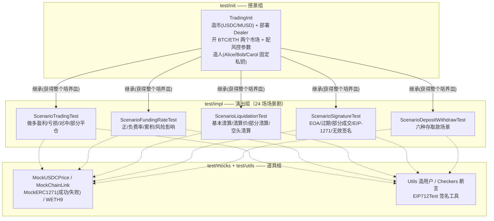
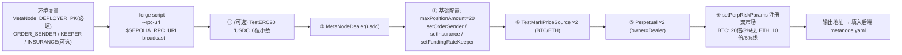

# 第 16 章：测试与部署实战 — 用 Foundry 跑通 Deposit → Trade → Funding → Liquidate 闭环

> 涉及源码：`test/`（init / impl / mocks / utils 四个目录）、`script/`（DeploySepolia.s.sol 一键部署等）、`foundry.toml`
> 前 15 章我们一直在"读"代码；本章把终端打开，**亲手把整个交易所从部署到清算跑一遍**。这一章是一份可执行的实验手册——所有命令与数字都来自项目真实的测试与脚本。

---

## 1. 本章导读

### 1.1 类比：生物实验室的"培养皿"

前 15 章是解剖课（看真实的器官怎么连），本章是实验课：**在培养皿里重建一个微缩生态**，然后做受控实验——

- **培养皿** = Foundry 的本地 EVM（`forge test` 自动起一个临时链，测完即焚）；
- **受控变量** = cheat codes（`vm.prank` 伪装任何人、`vm.warp` 拨动时间、`vm.sign` 用任意私钥签名）——**上帝模式**；
- **实验记录** = 场景化测试（`testScenario1_LongProfitClose`），每个实验的名字就是结论。

为什么这个项目的测试值得精读？因为它用的是**场景剧（Scenario）组织法**：每个测试是一个完整业务故事（开仓 → 行情变化 → 平仓/清算），断言写的是**业务结论**（"Alice 应该盈利约 $5000"）而不是实现细节。这种测试既是质量保障，也是**最好的使用文档**——你读不懂某个函数时，先找有没有场景剧演过它。

### 1.2 Foundry 三件套与本项目的分工

| 工具 | 作用 | 本项目对应 |
|---|---|---|
| `forge test` | 跑单元/场景测试 | `test/` 目录（24 个场景测试） |
| `forge script` | 广播部署/交易到链 | `script/` 目录（Sepolia 一键部署） |
| `cast` | 单发查询/交易 | 部署后验链上状态 |
| `anvil` | 本地开发链 | 手动联调后端时使用 |

### 1.3 本章路线图

先看测试目录的**组织架构**（为什么分 init/impl/mocks/utils），再拆一个场景剧的完整剧本，然后把 `DeploySepolia` 脚本跑通主网测试网，最后留一份**你自己动手的实验清单**。

---

## 2. 架构 / 流程图

### 2.1 测试体系：一套"剧组"架构



**继承即搭景**：`TradingInit` 是唯一的"造物主"合约，所有场景测试继承它——每个测试开跑时都得到一个**全新的、配置一致的世界**（Foundry 对每个测试函数独立执行 setUp/init）。测试之间的隔离由框架保证，这正是场景剧敢写"绝对结论"的原因。

### 2.2 部署流水线：`DeploySepolia` 的一键开服



**与生产部署的差距要心里有数**：脚本部署的是 `TestMarkPriceSource`（任何人可改价格）和 `TestERC20`——源码注释自己都写了"仅适合测试网；生产请换预言机"。它是一份**可运行的部署骨架**，而非生产管线。

---

## 3. 核心代码拆解

### (1) `initUsers`：为什么用固定私钥？

```solidity
// test/init/TradingInit.sol
tradersKey[0] = 0xA11CE;  // Alice
tradersKey[1] = 0xB0B;    // Bob
tradersKey[2] = 0xC0C;    // Carol
for (uint256 i; i < traders.length; i++) {
    traders[i] = vm.addr(tradersKey[i]);   // 从私钥推导地址
}
```

随机生成的私钥无法在测试里"预知地址"，而签名订单必须**先知道 signer 再构造订单**。固定私钥（0xA11CE 谐音 Alice，Foundry 社区梗）让 `vm.sign(key, digest)` 在测试里随手可用。**"确定性造人"是所有签名相关测试的前提**——这个技巧你写任何 DeFi 测试都会用到。

### (2) `initMetaNodeDealer`：一个测试宇宙的创世参数

```solidity
metaNodeDealer.setMaxPositionAmount(10);
metaNodeDealer.setOrderSender(address(this), true);   // ★ 测试合约自己当撮合员！

// BTC-PERP: 5% 初始保证金(20倍杠杆), 3% 清算线, 1% 折扣, 1% 保险费
// ETH-PERP: 10% 初始保证金(10倍杠杆), 5% 清算线, 1% 折扣, 2% 保险费
metaNodeDealer.setPerpRiskParams(address(perpList[0]), paramBTC);
metaNodeDealer.setPerpRiskParams(address(perpList[1]), paramETH);
metaNodeDealer.setSecondaryAsset(address(musd));
metaNodeDealer.setFundingRateKeeper(address(this));   // 测试合约也是 keeper
metaNodeDealer.setInsurance(insurance);               // users[0]

for (...) { usdc.mint(traders[i], 1_000_000e6); ...approve... }  // 每人 100 万 USDC
```

两个"演员一人分饰多角"的细节值得注意：**测试合约同时担任 orderSender 和 fundingRateKeeper**——因为它有 Dealer 的全部权限（部署者即 owner），可以代表"链下服务"执行动作。另外**双市场刻意配了不同杠杆参数**（BTC 20 倍 / ETH 10 倍），让"风控按市场独立计算"这个特性天然被测试覆盖。

### (3) `buildOrder`：链下签名的手工复现（第 7 章的实验验证）

```solidity
function buildOrder(address signer, uint256 privateKey, int128 paper, int128 credit, address perpetual)
    public view returns (Types.Order memory order, bytes memory signature)
{
    int64 makerFeeRate = 1e14;   // 0.01%
    int64 takerFeeRate = 5e14;   // 0.05%
    bytes memory infoBytes =
        abi.encodePacked(makerFeeRate, takerFeeRate, uint64(block.timestamp), uint64(block.timestamp));
    //                              ↑maker        ↑taker        ↑expiration      ↑nonce

    order = Types.Order({ perp: perpetual, signer: signer, paperAmount: paper, creditAmount: credit, info: bytes32(infoBytes) });

    bytes32 domainSeparator = EIP712Test._buildDomainSeparator("MetaNode", "1", address(metaNodeDealer));
    bytes32 digest = keccak256(abi.encodePacked("\x19\x01", domainSeparator, EIP712Test._structHash(order)));
    (uint8 v, bytes32 r, bytes32 s) = vm.sign(privateKey, digest);
    signature = abi.encodePacked(r, s, v);
}
```

第 7 章讲的三层哈希（TYPEHASH → structHash → digest）在这里被**逐层手工组装**——这是验证你理解程度的最好的代码：能与链上 `_structHash`/`_hashTypedDataV4` 对上号，说明你真懂了。注意 `info` 的打包顺序与第 7 章的位域图完全一致（两个 int64 费率 + 两个 uint64）。

### (4) `testScenario1_LongProfitClose`：最完整的一场戏

```solidity
function testScenario1_LongProfitClose() public {
    // 步骤1: 开仓——Alice 多 1 BTC@30000, Bob 空 1 BTC@30000
    trade(1e18, -30_000e6, -1e18, 30_000e6, 1e18, 1e18, address(perpList[0]));
    (int256 alicePaper, ) = perpList[0].balanceOf(traders[0]);
    assertEq(alicePaper, 1e18, "Alice should have 1 BTC long");

    // 步骤2: 行情——BTC 涨到 $35,000
    priceSourceList[0].setMarkPrice(35_000e6);
    (int256 aliceNetValue,,,) = metaNodeDealer.getTraderRisk(traders[0]);
    assertTrue(aliceNetValue > int256(INITIAL_MARGIN), "Alice should be in profit");

    // 步骤3: 平仓——双向在 35000 反向成交
    trade(-1e18, 35_000e6, 1e18, -35_000e6, 1e18, 1e18, address(perpList[0]));
    (alicePaper, ) = perpList[0].balanceOf(traders[0]);
    assertEq(alicePaper, 0, "Alice position should be closed");

    // 步骤4: 结账——从总行余额反推盈亏
    (int256 aliceFinalCredit,,,,) = metaNodeDealer.getCreditOf(traders[0]);
    int256 alicePnL = aliceFinalCredit - int256(INITIAL_MARGIN);
    assertTrue(alicePnL > 4900e6, "Alice should profit ~$5000");    // 5000 − 手续费
    assertTrue(bobPnL < -4900e6, "Bob should lose ~$5000");
}
```

这个测试就是第 6 章 T0–T4 笔算的**可执行版**：价格盈亏 5000，手续费吃掉约 100 上下（taker 0.05% × 30000+35000 ≈ 32.5，maker 侧 0.01% × 65000 ≈ 6.5，具体分摊见第 8 章），所以断言用范围（>4900e6）而非精确值。**"改价"只需一行 `priceSourceList[0].setMarkPrice(...)`**——这就是测试桩预言机的上帝模式。

### (5) `testScenario1_PositiveFundingRate`：资金费的零和断言

```solidity
trade(1e18, -30_000e6, -1e18, 30_000e6, 1e18, 1e18, address(perpList[0]));
(, int256 aliceCreditBefore) = perpList[0].balanceOf(traders[0]);
(, int256 bobCreditBefore)   = perpList[0].balanceOf(traders[1]);

int256[] memory rates = new int256[](1);
rates[0] = 1e14;                                   // 累计读数更新到 +1e14（正费率）
metaNodeDealer.updateFundingRate(perps, rates);    // 测试合约以 keeper 身份拨水表

int256 aliceChange = aliceCreditAfter - aliceCreditBefore;
assertTrue(aliceChange > 0, "Long credit should increase with positive rate");
assertTrue(bobChange < 0, "Short credit should decrease with positive rate");
assertEq(aliceChange + bobChange, 0, "Should be zero-sum");   // ★ 零和检验
```

**最后那行零和断言是全场点睛**：它把第 10 章的"中性定理"（Δ × Σpaper = 0）写进了测试。注意测试注释明确写着"正资金费率：多头收钱"——**测试文件里的语义与恒等式一致**，再次印证第 10 章踩坑里"以数学和测试为准"的结论。

### (6) 清算场景剧：把第 11/12 章演出来

`ScenarioLiquidationTest` 的四个场景分别对应：基本清算（价格砸穿维持线 → 清算人接仓 → 验三方余额）、清算价计算（`getLiquidationPrice` 的结果与预期一致）、部分清算（吃一半，剩余仓位复活）、空头清算（方向镜像）。清算的触发在测试里同样是两行：`priceSource.setMarkPrice(砸穿价)` + `perp.liquidate(...)`——**"制造猎物"和"打猎"在培养皿里都只是一次调用**，你可以在这里无成本地试错自己的清算机器人逻辑。

### (7) 签名安全场景剧：五连击覆盖第 7 章

`ScenarioSignatureTest` 的五个场景逐一对应第 7 章的知识点：EOA 正常签名、过期订单 revert（`expiration` 检查）、部分成交（`orderFilledPaperAmount` 累计）、**合约钱包 EIP-1271**（`MockERC1271` 魔数验证）、无效签名拒绝（`MockERC1271Failed` + 假签名）。注意 mock 目录里**故意放了一个"验签失败"的合约**——负向测试（negative test）与正向测试同等重要，mock 一个"总是失败"的依赖是标准做法。

### (8) `DeploySepolia` 脚本的环境变量工程

```solidity
uint256 pk = _envPrivateKey("MetaNode_DEPLOYER_PK");          // 支持 0x 前缀或裸 hex
address orderSender  = vm.envOr("MetaNode_ORDER_SENDER", deployer);   // 可选参数带默认值
...
try vm.envString("MetaNode_USDC_ADDRESS") returns (string memory usdcEnv) {
    if (bytes(usdcEnv).length > 0) usdc = vm.parseAddress(usdcEnv);   // 复用已有 USDC
} catch {
    usdc = address(new TestERC20("USDC", "USDC", 6));                 // 未配置则现铸
}
```

**可选变量带默认值 + try/catch 读取**，让同一份脚本既能一键全新部署、又能接入既有代币。脚本尾部还有一个对接说明：把输出的 Dealer/Perp 地址填进后端 `metanode.yaml`——**脚本的任务边界到"输出地址"为止**，链下系统接线是下一步。

### (9) 一条隐藏的部署关卡：`via_ir` 与 24KB 上限

```bash
export FOUNDRY_PROFILE=sepolia   # 必须：开启 via_ir，否则 MetaNodeDealer 超过 24KB 无法在链上部署
```

脚本注释里这句是**第 4 章 EIP-170（24KB 合约大小限制）的实战回响**：`MetaNodeDealer` 拍平后的字节码超限，必须开启 `via_ir`（让 Solidity 走 Yul 中间表示做优化）才能塞进去。这也解释了为什么配置文件里可能存在多 profile——**本地测试与链上部署的编译配置可能不同**，"本地能测"不等于"能上链"。

### (10) 你的实验清单（照抄即可运行）

```bash
# ① 跑全部场景剧
forge test -vv                     # -vv 显示每个断言的失败详情

# ② 只跑清算场景
forge test --match-contract ScenarioLiquidationTest -vvvv   # -vvvv 带完整调用栈

# ③ 本地模拟部署（不广播，纯演练）
forge script script/DeploySepolia.s.sol:DeploySepoliaScript -vvvv

# ④ 广播到 Sepolia
export FOUNDRY_PROFILE=sepolia
export MetaNode_DEPLOYER_PK=<你的测试私钥>
forge script script/DeploySepolia.s.sol:DeploySepoliaScript \
  --rpc-url $SEPOLIA_RPC_URL --broadcast -vvvv

# ⑤ 部署后用 cast 验链
cast call <DEALER地址> "getAllRegisteredPerps()(address[])" --rpc-url $SEPOLIA_RPC_URL
cast send <价格源地址> "setMarkPrice(uint256)" 30000e6 --private-key <PK> --rpc-url $SEPOLIA_RPC_URL

# ⑥ 分叉主网复现（进阶）
forge test --fork-url $SEPOLIA_RPC_URL --match-test testScenario1_BasicLiquidation -vvv
```

---

## 4. Web3 特有机制

1. **Cheat codes（`vm.` 前缀）**：Foundry 通过预编译合约 `0x7109...` 提供上帝模式——`vm.prank` 伪装调用者、`vm.sign` 用任意私钥签名、`vm.warp` 拨时间（测订单过期/取款时间锁）、`vm.label` 给调试输出起名。**测试里可以做到主网不可能的事，这正是测试的价值**。
2. **测试隔离模型**：Foundry 对每个测试函数独立执行状态（含 setUp），场景剧之间零污染——这让"每个测试都从创世状态出发"成为可能。
3. **`vm.sign` 与确定性地址**：固定私钥 + `vm.addr` 是签名测试的标准起手式；生产里对应的流程是"链下钱包签 EIP-712"（第 7 章 JS 视角），测试里用 vm.sign 模拟同一件事。
4. **广播模式（broadcast）**：`forge script` 先本地 simulate，加 `--broadcast` 才真正发交易；输出 json 落在 `broadcast/` 目录，是链上部署的审计凭据。
5. **`via_ir` 与 EIP-170**：24KB 上限逼出的编译开关——**合约大小的治理要从写第一行代码就开始**（第 4 章的 library 化设计在这里拿到了回报：没有它，via_ir 也救不回来）。
6. **场景剧命名法**：`testScenarioN_业务结论` 的命名让测试报告直接可读——`forge test` 的输出本身就是一份"系统行为说明书"。负向场景（SignatureTest 的 InvalidSignatureRejected）与正向场景必须成对出现。

---

## 5. 本章小结与思考题

### 5.1 核心知识点回顾

- **剧组架构**：init 搭景（造币/部署/双市场/固定私钥造人）→ impl 演出（24 场场景剧）→ mocks/utils 道具，继承获得培养皿、框架保证隔离。
- **核心测试手法**：固定私钥签名（buildOrder 手工复现三层哈希）、测试合约一人分饰 orderSender/keeper、一行 setMarkPrice 制造行情、断言写业务结论（含零和断言与范围断言）。
- **部署实战**：环境变量工程（必填/可选/try-catch 读取）、TestMarkPriceSource 的测试网定位、`via_ir` 与 24KB、cast 验链。
- **场景覆盖矩阵**：存取款 6 场、交易 4 场、资金费 5 场、清算 4 场、签名 5 场——基本覆盖全书每个业务线。

### 5.2 思考题

1. **写一个不变量测试（invariant test）**：用 Foundry 的 `invariant_` 前缀 + handler 合约，断言"任意随机交易序列后，每个 Perpetual 的 Σpaper == 0"（提示：handler 提供 trade/liquidate 两个动作，`vm.roller` 随机调用；参考 forge 文档的 Invariant Testing）。这是第 8 章守恒律的终极检验，也是真实审计中最有性价比的一类测试。写完后试着加第二个不变量："Σ(credit 变化) == −Σ(手续费 + 保险费)"，看哪里会打破你的第一个直觉。
2. **把 `TradingInit` 的 BTC 市场参数改成"初始 5% / 维持 3%"并构造一个"只亏 1.5% 就被清算"的极端仓位**——算一算这是多少倍杠杆下的什么仓位，然后写一个测试验证：在这个参数下，清算价公式（第 11 章 multiplier = 1−LT）给出的价格与实际触发清算的价格一致。这个练习会同时检验你对 RiskParams、getLiquidationPrice、清算资格三块知识的掌握。

---

## 6. 踩坑提示

1. **测试里的 `info` 打包方式不可照抄到生产**：`expiration` 与 `nonce` 都填了 `block.timestamp`——测试里"每单唯一"靠时间戳，生产里同一秒内的两张订单 nonce 相同 = 同一张订单！真实撮合服务器必须用递增 nonce 或随机数。**测试是简化的世界，抄它的时候要想清楚它简化了什么**。
2. **`TestMarkPriceSource` 任何人可改价**：Sepolia 脚本部署的它没有权限控制，"价格"是全公共的玩具。用这套脚本搭建的"测试网环境"做前端联调没问题，**做任何与真实资金沾边的实验都必须先换预言机**（第 13 章的适配器家族）。
3. **断言用了范围而不是精确值**（`> 4900e6`）：因为手续费的分摊取决于撮合细节（第 8 章）。这是合理的测试策略，但**别把它当成"手续费算不清"的借口**——要么把费率代入第 8 章公式精确复算，要么用 `vm.expectEmit` 校验 `OrderFilled` 事件里的 fee 字段。
4. **`FOUNDRY_PROFILE=sepolia` 忘开 = 部署必失败**：报错是难以理解的 `EIP-170: contract too large`。把编译 profile 写进部署文档与 CI，不要靠人肉记忆。
5. **测试合约兼任 orderSender 的权限残留**：`initMetaNodeDealer` 把测试合约设为撮合员，生产部署脚本则显式设置独立地址。**测试环境的角色分配不要无意带入主网配置**——核对 `DeploySepolia` 的环境变量默认值（全部 fallback 到 deployer）时要想清楚：deployer 私钥一旦同时是 orderSender/keeper/insurance，第 15 章"权力清单审计"的最坏情形就自动成立了。

---

> 下一章预告（第 17 章，终章）：安全审计视角——以审计师的身份把全书 16 章的知识重新过一遍，输出一份"风险面 × 防线 × 已知缝隙"的三栏清单，并给出学习路线的收官建议。
