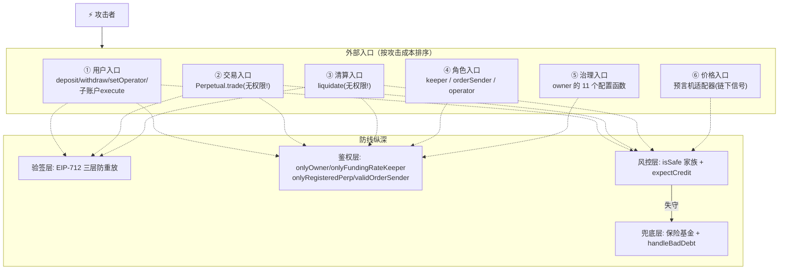
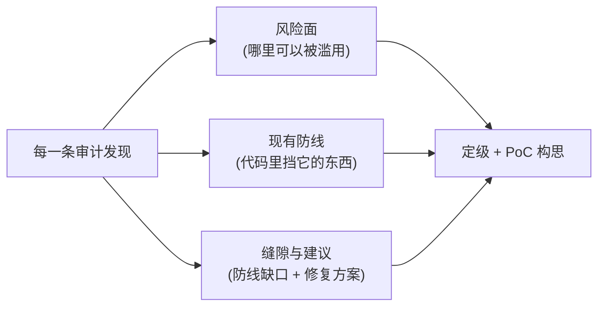

# 第 17 章：安全审计视角 — 重入、权限、坏账与预言机操纵的攻防清单

> 本章是全书终章。前 16 章我们用"建设者视角"把系统拆开看懂；本章切换到**攻击者与审计师的视角**，把 16 章积累的理解重组成一张"风险面 × 防线 × 已知缝隙"的攻防清单——既是一份对这个项目的迷你审计报告，也是一份你可以复用的审计方法论模板。

---

## 1. 本章导读

### 1.1 类比：从"建筑师"到"验房师"

读完 16 章，你已经像建筑师一样了解这栋楼怎么盖的：地基（Storage）、承重结构（记账恒等式）、水电管线（资金流）、门禁系统（鉴权）。**审计师验房时的思维恰恰相反**：不问"这里怎么用"，只问"**哪里能被滥用**"——

- 每扇门（外部入口）→ 谁能进？进去了能拿走什么？
- 每根水管（资金流）→ 有没有旁路？倒流会怎样？
- 每把锁（require/权限）→ 锁芯是真是假？有没有窗户没装锁？
- 每次停电（外部依赖故障）→ 楼里会窒息吗？

本章按这个"验房清单"把 MetaNode 走一遍。你会发现：前 16 章**每章的踩坑提示**其实就是审计发现的碎片——本章把它们拼成全景，并给出风险定级。

### 1.2 审计的三条基本心法

1. **信任边界清单法**：列出系统信任的每一个外部实体（用户、撮合服务器、keeper、预言机、管理员、清算人），对每个实体问同一句话——"它**完全作恶**时的最坏后果是什么？"如果答案涉及资金损失，防线不够；如果只是"拒绝服务/体验受损"，通常可接受（第 2 章对撮合服务器的分析就是范例）。
2. **守恒律优先**：记账系统的第一性不变量（本项目：`Σpaper = 0`、恒等式成立、手续费/保险费之外的转移严格对消）。所有能改变这些总量的路径都要逐条验证。
3. **最坏时序假设**：把每个状态变更想象成可以被任意其他交易**穿插**（内存池公开、MEV 存在），问"乱序插入会让哪个假设失效"。

### 1.3 风险定级约定

本章沿用审计行业惯例：**Critical**（直接资金损失）、**High**（特定条件下资金损失/核心功能瘫痪）、**Medium**（特定条件下利益受损/可利用的缝隙）、**Low/Informational**（代码质量、可观测性、Gas 优化）。

---

## 2. 架构 / 流程图

### 2.1 攻击面全景图：六个入口与它们的守卫



**读图方式**：审计就是从每个入口出发，沿箭头追问"守卫是否真的挡住我"。下面 3 节的发现清单就是走查结果。

### 2.2 风险清单的"三栏格式"（审计报告模板）



这个格式不仅用于审计——**你自己写合约时，对每个函数按三栏自检一遍**，就是最低成本的安全工程。

---

## 3. 审计发现清单（按严重度排序）

### 🔴 Critical 级（本项目未发现，但防线依赖单一假设）

#### 发现 C-1：管理员私钥 = 全系统资金与定价的终极开关

```solidity
// 11 个 onlyOwner 函数中, 以下三条组合足以不流血地掏空系统:
setPerpRiskParams(perp, ...)   // ① 换 markPriceSource 为自控的假预言机
setInsurance(attacker)         // ② 保险费与坏账全部改道
setFundingRateKeeper(self)     // ③ 任意拨动水表 → 重写所有人的 credit
```

- **风险面**：治理入口（⑤）。
- **现有防线**：`onlyOwner`——**仅此而已**。无多签、无时间锁、无参数上下限、无变更告警延迟。
- **缝隙与建议**：`owner` 应为多签 + 时间锁；`RiskParams`/费率类关键参数加"单次变更幅度上限 + 事件告警"；把"暂停"类权限（如 `disableFastWithdraw`）从 owner 拆给独立的 guardian（只能暂停、不能改规则）。**这是本项目与生产级协议之间最大的差距**，第 15 章权力清单审计表的完整版。

### 🟠 High 级（依赖外部条件触发）

#### 发现 H-1：Pyth 读价未校验新鲜度，"最信任及时的分支"可被陈旧价劫持

```solidity
try pyth.getPrice(priceId) returns (PythStructs.Price memory pythPriceStruct) {
    // ← 缺少: require(block.timestamp - pythPriceStruct.publishTime <= pythInterval)
    ...
    } else { return pythPrice; }   // 偏差大 → 信 Pyth
```

- **风险面**：价格入口（⑥）。
- **现有防线**：Chainlink 侧心跳完整；但 Pyth 分支的"偏差大 = 信新鲜"推理**预设了 Pyth 是新鲜的**。
- **缝隙与建议**：Pyth 价格流冷门时段无人付费更新时，`getPrice` 返回陈旧价；此时若 Chainlink 正常推送了新价，偏差必然超阈值 → **系统优先采用旧 Pyth 价**——一个确保"用旧价格"的悖论。建议补 `publishTime` 检查（一行修复）。攻击收益场景：剧烈行情中清算价被旧价锚定，清算人可对偏差方向下注。

#### 发现 H-2：`updateFundingRate` 无幅度闸门，keeper 单点双失守

- **风险面**：角色入口（④）+ 治理（⑤）。
- **现有防线**：`onlyFundingRateKeeper` 单地址；链上**不检查**读数增幅合理性（合约无从判断"合理"）。
- **缝隙与建议**：keeper 私钥泄露 = 任意重写全市场 credit（所有用户的账面资金由 `paper × rate` 现算）。修复组合：链下签名机隔离 + Δ 异常监控告警 + owner 可秒切 keeper（已有）+ 理想情况链上加"单期 Δ 上限"。这是**链上做机制、链下做政策**分工的代价面（第 10 章）。

### 🟡 Medium 级（可利用的缝隙与经济攻击面）

#### 发现 M-1：自成交防护只覆盖"对 Taker"

```solidity
require(i == 0 || order.signer != orderList[0].signer, Errors.ORDER_SELF_MATCH);
// 只防 Maker 与 Taker 同人; Maker 之间同 signer 未检查
```

- **风险面**：交易入口（②）。
- **现有防线**：`_priceMatchCheck` 限价 + 守恒律（自成交零和，无法直接凭空获利）。
- **缝隙与建议**：同一人可用两张 Maker 单互相对敲——刷交易量/伪造成交记录（对积分活动、 TVL 展示有意义），且 Maker 费率可为负（返佣）时存在"自成交吃返佣补贴"的套利。建议补全 Maker 之间的同签者检查，或产品层接受并文档化（第 3、8 章）。

#### 发现 M-2：`liquidate` 价格保护的乘法交叉比较可被极端值触发溢出 DoS

```solidity
require(liqtorCreditChange * requestPaper >= expectCredit * liqtorPaperChange, ...);
// int256 × int256, 0.8.x 下溢出 revert 而非回绕——安全性有底线, 但构成拒绝服务面
```

- **风险面**：清算入口（③）。
- **现有防线**：Solidity 溢出 revert（宁可失败不可算错）。
- **缝隙与建议**：极端大仓位时该乘法可能溢出 → 清算永远 revert → 坏账无法出清、风险堆积到保险基金。建议改用 OZ `SafeCast`/`mulDiv` 或在入口钳制单笔清算量。触发条件苛刻（需天文数字仓位），故定 Medium（第 3 章）。

#### 发现 M-3：`EmergencyOracle` 与治理换源组合 = 无约束的人治定价

- **风险面**：价格入口（⑥）+ 治理（⑤）。
- **现有防线**：`OracleAdaptor.isSelfOracle` 有 `priceThreshold` 偏离锁；但 `EmergencyOracle` 作为独立适配器**没有任何保护**，且 `setPerpRiskParams` 可随时把市场指向它。
- **缝隙与建议**：两步治理动作（部署 EmergencyOracle + 改 markPriceSource）即可对任意市场行使绝对定价权。建议：换源操作走时间锁 + 链下告警；或给 EmergencyOracle 保留"最近 Chainlink 价"做对照记录（第 13 章）。

#### 发现 M-4：域分隔符固化 `chainId`，跨分叉重放的 theoretical 面

```solidity
// MetaNodeStorage 构造期:
domainSeparator = EIP712._buildDomainSeparator("MetaNode", "1", address(this));
// chainId 在部署时被"烤"进分隔符——分叉后两侧若沿用原 chainId, 分隔符相同
```

- **风险面**：交易入口（②）。
- **现有防线**：`order.perp` 绑市场 + `orderFilledPaperAmount` 绑成交量——**同链内**重放被堵死；跨分叉的重放还要求两侧市场状态同步（成交量账本不同步时防超额仍生效）。
- **缝隙与建议**：改为验签时动态引用 `block.chainid`（OZ 5.x 模式）或部署后校验。低概率高影响，记录在案（第 7 章）。

#### 发现 M-5：碎片化部分清算可放大保险费抽取

```solidity
insuranceFee = (liqtorCreditChange.abs() * params.insuranceFeeRate) / Types.ONE;
// 每一笔部分清算单独抽费 → N 次小额清算的总保费 > 一次等额清算
```

- **风险面**：清算入口（③）。
- **现有防线**：`require(!_isMMSafe)` 保证每笔清算都有真实资格。
- **缝隙与建议**：清算人可将一笔清算拆成多笔以多抽保险费（费率 1%~2% 量级，损耗真实存在但有限），被清算者损失被放大。建议引入"最小清算粒度"或"同一区块内同一 victim 累计抽费封顶"（第 12 章）。

### 🟢 Low / Informational 级（代码质量与可观测性）

| 编号 | 发现 | 建议 |
|---|---|---|
| L-1 | `updateThreshold` 事件先赋值后 emit，old value 为新值（OracleAdaptor/PythOracleAdaptor） | 缓存旧值再 emit；链下参数审计依赖此事件 |
| L-2 | `setWithdrawlWhitelist` 函数名拼写笔误（Withdrawal） | 已成链上事实只能将错就错；新代码部署前做接口评审 |
| L-3 | `decimalMul/Div` 全部向零取整，保证金计算"对系统略不利" | 风控要求量向上取整、给与量向下取整（方向性取整） |
| L-4 | 批量 `updateFundingRate` 无 per-item 错误隔离，一个坏地址冻结全市场 | keeper 链下模拟剔除 + 可选 try/catch（权衡一致性） |
| L-5 | 错误信息风格混用（字符串 vs 自定义 Errors 常量） | 统一自定义错误（省 gas、链下可解析） |
| L-6 | `getLiquidationPrice` 返回 0 有三重含义（无仓/绝对安全/已清算） | 配套枚举返回或文档强制约定 |
| L-7 | openPositions 用 swap-and-pop，数组顺序不稳定 | 链下一律按 (user, perp, serialNum) 定位，已有机制支撑 |
| L-8 | 测试中 order info 的 nonce 用 block.timestamp | 生产撮合器必须用递增/随机 nonce（第 16 章） |

### ✅ 值得点名表扬的防线（审计报告的"亮点"节）

1. **CEI 纪律贯彻到位**：`_settle` 先改存储后回调、取款先清零 pending 再转账（第 3/9 章）。
2. **存储恒等式的数学自洽**：锚点反推使"部分兑现 = 一次性兑现"严格成立，无"忘写规则"型 bug 的土壤（第 6/9 章）。
3. **风控全部基于标记价格**而非成交价，价格操纵触发清算的经典攻击被结构性地挡住（第 11 章）。
4. **`expectCredit`/限价兜底 + 交叉相乘**在 trade 与 liquidate 双入口一致实施，MEV 防御成体系（第 8/12 章）。
5. **`handleBadDebt` 的双重守门**（openPositions 空 + !isMMSafe ≡ 余额为负）从数学上排除了"误勾销健康账户"（第 9 章）。
6. **"链上做机制、链下做政策"的边界清晰**：验签、守恒、幂等在链上；撮合、费率政策、盯盘在链下——信任边界文档化程度高。

---

## 4. Web3 特有机制

1. **审计产出物**：完整审计报告 = 概要（范围+结论）→ 信任模型描述 → 发现清单（三栏格式 + 定级 + PoC）→ 亮点 → 建议。本章 3 节就是一个缩微版。写报告的纪律：**每条发现必须能被复现（PoC）或给出精确触发条件**，"我觉得不安全"不是审计语言。
2. **中心化风险报告（Centralization Report）**：业界把"管理员权力清单"单列成节——对应本章 3 节的 C-1 与第 15 章。审计协议时先画"谁能动什么"，再画"怎么绕过防线"。
3. **不变量测试与审计的共生**：第 16 章思考题的 invariant 测试（Σpaper=0 等）是审计的"自动验房器"——**守恒律类不变量一旦写好，任何未来改动破坏记账就自动报警**。审计建议单里几乎总会包含"补 invariant 测试"。
4. **MEV 与时序攻击**：所有"公开提交 → 有利可图"的入口（清算、吃单、keeper 更新）都活在三明治/抢跑的威胁模型下。防线的通用形态是**"结果偏离提交者声明 → revert"**（expectCredit、限价、getLiquidationCost 预演）。
5. **预言机是最高优先级攻击面**：链上代码再严谨，"价格"这个输入被污染就全盘皆输。审计时对每个 `getMarkPrice` 调用点追问：价格源是谁、新鲜度查了吗、单点故障时行为是冻结还是用旧值、管理员能换源吗。
6. **治理即攻击面**：DeFi 被黑案例中，"治理私钥/多签被攻破"与"代码漏洞"比例相当。**审计报告不给治理打分是不完整的**——时间锁、多签、参数上限、紧急程序，缺一项记一项。

---

## 5. 本章小结与思考题

### 5.1 核心知识点回顾

- **审计心法三条**：信任边界清单（每个外部实体完全作恶的最坏后果）、守恒律优先（记账不变量逐路径验证）、最坏时序假设（MEV 穿插）。
- **风险定级实践**：本项目无 Critical 级代码缺陷，但 **C-1（治理单点）是最高风险项**；High 集中在外部依赖（Pyth 新鲜度、keeper 闸门）；Medium 是"可利用但不致命"的缝隙（自成交、溢出 DoS、人治定价、跨分叉、碎片清算）。
- **防线的亮面**：CEI、数学自洽的锚点体系、标记价格风控、MEV 防御成对出现、坏账守门——这个项目的安全设计**底子是好的**，差距在治理工程。
- **终局认知**：安全不是一个"做完的检查项"，而是一套持续的机制——不变量测试、监控告警、治理流程、应急手册，代码只是其中一环。

### 5.2 思考题

1. **为发现 M-1（自成交缝隙）写一个 Foundry 攻击测试**：用同一个交易者的两张 Maker 单（同 signer、相邻排序，方向相反、价格合理）对 Taker 成交，验证 (a) 交易可以成功（缝隙存在）；(b) 两张 Maker 单的净 paper 变化为零但净 credit 变化为负（合计付了双份 Maker 手续费）——由此定量回答"自成交刷量"的成本收益比。这个练习同时检验你第 7、8 章的签名与撮合知识。
2. **给 `updateFundingRate` 加"链上幅度闸门"**：在 `Operation.updateFundingRate` 中加入"单期 |Δ| ≤ maxFundingDelta（管理参数）"的检查。推演三种后果：(a) 正常市场会不会被闸门卡住（极少数极端行情下 keeper 该怎么办）；(b) 攻击者还能不能通过多期连续更新把读数拉走（速率限制 vs 突发限制的博弈）；(c) 这个新管理参数本身又成了治理攻击面（循环！）——**安全是一个没有终点的递归**，体会这句话。

---

## 6. 全书收官：你的知识地图与下一步

### 6.1 十七章的知识闭环


### 6.2 建议的下一步（按投入产出排序）

1. **动手复刻**（最高优先）：不看源码，凭本章笔记从零写一个 `MiniPerp`（只保留 trade/settle/funding/liquidate），写完再 diff——**能徒手写出恒等式反推与锚点机制，才算真懂**。
2. **补 invariant 测试**：给本项目写 Σpaper=0 与"credit 恒等式在任意结算序列后成立"两个不变量测试（第 16 章思考题 1），跑通后你的审计能力上一个台阶。
3. **横向对比阅读**：dYdX v3（同类链下撮合+链上清算）、Vertex/GMX v2（不同清算模型）、Perpetual Protocol（vAMM 模型）——**用第 3 章"总行/分行"的分析法去拆它们**，比较清算触发、资金费实现、保证金模型的取舍。
4. **安全进阶**：把本章清单做成自己的 checklist 模板；练习写 PoC（Foundry 攻击测试）；通读 1-2 份知名协议的真实审计报告（Trail of Bits / OpenZeppelin / Sherlock 的公开报告），对照本章的三栏格式。
5. **前端/链下游**：读项目 `others/` 目录的后端与前端代码，理解链下撮合器如何组装 tradeData、keeper 如何计算 Δ——把"链上做机制、链下做政策"的另一半补齐。

### 6.3 最后的话

这个项目只有三千行左右的 src，却完整覆盖了一个衍生品协议的**全部核心命题**：记账的数学自洽、撮合的信任最小化、风控的市场化外包、治理的权力边界。你在 17 章里遇到的每一个"为什么这么设计"，都是真实世界中无数被黑过的协议换来的教训。

读源码的终点不是"读懂这个项目"，而是**获得拆解任何项目的能力**：先画信任边界，再找守恒律，最后站在攻击者的位置把每个入口走一遍。带着这三把钥匙，去看下一份代码吧。

---

> 全书完。若需要，可以继续为本指南补写附录 A~D（文件速查表 / 术语表 / 自查问题 / 调试命令），或对任一章节做深化扩展。
